---
## Front matter
lang: ru-RU
title: Лабораторная работа №1
subtitle: Операционные системы
author:
  - Тойчубекова Асель Нурлановна
institute:
  - Российский университет дружбы народов, Москва, Россия
date: 29 января 2024

## i18n babel
babel-lang: russian
babel-otherlangs: english

## Formatting pdf
toc: false
toc-title: Содержание
slide_level: 2
aspectratio: 169
section-titles: true
theme: metropolis
header-includes:
 - \metroset{progressbar=frametitle,sectionpage=progressbar,numbering=fraction}
 - '\makeatletter'
 - '\beamer@ignorenonframefalse'
 - '\makeatother'
 
## Fonts
mainfont: PT Serif
romanfont: PT Serif
sansfont: PT Sans
monofont: PT Mono
mainfontoptions: Ligatures=TeX
romanfontoptions: Ligatures=TeX
sansfontoptions: Ligatures=TeX,Scale=MatchLowercase
monofontoptions: Scale=MatchLowercase,Scale=0.9

---

# Информация

## Докладчик

:::::::::::::: {.columns align=center}
::: {.column width="70%"}

  * Тойчубекова Асель Нурлановна
  * Студент НПИбд-02-23
  * Факультете физико-математических и естественных наук
  * Российский университет дружбы народов
  * [1032235033@pfur.ru](mailto:1032235033@pfur.ru)

:::
::: {.column width="30%"}

:::
::::::::::::::

## Цель работы

Целью лабараторной работы №1 является приобретение практических навыков установки операционной системы на виртуальную машину, настроики минимально необходимых для дальнейшей работы серверов.

## Теоретическое введение

VirtualBox- это программное обеспечение,которые имитирует настояший компьютер, что дает возможность пользователю устанвить, запустить и испольовать другие операционные системы, как обычные приложения. Такой себе компьютер в компьютере.

Виртуальная машина создает некое изолированное окружение на компьютере, которое состоит из виртуальных компонентов реального ПК: жесткий диск, видеокарты, опиративная память, различных контроллеров устройств и т.п. Таким образом, установленная в VirtualBox операционная система будет полностью уверена в том, что она работает на реальном железе.

# Выполнение лабораторной работы

## Создание виртуальной машины 

Для использования графического интерфейса запускаю менеджер виртуальных машин VirtualBox на.Создаю новую виртуальную машину.

 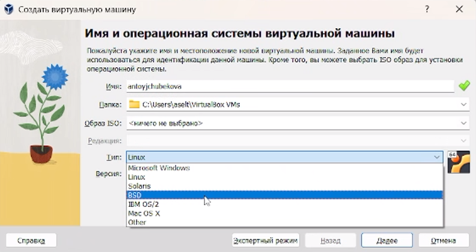
 
## Создание виртуальной машины 

Указываю размер основной памяти виртуальной машины 2048 МБ.
 
 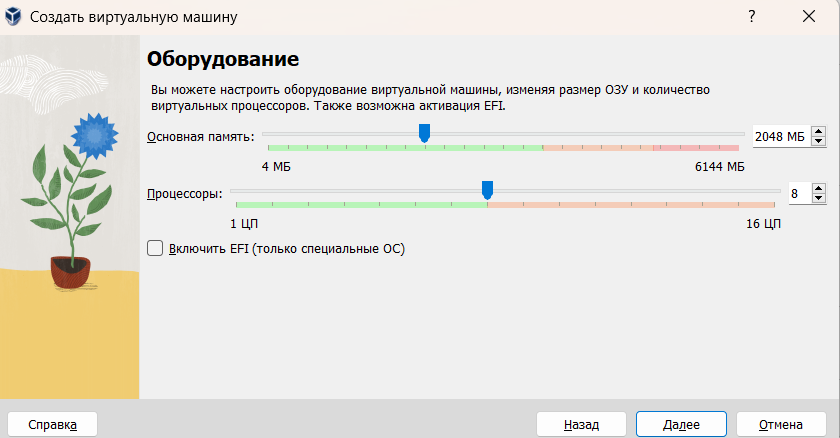

## Создание виртуальной машины 

 Задаю конфигурацию жесткого диска-загрузочный,VDI, динамический виртуальный диск. Задаю размер диска-80 ГБ. 
 
 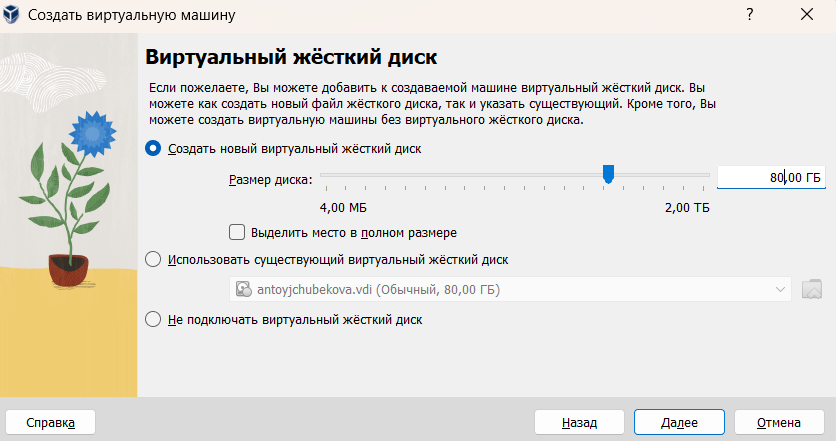
 
## Создание виртуальной машины 
 
 Выбираю в VirtualBox виртуальной машины. Добавляю новый привод оптических дисков и выбираю образ. 
 
 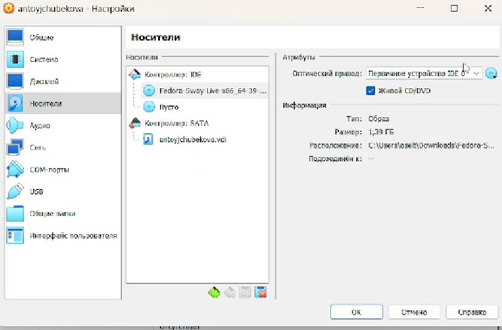
 
## Создание виртуальной машины 
 
 В качестве графического контроллера поставлю VMSVGA и вклчаю ускорение 3D.
 
 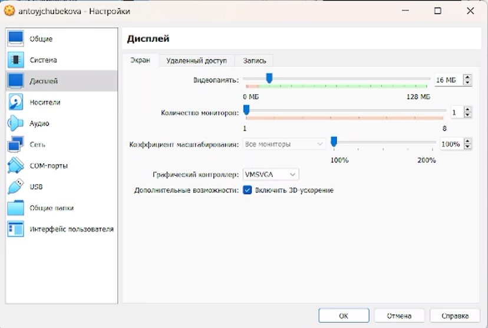
 
## Создание виртуальной машины 
 
 Включаю общий буфер обмена и перетаскивание объектов между хостосом и гостевой ОС.
 
 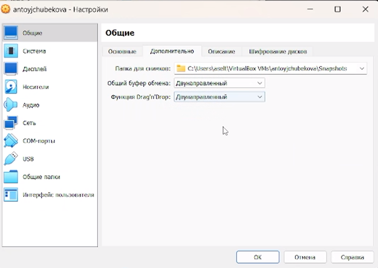
 
## Создание виртуальной машины 
 
 Включаю поддержку UEFI. 
 
 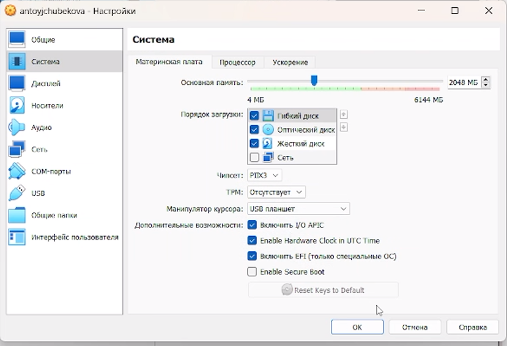
 
## Установка операционной системы 

Запускаю созданную виртуальную машину для установки. 
 
 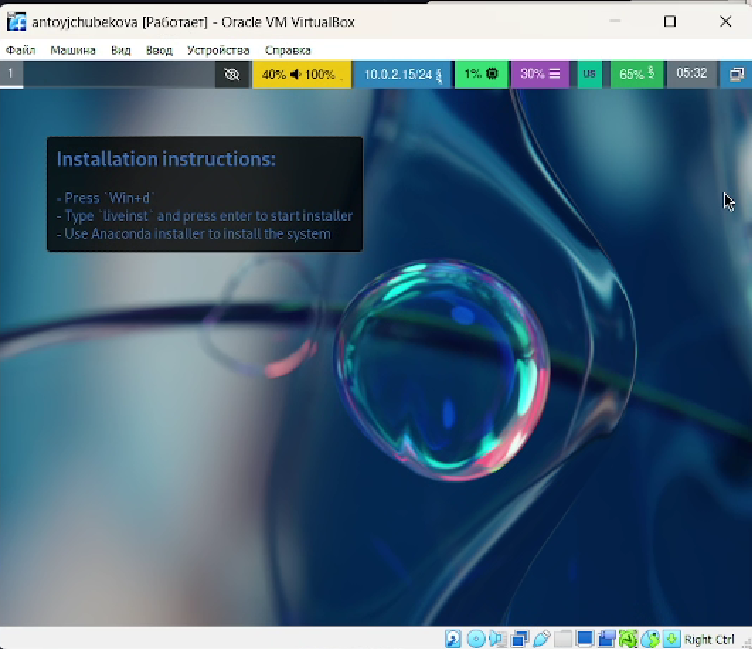
 
## Установка операционной системы 

После появления интерфейса начальной конфигурации нажимаю Enter для создания конфигурации по умолчанию, затем еще раз нажимаю Enter,чтобы выбрать в качестве модификатора клавишу Win. Нажимаю Win+Enter для запуска терминала. В терминале запускаю liveinst.
 
 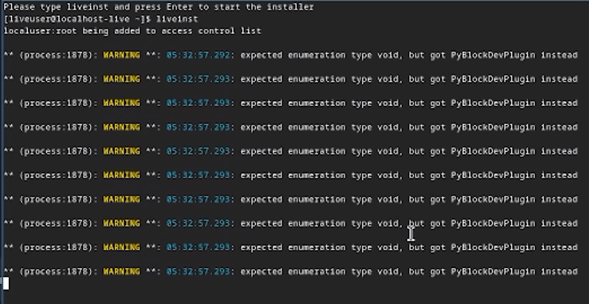
 
## Установка системы на диск 

Выбираю язык интерфейса, как русский.

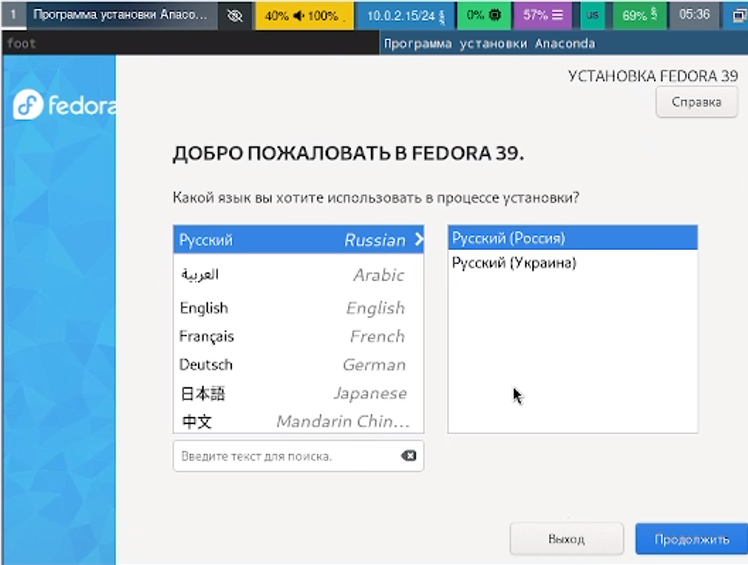

## Установка системы на диск 

Перехожу к найстройкам установки операционной системы.

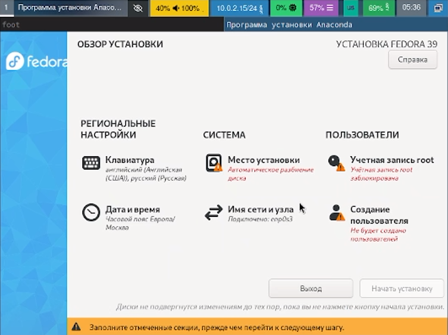

Без изменений оставляю часовой пояс, расладку клавиатуры, а также место установки ОС 
 
 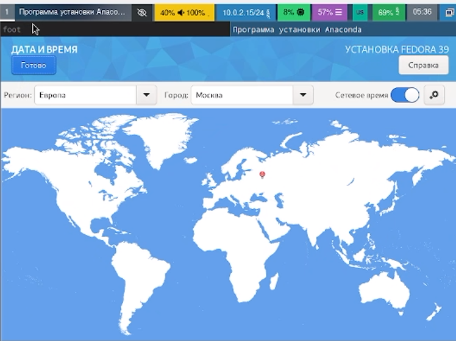
 
## Установка системы на диск 

Без изменений оставляю расладку клавиатуры
 
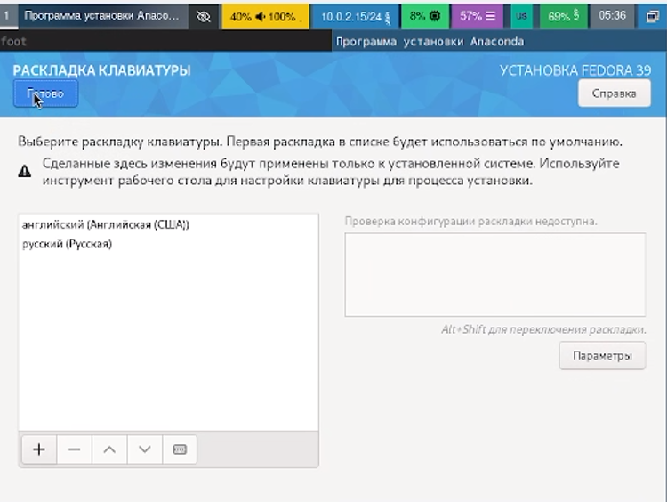

## Установка системы на диск 

Без изменений оставляю место установки ОС
 
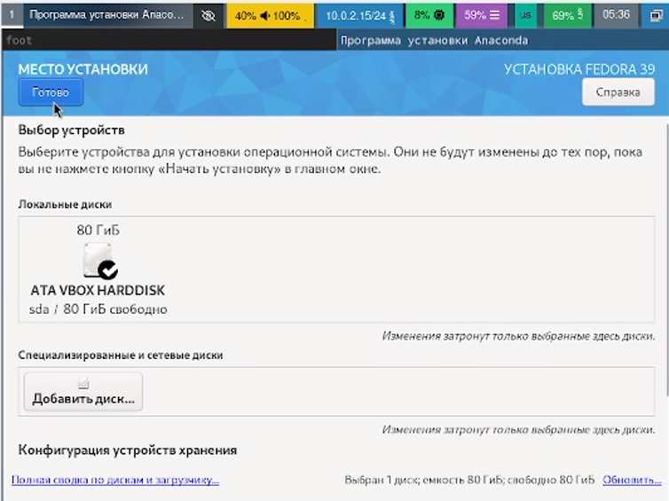

## Установка системы на диск 

Устанавливаю сеть и имя узла как - antoyjchubekova.antojchubekova.net 
 
 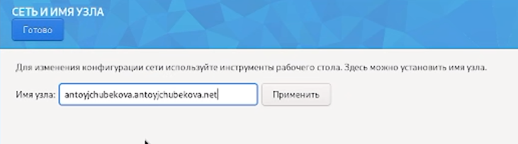

## Установка системы на диск 

Устанавливаю имя и пароль для пользователя root.
 
 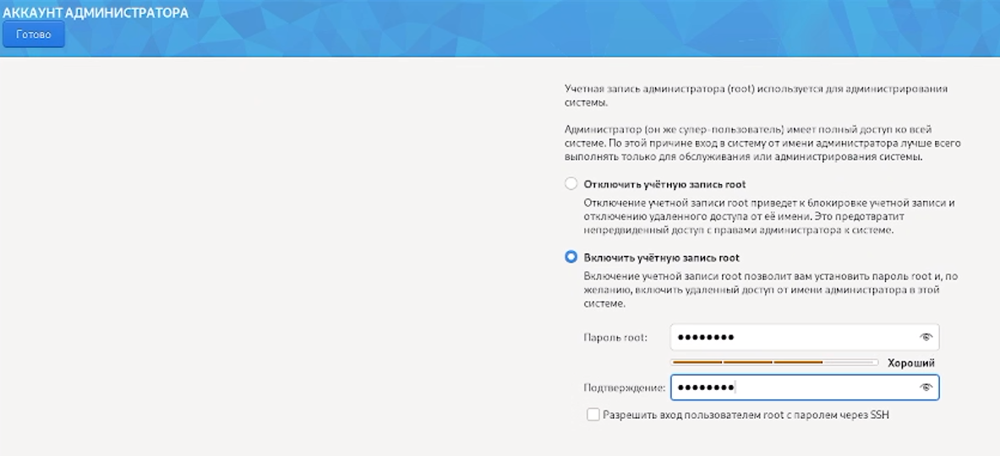
 
## Установка системы на диск 
 
Устанавливаю  имя и пароль пользователя.
 
 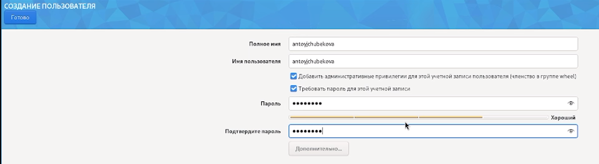
 
## Установка системы на диск 

 Далее жду завершения установки операционной системы, а затем перезагружаю виртуальную машину.
 
 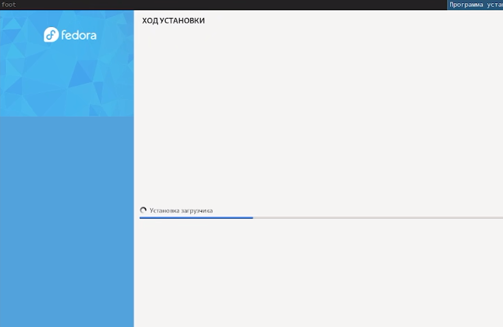
 
## Установка системы на диск 
 
 Отключаю носитель информации с образом. 
 
 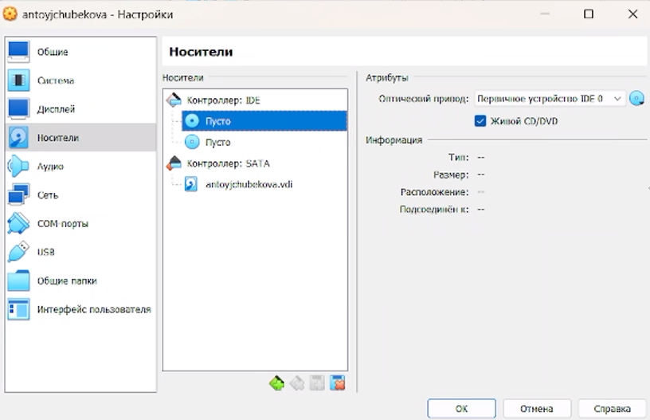
 
## После установки 

Вхожу в ОС под заданным при установке учетной записи.
 
 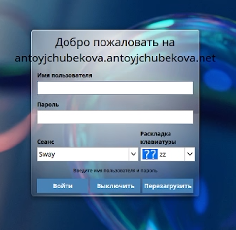
 
## После установки 

 Переходим в терминал и переключаемся на роль супер пользователя 
 
 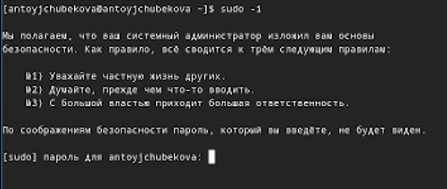
 
## После установки 

 Обновляю все пакеты, используя команду 'dnf -y update'.
 
 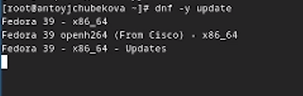
 
## После установки 
 
  Обновляю все пакеты, используя команду 'dnf -y update'
 
 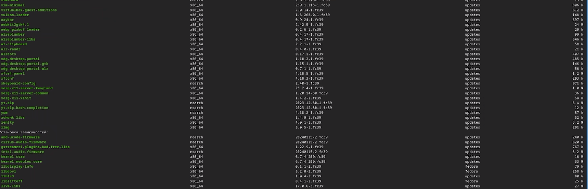
 
## После установки 
 
 Устанавливаю программы для удобства работы в консоли, командой 'dnf -y install tmux mc'
 
 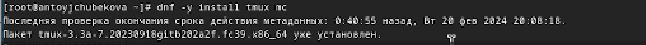
 
## После установки 
 
 Устанавливаю программы для удобства работы в консоли, командой 'dnf -y install tmux mc'
 
 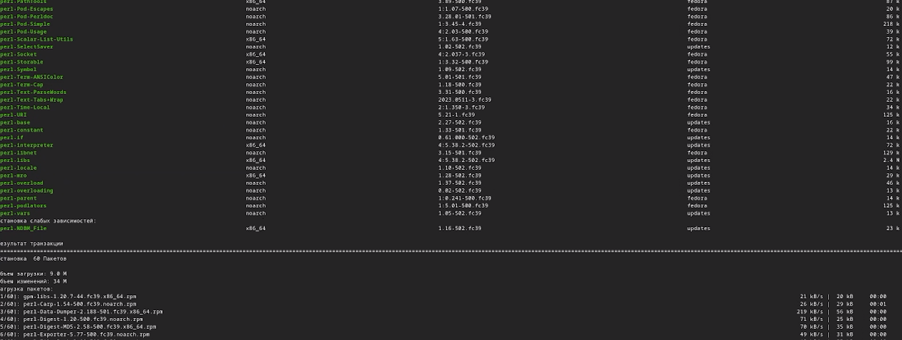
 
## После установки
 
 Устанавливаю программное обеспечение для автоматического обновления, командой 'dnf install dnf-automatic'.
 
 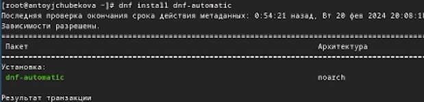
 
## После установки
 
 Запускаю таймер, командой 'systemctl enable --now dnf -automatic.timer' 
 
 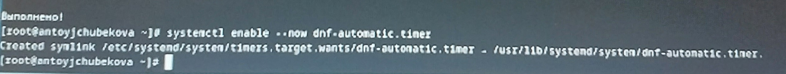
 
## После установки

Т.к. в этом курсе мы не будем рассматривать работу с системой безопасности SELinux я отключаю его, перейдя по адресу /etc/selinux/config в файле заменим SELINUX=enforcing на SELINUX=permissive.
 
 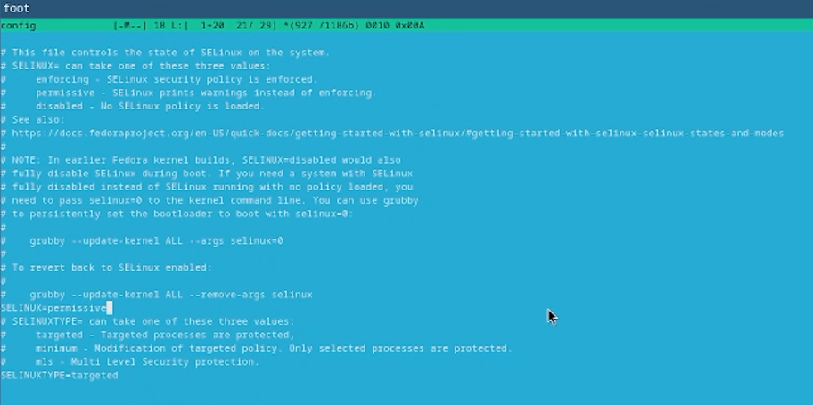
 
 Затем перезагружаю виртуальную машину через reboot
 
## Установка драйверов для VirtualBox 

Вхожу в ОС и перехожу в терминал, запускаю мультиплексор tmux и переключаюсь на роль супер пользователя, устанавливаю средства разработки, введя команду 'dnf -y group install "Development Tools"'
 
 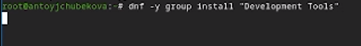
 
## Установка драйверов для VirtualBox 
 
 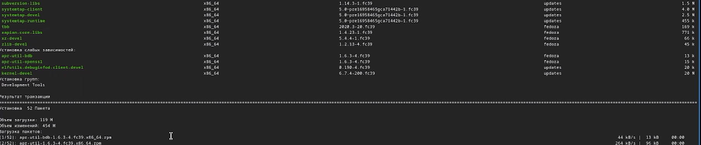
 
## Установка драйверов для VirtualBox 
 
 Устанавливаю пакет DKMS, командой 'dnf -y install dkms'
 
 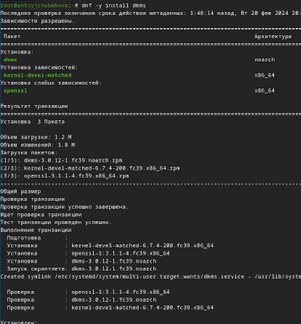
 
## Установка драйверов для VirtualBox 
 
В меню виртуальной машины подключаю образ диска дополнений гослевой ОС.

 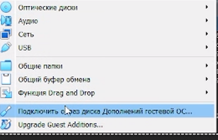
 
## Установка драйверов для VirtualBox 
  
 Подмонтирую диск, введя в терминал mount/dev/sr0/media, устанавливаю драйвера 
 
 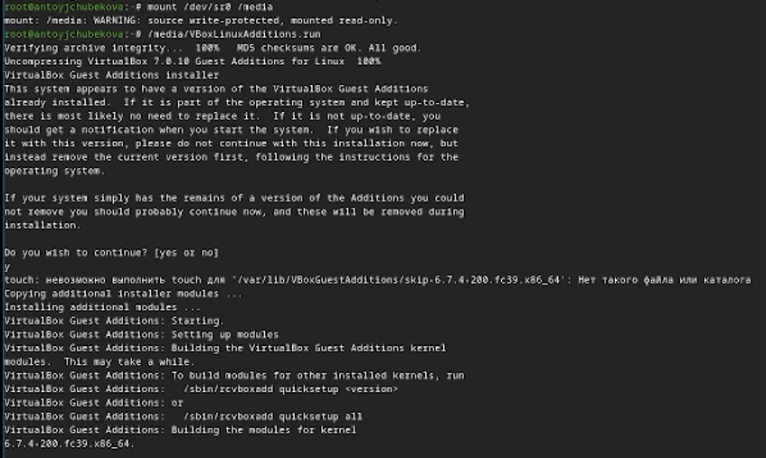
 
 Перезагружаю виртуальную машину 
 
## Настройка раскладки клавиатуры 

Запускаю терминал и запускаю мультиплексор tmux. Создаю конфигурационный файл. 
 
 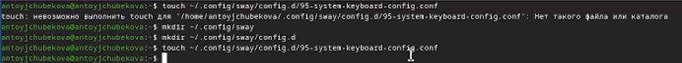
 
## Настройка раскладки клавиатуры 
 
 Открыв с командой nano файл по адресу ~/.config/sway/config.d/95-system-keyboard-config.conf отредактируем конфигурационный файл 
 
 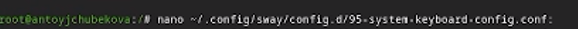
 
 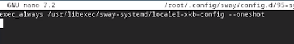
 
## Настройка раскладки клавиатуры 
 
 Переключаюсь на роль супер пользователя и открываю файл /etc/x11/xorg.conf.d/00-keyboard.conf. 
 
 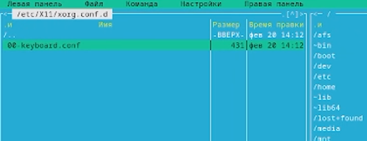
 
## Настройка раскладки клавиатуры 
 
Редактирую конфигурационный файл /etc/x11/xorg.conf.d/00-keyboard.conf. Перезагружаю виртуальную машину.
  
 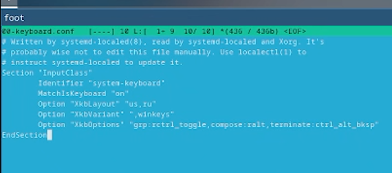
 
## Установка имени пользователя и название хоста 

При установке виртуальной машины я задала имя пользователя в соответствии со своим логином в дисплейном классе, так что я могу не изменять имя пользователя. Изменяю имя хоста в соответствии с логином в дисплейном классе и командой hostname проверяю изменения. 

 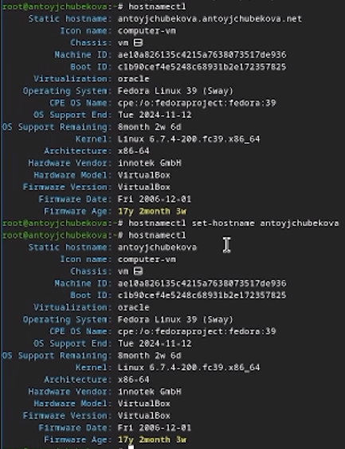
 
## Подключение общей папки 

Внутри виртуальной машины добавляю своего пользователя в группу vboxst, используя команду 'gpasswd -a antoyjchubekova vboxssf' 

 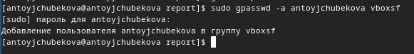
 
## Подключение общей папки 
 
 В хостовой системе подключаю разделяемую папку.
 
 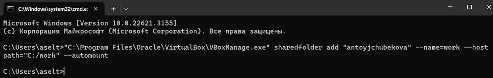
 
 Перезанружаю виртуальную машину.
 
## Установка программного обеспечения для создания документации 

 Запустим терминал и мултиплексор tmux, перейдем на роль супер пользователя. 
 
 Устанавливаю средство pandoc для работы с языком разметки Markdown.
 
 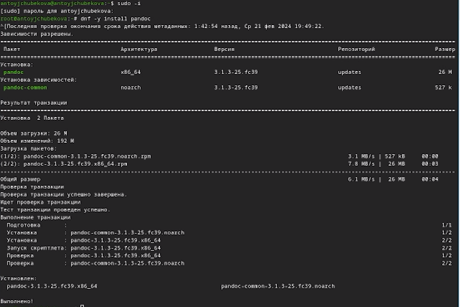
 
## Установка программного обеспечения для создания документации
 
 Устанавливаю pandoc вручную 
 
 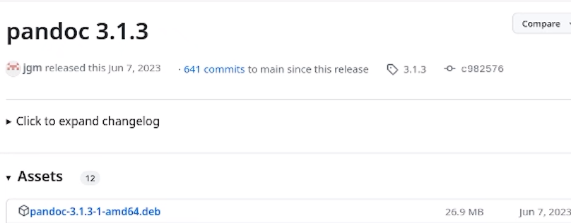
 
## Установка программного обеспечения для создания документации
 
 Устанавливаю pandoc-crossref вручную 
 
 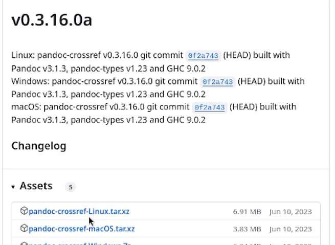
 
## Установка программного обеспечения для создания документации
 
 Проверяем наличие средств в Загрузки 
 
 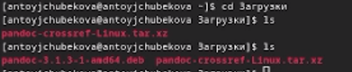
 
## Установка программного обеспечения для создания документации
 
 Распакуем архивы и поместим и в каталог /usr/local/bin ).
 
 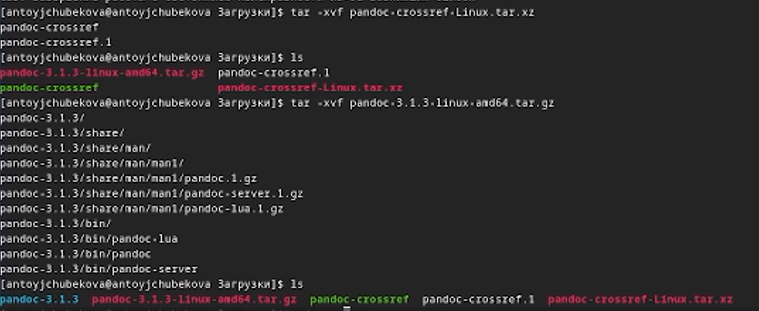
 
 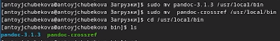
 
## Texlive ##
 
 Устанавливаю дистрибутив Texlive
 
 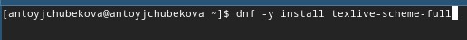
 
 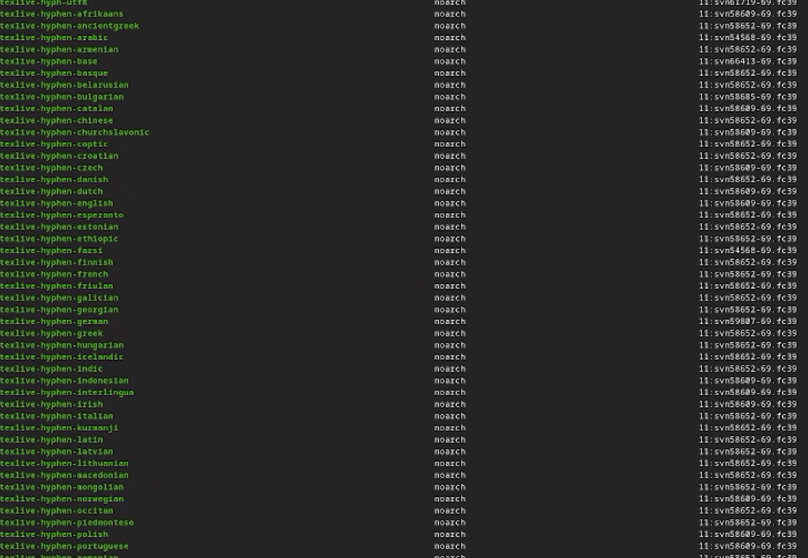
 
## Выводы

В ходе выполнения лабараторной работы №1 я приобрела практических навыков установки операционной системы на виртуальную машину, настроики минимально необходимых для дальнейшей работы серверов.

## Список литературы{.unnumbered}

- https://esystem.rudn.ru/mod/page/view.php?id=1098933#org2151722.

