---
## Front matter
title: "Лабораторная работа №1"
subtitle: "Операционные системы"
author: "Тойчубекова Асель Нурлановна"

## Generic otions
lang: ru-RU
toc-title: "Содержание"

## Bibliography
bibliography: bib/cite.bib
csl: pandoc/csl/gost-r-7-0-5-2008-numeric.csl

## Pdf output format
toc: true # Table of contents
toc-depth: 2
lof: true # List of figures
lot: true # List of tables
fontsize: 12pt
linestretch: 1.5
papersize: a4
documentclass: scrreprt
## I18n polyglossia
polyglossia-lang:
  name: russian
  options:
	- spelling=modern
	- babelshorthands=true
polyglossia-otherlangs:
  name: english
## I18n babel
babel-lang: russian
babel-otherlangs: english
## Fonts
mainfont: PT Serif
romanfont: PT Serif
sansfont: PT Sans
monofont: PT Mono
mainfontoptions: Ligatures=TeX
romanfontoptions: Ligatures=TeX
sansfontoptions: Ligatures=TeX,Scale=MatchLowercase
monofontoptions: Scale=MatchLowercase,Scale=0.9
## Biblatex
biblatex: true
biblio-style: "gost-numeric"
biblatexoptions:
  - parentracker=true
  - backend=biber
  - hyperref=auto
  - language=auto
  - autolang=other*
  - citestyle=gost-numeric
## Pandoc-crossref LaTeX customization
figureTitle: "Рис."
tableTitle: "Таблица"
listingTitle: "Листинг"
lofTitle: "Список иллюстраций"
lotTitle: "Список таблиц"
lolTitle: "Листинги"
## Misc options
indent: true
header-includes:
  - \usepackage{indentfirst}
  - \usepackage{float} # keep figures where there are in the text
  - \floatplacement{figure}{H} # keep figures where there are in the text
---

# Цель работы

Целью лабараторной работы №1 является приобретение практических навыков установки операционной системы на виртуальную машину, настроики минимально необходимых для дальнейшей работы серверов.

# Задание

Здесь приводится описание задания в соответствии с рекомендациями
методического пособия и выданным вариантом.

# Теоретическое введение

VirtualBox- это программное обеспечение,которые имитирует настояший компьютер, что дает возможность пользователю устанвить, запустить и испольовать другие операционные системы, как обычные приложения. Такой себе компьютер в компьютере.

Виртуальная машина создает некое изолированное окружение на компьютере, которое состоит из виртуальных компонентов реального ПК: жесткий диск, видеокарты, опиративная память, различных контроллеров устройств и т.п. Таким образом, установленная в VirtualBox операционная система будет полностью уверена в том, что она работает на реальном железе.

# Выполнение лабораторной работы

Перед началом выполнения лабораторной работы №1 я установила себе VirtualBox и дистрибутив Linux Fedora,вариант с менежером окон sway, также скачала необходимый образ операционной системы.

## Создание виртуальной машины ##

Для использования графического интерфейса запускаю менеджер виртуальных машин VirtualBox на своей технике. Создаю новую виртуальную машину, указывая имя виртуальной машины как свой логин в дисплейных классах, указывааю тип операционной системы-Linux,Fedora. (рис. [-@fig:001]).Указываю размер основной памяти виртуальной машины 2048 МБ (рис. [-@fig:002]).

 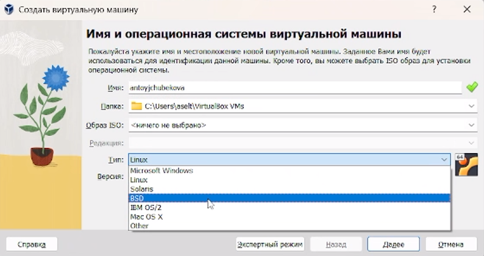{#fig:001 width=70%}
 
 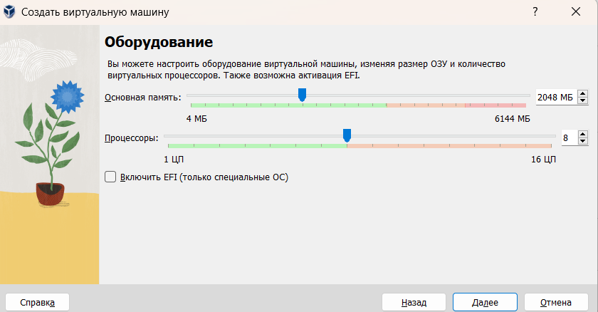{#fig:002 width=70%}
 
 Задаю конфигурацию жесткого диска-загрузочный,VDI, динамический виртуальный диск. Задаю размер диска-80 ГБ. (рис. [-@fig:003]).
 
 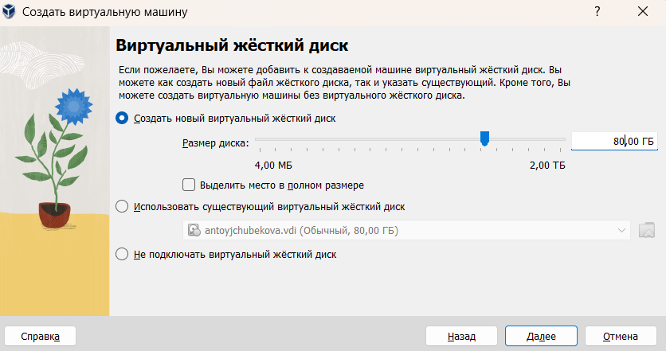{#fig:003 width=70%}
 
 Выбираю в VirtualBox виртуальной машины. Добавляю новый привод оптических дисков и выбираю образ. (рис. [-@fig:004]).
 
 {#fig:004 width=70%}
 
 В качестве графического контроллера поставлю VMSVGA и вклчаю ускорение 3D. (рис. [-@fig:005]).
 
 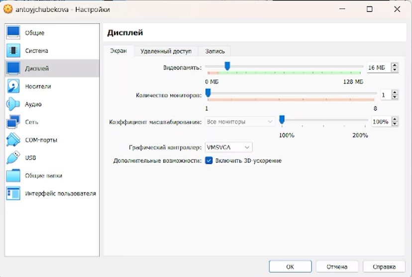{#fig:005 width=70%}
 
 Включаю общий буфер обмена и перетаскивание объектов между хостосом и гостевой ОС (рис. [-@fig:006]).
 
 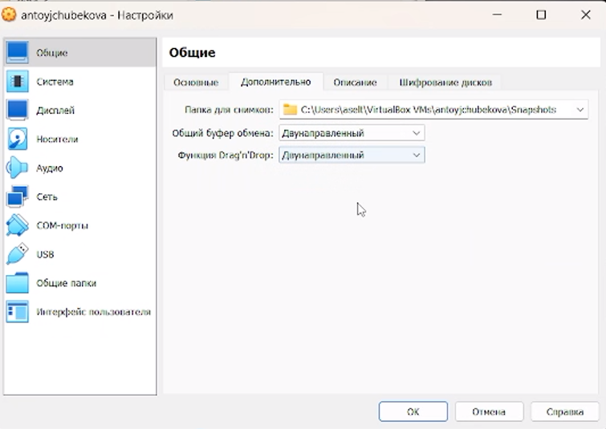{#fig:006 width=70%}
 
 Включаю поддержку UEFI. (рис. [-@fig:007]).
 
 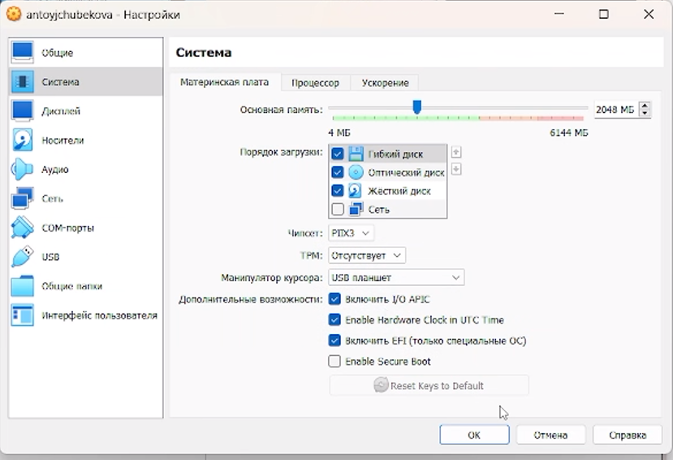{#fig:007 width=70%}
 
## Установка операционной системы ##

Запускаю созданную виртуальную машину для установки. (рис. [-@fig:008]).
 
 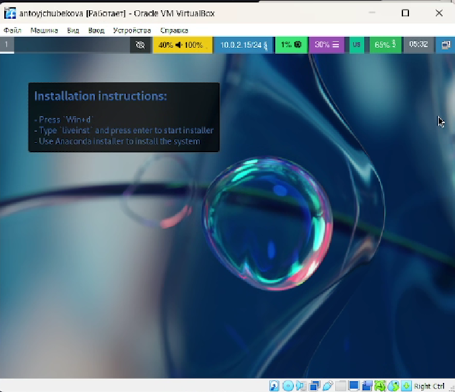{#fig:008 width=70%}

После появления интерфейса начальной конфигурации нажимаю Enter для создания конфигурации по умолчанию, затем еще раз нажимаю Enter,чтобы выбрать в качестве модификатора клавишу Win. Нажимаю Win+Enter для запуска терминала. В терминале запускаю liveinst. (рис. [-@fig:009]).
 
 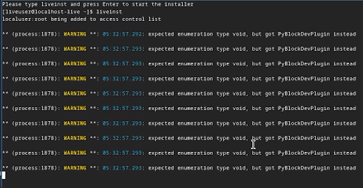{#fig:009 width=70%}
 
## Установка системы на диск ##

Выбираю язык интерфейса, как русский (рис. [-@fig:010])и перехожу к найстройкам установки операционной системы (рис. [-@fig:011]).

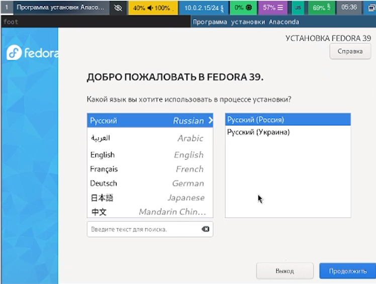{#fig:010 width=70%}

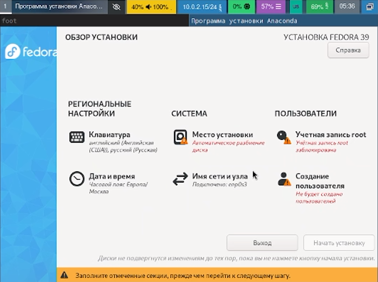{#fig:011 width=70%}

Без изменений оставляю часовой пояс (рис. [-@fig:012]), расладку клавиатуры (рис. [-@fig:013]), а также место установки ОС (рис. [-@fig:014]).
 
 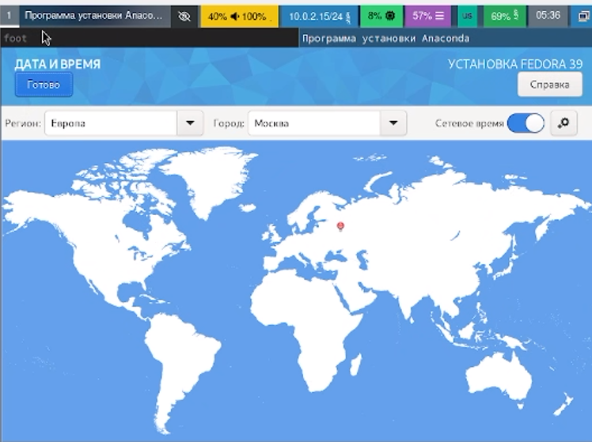{#fig:012 width=70%}

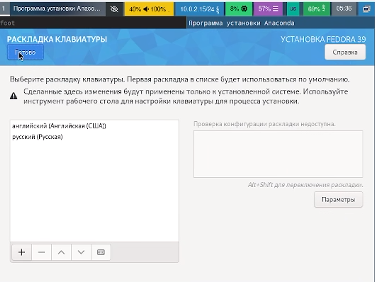{#fig:013 width=70%}

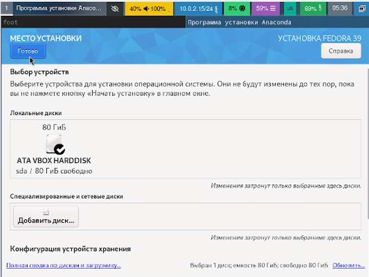{#fig:014 width=70%}

Устанавливаю сеть и имя узла как - antoyjchubekova.antojchubekova.net  (рис. [-@fig:015]).
 
 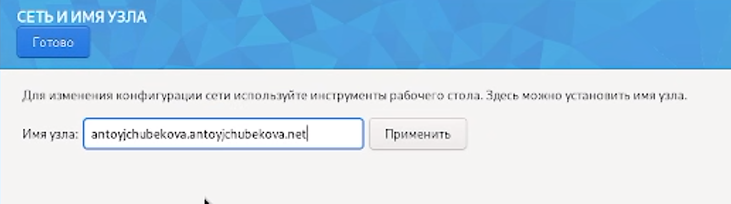{#fig:015 width=70%}

Устанавливаю имя и пароль для пользователя root. (рис. [-@fig:016]).
 
 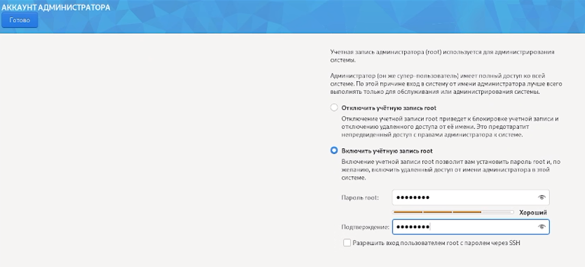{#fig:016 width=70%}
 
Устанавливаю  имя и пароль пользователя (рис. [-@fig:017]).
 
 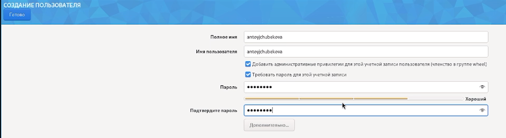{#fig:017 width=70%}
 
 Далее жду завершения установки операционной системы, а затем перезагружаю виртуальную машину. (рис. [-@fig:018]).
 
 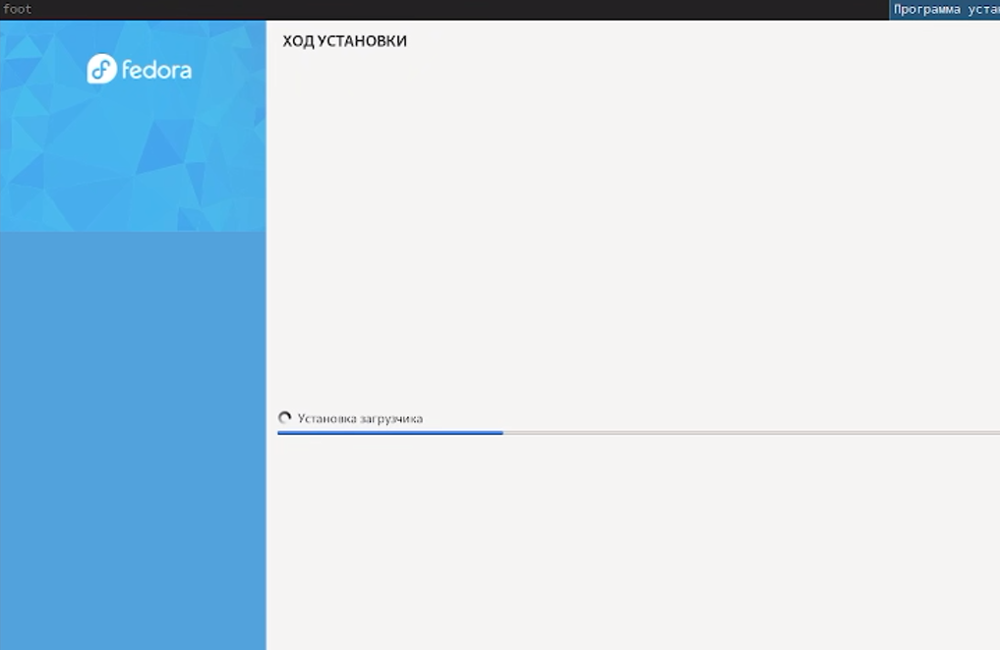{#fig:018 width=70%} 
 
 Отключаю носитель информации с образом. (рис. [-@fig:019]).
 
 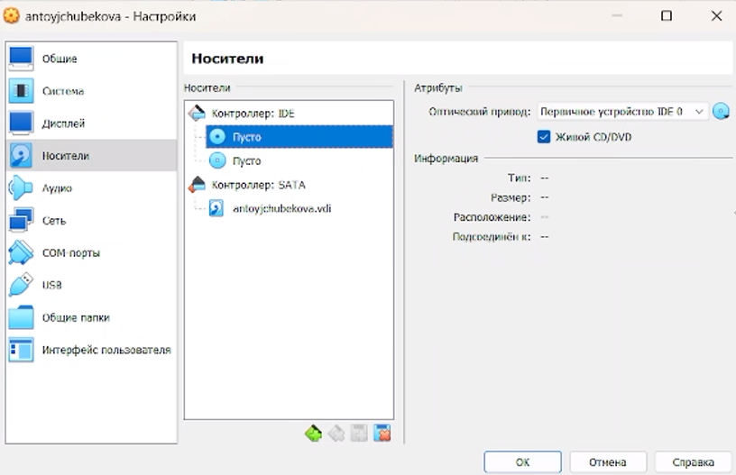{#fig:019 width=70%}
 
## После установки ##

Вхожу в ОС под заданным при установке учетной записи. (рис. [-@fig:020]).
 
 {#fig:020 width=70%}
 
 Переходим в терминал и переключаемся на роль супер пользователя (рис. [-@fig:021]).
 
 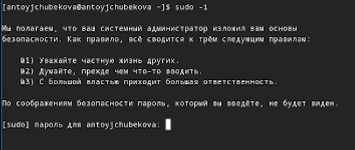{#fig:021 width=70%}
 
 Обновляю все пакеты, используя команду 'dnf -y update' (рис. [-@fig:022] и рис. [-@fig:023]).
 
 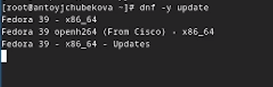{#fig:022 width=70%}
 
 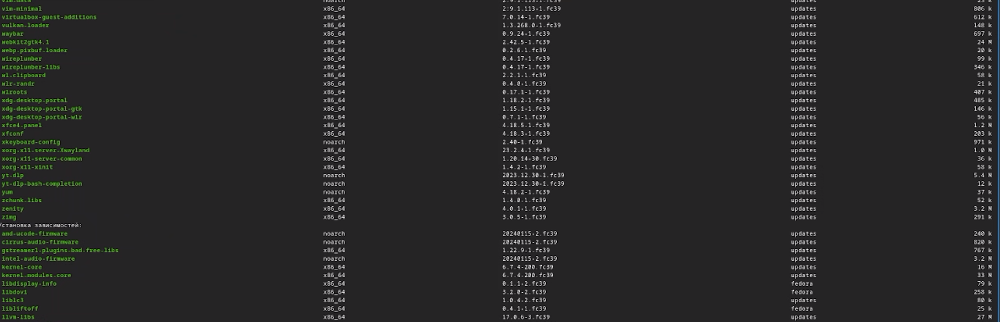{#fig:023 width=70%}
 
 Устанавливаю программы для удобства работы в консоли, командой 'dnf -y install tmux mc' (рис. [-@fig:024] и рис. [-@fig:025]).
 
 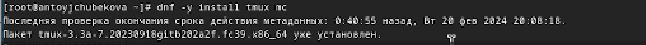{#fig:024 width=70%}
 
 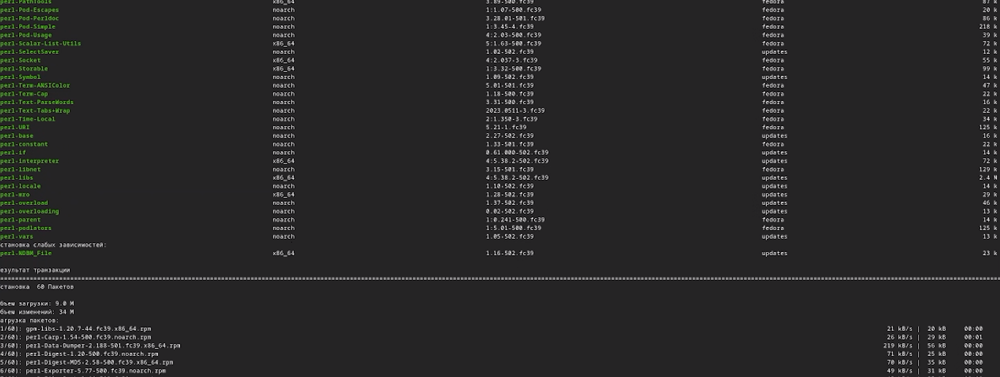{#fig:025 width=70%}
 
 Устанавливаю программное обеспечение для автоматического обновления, командой 'dnf install dnf-automatic' рис. [-@fig:026]).
 
 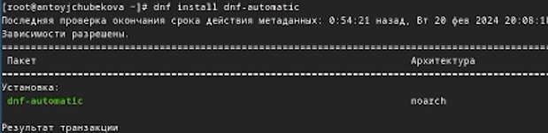{#fig:026 width=70%}
 
 Запускаю таймер, командой 'systemctl enable --now dnf -automatic.timer' (рис. [-@fig:027]).
 
 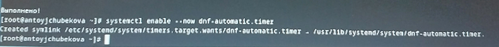{#fig:027 width=70%}

Т.к. в этом курсе мы не будем рассматривать работу с системой безопасности SELinux я отключаю его, перейдя по адресу /etc/selinux/config в файле заменим SELINUX=enforcing на SELINUX=permissive. рис. [-@fig:028]).
 
 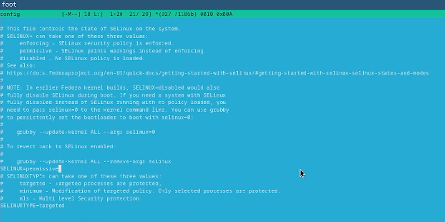{#fig:028 width=70%}
 
 Затем перезагружаю виртуальную машину через reboot
 
## Установка драйверов для VirtualBox ##

Вхожу в ОС и перехожу в терминал, запускаю мультиплексор tmux и переключаюсь на роль супер пользователя, устанавливаю средства разработки, введя команду 'dnf -y group install "Development Tools"' (рис. [-@fig:029] и рис. [-@fig:030]).
 
 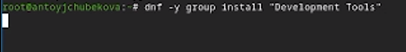{#fig:029 width=70%}
 
 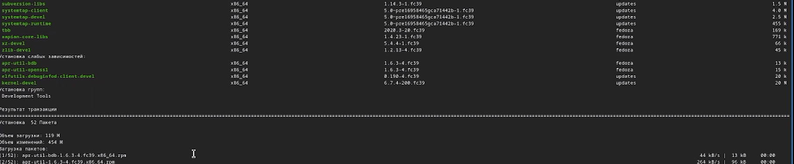{#fig:030 width=70%}
 
 Устанавливаю пакет DKMS, командой 'dnf -y install dkms' (рис. [-@fig:031]).
 
 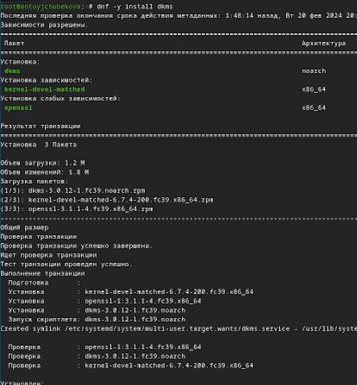{#fig:031 width=70%}
 
В меню виртуальной машины подключаю образ диска дополнений гослевой ОС. (рис. [-@fig:032]).
 
 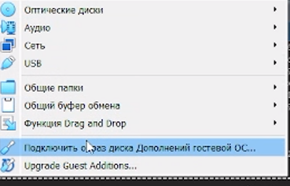{#fig:032 width=70%}
  
 Подмонтирую диск, введя в терминал mount/dev/sr0/media, устанавливаю драйвера (рис. [-@fig:033]).
 
 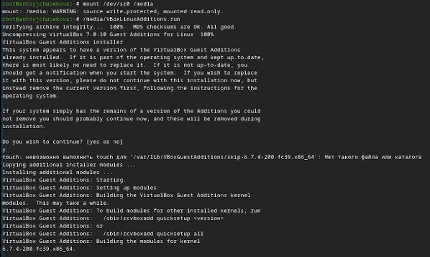{#fig:033 width=70%}
 
 Перезагружаю виртуальную машину 
 
## Настройка раскладки клавиатуры ##

Запускаю терминал и запускаю мультиплексор tmux. Создаю конфигурационный файл. (рис. [-@fig:034]).
 
 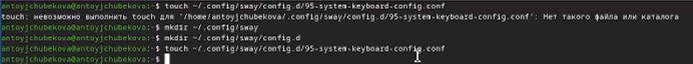{#fig:034 width=70%}
 
 Открыв с командой nano файл по адресу ~/.config/sway/config.d/95-system-keyboard-config.conf отредактируем конфигурационный файл  (рис. [-@fig:035] и рис. [-@fig:036]).
 
 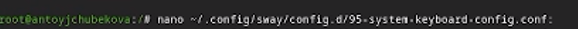{#fig:035 width=70%}
 
 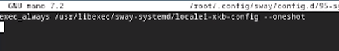{#fig:036 width=70%}
 
 Переключаюсь на роль супер пользователя и редактирую конфигурационный файл /etc/x11/xorg.conf.d/00-keyboard.conf. (рис. [-@fig:037] и рис. [-@fig:038]).
 
 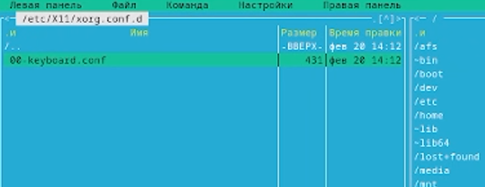{#fig:037 width=70%}
 
 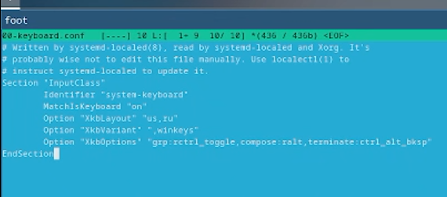{#fig:038 width=70%}
 
 Перезагружаю виртуальную машину.
 
## Установка имени пользователя и название хоста ##

При установке виртуальной машины я задала имя пользователя в соответствии со своим логином в дисплейном классе, так что я могу не изменять имя пользователя. Изменяю имя хоста в соответствии с логином в дисплейном классе и командой hostname проверяю изменения. (рис. [-@fig:039]).
 
 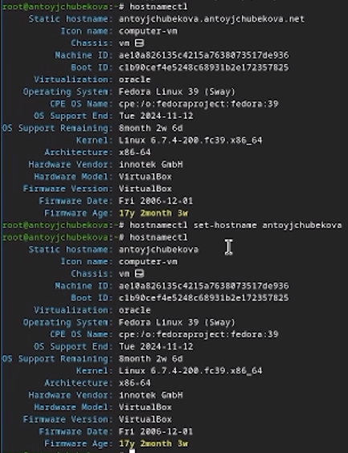{#fig:039 width=70%}
 
## Подключение общей папки ##

Внутри виртуальной машины добавляю своего пользователя в группу vboxst, используя команду 'gpasswd -a antoyjchubekova vboxssf' (рис. [-@fig:040]).
 
 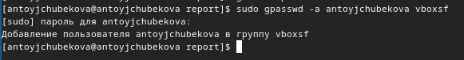{#fig:040 width=70%}
 
 В хостовой системе подключаю разделяемую папку.(рис. [-@fig:041]).
 
 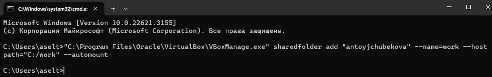{#fig:041 width=70%}
 
 Перезанружаю виртуальную машину.
 
## Установка программного обеспечения для создания документации ##

 Запустим терминал и мултиплексор tmux, перейдем на роль супер пользователя. 
 
 Устанавливаю средство pandoc для работы с языком разметки Markdown. (рис. [-@fig:042]).
 
 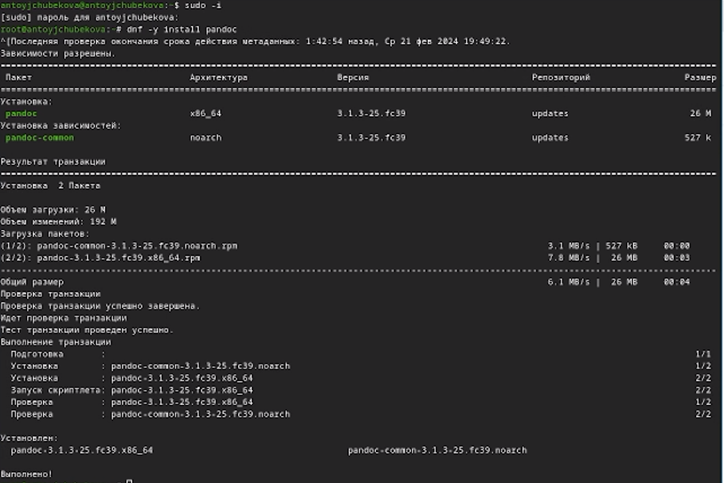{#fig:042 width=70%}
 
 Устанавливаю pandoc (рис. [-@fig:043]). и pandoc-crossref (рис. [-@fig:044]) вручную 
 
 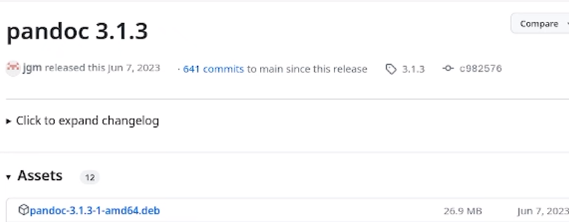{#fig:043 width=70%}
 
 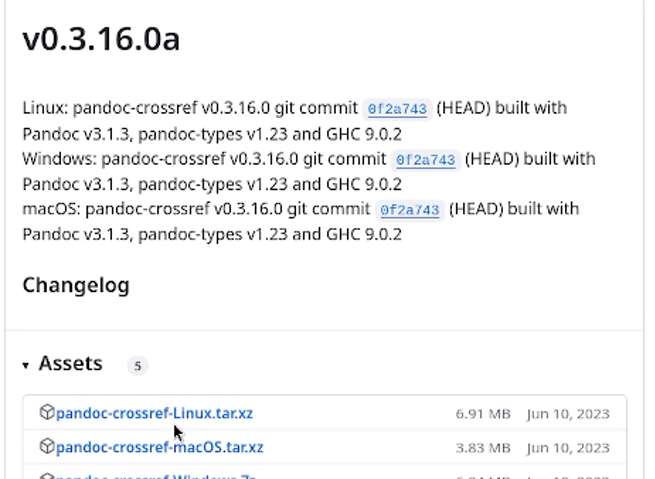{#fig:044 width=70%}
 
 Проверяем наличие средств в Загрузки  (рис. [-@fig:045]).
 
 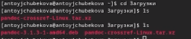{#fig:045 width=70%}
 
 Распакуем архивы и поместим и в каталог /usr/local/bin (рис. [-@fig:046] и рис. [-@fig:047]).
 
 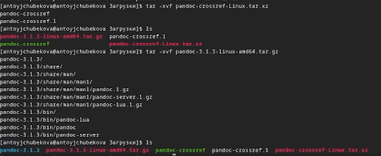{#fig:046 width=70%}
 
 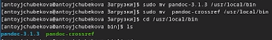{#fig:047 width=70%}
 
## Texlive ##
 
 Устанавливаю дистрибутив Texlive( рис. [-@fig:048] и рис. [-@fig:049]).
 
 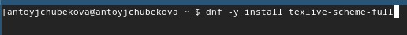{#fig:048 width=70%}
 
 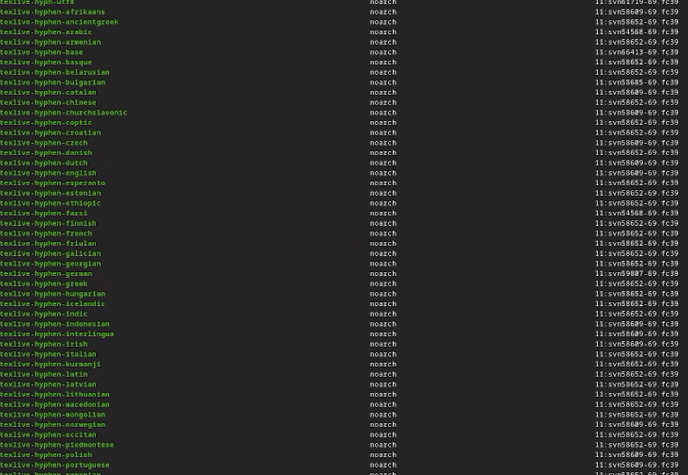{#fig:049 width=70%}
 
## Выполнение доманей работы ##

 В окне терминала анализирую последовательность загрузки системы, выполнив команду dmesg. (рис. [-@fig:050] и рис. [-@fig:051]).
 
 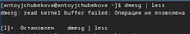{#fig:050 width=70%}
 
 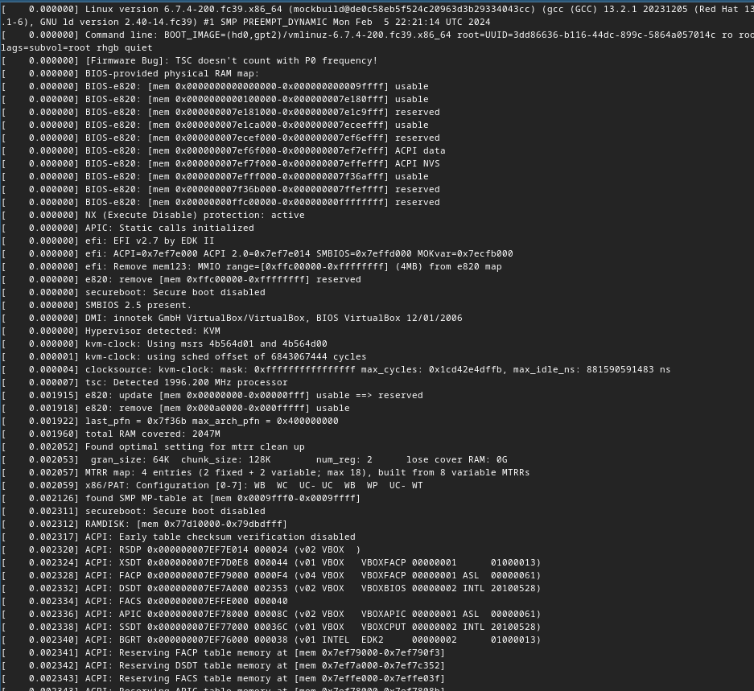{#fig:051 width=70%}
 
 С помощью поиска, осуществляемого командой dmesg|grep -i ищу версию ядра Linux: 6.7.4-200.fc39.x86_64 (рис. [-@fig:052]).
 
 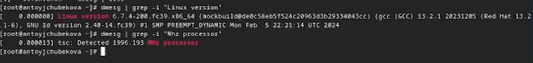{#fig:052 width=70%}
 
 С помощью поиска, осуществляемого командой dmesg|grep -i ищу частоту процессора Detected Mhz processor: Detected  1996.193 Mhz processor (рис. [-@fig:053]).
 
 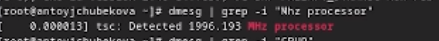{#fig:053 width=70%}
 
 С помощью поиска, осуществляемого командой dmesg|grep -i ищу модель процессора (рис. [-@fig:054]).
 
 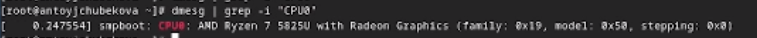{#fig:054 width=70%}
 
  С помощью поиска, осуществляемого командой dmesg|grep -i ищу объем доступной оперативной памяти и типообнаруженного гипервизора (рис. [-@fig:055]).
 
 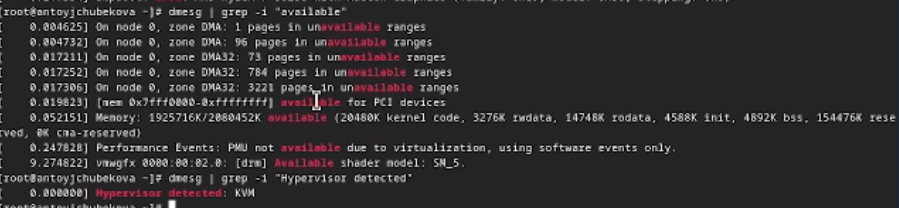{#fig:055 width=70%}
 
 Тип файловой системы корневого раздела можно посмотреть с помощью утилиты fdisk. (рис. [-@fig:056]).
 
 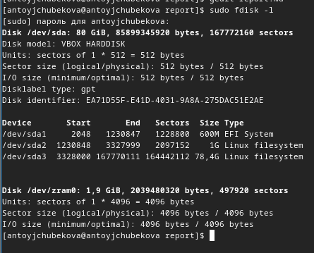{#fig:056 width=70%}
 
 Последовательнось монтирования файловых систем можно посмотреть, введя в поиск результат dmesg, слово mount (рис. [-@fig:057]).
 
 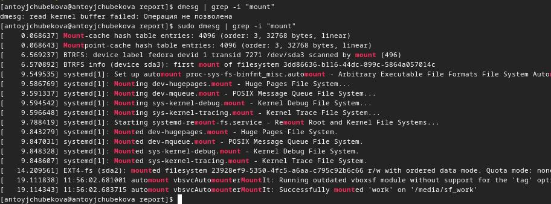{#fig:057 width=70%}
 
## Ответы на контрольные вопросы ##

1. Учетная запись содержит необходимые для видентификации пользователя при подключении к системе данные,а также информацию для авторизации и учета :системного имен(username), идентификатор пользователя (UID, идентификатор группы(CID) полное имя(full name), домашний каталог, начальная оболочка.

2. Для получения справки по команде:-help; для перемещения по файловой системе -cd;для просмотра содержание файла -ls; для определения объема каталога -du; для создания/удаления каталога -mksir/rmdir; для созданиеъ/удалерние файлов - touch/rm; для задания определенных прав на файл/каталог -chmod; для просмотра истории команд -history.

3. Файловая система - это порядок, определяющий способ организации и хранения и именования данных на различных носителях информации, например:FAT32,ext/ext4. 
в
4. С помощью команды df, введя ее в терминал. Это утилита показывает список всех файловых системпо по именам устройств , сообщает их размер и данные о памяти. Также посмотреть подмонтированные файловые системы можно с помощью  утилиты mount.

5. Чтобы удалить зависший процесс, вначале мы должны узнать, какой у него id: используем команду ps. Далее в терминале вводим команду kill < айди процесса. Илм можно использовать утилиту killall, что убьет все процессы, которые есть в данный момент, для этого  не нужно знать id процессора.
 
# Выводы

В ходе выполнения лабараторной работы №1 я приобрела практических навыков установки операционной системы на виртуальную машину, настроики минимально необходимых для дальнейшей работы серверов.

# Список литературы{.unnumbered}

- https://esystem.rudn.ru/mod/page/view.php?id=1098933#org2151722.
