---
## Front matter
lang: ru-RU
title: Лабораторная рабта №2
subtitle: Операционные системы 
author:
  - Тойчубекова Асель Нурлановна
institute:
  - Российский университет дружбы народов, Москва, Россия
  
date: 29 января 2024

## i18n babel
babel-lang: russian
babel-otherlangs: english

## Formatting pdf
toc: false
toc-title: Содержание
slide_level: 2
aspectratio: 169
section-titles: true
theme: metropolis
header-includes:
 - \metroset{progressbar=frametitle,sectionpage=progressbar,numbering=fraction}
 - '\makeatletter'
 - '\beamer@ignorenonframefalse'
 - '\makeatother'
 
## Fonts
mainfont: PT Serif
romanfont: PT Serif
sansfont: PT Sans
monofont: PT Mono
mainfontoptions: Ligatures=TeX
romanfontoptions: Ligatures=TeX
sansfontoptions: Ligatures=TeX,Scale=MatchLowercase
monofontoptions: Scale=MatchLowercase,Scale=0.9

---

# Информация

## Докладчик

:::::::::::::: {.columns align=center}
::: {.column width="70%"}

  * Тойчубекова Асель Нурлановна
  * Студент 1 курса
  * Российский университет дружбы народов
  * [1032235033@pfur.ru](1032235033@pfur.ru)

:::
::: {.column width="30%"}

:::
::::::::::::::

## Цель работы

Целью лабораторной работы №2 является изучение идеологии и примечание средств контроля версий, а также освоение умений по работе с git.

## Теоретическое введение

   Системы контроля версий (Version Control System, VCS) применяются при работе нескольких человек над одним проектом. Обычно основное дерево проекта хранится в локальном или удалённом репозитории, к которому настроен доступ для участников проекта. При внесении изменений в содержание проекта система контроля версий позволяет их фиксировать, совмещать изменения, произведённые разными участниками проекта, производить откат к любой более ранней версии проекта, если это требуется.

## Теоретическое введение
 
   Система контроля версий Git представляет собой набор программ командной строки. Доступ к ним можно получить из терминала посредством ввода команды git с различными опциями. Благодаря тому, что Git является распределённой системой контроля версий, резервную копию локального хранилища можно сделать простым копированием или архивацией.
   
 Ниже на фото представлены основные команды git. 
 
## Теоретическое введение

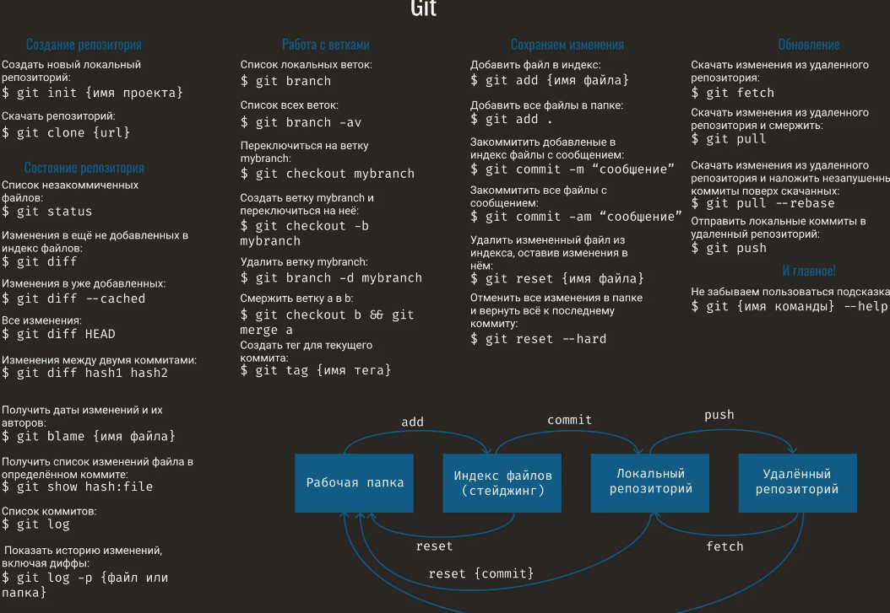

# Выполнение лабораторной работы

## Установка программного обеспечения

 Сперва захожу в терминал и устанавливаю git,используя команду 'dnf install git'.

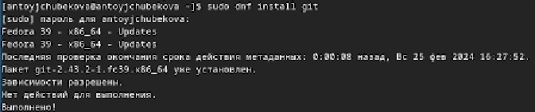

## Установка программного обеспечения

 Устанавливаю gh, используя команду 'dnf install gh'. 

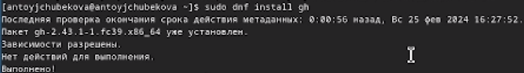

## Базавая настройка git. 

 Пользуясь командой 'git config --global user.name "Asel Toychubekova"' задаю свое имя, а командой 'git config --global user.email "aseltoychubekova714@gmail.com" ' задаю свой email  для репозитория, а также настроиваю utf-8 в выводе сообщений git командой 'git config --global core.quotepath false'. 

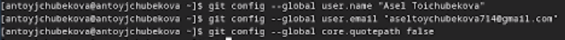

## Базавая настройка git. 

 Задаю имя начальной ветки, название-master, командой 'git config --global init.defaultBranch master', затем настраиваю параметры autocrlf( git config --global core.autocrlf input) и safecrlf(git config --global core.safecrlf warn).  

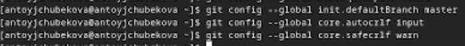

## Создание ключей ssh 

 Создаю ключ по алгоритму rsa с ключём размером 4096 бит, после чего создаю ключ по алгоритму ed25519, используя команду 'ssh keygen -t'. 
 
 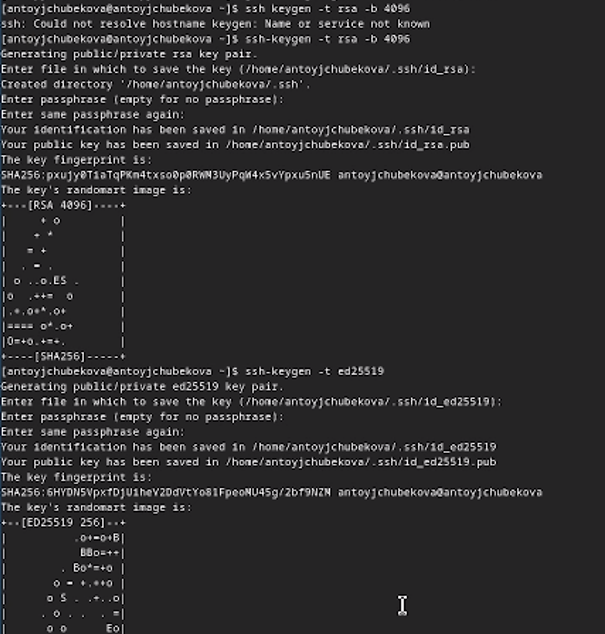
 
## Создание ключа pgp 
 
 Генерирую ключ, командой 'gpg --full-generate-key', выбирая подходящие из предложенных опций. 
 
 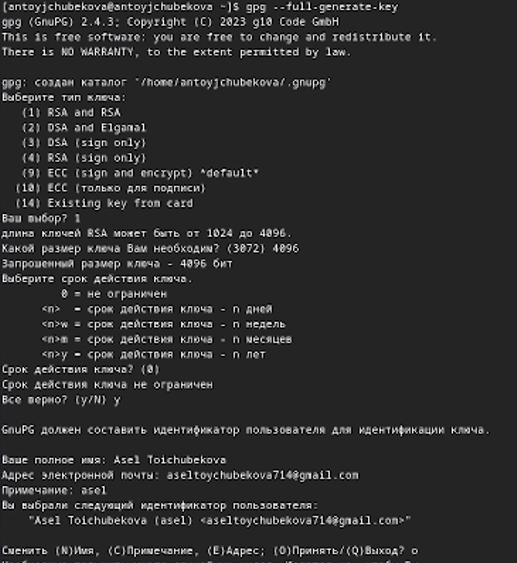
 
## Создание ключа pgp 
 
 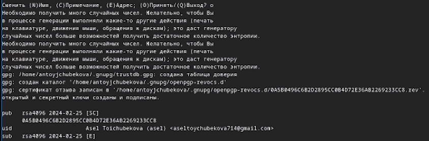
 
## Настройка github 
 
  У меня уже был настроен github, я создала учетную запись  заполнила основные данные на прошлом семестре. 
 
 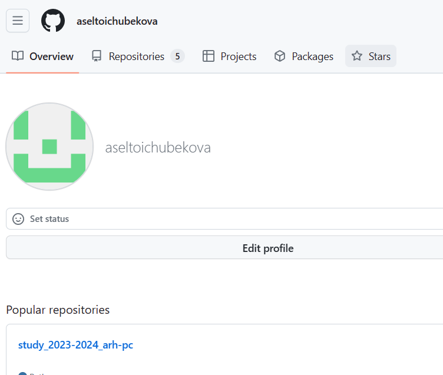
 
## Добавление PGP ключа в GitHub 

  Вывожу список ключей,командой 'gpg --list-secret-keys --keyid-format LONG'. 
  
 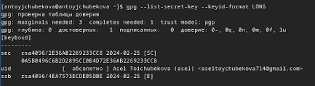

## Добавление PGP ключа в GitHub 
 
 Копирую сгенерированный PGP ключ  вв буфер обмена,командой 'gpg --armor --export  ключ  | xclip -sel clip', перед эти установив команду xclip. 
 
 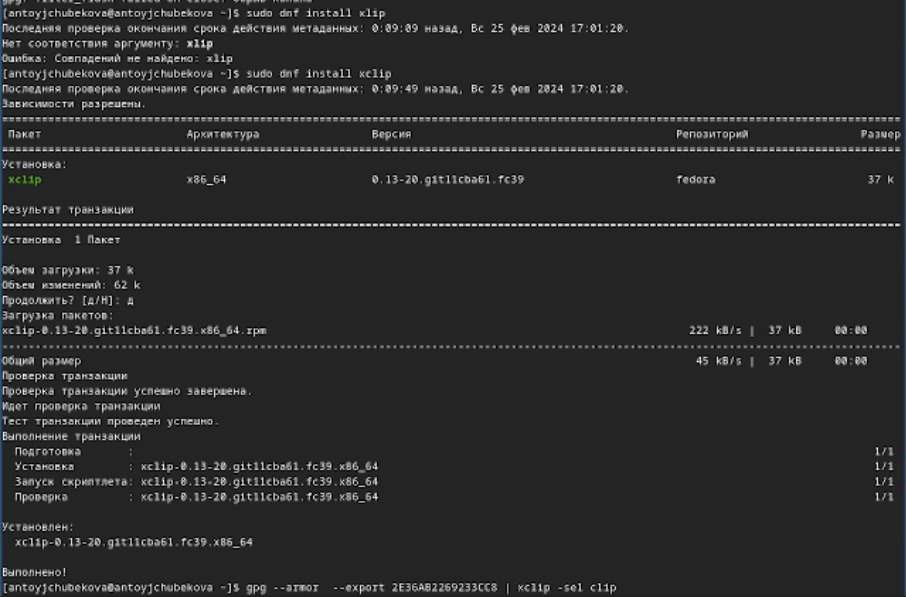
 
## Добавление PGP ключа в GitHub 

  Перехожу в настройки GitHub, нажимаю на кнопку New GPG key и вставляю полученный ключ в поле ввода. 

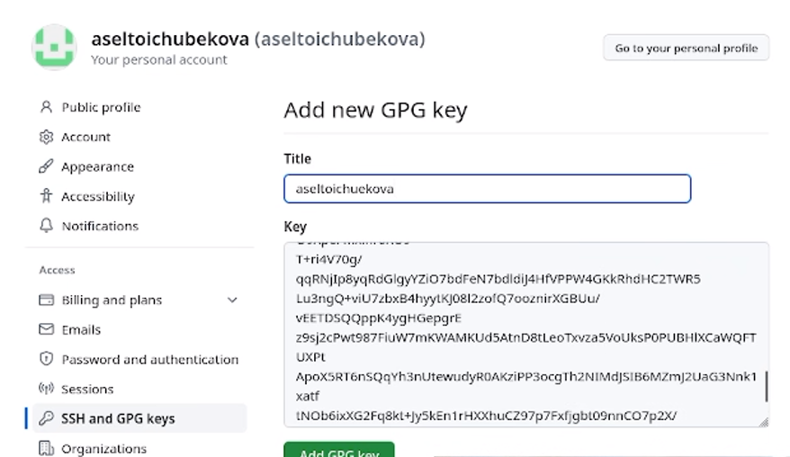

## Добавление PGP ключа в GitHub 

Далее получаю сгенерированный ключ 

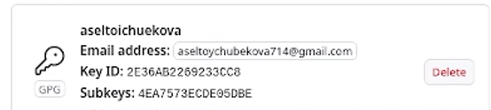

## Настройка автоматических подписей коммитов git 

 Используя введёный email, укажим Git применять его при подписи коммитов (git config --global user.signingkey email) 

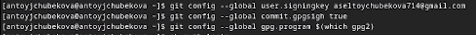

## Настройка gh 

 Используя команду 'gh auth login', авторизуюсь через браузер 

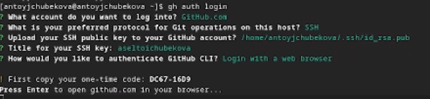

## Настройка gh 

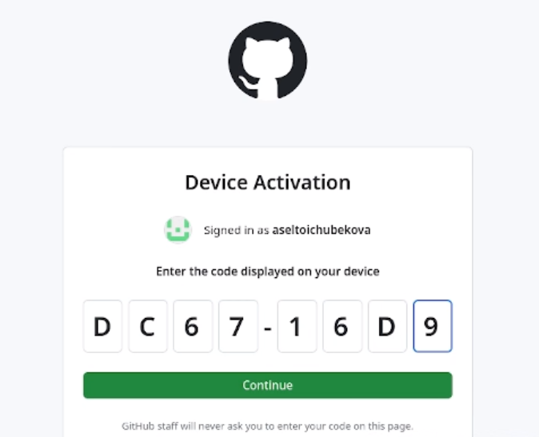

## Создание репозитория курса на основе шаблона 

 Создаю каталок, в котором мы будем дальше работать, перехожу в него, используя команды mkdir и cd

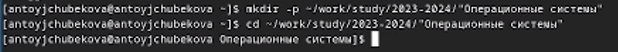

## Создание репозитория курса на основе шаблона 

 Далее создаю репозиторий на основе шаблона, с помощью команды 'gh repo create study_2022-2023_os-intro --template=yamadharma/course-directory-student-template --public' 

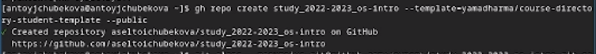

## Создание репозитория курса на основе шаблона 

После кланирую репозиторий,командой 'git clone --recursive git@github.com:aseltoichubekova/study_2022-2023_os-intro.git os-intro' 

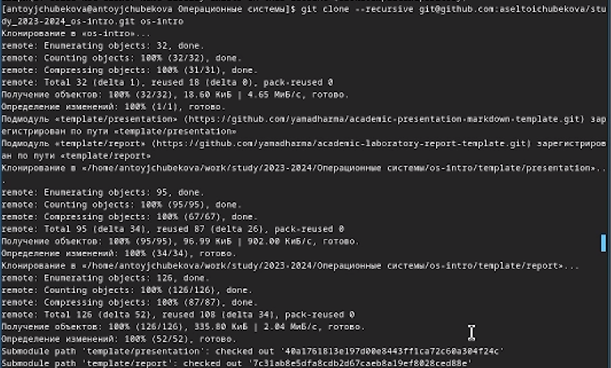

## Настройка каталога курса 

Перехожу в каталог курса -> cd ~/work/study/2022-2023/"Операционные системы"/os-intro и удаляю лишний файл rm package.json 

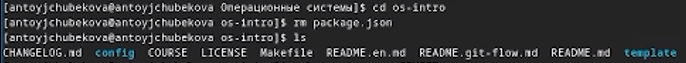

## Настройка каталога курса 

Создаю необходимые каталоги, используя команды : echo os-intro > COURSE, затем  make 

## Настройка каталога курса 

Отправляю файлы на сервер:
- git add . \
- git commit -am 'feat(main): make course structure' \
- git push.

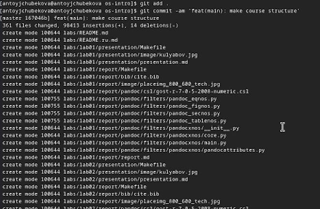

## Настройка каталога курса 

Зайдем в github и видим репозиторий созданный по шаблону 

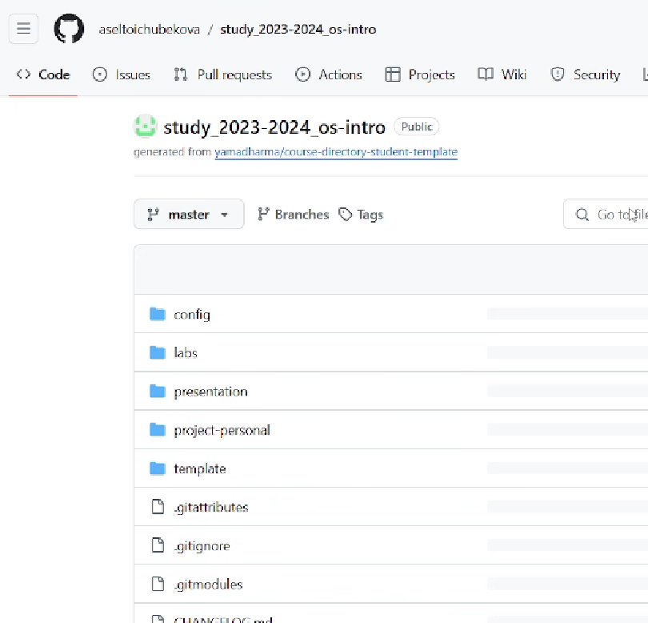

## Выводы

В ходе выполнения лабораторной работы №2 я изучила идеалогию и примечание средств контроля версии,а также освоила умения пл работе с git

## Список литературы{.unnumbered}
- https://esystem.rudn.ru/mod/page/view.php?id=1098933#org2151722.

