---
## Front matter
title: "Лабораторная работа №2"
subtitle: "Первоночальная настройка git"
author: "Тойчубекова Асель Нурлановна"

## Generic otions
lang: ru-RU
toc-title: "Содержание"

## Bibliography
bibliography: bib/cite.bib
csl: pandoc/csl/gost-r-7-0-5-2008-numeric.csl

## Pdf output format
toc: true # Table of contents
toc-depth: 2
lof: true # List of figures
lot: true # List of tables
fontsize: 12pt
linestretch: 1.5
papersize: a4
documentclass: scrreprt
## I18n polyglossia
polyglossia-lang:
  name: russian
  options:
	- spelling=modern
	- babelshorthands=true
polyglossia-otherlangs:
  name: english
## I18n babel
babel-lang: russian
babel-otherlangs: english
## Fonts
mainfont: PT Serif
romanfont: PT Serif
sansfont: PT Sans
monofont: PT Mono
mainfontoptions: Ligatures=TeX
romanfontoptions: Ligatures=TeX
sansfontoptions: Ligatures=TeX,Scale=MatchLowercase
monofontoptions: Scale=MatchLowercase,Scale=0.9
## Biblatex
biblatex: true
biblio-style: "gost-numeric"
biblatexoptions:
  - parentracker=true
  - backend=biber
  - hyperref=auto
  - language=auto
  - autolang=other*
  - citestyle=gost-numeric
## Pandoc-crossref LaTeX customization
figureTitle: "Рис."
tableTitle: "Таблица"
listingTitle: "Листинг"
lofTitle: "Список иллюстраций"
lotTitle: "Список таблиц"
lolTitle: "Листинги"
## Misc options
indent: true
header-includes:
  - \usepackage{indentfirst}
  - \usepackage{float} # keep figures where there are in the text
  - \floatplacement{figure}{H} # keep figures where there are in the text
---

# Цель работы

Целью лабораторной работы №2 является изучение идеологии и примечание средств контроля версий, а также освоение умений по работе с git.

# Задание

- Создать базовую конфигурацию для работы с git.\
- Создать ключ SSH.\
- Создать ключ PGP.\
- Настроить подписи git.\
- Зарегистрироваться на Github.\
- Создать локальный каталог для выполнения заданий по предмету.

# Теоретическое введение

   Системы контроля версий (Version Control System, VCS) применяются при работе нескольких человек над одним проектом. Обычно основное дерево проекта хранится в локальном или удалённом репозитории, к которому настроен доступ для участников проекта. При внесении изменений в содержание проекта система контроля версий позволяет их фиксировать, совмещать изменения, произведённые разными участниками проекта, производить откат к любой более ранней версии проекта, если это требуется.

   В классических системах контроля версий используется централизованная модель, предполагающая наличие единого репозитория для хранения файлов. Выполнение большинства функций по управлению версиями осуществляется специальным сервером. Участник проекта (пользователь) перед началом работы посредством определённых команд получает нужную ему версию файлов. После внесения изменений, пользователь размещает новую версию в хранилище. При этом предыдущие версии не удаляются из центрального хранилища и к ним можно вернуться в любой момент. Сервер может сохранять не полную версию изменённых файлов, а производить так называемую дельта-компрессию — сохранять только изменения между последовательными версиями, что позволяет уменьшить объём хранимых данных.Системы контроля версий (Version Control System, VCS) применяются при работе нескольких человек над одним проектом. Обычно основное дерево проекта хранится в локальном или удалённом репозитории, к которому настроен доступ для участников проекта. При внесении изменений в содержание проекта система контроля версий позволяет их фиксировать, совмещать изменения, произведённые разными участниками проекта, производить откат к любой более ранней версии проекта, если это требуется.

   В классических системах контроля версий используется централизованная модель, предполагающая наличие единого репозитория для хранения файлов. Выполнение большинства функций по управлению версиями осуществляется специальным сервером. Участник проекта (пользователь) перед началом работы посредством определённых команд получает нужную ему версию файлов. После внесения изменений, пользователь размещает новую версию в хранилище. При этом предыдущие версии не удаляются из центрального хранилища и к ним можно вернуться в любой момент. Сервер может сохранять не полную версию изменённых файлов, а производить так называемую дельта-компрессию — сохранять только изменения между последовательными версиями, что позволяет уменьшить объём хранимых данных.
 
 
   Система контроля версий Git представляет собой набор программ командной строки. Доступ к ним можно получить из терминала посредством ввода команды git с различными опциями. Благодаря тому, что Git является распределённой системой контроля версий, резервную копию локального хранилища можно сделать простым копированием или архивацией.
   
 Ниже на фото представлены основные команды git. (рис. [-@fig:001]).

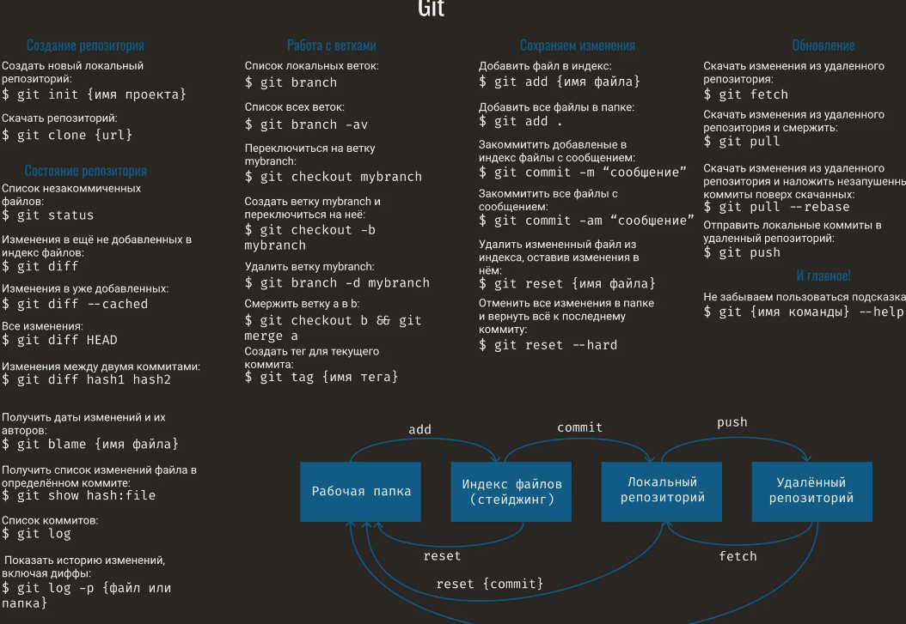{#fig:001 width=70%}

# Выполнение лабораторной работы

## Установка программного обеспечения ##

 Сперва захожу в терминал и устанавливаю git,используя команду 'dnf install git'. (рис. [-@fig:002])

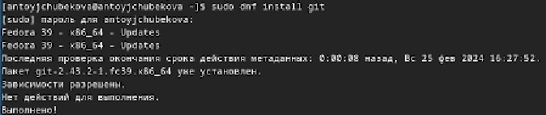{#fig:002 width=70%}

 Устанавливаю gh, используя команду 'dnf install gh'. (рис. [-@fig:003])

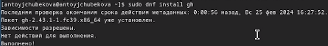{#fig:003 width=70%}

## Базавая настройка git. ##

 Пользуясь командой 'git config --global user.name "Asel Toychubekova"' задаю свое имя, а командой 'git config --global user.email "aseltoychubekova714@gmail.com" ' задаю свой email  для репозитория, а также настроиваю utf-8 в выводе сообщений git командой 'git config --global core.quotepath false'. (рис. [-@fig:004])

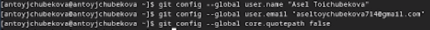{#fig:004 width=70%}

 Задаю имя начальной ветки, название-master, командой 'git config --global init.defaultBranch master', затем настраиваю параметры autocrlf( git config --global core.autocrlf input) и safecrlf(git config --global core.safecrlf warn).   (рис. [-@fig:005])

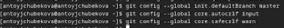{#fig:005 width=70%}

## Создание ключей ssh ##

 Создаю ключ по алгоритму rsa с ключём размером 4096 бит, после чего создаю ключ по алгоритму ed25519, используя команду 'ssh keygen -t'. (рис. [-@fig:006])
 
 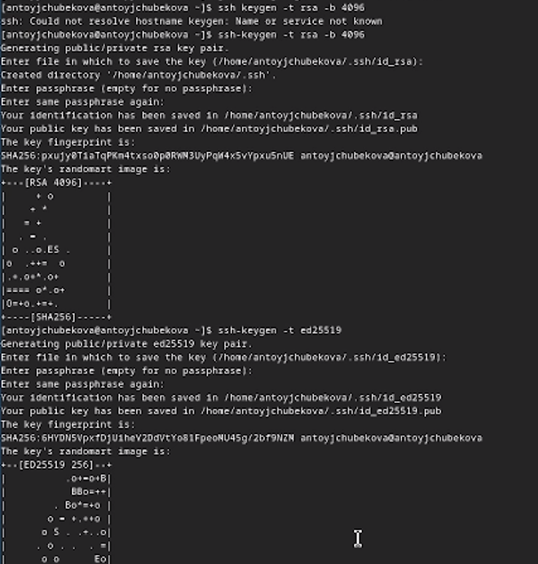{#fig:006 width=70%}
 
## Создание ключа pgp ##
 
 Генерирую ключ, командой 'gpg --full-generate-key', выбирая подходящие из предложенных опций. (рис. [-@fig:007] и рис. [-@fig:008])
 
 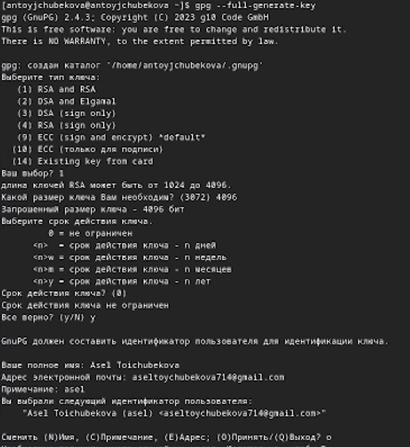{#fig:007 width=70%}
 
 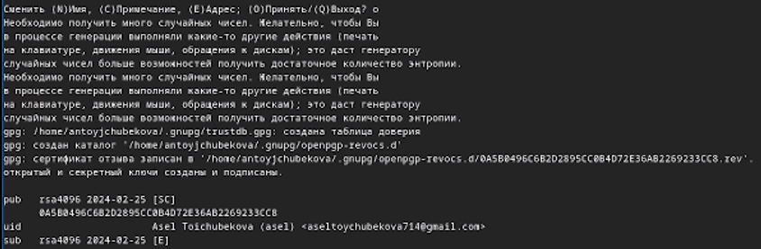{#fig:008 width=70%}
 
## Настройка github ##
 
  У меня уже был настроен github, я создала учетную запись  заполнила основные данные на прошлом семестре. (рис. [-@fig:009])
 
 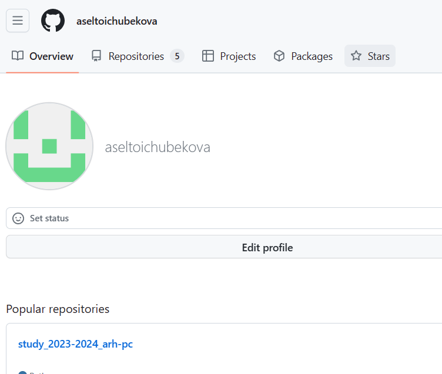{#fig:009 width=70%}
 
## Добавление PGP ключа в GitHub ##

  Вывожу список ключей,командой 'gpg --list-secret-keys --keyid-format LONG'. (рис. [-@fig:010])
 
 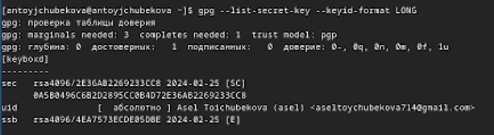{#fig:010 width=70%}
 
 Копирую сгенерированный PGP ключ  вв буфер обмена,командой 'gpg --armor --export  ключ  | xclip -sel clip', перед эти установив команду xclip. (рис. [-@fig:011])
 
 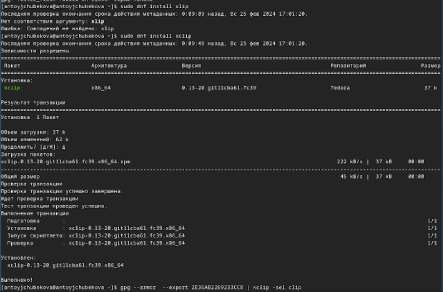{#fig:011 width=70%}

  Перехожу в настройки GitHub, нажимаю на кнопку New GPG key и вставляю полученный ключ в поле ввода. (рис. [-@fig:012]) , далее получаю сгенерированный ключ (рис. [-@fig:013])

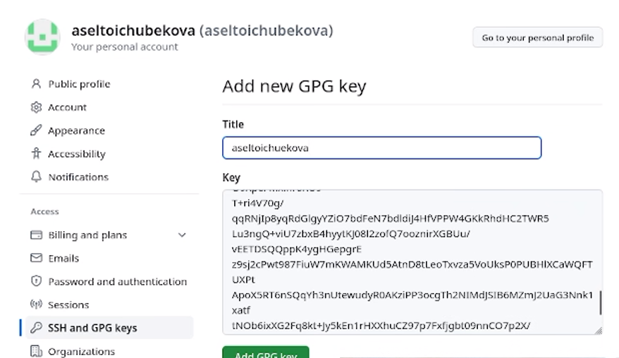{#fig:012 width=70%}

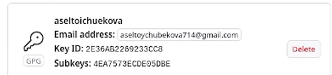{#fig:013 width=70%}

## Настройка автоматических подписей коммитов git ##

 Используя введёный email, укажим Git применять его при подписи коммитов (git config --global user.signingkey email) (рис. [-@fig:014])

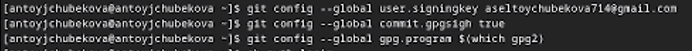{#fig:014 width=70%}

## Настройка gh ##

 Используя команду 'gh auth login', авторизуюсь через браузер (рис. [-@fig:015] и рис. [-@fig:016])

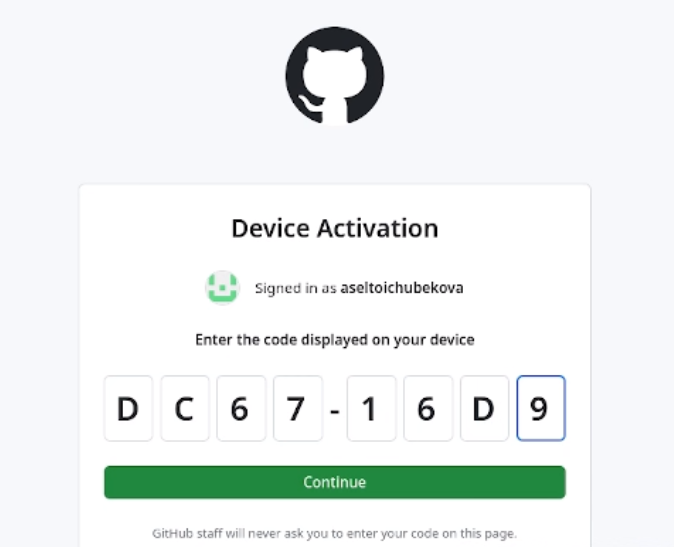{#fig:015 width=70%}

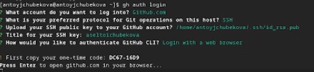{#fig:016 width=70%}

## Создание репозитория курса на основе шаблона ##

 Создаю каталок, в котором мы будем дальше работать, перехожу в него, используя команды mkdir и cd (рис. [-@fig:017])

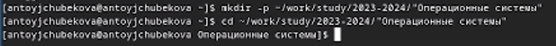{#fig:017 width=70%}

 Далее создаю репозиторий на основе шаблона, с помощью команды 'gh repo create study_2022-2023_os-intro --template=yamadharma/course-directory-student-template --public' (рис. [-@fig:018])

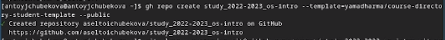{#fig:018 width=70%}

После кланирую репозиторий,командой 'git clone --recursive git@github.com:aseltoichubekova/study_2022-2023_os-intro.git os-intro'  (рис. [-@fig:019])

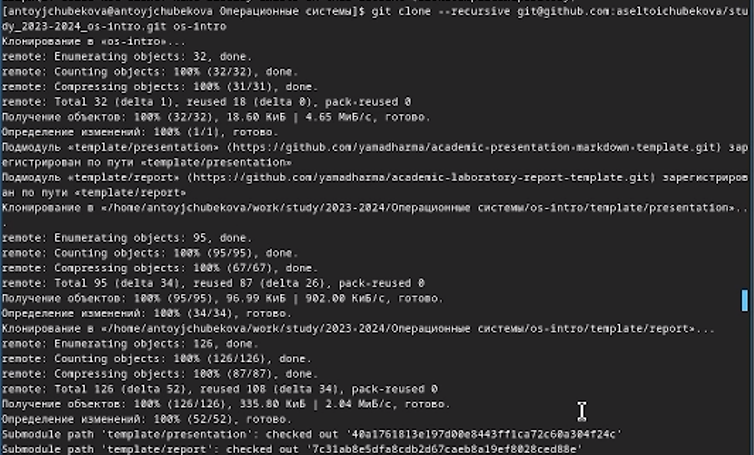{#fig:019 width=70%}

## Настройка каталога курса ##

Перехожу в каталог курса -> cd ~/work/study/2022-2023/"Операционные системы"/os-intro и удаляю лишний файл rm package.json (рис [-@fig:020])

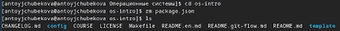{#fig:020 width=70%}

Создаю необходимые каталоги, используя команды : echo os-intro > COURSE, затем  make (рис [-@fig:021])

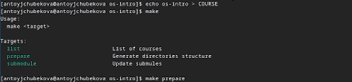{#fig:021 width=70%}

Отправляю файлы на сервер:(рис [-@fig:022])
- git add . \
- git commit -am 'feat(main): make course structure' \
- git push.

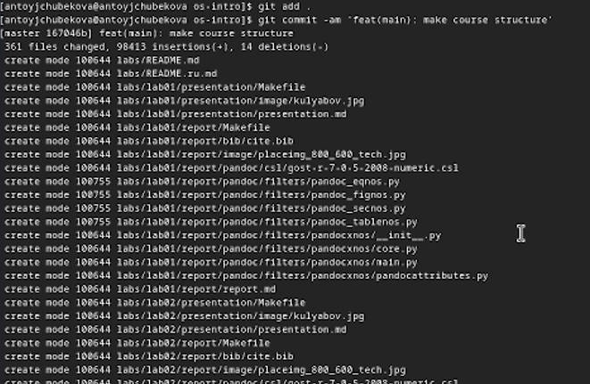{#fig:022 width=70%}

Зайдем в github и видим репозиторий созданный по шаблону (рис [-@fig:023])

{#fig:023 width=70%}

## Ответы на контрольные вопросы ##

 1. Что такое системы контроля версий (VCS) и для решения каких задач они предназначаются?
 
 Системы контроля(VCS)- проограммное обеспечение для облегчения работы с изменяющейся информацией, например, когда над проектом  работают несколько человек. Они позволяют хранить несколько версий информации, также можно посмотреть ранние версии этой информации-проекта. Это программное обеспечение позволяет просматривать кем и когда были внесены изменения в тот или иной проект. Его применяют для хранения полной истории именений, сохранения причин изменений, для удобства работы над проектом нескольких людей.\
 
 2. Объясните следующие понятия VCS и их отношения: хранилище, commit, история, рабочая копия.
 
 Хранилище- репоиторий, где сохроняются все версии проекта, в нем хранятся все документы,история их изменения и прочие служебные информации.\
 Commit-Отлаживает все изменения, сохроняет разницу версий,их изменения.\
 История-хранит все изменения в проекте и позволяет при необходимости использовать нужные данные из прошлых версий.\
 Рабочая копия-копия проекта, основанная на версии из хранилища, последней версии.\
 
 3. Что представляют собой и чем отличаются централизованные и децентрализованные VCS? Приведите примеры VCS каждого вида.
 
 Централизованные VCS- одно основное хранилище всего проекта. Каждый пользователль копирует себе необходимые ему файлы из этого репозитория,именяет затем добавляет измененияобратно в хранилище.\
 Децентрализованные VCS- в этих VCS у каждого пользователя свой вариантрепозитория, есть возможность добавлять и забирать изменения из любого репозитория.\
 В отличие от классических  в  децентрализованных системах контроля версий центральный репозиторий не является обязательным.\
 Централизованные VCS -CVS,TFS,AccuRev.\
 Децентрализованные VCS-Git,Bazaar.\
   
 4. Опишите действия с VCS при единоличной работе с хранилищем.
 
 Для начало для всех создается и подключается  центральный репозиторий, затем по мере изменений проекта эти изменения отправляются на сервер.\
 
 5. Опишите порядок работы с общим хранилищем VCS.
 
 Перед наалом работы все учасники проекта получают версию проекта в хранилище, после изменений пользователь размещает уже новую версию в хранилище. При этом предыдущие версии тоже сохроняются.\
 
 6. Каковы основные задачи, решаемые инструментальным средством git?
 
 Основными задачами инструментального средства git является: хранение информации о всех изменениях,обеспечения удобства командной работы над проектом.\
 
 7. Назовите и дайте краткую характеристику командам git.
 - Создания основного дерева репозитория-git init.\
 - Получение обновлений -git pull.\
 - Просмотр списка измененных файлов-git status.\
 - Отправка изменений локального дерева- git push.\
 - Просмотр текущих изменений-git diff.\
 - Сохранение изменений-git add .\
 - Добавить конкретные изменения -git add имя файла\
 - Удаление файл или каталог из индекса репозитория-git rm имя файла\
 - Сохранение добавленных изменений и все измененные файлы -git commit -am 'описание коммита'\
 - Сохранить добавленные изменения с внесением комментария через встроенный редактор- git commit\
 - Создание новой ветки базиркующаяся на текущей-git checkout-b имя ветки
 - Переключение на новую ветку-git checkout имя ветки\
 - Отправка изменений конкретной ветки в центральный репозиторий- git push origin имя ветки\
 - Удаление локальной уже слитой с основным деревом ветки-git branch d- имя ветки\
 - Принудительное удаление ветки-git branch -D имя ветки\
 - Удаление ветки с центрального репозитория - go=it push origin: имя ветки.\
 - Слияние ветки с текущим деревом-git merge -no-ff имя веткию\
  
 8.   Приведите примеры использования при работе с локальным и удалённым репозиториями.
 
 git push-all отправляет из локального репозитория все созраненные изменения в центральный репозиторий,предворительно создав локальный ррепозиторий и сделав предварительную конфигуряцию.\
 
 9.  Что такое и зачем могут быть нужны ветви (branches)?
 
 Ветвление- один из параллельных участков в одном хранилище,исходящие из одной версии, обычно есть главная ветка, также возможно их слияние. Испольуется для разработки новых функций.\
 
 10.   Как и зачем можно игнорировать некоторые файлы при commit?
 
 Когда идет работа над проектом могут создаваться файлы которые не нуужно добавлять в репозиторий. К ним относятся временные файлы. Можно прописать шаблоны игнарируемые при добавлении в репозиторий типов файлов в файл.gitignore с помощью сервисов.

# Выводы

В ходе выполнения лабораторной работы №2 я изучила идеалогию и примечание средств контроля версии,а также освоила умения пл работе с git

# Список литературы{.unnumbered}
- https://esystem.rudn.ru/mod/page/view.php?id=1098933#org2151722.
