---
## Front matter
lang: ru-RU
title: Лабораторная работа №3
subtitle: Операционные системы
author:
  - Тойчубекова Асель Нурлановна
institute:
  - Российский университет дружбы народов, Москва, Россия
date: 29 января 2024

## i18n babel
babel-lang: russian
babel-otherlangs: english

## Formatting pdf
toc: false
toc-title: Содержание
slide_level: 2
aspectratio: 169
section-titles: true
theme: metropolis
header-includes:
 - \metroset{progressbar=frametitle,sectionpage=progressbar,numbering=fraction}
 - '\makeatletter'
 - '\beamer@ignorenonframefalse'
 - '\makeatother'
 
## Fonts
mainfont: PT Serif
romanfont: PT Serif
sansfont: PT Sans
monofont: PT Mono
mainfontoptions: Ligatures=TeX
romanfontoptions: Ligatures=TeX
sansfontoptions: Ligatures=TeX,Scale=MatchLowercase
monofontoptions: Scale=MatchLowercase,Scale=0.9

---

# Информация

## Докладчик

:::::::::::::: {.columns align=center}
::: {.column width="70%"}

  * Тойчубекова Асель Нурлановна
  * Студент НПИбд-02-23
  * Факультете физико-математических и естественных наук
  * Российский университет дружбы народов
  * [1032235033@pfur.ru](mailto:1032235033@pfur.ru)

:::
::: {.column width="30%"}

:::
::::::::::::::

## Цель работы

Целью лабораторной работы №3 является научиться оформлять отчеты с помощью языка разметки Markdown

## Теоретическое введение

Язык разметки Markdown- это  облегченный язык текстовой разметки документов, созданный с целью обозначения формирования в простом тексте, с максимальным сохранением его читаемости человеком, и пригоднный для машинного преобразования в языки для продвинутых преобразований(html,rich text и др.) . Он позволяет создавать тексты без использования word и других редакторов. Разметку можно прочитать и воспроизвести в любой системе или браузере. 
 Используя различные знаки мы можем редактировать текстения.

                                             |
# Выполнение лабораторной работы

## Выполнение лабораторной работы

  Для начало нам, нужно перекинуть все скриншоты, которые нужны при написании отчета на лабораторную работу №2. Для этого я перехожу в настройки устройства и подключаю образ диска дополнений гостевой ОС. 

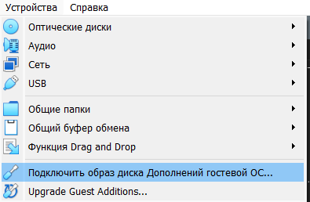

## Выполнение лабораторной работы

Дальше я перехожу в настройки виртуальной машины и подключаю общую папку, в данном случае эта папка, в которой расположены все скриншоты ко второй лабораторной работе. 

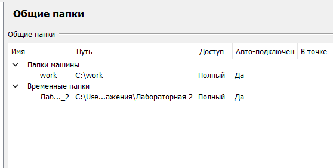

## Выполнение лабораторной работы

 Затем открываю папки в виртуальной машине и перехожу в общую папку, копирую все скриншоты и вставляю их по адресу -> /home/antoyjchubekova/work/study/2023-2024/Операционные системы/os-intro/labs/lab02/report/image/, там где я буду писать отчет к лабораторной работе №2. 

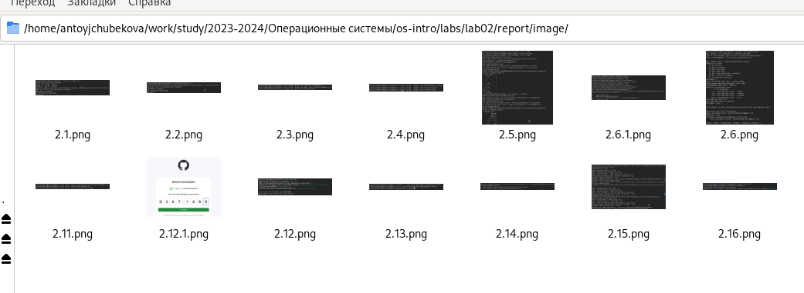

## Выполнение лабораторной работы

Открыв терминал перехожу в нужный мне каталог для начала написания отчета к лабораторной работе №2(по адресу /home/antoyjchubekova/work/study/2023-2024/Операционные системы/os-intro/labs/lab02/report) 

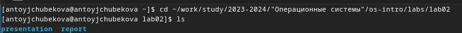

## Выполнение лабораторной работы

С помощью команды gedit, я открываю файл report.md для дальнейшего его редактирования.

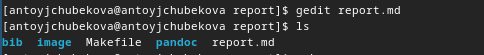

## Выполнение лабораторной работы

Далее я приступаю к самому написанию отчета. Заполняю титульный лист лабораторной работы. 

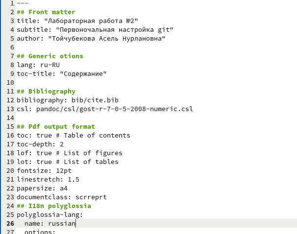

## Выполнение лабораторной работы

Описываю цель работы и задание, которое я должна выполнить. 

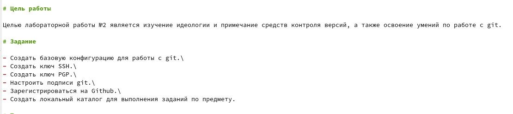

## Выполнение лабораторной работы

Расписываю теоретическое введение. 

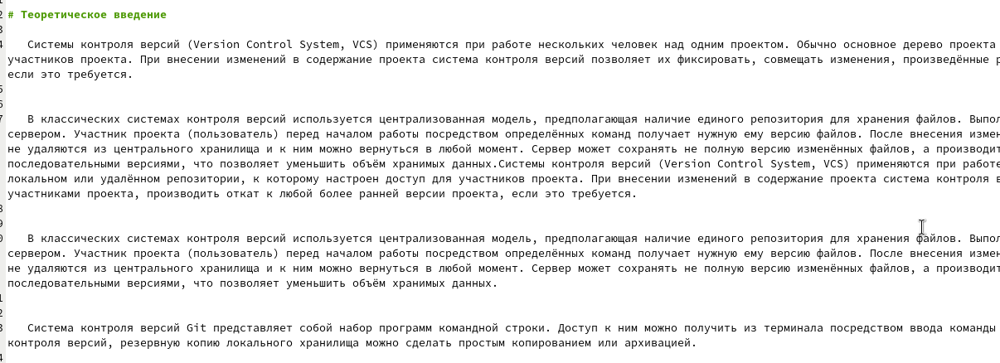

## Выполнение лабораторной работы

Расписываю ход выполнения лабораторной работы. 

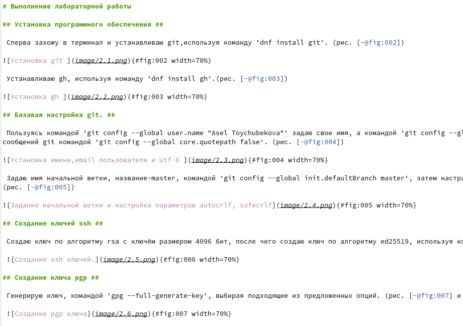

## Выполнение лабораторной работы

Отвечаю на контрольные вопросы. 

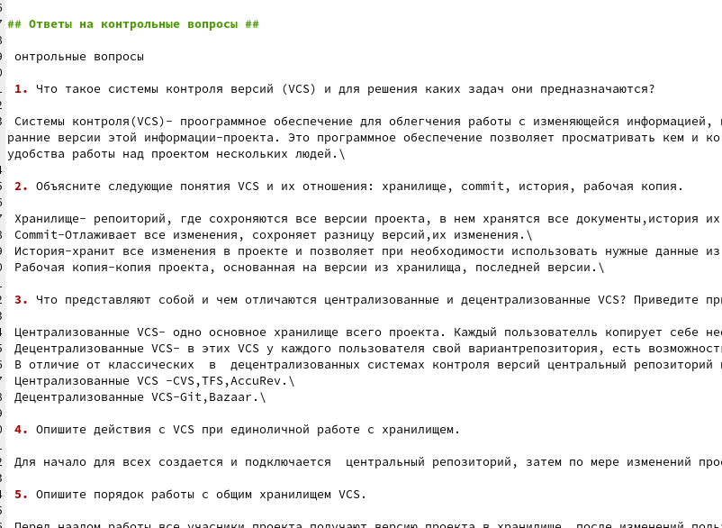

## Выполнение лабораторной работы

Делаю вывод и указываю литературные источники. 

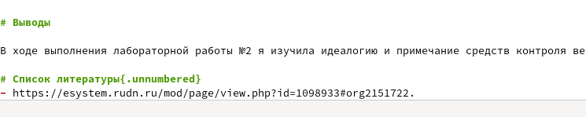

## Выполнение лабораторной работы

После изменения файла, используя команду make, я выполняю его компиляцию из формата md в doxc,pdf. 

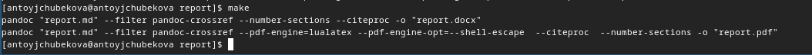

## Выполнение лабораторной работы

Перейдя в папку лабораторной работы мы видим, что файлы скомпилировались. 

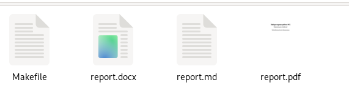

## Выполнение лабораторной работы

Затем отправляю измененный и скомпилированные файлы на глобальный репозиторий, используя команды git add . -> git commit -> git push. 

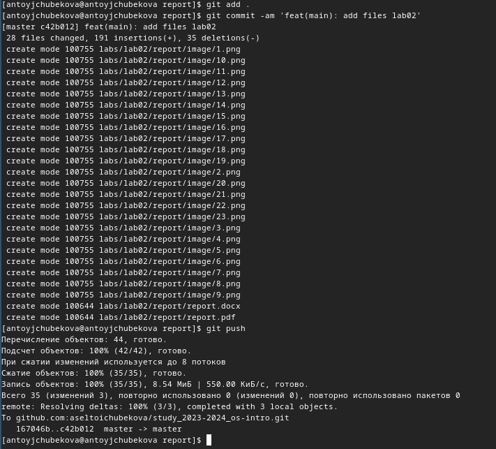

## Выполнение лабораторной работы

Заходим в githb и видим, что файлы были успешно доставлены и сохранены. 

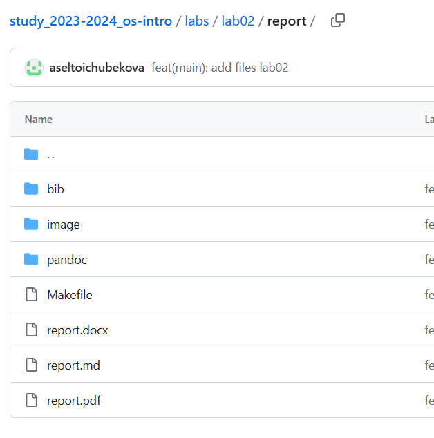

## Выводы

В ходе выполнения лабораторной работы №3 я научилась оформлять отчеты с помощью языка разметки Markdown

## Список литературы{.unnumbered}

- https://esystem.rudn.ru/course/view.php?id=5790.\
- https://help.vivaldi.com/ru/services-ru/forum-ru/markdown-formatting/ \
- https://ru.wikipedia.org/wiki/Markdown.
 

