---
## Front matter
title: "Лабораторная работа №3"
subtitle: "Язык разметки Markdown"
author: "Тойчубекова Асель Нурлановна"

## Generic otions
lang: ru-RU
toc-title: "Содержание"

## Bibliography
bibliography: bib/cite.bib
csl: pandoc/csl/gost-r-7-0-5-2008-numeric.csl

## Pdf output format
toc: true # Table of contents
toc-depth: 2
lof: true # List of figures
lot: true # List of tables
fontsize: 12pt
linestretch: 1.5
papersize: a4
documentclass: scrreprt
## I18n polyglossia
polyglossia-lang:
  name: russian
  options:
	- spelling=modern
	- babelshorthands=true
polyglossia-otherlangs:
  name: english
## I18n babel
babel-lang: russian
babel-otherlangs: english
## Fonts
mainfont: PT Serif
romanfont: PT Serif
sansfont: PT Sans
monofont: PT Mono
mainfontoptions: Ligatures=TeX
romanfontoptions: Ligatures=TeX
sansfontoptions: Ligatures=TeX,Scale=MatchLowercase
monofontoptions: Scale=MatchLowercase,Scale=0.9
## Biblatex
biblatex: true
biblio-style: "gost-numeric"
biblatexoptions:
  - parentracker=true
  - backend=biber
  - hyperref=auto
  - language=auto
  - autolang=other*
  - citestyle=gost-numeric
## Pandoc-crossref LaTeX customization
figureTitle: "Рис."
tableTitle: "Таблица"
listingTitle: "Листинг"
lofTitle: "Список иллюстраций"
lotTitle: "Список таблиц"
lolTitle: "Листинги"
## Misc options
indent: true
header-includes:
  - \usepackage{indentfirst}
  - \usepackage{float} # keep figures where there are in the text
  - \floatplacement{figure}{H} # keep figures where there are in the text
---

# Цель работы

Целью лабораторной работы №3 является научиться оформлять отчеты с помощью языка разметки Markdown

# Задание 

- Сделать отчет по предыдущей лабораторной работе в формате Markdown. \
- В качестве отчета предоставить отчет в 3 форматах:pdf,doxc,rm.

# Теоретическое введение

**Язык разметки Markdown**- это  облегченный язык текстовой разметки документов, созданный с целью обозначения формирования в простом тексте, с максимальным сохранением его читаемости человеком, и пригоднный для машинного преобразования в языки для продвинутых преобразований(html,rich text и др.) . Он позволяет создавать тексты без использования word и других редакторов. Разметку можно прочитать и воспроизвести в любой системе или браузере. 
 Используя различные знаки мы можем редактировать текст, например:

'#'-для создания заголовка

'** **'- для создания полужирного начертания текста

'**'-для курсивного начертания курсива

'>'-блок цитирования

'*' ; '- '; '1.' -для упорядоченного, неупорядоченного, вложенного списка

Для встроенной 0ссылки действует схема [link text](file-name.md) или [link text](http://example.com/ "Необязательная подсказка").
Также существуют определенные правила по оформлению тех или иных формул и изображений в Markdown. В Markdown вставить изображение в документ можно с помощью непосредственного указания адреса изображения. C помощью команды pandoc  мы можем обработать файлы.
                                             |
# Выполнение лабораторной работы

  Для начало нам, нужно перекинуть все скриншоты, которые нужны при написании отчета на лабораторную работу №2. Для этого я перехожу в настройки устройства и подключаю образ диска дополнений гостевой ОС. (рис. [-@fig:001])

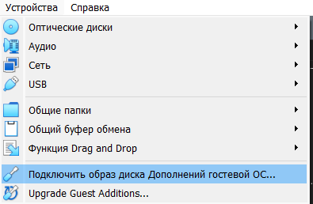{#fig:001 width=70%}

Дальше я перехожу в настройки виртуальной машины и подключаю общую папку, в данном случае эта папка, в которой расположены все скриншоты ко второй лабораторной работе. (рис. [-@fig:002])

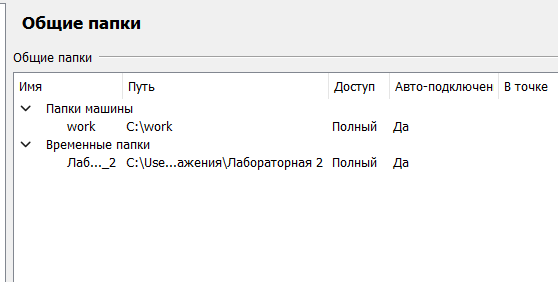{#fig:002 width=70%}

 Затем открываю папки в виртуальной машине и перехожу в общую папку, копирую все скриншоты и вставляю их по адресу -> /home/antoyjchubekova/work/study/2023-2024/Операционные системы/os-intro/labs/lab02/report/image/, там где я буду писать отчет к лабораторной работе №2. (рис. [-@fig:003])

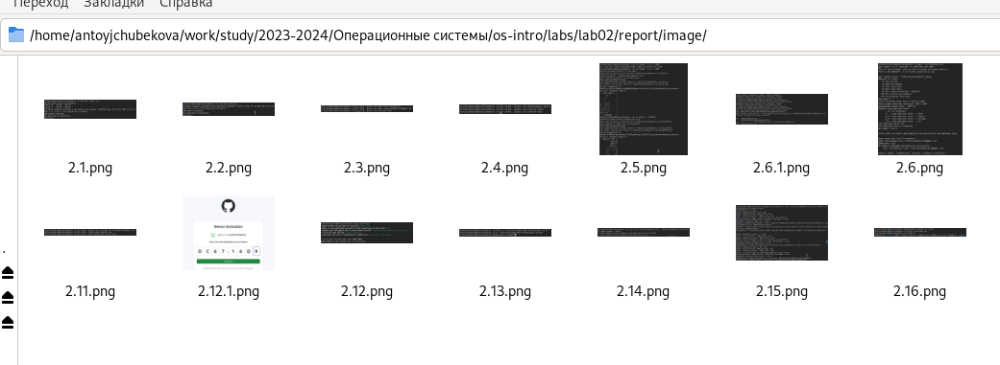{#fig:003 width=70%}

Открыв терминал перехожу в нужный мне каталог для начала написания отчета к лабораторной работе №2(по адресу /home/antoyjchubekova/work/study/2023-2024/Операционные системы/os-intro/labs/lab02/report) (рис. [-@fig:004])

{#fig:004 width=70%}

С помощью команды gedit(заранее ее установив) я открываю файл report.md для дальнейшего его редактирования. (рис. [-@fig:005] и рис. [-@fig:006])

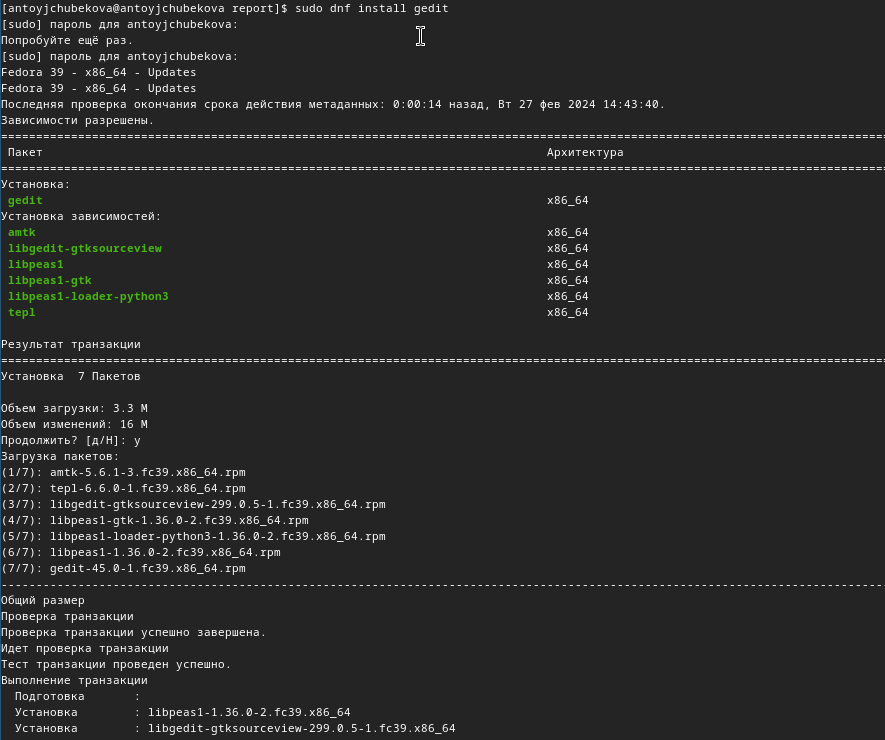{#fig:005 width=70%}

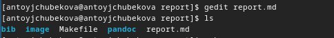{#fig:006 width=70%}

Далее я приступаю к самому написанию отчета. Заполняю титульный лист лабораторной работы. (рис. [-@fig:007])

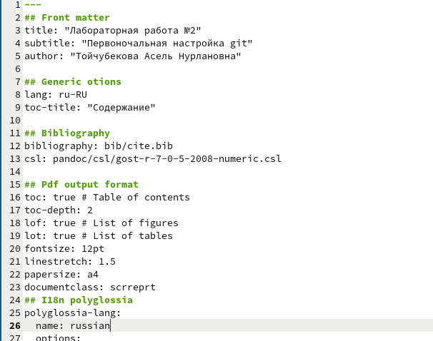{#fig:007 width=70%}

Описываю цель работы и задание, которое я должна выполнить. (рис. [-@fig:008])

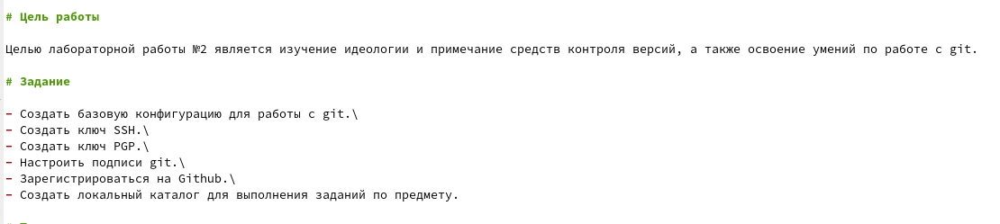{#fig:008 width=70%}

Расписываю теоретическое введение. (рис. [-@fig:009])

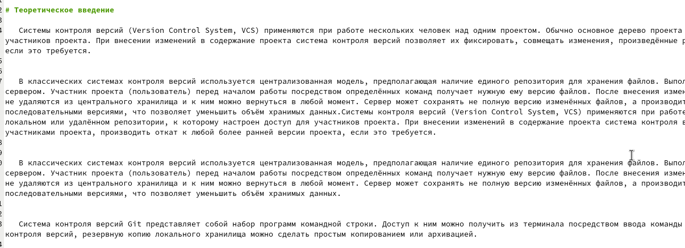{#fig:009 width=70%}

Расписываю ход выполнения лабораторной работы. (рис. [-@fig:010])

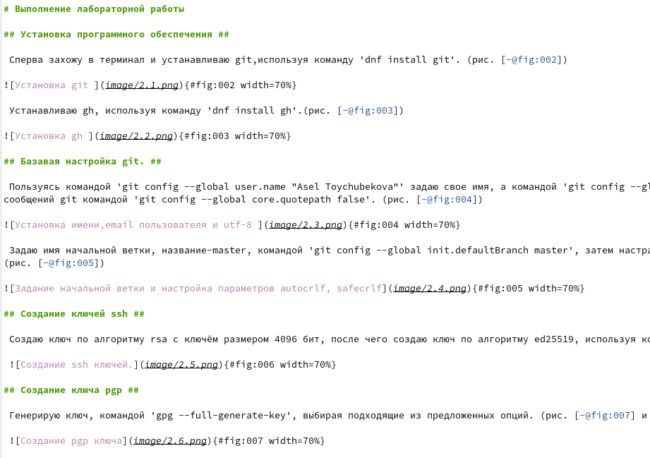{#fig:010 width=70%}

Отвечаю на контрольные вопросы. (рис. [-@fig:011])

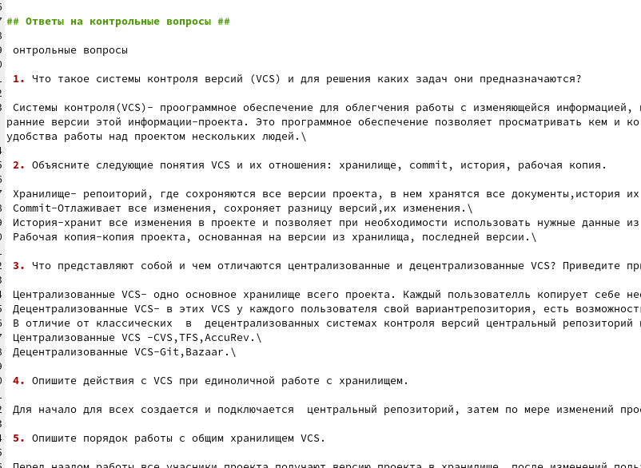{#fig:011 width=70%}

Делаю вывод и указываю литературные источники. (рис. [-@fig:012])

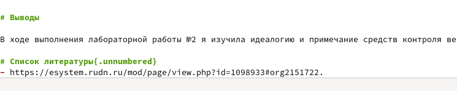{#fig:012 width=70%}

После изменения файла, используя команду make, я выполняю его компиляцию из формата md в doxc,pdf. (рис. [-@fig:013]). Перейдя в папку лабораторной работы мы видим, что файлы скомпилировались. (рис. [-@fig:014])

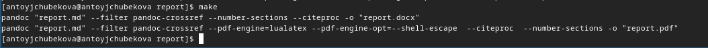{#fig:013 width=70%}

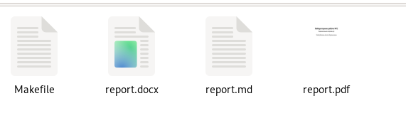{#fig:014 width=70%}

Затем отправляю измененный и скомпилированные файлы на глобальный репозиторий, используя команды git add . -> git commit -> git push.  (рис. [-@fig:015]  и рис.[-@fig:016])). Заходим в githb и видим, что файлы были успешно доставлены и сохранены.  

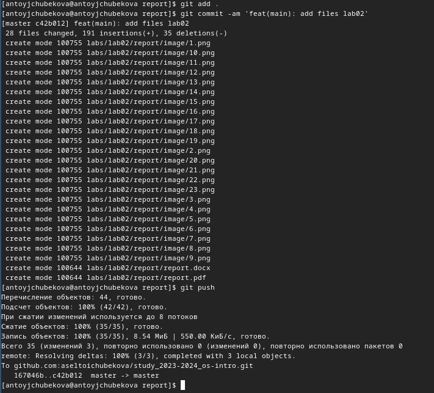{#fig:015 width=70%}

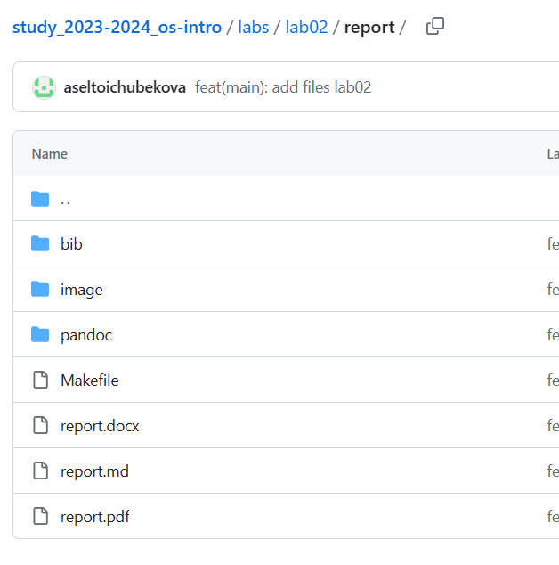{#fig:016 width=70%}.

# Выводы

В ходе выполнения лабораторной работы №3 я научилась оформлять отчеты с помощью языка разметки Markdown

# Список литературы{.unnumbered}

- https://esystem.rudn.ru/course/view.php?id=5790.\
- https://help.vivaldi.com/ru/services-ru/forum-ru/markdown-formatting/ \
- https://ru.wikipedia.org/wiki/Markdown.
