---
## Front matter
lang: ru-RU
title: Лабораторная работа №4
subtitle: Операционные системы
author:
  - Тойчубекова Асель Нурлановна
institute:
  - Российский университет дружбы народов, Москва, Россия
 
date: 07 марта 2024

## i18n babel
babel-lang: russian
babel-otherlangs: english

## Formatting pdf
toc: false
toc-title: Содержание
slide_level: 2
aspectratio: 169
section-titles: true
theme: metropolis
header-includes:
 - \metroset{progressbar=frametitle,sectionpage=progressbar,numbering=fraction}
 - '\makeatletter'
 - '\beamer@ignorenonframefalse'
 - '\makeatother'
 
## Fonts
mainfont: PT Serif
romanfont: PT Serif
sansfont: PT Sans
monofont: PT Mono
mainfontoptions: Ligatures=TeX
romanfontoptions: Ligatures=TeX
sansfontoptions: Ligatures=TeX,Scale=MatchLowercase
monofontoptions: Scale=MatchLowercase,Scale=0.9
 
---

# Информация

## Докладчик

:::::::::::::: {.columns align=center}
::: {.column width="70%"}

  * Тойчубекова Асель Нурлановна 
  * Студент, НПИбд-02-23
  * Факультет физико-математических и естественных наук
  * Российский университет дружбы народов
  * [1032235033@pfur.ru](1032235033@pfur.ru)
  * <https://aseltoichubekova.github.io/ru/>

:::
::: {.column width="30%"}

:::
::::::::::::::

## Цель работы

Целью данной лабораторной работы является получение навыков правильной работы с репозиториями git.

## Задание

- Выполнить работу для тестового репозитория.\
- Преобразовать рабочий репозиторий в репозиторий с git-flow и conventional commits.

## Теоретическое введение

 **GitFlow**- это определенная надстройка над моделью ветвление Git, которая включает в себя использование фича веток и несколько основных веток, для удобства работы над тем или иным проектом. Gitflow Workflow опубликована и популяризована Винсентом Дриссеном. Gitflow Workflow предполагает выстраивание строгой модели ветвления с учётом выпуска проекта. Данная модель отлично подходит для организации рабочего процесса на основе релизов.\
  Последовательность действий при работе по модели Gitflow:
  - Из ветки master создаётся ветка develop. \
  - Из ветки develop создаётся ветка release. \
  - Из ветки develop создаются ветки feature. \
  - Когда работа над веткой feature завершена, она сливается с веткой develop. \
  - Когда работа над веткой релиза release завершена, она сливается в ветки develop и master. \
  - Если в master обнаружена проблема, из master создаётся ветка hotfix. \
  - Когда работа над веткой исправления hotfix завершена, она сливается в ветки develop и master. \

# Выполнение лабораторной работы

## Установка gitflow 

Устанавливаю gitflow из коллекции репозиториев Copr 

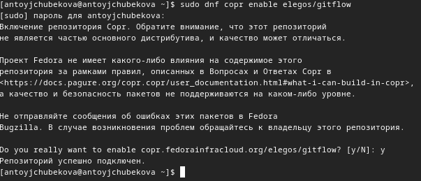

## Установка gitflow 

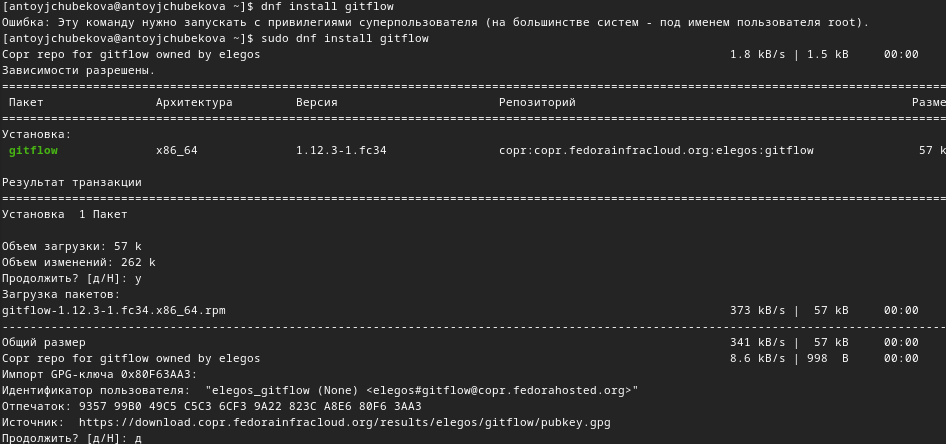

## Установка Node.js 

Устанавливаю Node.js. pnpm скачиваю с интернета и запускаю с помощью команды dnf install.

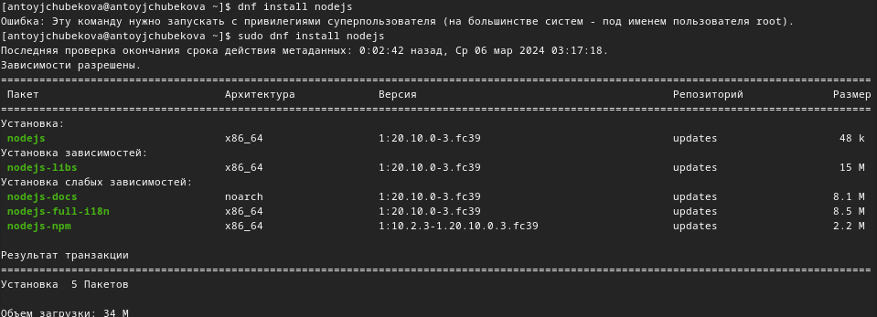

## Установка Node.js

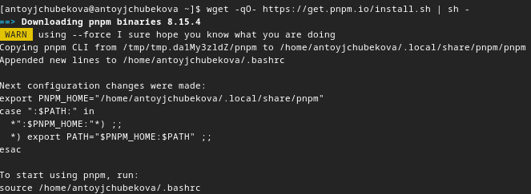

## Настройка Node.js 

Запускаю pnpm. 

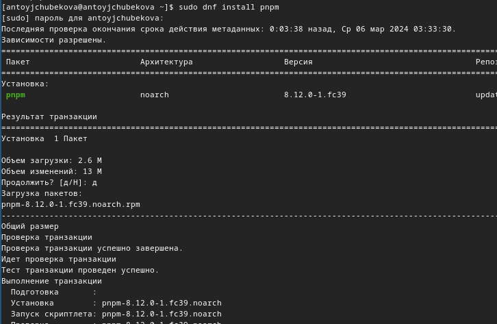

## Настройка Node.js 

Перелогиниваюсь, выполняя команду source ~/.bashrc. 

## Общепринятые коммиты 

Устанавливаю программу, используемая для помощи в формировании коммитов. При этом устанавливвается скрипт git-cz, который мы и будем использовать для коммитов. 

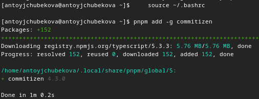

## Общепринятые коммиты

Устанавливаю программу для помощи в создании логов. 

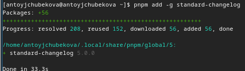

## Общепринятые коммиты

Создаю репозиторий git-extended. 

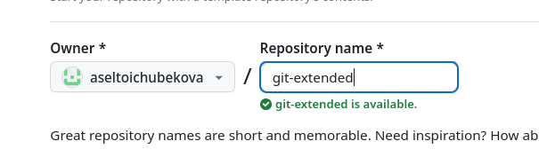

## Общепринятые коммиты

Клонирую репозторий.

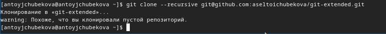
## Общепринятые коммиты

Далее я перехожу в этот репозиторий и создаю файл README.md, затем записываю в этот файл некоторый текст и сохраняю его.

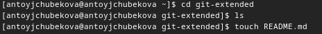

## Общепринятые коммиты

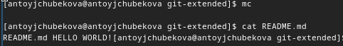

## Общепринятые коммиты

Делаю первый коссит и выкладываю на github. Захожу на github и видим, что успешно закоммитолось. 

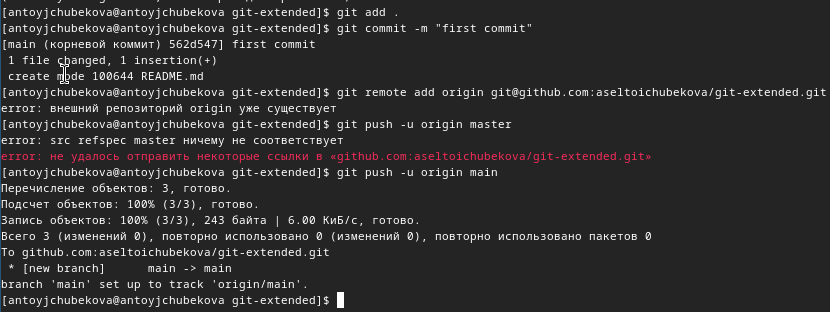

## Общепринятые коммиты

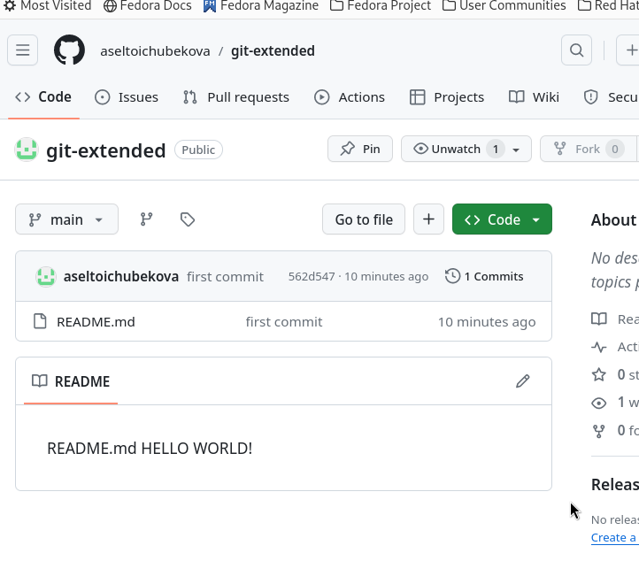

##Общепринятые коммиты

Выполняю конфигурацию для пакетов Node.js. 

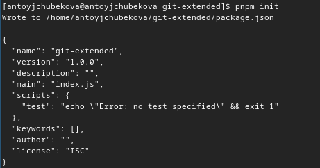

## Общепринятые коммиты

Открыв файл package.json с помщью команды mc, редактирую его заполняя некоторыые параметры пакета, также сконфигурирую формат коммитов. 

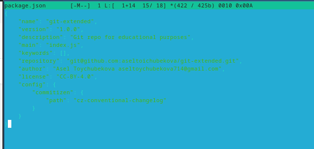

## Общепринятые коммиты

Добавляю новые файлы и выполняю коммит, затем отправляю на github. 

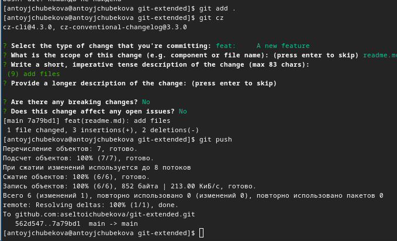

## Общепринятые коммиты

Инициализирую gitflow.

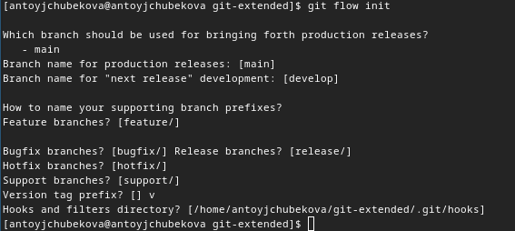

## Общепринятые коммиты

Проверяю, что я нахожусь в ветке develop. Мы видим, что все верно и мы находимся в этой ветке. 

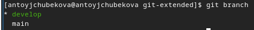

## Общепринятые коммиты

Загружаю весь репозиторий в хранилище. 

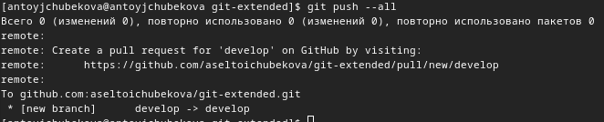

## Общепринятые коммиты

Устанавливаю внешнюю ветку как вышестоящую для этой ветки. 

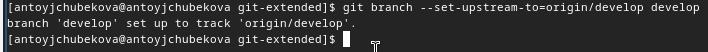

## Общепринятые коммиты

Создаю релиз с версией 1.0.0 

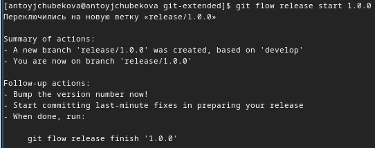

## Общепринятые коммиты

Создаю журнал изменений 

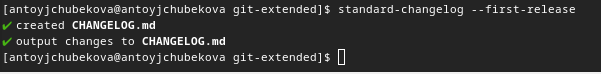

## Общепринятые коммиты

Добавляю журнал изменений в индекс.

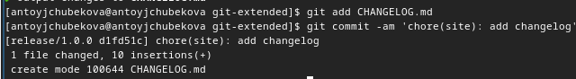

## Общепринятые коммиты

Заливаю релизную ветку в основную ветку. 

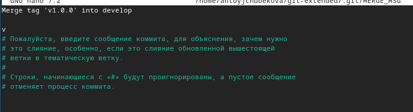

## Общепринятые коммиты

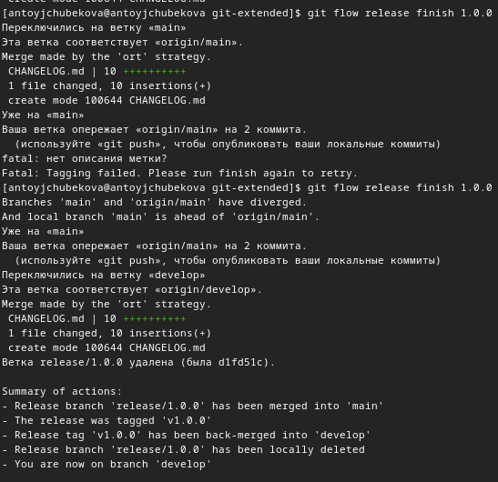

## Общепринятые коммиты

Отправляю данные на github. 

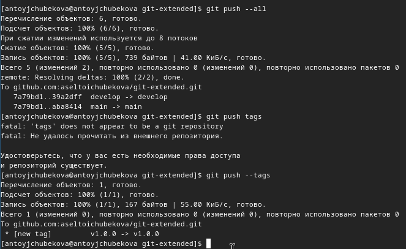

## Общепринятые коммиты

Создаю релиз на github.

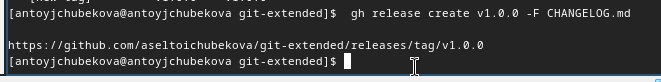

## Общепринятые коммиты

Создаю ветку для новой функциональности. 

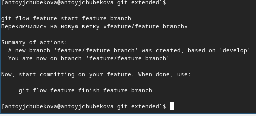

## Общепринятые коммиты

Объединяю ветку feature_branch с develop. 

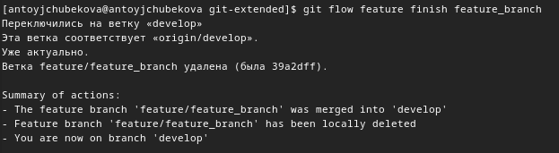

## Общепринятые коммиты

Создадим релиз с версией 1.2.3 

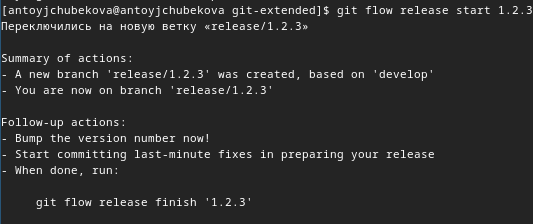

## Общепринятые коммиты

Обнавляю номер версии в файле package.json. 

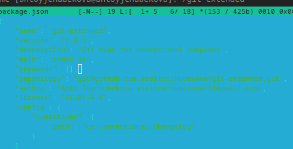
## Общепринятые коммиты

Создаю журнал изменений. 

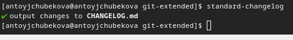
## Общепринятые коммиты

Добавляю журнал изменений в индекс. 

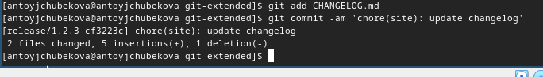

## Общепринятые коммиты

Заливаю релизную ветку в основную ветку.

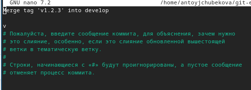

## Общепринятые коммиты

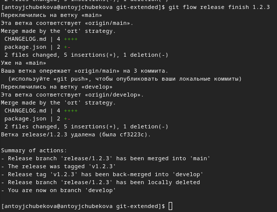
## Общепринятые коммиты

Отправляю данные на github.

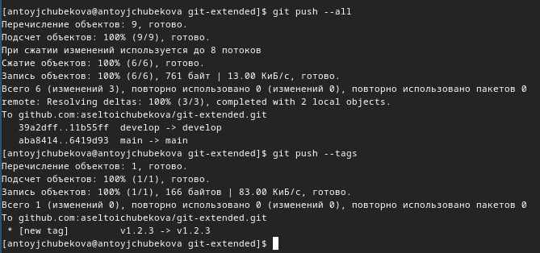

## Общепринятые коммиты

Создаю релиз на github c комментарием из журнала изменений. 

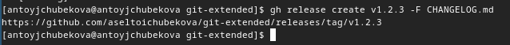

## Вывод 

В ходе выполнения лабораторной работы №4 я получила навыки правильной работы с репозиториями git.

