---
## Front matter
title: "Лабораторная работа №4"
subtitle: "Операционные системы"
author: "Тойчубекова Асель Нуралановна"

## Generic otions
lang: ru-RU
toc-title: "Содержание"

## Bibliography
bibliography: bib/cite.bib
csl: pandoc/csl/gost-r-7-0-5-2008-numeric.csl

## Pdf output format
toc: true # Table of contents
toc-depth: 2
lof: true # List of figures
lot: true # List of tables
fontsize: 12pt
linestretch: 1.5
papersize: a4
documentclass: scrreprt
## I18n polyglossia
polyglossia-lang:
  name: russian
  options:
	- spelling=modern
	- babelshorthands=true
polyglossia-otherlangs:
  name: english
## I18n babel
babel-lang: russian
babel-otherlangs: english
## Fonts
mainfont: PT Serif
romanfont: PT Serif
sansfont: PT Sans
monofont: PT Mono
mainfontoptions: Ligatures=TeX
romanfontoptions: Ligatures=TeX
sansfontoptions: Ligatures=TeX,Scale=MatchLowercase
monofontoptions: Scale=MatchLowercase,Scale=0.9
## Biblatex
biblatex: true
biblio-style: "gost-numeric"
biblatexoptions:
  - parentracker=true
  - backend=biber
  - hyperref=auto
  - language=auto
  - autolang=other*
  - citestyle=gost-numeric
## Pandoc-crossref LaTeX customization
figureTitle: "Рис."
tableTitle: "Таблица"
listingTitle: "Листинг"
lofTitle: "Список иллюстраций"
lotTitle: "Список таблиц"
lolTitle: "Листинги"
## Misc options
indent: true
header-includes:
  - \usepackage{indentfirst}
  - \usepackage{float} # keep figures where there are in the text
  - \floatplacement{figure}{H} # keep figures where there are in the text
---

# Цель работы

Целью данной лабораторной работы является получение навыков правильной работы с репозиториями git.

# Задание

- Выполнить работу для тестового репозитория.\
- Преобразовать рабочий репозиторий в репозиторий с git-flow и conventional commits.

# Теоретическое введение

 **GitFlow**- это определенная надстройка над моделью ветвление Git, которая включает в себя использование фича веток и несколько основных веток, для удобства работы над тем или иным проектом. Gitflow Workflow опубликована и популяризована Винсентом Дриссеном. Gitflow Workflow предполагает выстраивание строгой модели ветвления с учётом выпуска проекта. Данная модель отлично подходит для организации рабочего процесса на основе релизов.
 
  **Последовательность действий при работе по модели Gitflow:**
  - Из ветки master создаётся ветка develop. \
  - Из ветки develop создаётся ветка release. \
  - Из ветки develop создаются ветки feature. \
  - Когда работа над веткой feature завершена, она сливается с веткой develop. \
  - Когда работа над веткой релиза release завершена, она сливается в ветки develop и master. \
  - Если в master обнаружена проблема, из master создаётся ветка hotfix. \
  - Когда работа над веткой исправления hotfix завершена, она сливается в ветки develop и master. \

# Выполнение лабораторной работы

## Установка gitflow ##

Устанавливаю gitflow из коллекции репозиториев Copr (рис. [-@fig:001] и рис. [-@fig:002] ).

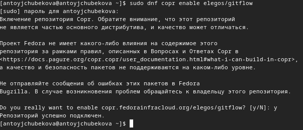{#fig:001 width=70%}

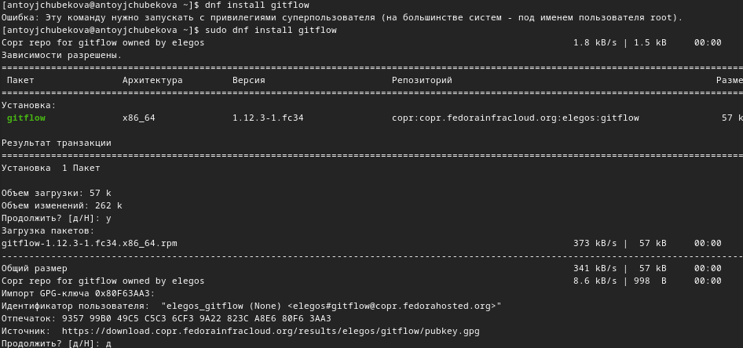{#fig:002 width=70%}

## Установка Node.js ##

Устанавливаю Node.js. pnpm скачиваю с интернета и запускаю с помощью команды dnf install. рис. [-@fig:003] и рис. [-@fig:004] ).

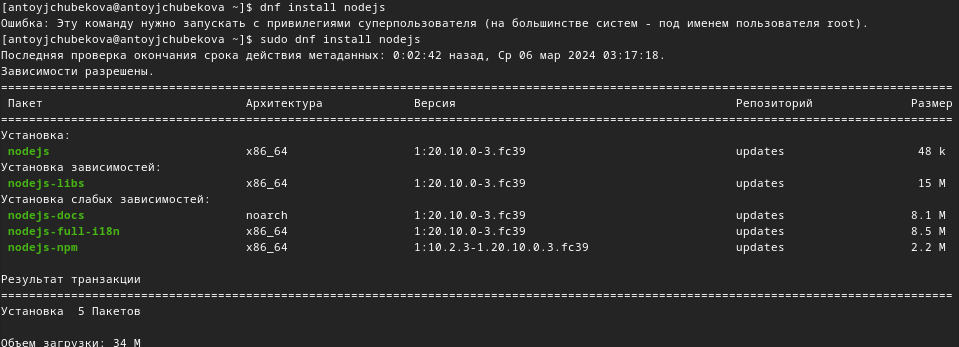{#fig:003 width=70%}

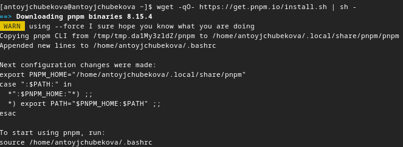{#fig:004 width=70%}

## Настройка Node.js ##

Запускаю pnpm. (рис. [-@fig:005] ).

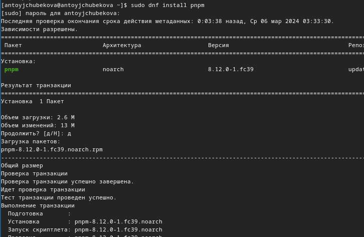{#fig:005 width=70%}

Перелогиниваюсь, выполняя команду source ~/.bashrc. (рис. [-@fig:006] ).

{#fig:006 width=70%}

## Общепринятые коммиты ##

Устанавливаю программу, используемая для помощи в формировании коммитов. При этом устанавливвается скрипт git-cz, который мы и будем использовать для коммитов. (рис. [-@fig:007] ).

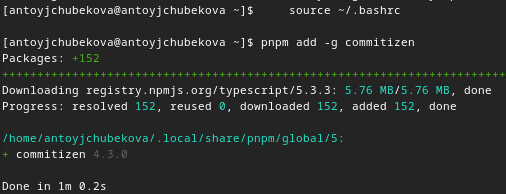{#fig:007 width=70%}

Устанавливаю программу для помощи в создании логов. (рис. [-@fig:008] ).

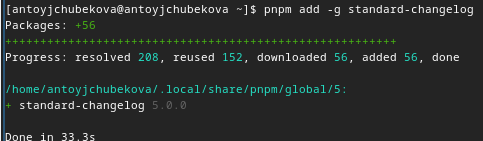{#fig:008 width=70%}

Создаю репозиторий git-extended. (рис. [-@fig:009] ).

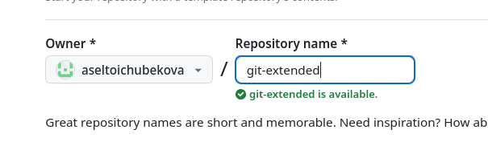{#fig:009 width=70%}

Клонирую репозторий. (рис. [-@fig:010] ).

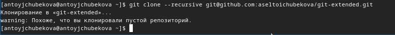{#fig:010 width=70%}

Далее я перехожу в этот репозиторий и создаю файл README.md, затем записываю в этот файл некоторый текст и сохраняю его. (рис. [-@fig:011] и рис. [-@fig:012] ).

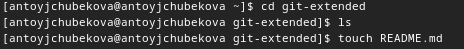{#fig:011 width=70%}

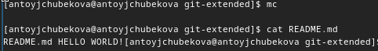{#fig:012 width=70%}

Делаю первый коссит и выкладываю на github. (рис. [-@fig:013] ) Захожу на github и видим, что успешно закоммитолось. (рис. [-@fig:014] )

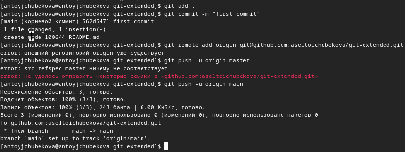{#fig:013 width=70%}

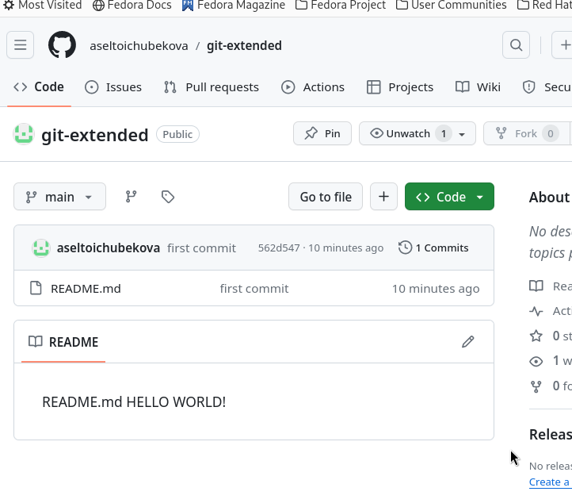{#fig:014 width=70%}

Выполняю конфигурацию для пакетов Node.js. (рис. [-@fig:015] ).

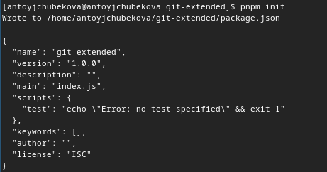{#fig:015 width=70%}

Открыв файл package.json с помщью команды mc, редактирую его заполняя некоторыые параметры пакета, также сконфигурирую формат коммитов. (рис. [-@fig:016] ).

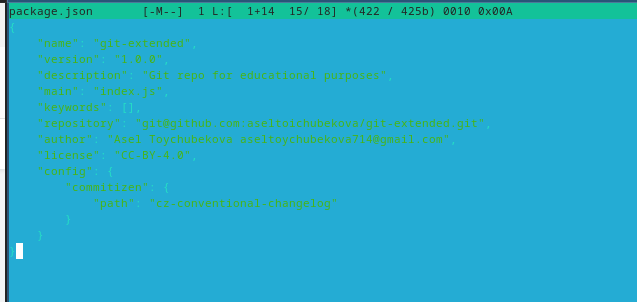{#fig:016 width=70%}

Добавляю новые файлы и выполняю коммит, затем отправляю на github. (рис. [-@fig:017] ).

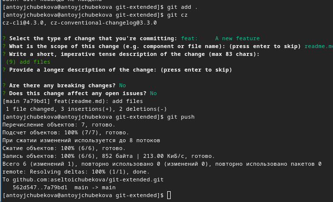{#fig:017 width=70%}

Инициализирую gitflow. (рис. [-@fig:018] ).

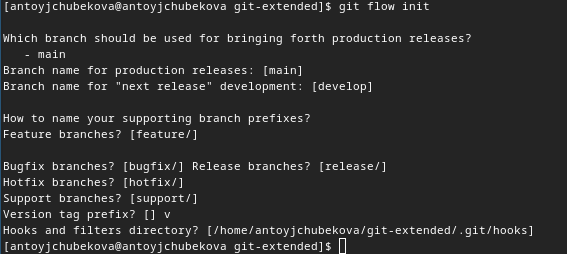{#fig:018 width=70%}

Проверяю, что я нахожусь в ветке develop. Мы видим, что все верно и мы находимся в этой ветке. (рис. [-@fig:019] ).

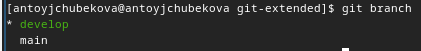{#fig:019 width=70%} 

Загружаю весь репозиторий в хранилище. (рис. [-@fig:020] ).

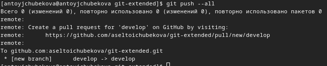{#fig:020 width=70%}

Устанавливаю внешнюю ветку как вышестоящую для этой ветки. (рис. [-@fig:021] ).

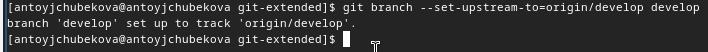{#fig:021 width=70%}

Создаю релиз с версией 1.0.0 (рис. [-@fig:022] ).

{#fig:022 width=70%}

Создаю журнал изменений (рис. [-@fig:023] ).

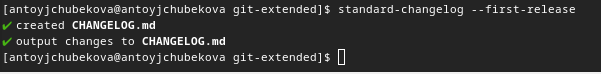{#fig:023 width=70%}

Добавляю журнал изменений в индекс. (рис. [-@fig:024] ).

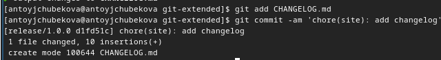{#fig:024 width=70%}

Заливаю релизную ветку в основную ветку. (рис. [-@fig:025] и рис. [-@fig:026] ).

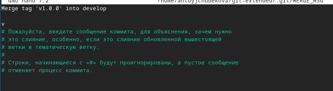{#fig:025 width=70%}

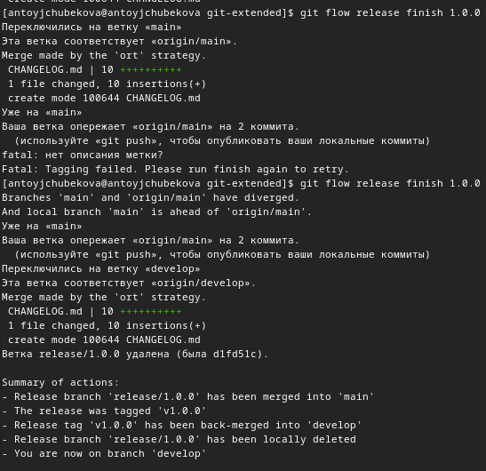{#fig:026 width=70%}

Отправляю данные на github. (рис. [-@fig:027] ).

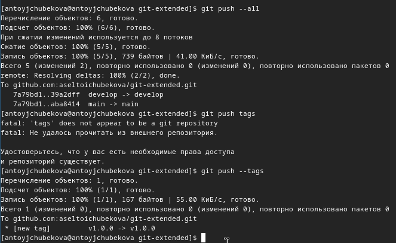{#fig:027 width=70%}

Создаю релиз на github. (рис. [-@fig:028] ).

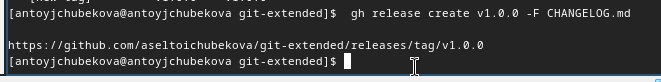{#fig:028 width=70%}

Создаю ветку для новой функциональности. (рис. [-@fig:029] ).

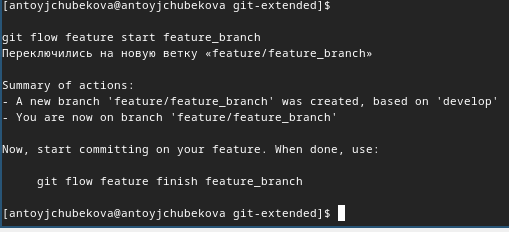{#fig:029 width=70%}

Объединяю ветку feature_branch с develop. (рис. [-@fig:030] ).

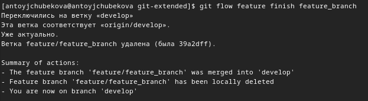{#fig:030 width=70%}

Создадим релиз с версией 1.2.3 (рис. [-@fig:031] ).

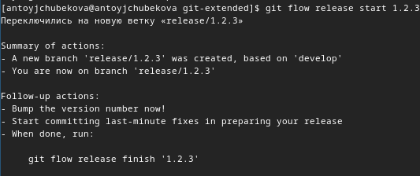{#fig:031 width=70%}

Обнавляю номер версии в файле package.json. (рис. [-@fig:032] ).

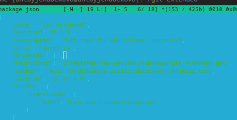{#fig:032 width=70%}

Создаю журнал изменений. (рис. [-@fig:033] ).

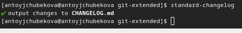{#fig:033 width=70%}

Добавляю журнал изменений в индекс. (рис. [-@fig:034] ).

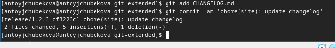{#fig:034 width=70%}

Заливаю релизную ветку в основную ветку. (рис. [-@fig:035] и рис. [-@fig:036] ).

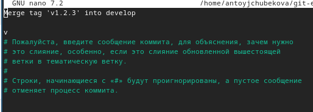{#fig:035 width=70%}

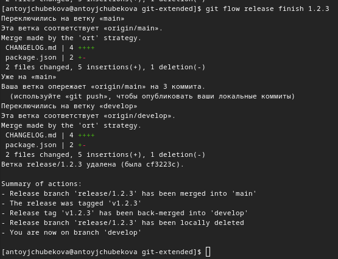{#fig:036 width=70%}

Отправляю данные на github. (рис. [-@fig:037] ).

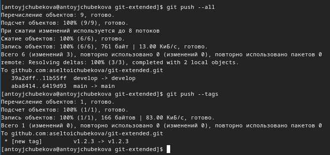{#fig:037 width=70%}

Создаю релиз на github c комментарием из журнала изменений. (рис. [-@fig:038]  ).

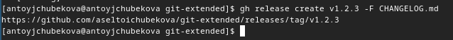{#fig:038 width=70%}

# Вывод 

В ходе выполнения лабораторной работы №4 я получила навыки правильной работы с репозиториями git.

# Список литературы{.unnumbered}

- https://esystem.rudn.ru/mod/page/view.php?id=1098937.
