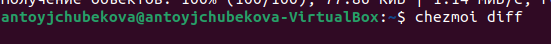

---
## Front matter
lang: ru-RU
title: Лабораторная работа №5
subtitle: Операционные системы
author:
  - Тойчубекова Асель Нурлановна
institute:
  - Российский университет дружбы народов, Москва, Россия
 
date: 15 марта 2024

## i18n babel
babel-lang: russian
babel-otherlangs: english

## Formatting pdf
toc: false
toc-title: Содержание
slide_level: 2
aspectratio: 169
section-titles: true
theme: metropolis
header-includes:
 - \metroset{progressbar=frametitle,sectionpage=progressbar,numbering=fraction}
 - '\makeatletter'
 - '\beamer@ignorenonframefalse'
 - '\makeatother'
 
## Fonts
mainfont: PT Serif
romanfont: PT Serif
sansfont: PT Sans
monofont: PT Mono
mainfontoptions: Ligatures=TeX
romanfontoptions: Ligatures=TeX
sansfontoptions: Ligatures=TeX,Scale=MatchLowercase
monofontoptions: Scale=MatchLowercase,Scale=0.9
 
---

# Информация

## Докладчик

:::::::::::::: {.columns align=center}
::: {.column width="70%"}

  * Тойчубекова Асель Нурлановна
  * Студент 1 курс, НПИбд-02-23
  * Факультет физико-математических и естественных наук
  * Российский университет дружбы народов
  * [1032235033@pfur.ru](1032235033@pfur.ru)
  * <https://aseltoichubekova.github.io/ru/>

:::
::: {.column width="30%"}

:::
::::::::::::::

## Цель работы

Целью лабораторной работы №5 является получение навыком настройки рабочей среды.

## Задание

- Выполнить все пункты лабораторной работы №5.

## Теоретическое введение
    
 **Менеджер паролей pass**

- Менеджер паролей pass — программа, сделанная в рамках идеологии Unix. \
- Также носит название стандартного менеджера паролей для Unix (The standard Unix password manager).

Утилиты командной строки\

На данный момент существует 2 основных реализации:\
- pass — классическая реализация в виде shell-скриптов (https://www.passwordstore.org/);\
- gopass — реализация на go с дополнительными интегрированными функциями (https://www.gopass.pw/).\

Дальше в тексте будет использоваться программа pass, но всё то же самое можно сделать с помощью программы gopass.\

## Теоретическое введение

**Графические интерфейс**

1. qtpass\

- qtpass — может работать как графический интерфейс к pass, так и как самостоятельная программа. В настройках можно переключаться между использованием pass и gnupg.\

2. gopass-ui\
- gopass-ui — интерфейс к gopass.\
- gopass-ui — интерфейс к gopass.\

3. webpass
- Репозиторий: https://github.com/emersion/webpas\
-  Веб-интерфейс к pass. \
- Написано на golang.\

## Теоретическое введение

**Управление файлами конфигурации**

Использование chezmoi для управления файлами конфигурации домашнего каталога пользователя.\

Общая информация\

- Сайт: https://www.chezmoi.io/\
-  Репозиторий: https://github.com/twpayne/chezmoi\

## Теоретическое введение

**Конфигурация chezmoi**

**Рабочие файлы**

- Состояние файлов конфигурации сохраняется в каталоге \

 ~/.local/share/chezmoi \

- Он является клоном вашего репозитория dotfiles. \
- Файл конфигурации ~/.config/chezmoi/chezmoi.toml (можно использовать также JSON или YAML) специфичен для локальной машины. \
- Файлы, содержимое которых одинаково на всех ваших машинах, дословно копируются из исходного каталога. \
- Файлы, которые варьируются от машины к машине, выполняются как шаблоны, обычно с использованием данных из файла конфигурации локальной машины для настройки конечного содержимого, специфичного для локальной машины.\

    При запуске\

    chezmoi apply\

вычисляется желаемое содержимое и разрешения для каждого файла, а затем вносит необходимые изменения, чтобы ваши файлы соответствовали этому состоянию. По умолчанию chezmoi изменяет файлы только в рабочей копии.

## Теоретическое введение
    

**Шаблоны** \

**Общая информация**

- Шаблоны используются для изменения содержимого файла в зависимости от среды. \
- Используется синтаксис шаблонов Go. \
- Файл интерпретируется как шаблон, если выполняется одно из следующих условий: \
- имя файла имеет суффикс .tmpl; \
- файл находится в каталоге .chezmoitemplates. \

# Выполнение лабораторной работы

## Менежер паролей pass 

 Устанавливаю менеджер паролей pass для федоры 

## Менежер паролей pass 

Устанонавливаю gopass.

## Настройка 

Просматриваю спискок ключей. Вижу, что ключи присутствуют. 

## Настройка 

Инициализирую хранилище, вписывая свою электронную почту. 

## Настройка 

Создаю структуры git. 

## Настройка 

Создаю новый репозиторий pass. 

## Настройка 

И задаю адрес нового репозитория на хостинге. Далее для синхронизации выполняю команды pass git push и pass git pull. 

## Настройка 

## Настройка 

В случае если изменения сделаны на файловой системе, необходимо вручную закоммитить и выложить измения. Так как мы не произзводили никакие изменения нам пока несего коммитить. 

## Настройка 

Проверяю статус синхрониации. 

## Настройки интерфейса с браузером 

Для взаимодействия с браузером используется интерфейс native messaging. Поэтому кроме плагина к браузеру я устанавливаю программу, обеспечивающая интерфейс native messaging. 

## Настройки интерфейса с браузером

Подключаю нужный мне репозиторий, чтобы установить browserpass.

## Настройки интерфейса с браузером

Устанавливаю browserpass. 

## Сохранение пароля 

Создаю файл, который будет использоваь=ться для хранения пароля,  и добавляю новый пароль.

## Сохранение пароля 

Отображаю созданный пароль. 

## Сохранение пароля 

Заменяю существующий пароль, сгенерировав новый. 

## Сохранение пароля 

На всякий случай сохраняю сгенерированный пароль в другой файл pass.txt в work. 

#Управление файлами конфигурации 

## Дополнительное программное обеспечение 

Устанавливаю дополнительное программное обеспечение.

## Дополнительное программное обеспечение 

Устанавливаю шрифты.

## Дополнительное программное обеспечение 

## Дополнительное программное обеспечение 

## Дополнительное программное обеспечение 

Устанавливаю бинарный файл с помощью wget. 

## Дополнительное программное обеспечение 

Используя утилиты командной строки для работы с гитхаб, создаю свой репозиторий для конфигурационных файлов на основе шаблна.

## Дополнительное программное обеспечение 

Инициализирую chezmoi c  моим репозиторием dotfiles. 

## Дополнительное программное обеспечение 

Проверяю, какие изменения внесет chezmoi в домашний каталог. 

## Дополнительное программное обеспечение 

Меня устраивают изменения, внесенные chezmoi, так что я запускаю chezmoi apply -v. 

## Дополнительное программное обеспечение 

## Использование chezmoi на нескольких машинах

На второй машине инициализирую chezmoi с репозиторием dotfiles. 

## Использование chezmoi на нескольких машинах

Проверяю какие изменения внесет chezmoi в домашний каталог. 

## Использование chezmoi на нескольких машинах

## Использование chezmoi на нескольких машинах

Меня устраивают изменения, внесенные chezmoi, так что я запускаю chezmoi apply -v. 

## Использование chezmoi на нескольких машинах

## Использование chezmoi на нескольких машинах

При существующем каталоге chezmoi можно получить и применить последние изменения из нашего репозитория.

## Настройка новой машины с помощью одной команды

Устанавливаю свои dotfiles на новый компьютер. 

## Ежедневные операции chezmoi

Извлекаю из репозитория все изменения. Так как никаких изменений не было нам выводится текс уже актуально. 

## Ежедневные операции chezmoi

Извлекаю последние изменения из своего репозитория и вижу, что изменений пока не было.

## Ежедневные операции chezmoi

Я довольна изменениями так что применяю команду chezmoi apply. 

## Ежедневные операции chezmoi

Для включения функции автоматически фиксирование и отправки изменений в исходном каталоге в репозитории редактирую файл по адресу ~/.config/chezmoi/chezmoi.toml и сохраняю изменения. 

## Выводы

В ходе выполнения данной лабораторной работы я получила навыки настройки рабочей среды.

