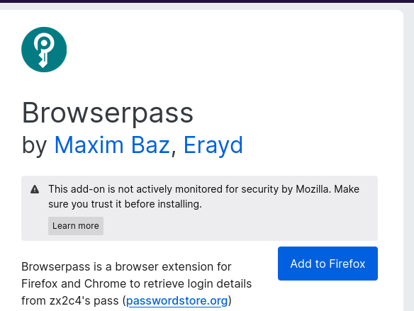

---
## Front matter
title: "Лабораторная работа №5"
subtitle: "Операцилнные системы"
author: "Тойчубекова Асель Нурлановна"

## Generic otions
lang: ru-RU
toc-title: "Содержание"

## Bibliography
bibliography: bib/cite.bib
csl: pandoc/csl/gost-r-7-0-5-2008-numeric.csl

## Pdf output format
toc: true # Table of contents
toc-depth: 2
lof: true # List of figures
lot: true # List of tables
fontsize: 12pt
linestretch: 1.5
papersize: a4
documentclass: scrreprt
## I18n polyglossia
polyglossia-lang:
  name: russian
  options:
	- spelling=modern
	- babelshorthands=true
polyglossia-otherlangs:
  name: english
## I18n babel
babel-lang: russian
babel-otherlangs: english
## Fonts
mainfont: PT Serif
romanfont: PT Serif
sansfont: PT Sans
monofont: PT Mono
mainfontoptions: Ligatures=TeX
romanfontoptions: Ligatures=TeX
sansfontoptions: Ligatures=TeX,Scale=MatchLowercase
monofontoptions: Scale=MatchLowercase,Scale=0.9
## Biblatex
biblatex: true
biblio-style: "gost-numeric"
biblatexoptions:
  - parentracker=true
  - backend=biber
  - hyperref=auto
  - language=auto
  - autolang=other*
  - citestyle=gost-numeric
## Pandoc-crossref LaTeX customization
figureTitle: "Рис."
tableTitle: "Таблица"
listingTitle: "Листинг"
lofTitle: "Список иллюстраций"
lotTitle: "Список таблиц"
lolTitle: "Листинги"
## Misc options
indent: true
header-includes:
  - \usepackage{indentfirst}
  - \usepackage{float} # keep figures where there are in the text
  - \floatplacement{figure}{H} # keep figures where there are in the text
---

# Цель работы

Целью лабораторной работы №5 является получение навыком настройки рабочей среды.

# Задание

- Выполнить все пункты лабораторной работы №5.

# Теоретическое введение
    
## Настройка рабочей среды. ##

## Менеджер паролей pass ##

- Менеджер паролей pass — программа, сделанная в рамках идеологии Unix. \
- Также носит название стандартного менеджера паролей для Unix (The standard Unix password manager).

Утилиты командной строки\

На данный момент существует 2 основных реализации:\
- pass — классическая реализация в виде shell-скриптов (https://www.passwordstore.org/);\
- gopass — реализация на go с дополнительными интегрированными функциями (https://www.gopass.pw/).\

Дальше в тексте будет использоваться программа pass, но всё то же самое можно сделать с помощью программы gopass.\

Графические интерфейсы\

1. qtpass\

- qtpass — может работать как графический интерфейс к pass, так и как самостоятельная программа. В настройках можно переключаться между использованием pass и gnupg.\

2. gopass-ui\
- gopass-ui — интерфейс к gopass.\
- gopass-ui — интерфейс к gopass.\

3. webpass
- Репозиторий: https://github.com/emersion/webpas\
-  Веб-интерфейс к pass. \
- Написано на golang.\

### Управление файлами конфигурации ###

Использование chezmoi для управления файлами конфигурации домашнего каталога пользователя.\

Общая информация\

- Сайт: https://www.chezmoi.io/\
-  Репозиторий: https://github.com/twpayne/chezmoi\

Конфигурация chezmoi\

Рабочие файлы\

- Состояние файлов конфигурации сохраняется в каталоге \

 ~/.local/share/chezmoi \

- Он является клоном вашего репозитория dotfiles. \
- Файл конфигурации ~/.config/chezmoi/chezmoi.toml (можно использовать также JSON или YAML) специфичен для локальной машины. \
- Файлы, содержимое которых одинаково на всех ваших машинах, дословно копируются из исходного каталога. \
- Файлы, которые варьируются от машины к машине, выполняются как шаблоны, обычно с использованием данных из файла конфигурации локальной машины для настройки конечного содержимого, специфичного для локальной машины.\

    При запуске\

    chezmoi apply\

вычисляется желаемое содержимое и разрешения для каждого файла, а затем вносит необходимые изменения, чтобы ваши файлы соответствовали этому состоянию. По умолчанию chezmoi изменяет файлы только в рабочей копии.

### Шаблоны ###

Общая информация\

- Шаблоны используются для изменения содержимого файла в зависимости от среды. \
- Используется синтаксис шаблонов Go. \
- Файл интерпретируется как шаблон, если выполняется одно из следующих условий: \
- имя файла имеет суффикс .tmpl; \
- файл находится в каталоге .chezmoitemplates. \

Данные шаблона\

 Полный список переменных шаблона: \

    chezmoi data \

    Источники переменных:\ 
- файлы .chezmoi, например, .chezmoi.os; \
- файлы конфигурации .chezmoidata.$FORMAT. Форматы (json, jsonc, toml, yaml) читаются в алфавитном порядке; \
- раздел data конфигурационного файла.

# Выполнение лабораторной работы

## Менежер паролей pass ##

 Устанавливаю менеджер паролей pass для федоры (рис. [-@fig:001]).

{#fig:001 width=70%}

Устанонавливаю gopass (рис. [-@fig:002]).

{#fig:002 width=70%}

## Настройка ##

Просматриваю спискок ключей. Вижу, что ключи присутствуют. (рис. [-@fig:003]).

{#fig:003 width=70%}

Инициализирую хранилище, вписывая свою электронную почту. (рис. [-@fig:004]).

{#fig:004 width=70%}

Создаю структуры git. (рис. [-@fig:005]).

{#fig:005 width=70%}

Создаю новый репозиторий pass. (рис. [-@fig:006]).

{#fig:006 width=70%}

И задаю адрес нового репозитория на хостинге. Далее для синхронизации выполняю команды pass git push и pass git pull. (рис. [-@fig:007] и рис. [-@fig:007] ).

{#fig:007 width=70%}

{#fig:008 width=70%}

В случае если изменения сделаны на файловой системе, необходимо вручную закоммитить и выложить измения. Так как мы не произзводили никакие изменения нам пока несего коммитить. (рис. [-@fig:009]).

{#fig:009 width=70%}

Проверяю статус синхрониации. (рис. [-@fig:010]).

{#fig:010 width=70%}

## Настройки интерфейса с браузером ##

Для взаимодействия с браузером используется интерфейс native messaging. Поэтому кроме плагина к браузеру я устанавливаю программу, обеспечивающая интерфейс native messaging. (рис. [-@fig:011]).

{#fig:011 width=70%}

Подключаю нужный мне репозиторий, чтобы установить browserpass. (рис. [-@fig:012]).

{#fig:012 width=70%}

Устанавливаю browserpass. (рис. [-@fig:013]).

{#fig:013 width=70%}

## Сохранение пароля ##

Создаю файл, который будет использоваь=ться для хранения пароля,  и добавляю новый пароль. (рис. [-@fig:014]).

{#fig:014 width=70%}

Отображаю созданный пароль. (рис. [-@fig:015]).

{#fig:015 width=70%}

Заменяю существующий пароль, сгенерировав новый. (рис. [-@fig:016]).

{#fig:016 width=70%}

На всякий случай сохраняю сгенерированный пароль в другой файл pass.txt в work. (рис. [-@fig:017]).

{#fig:017 width=70%}

## Управление файлами конфигурации ##

### Дополнительное программное обеспечение ###

Устанавливаю дополнительное программное обеспечение.(рис. [-@fig:018]).

{#fig:018 width=70%}

Устанавливаю шрифты (рис. [-@fig:019], рис. [-@fig:020], рис. [-@fig:021]).

{#fig:019 width=70%}

{#fig:020 width=70%}

{#fig:021 width=70%}

Устанавливаю бинарный файл с помощью wget. (рис. [-@fig:022]).

{#fig:022 width=70%}

Используя утилиты командной строки для работы с гитхаб, создаю свой репозиторий для конфигурационных файлов на основе шаблна. (рис. [-@fig:023]).

{#fig:023 width=70%}

Инициализирую chezmoi c  моим репозиторием dotfiles. (рис. [-@fig:024]).

{#fig:024 width=70%}

Проверяю, какие изменения внесет chezmoi в домашний каталог. (рис. [-@fig:025]).

{#fig:025 width=70%}

Меня устраивают изменения, внесенные chezmoi, так что я запускаю chezmoi apply -v. ((рис. [-@fig:026] и рис. [-@fig:027] ).

{#fig:026 width=70%}

{#fig:027 width=70%}

### Использование chezmoi на нескольких машинах ###

На второй машине инициализирую chezmoi с репозиторием dotfiles.  (рис. [-@fig:028]).

{#fig:028 width=70%}

Проверяю какие изменения внесет chezmoi в домашний каталог. ((рис. [-@fig:029] и рис. [-@fig:030] ).

{#fig:029 width=70%}

{#fig:030 width=70%}

Меня устраивают изменения, внесенные chezmoi, так что я запускаю chezmoi apply -v. ((рис. [-@fig:031] и рис. [-@fig:032] ).

{#fig:031 width=70%}

{#fig:032 width=70%}

При существующем каталоге chezmoi можно получить и применить последние изменения из нашего репозитория.(рис. [-@fig:033]  ).

{#fig:033 width=70%}

### Настройка новой машины с помощью одной команды ###

Устанавливаю свои dotfiles на новый компьютер. (рис. [-@fig:034]  ).

{#fig:034 width=70%}

Извлекаю из репозитория все изменения. Так как никаких изменений не было нам выводится текс уже актуально. (рис. [-@fig:035]  ).

{#fig:035 width=70%}

Извлекаю последние изменения из своего репозитория и вижу, что изменений пока не было. (рис. [-@fig:036]  ).

{#fig:036 width=70%}

Я довольна изменениями так что применяю команду chezmoi apply. (рис. [-@fig:037]  ).

{#fig:037 width=70%}

Для включения функции автоматически фиксирование и отправки изменений в исходном каталоге в репозитории редактирую файл по адресу ~/.config/chezmoi/chezmoi.toml и сохраняю изменения. (рис. [-@fig:038]  ).

{#fig:038 width=70%}

# Выводы

В ходе выполнения данной лабораторной работы я получила навыки настройки рабочей среды.

# Список литературы{.unnumbered}

- https://esystem.rudn.ru/mod/page/view.php?id=1098939.
