---
## Front matter
lang: ru-RU
title: Лабораторная работа №6
subtitle: Операционные системы
author:
  - Тойчубекова Асель Нурлановна
institute:
  - Российский университет дружбы народов, Москва, Россия
date: 16 марта 2024

## i18n babel
babel-lang: russian
babel-otherlangs: english

## Formatting pdf
toc: false
toc-title: Содержание
slide_level: 2
aspectratio: 169
section-titles: true
theme: metropolis
header-includes:
 - \metroset{progressbar=frametitle,sectionpage=progressbar,numbering=fraction}
 - '\makeatletter'
 - '\beamer@ignorenonframefalse'
 - '\makeatother'
 
## Fonts
mainfont: PT Serif
romanfont: PT Serif
sansfont: PT Sans
monofont: PT Mono
mainfontoptions: Ligatures=TeX
romanfontoptions: Ligatures=TeX
sansfontoptions: Ligatures=TeX,Scale=MatchLowercase
monofontoptions: Scale=MatchLowercase,Scale=0.9
 
---

# Информация

## Докладчик

:::::::::::::: {.columns align=center}
::: {.column width="70%"}

  * Тойчубекова Асель Нурлановна
  * Студент, НПИбд-02-23
  * факультет физико-математических и ественных наук.
  * Российский университет дружбы народов
  * [1032235033@pfur.ru](1032235033@pfur.ru)
  * <https://aseltoichubekova.github.io/ru/>

:::
::: {.column width="30%"}

:::
::::::::::::::

## Цель работы

Целью лабораторной работы №6 является приобретение практических навыков взаимодействия с системой посредством командной строки.

## Задание

- Выполнить все пункты лабораторной работы №6.

## Теоретическое введение

Командная строка — текстовый интерфейс пользователя для взаимодействия с операционной системой компьютера и/или другим программным обеспечением с помощью команд, вводимых с клавиатуры. С его помощью пользователь может запускать и отключать другие программы, системные процессы, редактировать реестр, управлять файлами и папками, а также программировать с использованием встроенного скриптового языка.\

## Теоретическое введение

В операционной системе типа Linux взаимодействие пользователя с системой обычно осуществляется с помощью командной строки посредством построчного ввода команд. При этом обычно используется командные интерпретаторы языка shell: /bin/sh;/bin/csh; /bin/ksh.\

## Теоретическое введение

Командой в операционной системе называется записанный по специальным правилам текст (возможно с аргументами), представляющий собой указание на выполнение какой-либо функций (или действий) в операционной системе. Обычно первым словом идёт имя команды, остальной текст — аргументы или опции, конкретизирующие действие.Общий формат команд можно представить следующим образом:
<имя_команды><разделитель><аргументы>.\

## Теоретическое введение

Ниже представлены одни из основных команд Unix/Linux. 

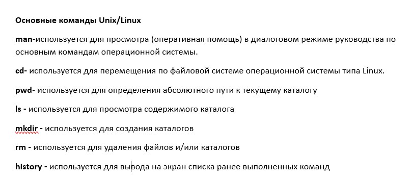

# Выполнение лабораторной работы

## Выполнение лабораторной работы

Определяю полное имя домашнего каталога, в котором мы дальше и будем работать 

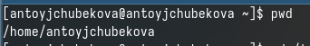

## Выполнение лабораторной работы

Перехожу в каталог tmp. 

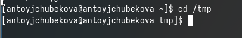

## Выполнение лабораторной работы

Вывожу на экран содержимое каталога в котором нахожусь,сперва используя команду ls, без опций.

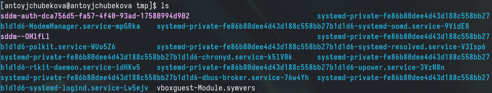

## Выполнение лабораторной работы

Дальше выведу на экран все содержимое каталога tmp, а также скрытые файлы, используя опцию -a.

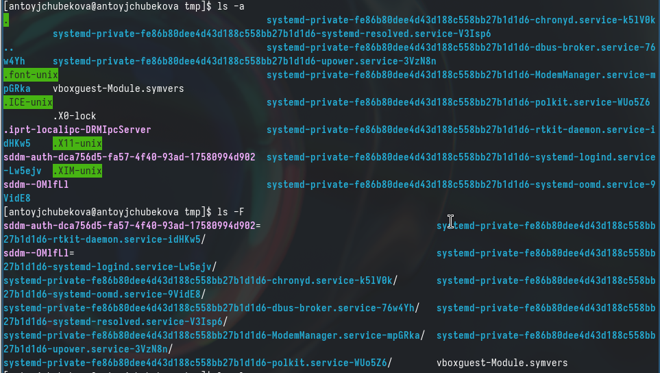

## Выполнение лабораторной работы

Далее выведу на экран все содержимое каталога tmp с указанием типов файла, используя опцию -F. 

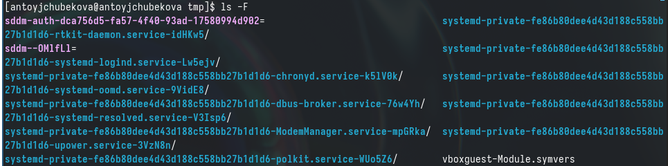

## Выполнение лабораторной работы

Затем выведу на экран содержимое tmp, подробную информацию о файлах и каталогах(тип файла,права доступа, число сылок, владелец,размер,дата последней ревизии,имя файла или каталога), используя опцию -l или -alF. 

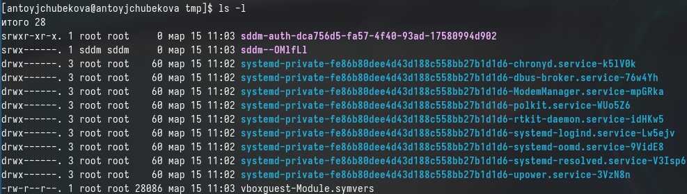

## Выполнение лабораторной работы

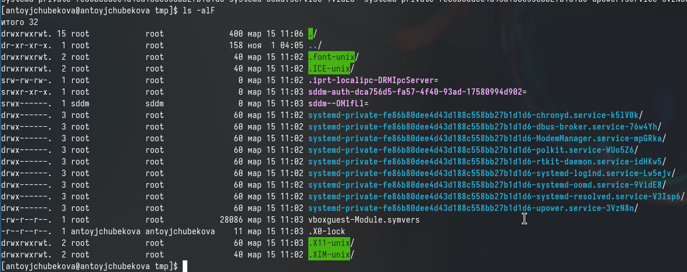

## Выполнение лабораторной работы

С помощью команды ls выводим на экран содержимое каталога /var/spool и видим, что каталог с именем cron есть. 

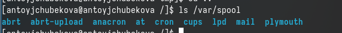

## Выполнение лабораторной работы

Перехожу в домашний каталог и вывожу на экран все его содержимле, используя опцию -l, чтобы можно было посмотреть владельца(владелец-antoyjchubekova).

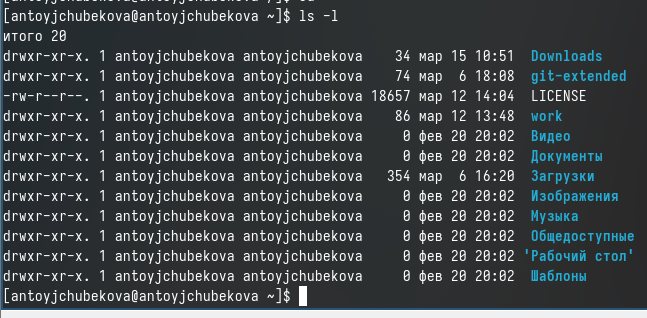

## Выполнение лабораторной работы

В домашнем каталоге создаю новый каталог с именем newdir. 

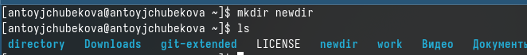

## Выполнение лабораторной работы

В новом каталоге создаю новый каталог с именем morefun, используя команду ls , вижу, чтоон удачно создался.

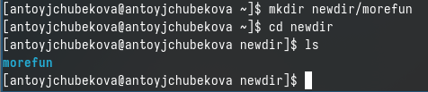

## Выполнение лабораторной работы

В домашнем каталоге создаю одной командой mkdir создаю три новых каталога с именем letters,memos,misk.

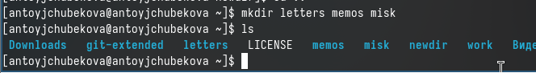

## Выполнение лабораторной работы

Затем удаляю эти каталоги одной командой. 

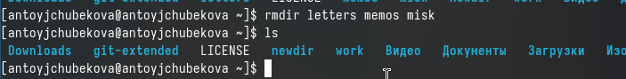

## Выполнение лабораторной работы

Пробую удалить ранее созданный каталог newdir командой rm и получаю предупреждение, что это каталог и невозможность его удаление этой командой.

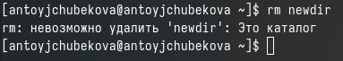

## Выполнение лабораторной работы

Удаляю каталог ~/newdir/morefun, командой rmdir сперва удаляется morefun, потом прописываю для каталога newdir и его удаляю. 

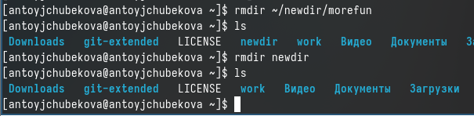

## Выполнение лабораторной работы

С помощью команды man узнаю, что команда ls с опцией -R показывает содержимое не только указанного каталога, но и подкаталоги, входящие в него. 

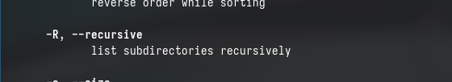

## Выполнение лабораторной работы

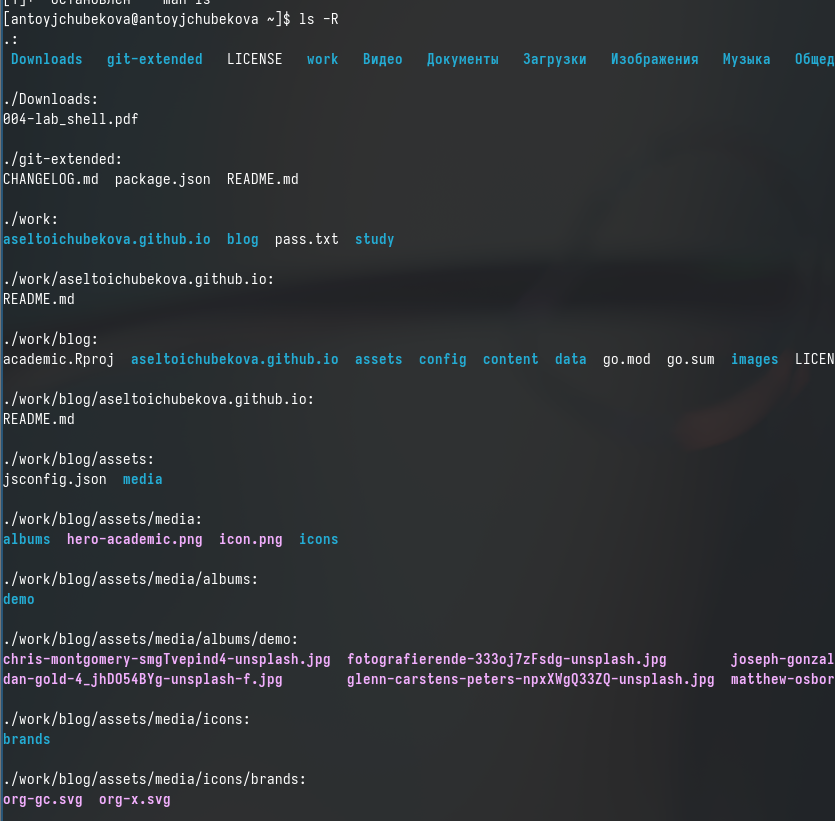

## Выполнение лабораторной работы

С помощью команды man узнаю, что команда ls с опцией -tl показывает содержимое каталога отсортированный по времени последнего изменения выводимый список содержимого каталога с развернутым описанием файлов. 

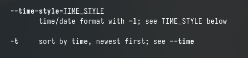

## Выполнение лабораторной работы

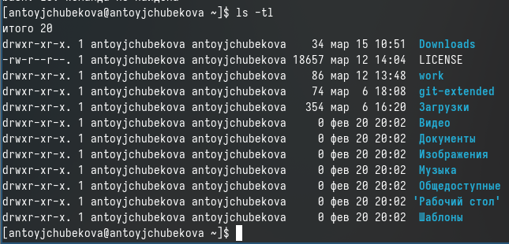

## Выполнение лабораторной работы

Используя команду man для просмотра cd. \

-P - позволяет следовать по символическим ссылкам перед тем как будут обработаны все переходы. \

-L - переходит по символическим символам только после того как были обработаны. \

-e - если папку, в которую нужно перейти, не удалось найти, выдает ощибку.\

## Выполнение лабораторной работы

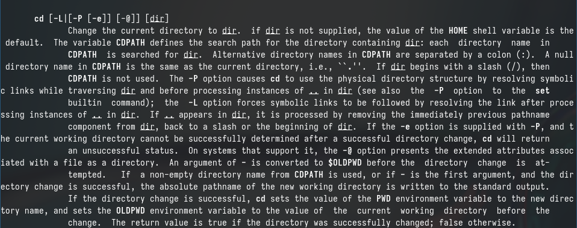

## Выполнение лабораторной работы

Использую команду man для просмотра pwd.

-L,--logical - брать директорию из переменной окружения, даже если она содержит символические ссылки \

-P - отбрасывает все символические ссылки \

--help - отобразить справку по утилите \

--version - отобразить версию утилиты. \

## Выполнение лабораторной работы

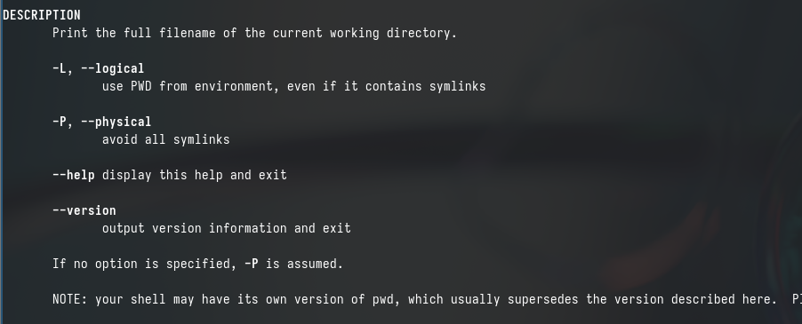

## Выполнение лабораторной работы

Использую команду man для просмотра mkdir. 

-p - это позволяет нам создавать носколько каталагов друг в друге \

-v - выводит информацию о созданном каталоге(ах). \

-m - это позволяет нам установить значения chmod/mode для нашего каталога, то есть 777. \

-z - устанавливает контекст безопасности SELinux для каталогов. 

## Выполнение лабораторной работы

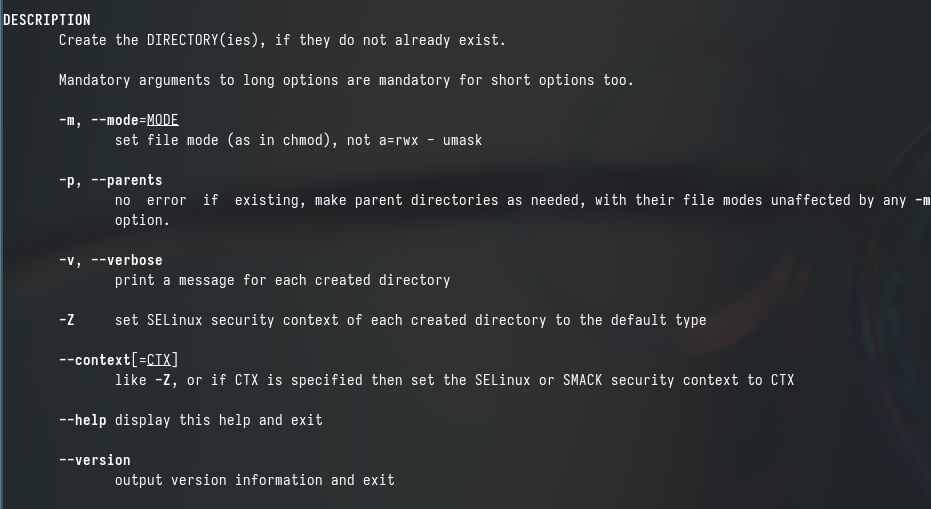

## Выполнение лабораторной работы

Использую команду man для просмотра rmdir. 

-p - удаляет каталог и любые пустые родительские каталоги \

-v - отображает сообщение для каждого удаленного каталога \

--ignore-fail-on-non-empty - подавляет сообщение если каталог не пуст.

## Выполнение лабораторной работы

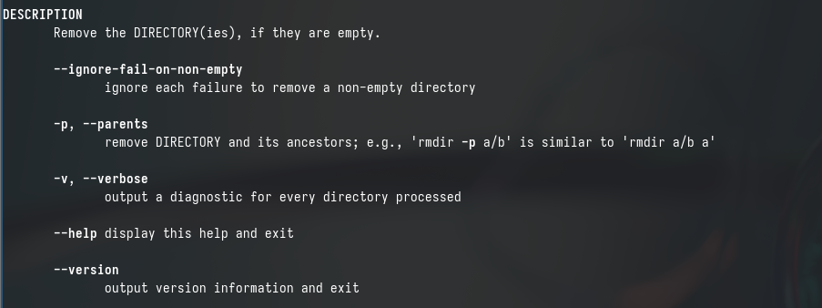

## Выполнение лабораторной работы

Использую команду man для просмотра rmr. 

-f - игнорировать несуществующие файлы и аргументы, никогда не выдавать запросы на подтверждение удаления \

-i - выводить запрос на подтверждение удаления каждого файла \

-l - выдавать один запрос на подтверждение удаления всех файлов \

-r - удалениедиректорий и их содержимого \

-d - удалять пустые директории \

-v - выводить информацию об удаленных файлах.

## Выполнение лабораторной работы

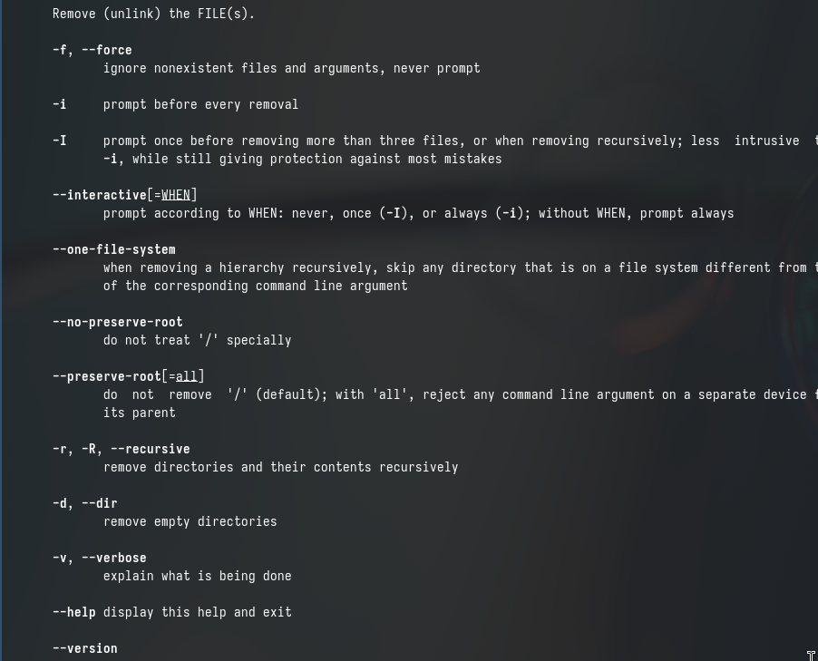

## Выполнение лабораторной работы

Выполняю команду history, чтобы посмотреть историю команд. 

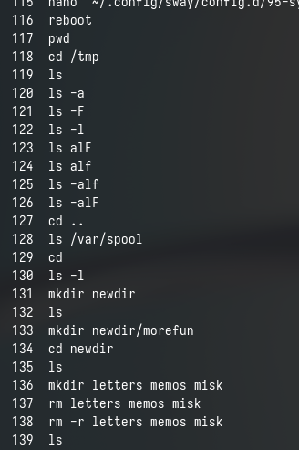

## Выполнение лабораторной работы

В 130 строке, модифицирую, изменив -l на -a. 

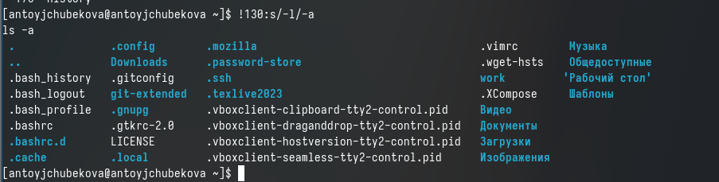

## Выполнение лабораторной работы

В 118 строке, модифицирую, изменив tmp на bin. 

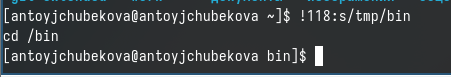

## Выполнение лабораторной работы

В 131 строке, модифицирую, изменив newdir на directory.

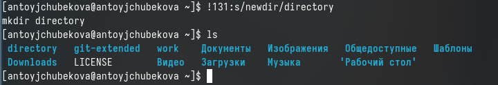

## Выполнение лабораторной работы

Используя строки команд, мы можем исполнить эти команды обращаясь к номеру строки. 

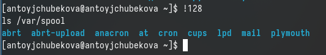

## Вывод 

В ходе выполнения данной лабораторной работы я приобрела практических навыков взаимодействия с системой посредством командной строки.

