---
## Front matter
title: "Лабораторная работа №6"
subtitle: "Опрерационные системы"
author: "Тойчубекова Асель Нурлановна"

## Generic otions
lang: ru-RU
toc-title: "Содержание"

## Bibliography
bibliography: bib/cite.bib
csl: pandoc/csl/gost-r-7-0-5-2008-numeric.csl

## Pdf output format
toc: true # Table of contents
toc-depth: 2
lof: true # List of figures
lot: true # List of tables
fontsize: 12pt
linestretch: 1.5
papersize: a4
documentclass: scrreprt
## I18n polyglossia
polyglossia-lang:
  name: russian
  options:
	- spelling=modern
	- babelshorthands=true
polyglossia-otherlangs:
  name: english
## I18n babel
babel-lang: russian
babel-otherlangs: english
## Fonts
mainfont: PT Serif
romanfont: PT Serif
sansfont: PT Sans
monofont: PT Mono
mainfontoptions: Ligatures=TeX
romanfontoptions: Ligatures=TeX
sansfontoptions: Ligatures=TeX,Scale=MatchLowercase
monofontoptions: Scale=MatchLowercase,Scale=0.9
## Biblatex
biblatex: true
biblio-style: "gost-numeric"
biblatexoptions:
  - parentracker=true
  - backend=biber
  - hyperref=auto
  - language=auto
  - autolang=other*
  - citestyle=gost-numeric
## Pandoc-crossref LaTeX customization
figureTitle: "Рис."
tableTitle: "Таблица"
listingTitle: "Листинг"
lofTitle: "Список иллюстраций"
lotTitle: "Список таблиц"
lolTitle: "Листинги"
## Misc options
indent: true
header-includes:
  - \usepackage{indentfirst}
  - \usepackage{float} # keep figures where there are in the text
  - \floatplacement{figure}{H} # keep figures where there are in the text
---

# Цель работы

Цклью лабораторной работы №6 является приобретение практических навыков взаимодействия с системой посредством командной строки.

# Задание

- Выполнить все пункты лабораторной работы №6.

# Теоретическое введение

Командная строка — текстовый интерфейс пользователя для взаимодействия с операционной системой компьютера и/или другим программным обеспечением с помощью команд, вводимых с клавиатуры. С его помощью пользователь может запускать и отключать другие программы, системные процессы, редактировать реестр, управлять файлами и папками, а также программировать с использованием встроенного скриптового языка.\

В операционной системе типа Linux взаимодействие пользователя с системой обычно осуществляется с помощью командной строки посредством построчного ввода команд. При этом обычно используется командные интерпретаторы языка shell: /bin/sh;/bin/csh; /bin/ksh.\

Командой в операционной системе называется записанный по специальным правилам текст (возможно с аргументами), представляющий собой указание на выполнение какой-либо функций (или действий) в операционной системе. Обычно первым словом идёт имя команды, остальной текст — аргументы или опции, конкретизирующие действие.Общий формат команд можно представить следующим образом:
<имя_команды><разделитель><аргументы>.\

Ниже представлены одни из основных команд Unix/Linux. (рис. [-@fig:001]).

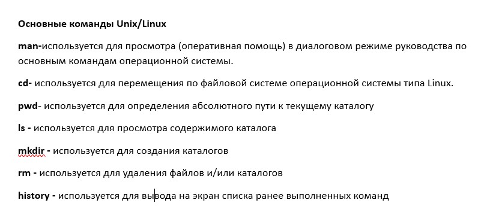{#fig:001 width=70%}

# Выполнение лабораторной работы

Определяю полное имя домашнего каталога, в котором мы дальше и будем работать (рис. [-@fig:002]).

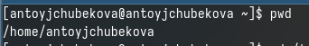{#fig:002 width=70%}

Перехожу в каталог tmp. (рис. [-@fig:003]).

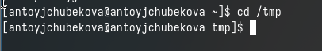{#fig:003 width=70%}

Вывожу на экран содержимое каталога в котором нахожусь,сперва используя команду ls, без опций. (рис. [-@fig:004]).

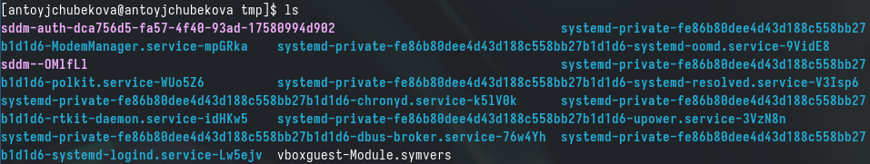{#fig:004 width=70%}

Дальше выведу на экран все содержимое каталога tmp, а также скрытые файлы, используя опцию -a. (рис. [-@fig:005]).

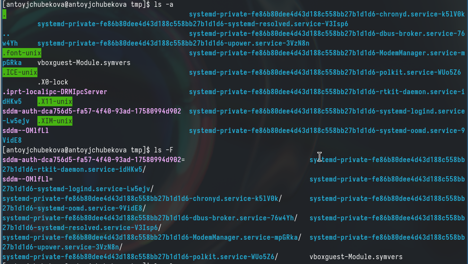{#fig:005 width=70%}

Далее выведу на экран все содержимое каталога tmp с указанием типов файла, используя опцию -F. (рис. [-@fig:006]).

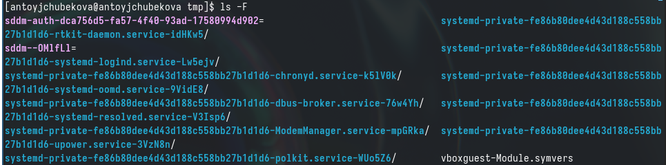{#fig:006 width=70%}

Затем выведу на экран содержимое tmp, подробную информацию о файлах и каталогах(тип файла,права доступа, число сылок, владелец,размер,дата последней ревизии,имя файла или каталога), используя опцию -l или -alF. (рис. [-@fig:007] и рис. [-@fig:008]).

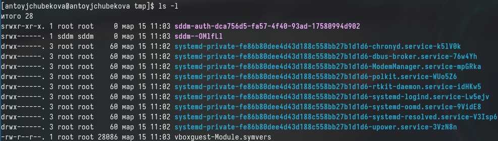{#fig:007 width=70%}

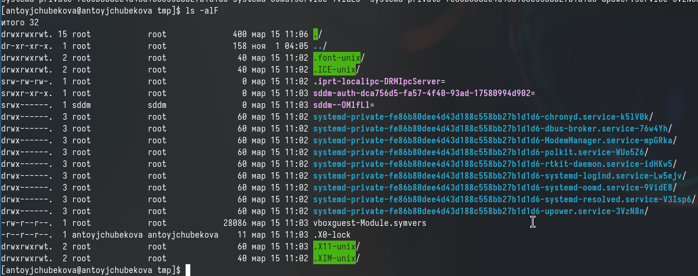{#fig:008 width=70%}

С помощью команды ls выводим на экран содержимое каталога /var/spool и видим, что каталог с именем cron есть. (рис. [-@fig:009]).

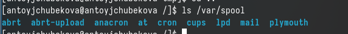{#fig:009 width=70%}

Перехожу в домашний каталог и вывожу на экран все его содержимле, используя опцию -l, чтобы можно было посмотреть владельца(владелец-antoyjchubekova). (рис. [-@fig:010]).

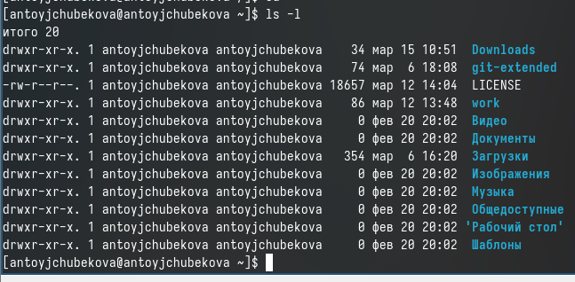{#fig:010 width=70%}

В домашнем каталоге создаю новый каталог с именем newdir. (рис. [-@fig:011]).

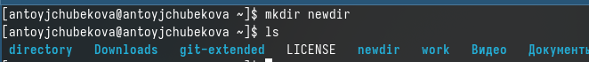{#fig:011 width=70%}

В новом каталоге создаю новый каталог с именем morefun, используя команду ls , вижу, чтоон удачно создался. (рис. [-@fig:012]).

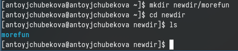{#fig:012 width=70%}

В домашнем каталоге создаю одной командой mkdir создаю три новых каталога с именем letters,memos,misk. (рис. [-@fig:013]).

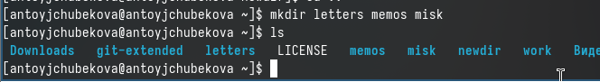{#fig:013 width=70%}

Затем удаляю эти каталоги одной командой. (рис. [-@fig:014]).

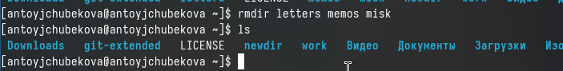{#fig:014 width=70%}

Пробую удалить ранее созданный каталог newdir командой rm и получаю предупреждение, что это каталог и невозможность его удаление этой командой. (рис. [-@fig:015]).

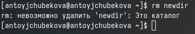{#fig:015 width=70%}

Удаляю каталог ~/newdir/morefun, командой rmdir сперва удаляется morefun, потом прописываю для каталога newdir и его удаляю. (рис. [-@fig:016]).

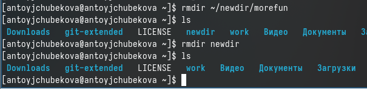{#fig:016 width=70%}

С помощью команды man узнаю, что команда ls с опцией -R показывает содержимое не только указанного каталога, но и подкаталоги, входящие в него. (рис. [-@fig:017] и рис. [-@fig:018]).

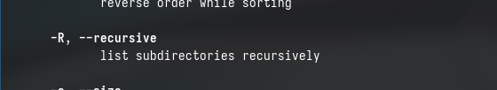{#fig:017 width=70%}

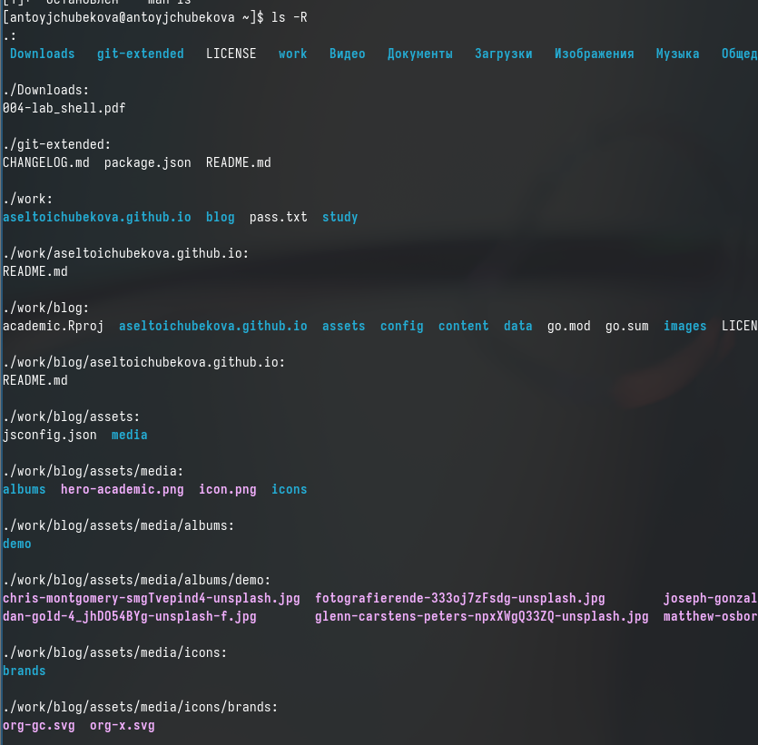{#fig:018 width=70%}

С помощью команды man узнаю, что команда ls с опцией -tl показывает содержимое каталога отсортированный по времени последнего изменения выводимый список содержимого каталога с развернутым описанием файлов. (рис. [-@fig:019] и рис. [-@fig:020]).

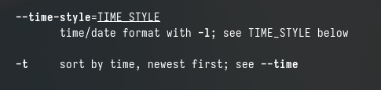{#fig:019 width=70%}

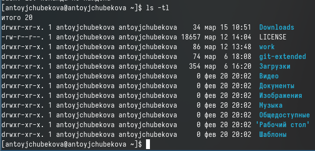{#fig:020 width=70%}

Используя команду man для просмотра cd. (рис. [-@fig:021]). \

-P - позволяет следовать по символическим ссылкам перед тем как будут обработаны все переходы. \

-L - переходит по символическим символам только после того как были обработаны. \

-e - если папку, в которую нужно перейти, не удалось найти, выдает ощибку.\

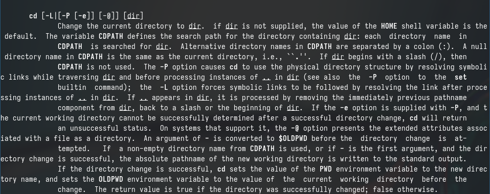{#fig:021 width=70%}

Использую команду man для просмотра pwd. (рис. [-@fig:022]).

-L,--logical - брать директорию из переменной окружения, даже если она содержит символические ссылки \

-P - отбрасывает все символические ссылки \

--help - отобразить справку по утилите \

--version - отобразить версию утилиты. \

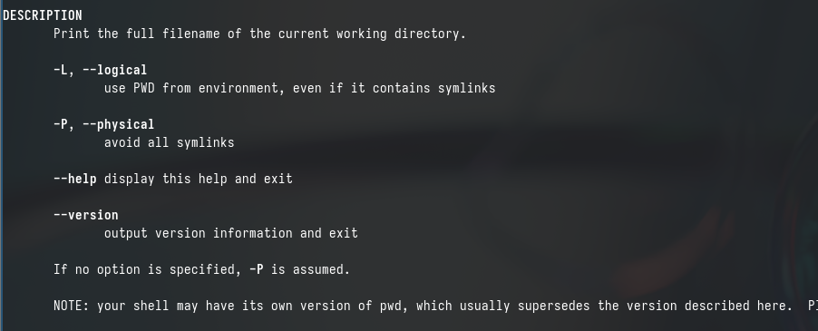{#fig:022 width=70%}

Использую команду man для просмотра mkdir. (рис. [-@fig:023]).

-p - это позволяет нам создавать носколько каталагов друг в друге \

-v - выводит информацию о созданном каталоге(ах). \

-m - это позволяет нам установить значения chmod/mode для нашего каталога, то есть 777. \

-z - устанавливает контекст безопасности SELinux для каталогов. 

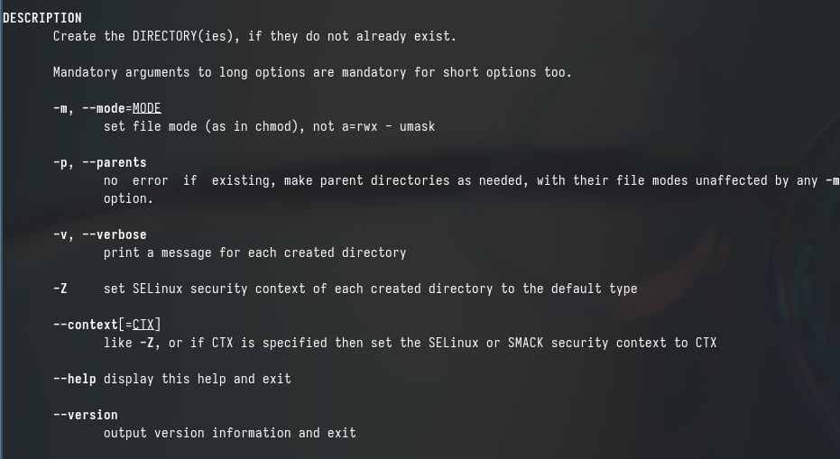{#fig:023 width=70%}

Использую команду man для просмотра rmdir. (рис. [-@fig:024]).

-p - удаляет каталог и любые пустые родительские каталоги \

-v - отображает сообщение для каждого удаленного каталога \

--ignore-fail-on-non-empty - подавляет сообщение если каталог не пуст.

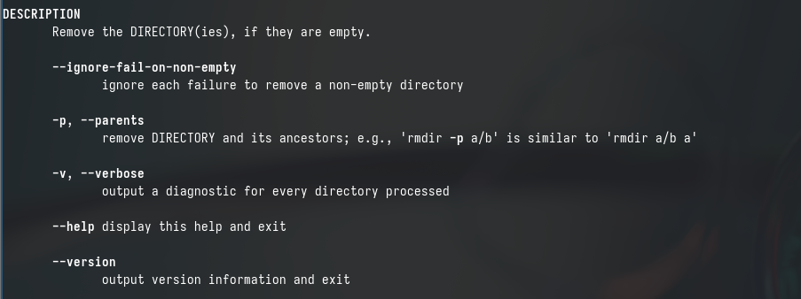{#fig:024 width=70%}

Использую команду man для просмотра rmr. (рис. [-@fig:025]).

-f - игнорировать несуществующие файлы и аргументы, никогда не выдавать запросы на подтверждение удаления \

-i - выводить запрос на подтверждение удаления каждого файла \

-l - выдавать один запрос на подтверждение удаления всех файлов \

-r - удалениедиректорий и их содержимого \

-d - удалять пустые директории \

-v - выводить информацию об удаленных файлах.

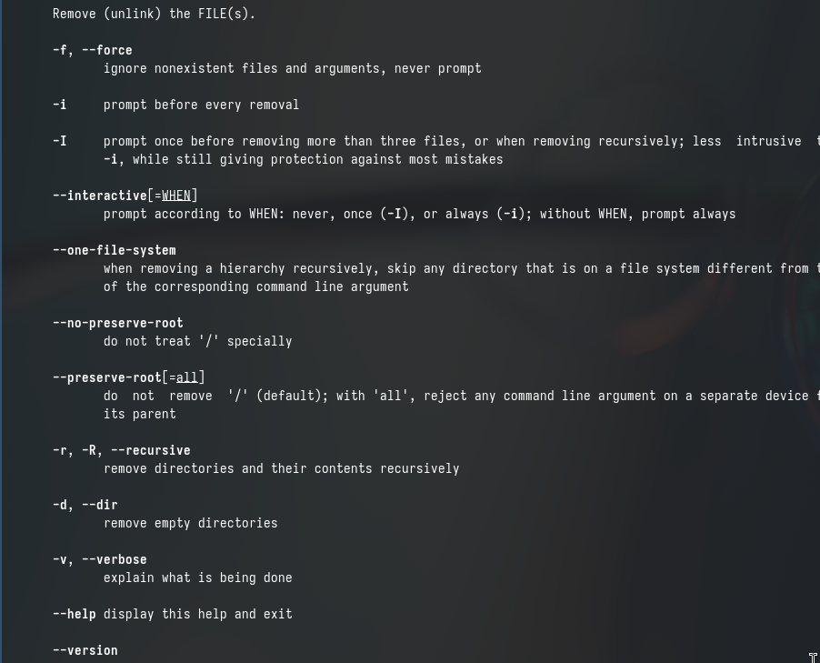{#fig:025 width=70%}

Выполняю команду history, чтобы посмотреть историю команд. (рис. [-@fig:026]).

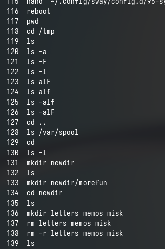{#fig:026 width=70%}

В 130 строке, модифицирую, изменив -l на -a. (рис. [-@fig:027]).

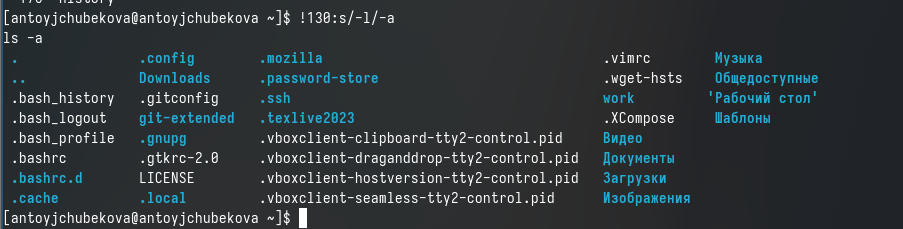{#fig:027 width=70%}

В 118 строке, модифицирую, изменив tmp на bin. (рис. [-@fig:028]).

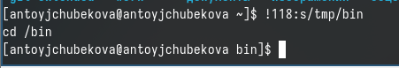{#fig:028 width=70%}

В 131 строке, модифицирую, изменив newdir на directory.(рис. [-@fig:029]).

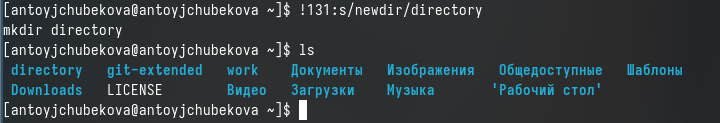{#fig:029 width=70%}

Используя строки команд, мы можем исполнить эти команды обращаясь к номеру строки. (рис. [-@fig:030]).

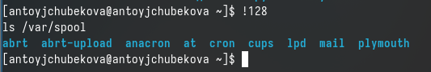{#fig:030 width=70%}

# Ответы на контрольные вопросы

1. Командная строка — текстовый интерфейс пользователя для взаимодействия с операционной системой компьютера и/или другим программным обеспечением с помощью команд, вводимых с клавиатуры. С его помощью пользователь может запускать и отключать другие программы, системные процессы, редактировать реестр, управлять файлами и папками, а также программировать с использованием встроенного скриптового языка.\

2. Определить абсолютный путь каталога можно командой pwd.

3. При помощи команды ls -F можно вывести на экран имена файлов и тип файлов. А также с помощью команд ls -l и ls -alF можно вывести на экран имя и тип файлов и плюс дополнительная информация об этих файлах. 

4. Информацию о скрытых файлах можно отобразить с помощью команды ls -a. 

5. При помощи команды rm мы можем удалить файлы, а при помощи команды rmdir мы можем удалить каталоги. Нет нельзя, командой rm  нельзя удалить каталог.

6. Вывести информацию о последних выполненных командах, работы можно командой history. Можно выполнить эту команды обращаяськ их номеру строки, а также модифицировать их.

7. Для модифицирования команд мы используем номер строки и часть команд которые хотим поменять. Примерно это выглядит так: !номер строки:s/что мы хотим поменять/на что мы хотим  поменять. 

8. Например для создание более одного каталога вместо трех строк команды, можно запистить их в одной строке, по очереди название каталогов, которые нужно создать.Например mkdir newdir directory morefun.

9. В работе с командами, в качестве аргументов которых выступает путь к какому либо каталогу или файлу, можно использовать сокращенную запись пути, используя слеш, многоточие,~. Например, чтобы вернуться на два каталога назад мы используем cd ../.. \

10. ls -l -используется для выведения подробной информации о файлах и каталогах на экран. О каждом файле и каталоге будет выведено следующее: тип файла, права доступа, число ссылок, владелец, размер, дата последней ревизии, имя файла и каталога.

11. Относительный путь -это путь к файлу относительно текущего каталога. Абсолютный путь- это путь к файлу относительно корневого каталога. \
Относительный путь - начинается с ранее установленого контекста, с каталога,где мы находимся. \
Абсолютный путь - всегда начинается с ~/ \

12. Информацию об интересующей нас команде можно узнать командой map

13. Клавиша TAB служит для автоматического дополнения вводимых команд.

# Вывод 

В ходе выполнения данной лабораторной работы я приобрела практических навыков взаимодействия с системой посредством командной строки.

# Список литературы{.unnumbered}

- https://esystem.rudn.ru/mod/page/view.php?id=1098933#org2151722.
