---
## Front matter
lang: ru-RU
title: Лабораторная работа №7
subtitle: Операционные системы
author:
  - Тойчубекоава Асель Нурлановна
institute:
  - Российский университет дружбы народов, Москва, Россия
date: 23 марта 2024

## i18n babel
babel-lang: russian
babel-otherlangs: english

## Formatting pdf
toc: false
toc-title: Содержание
slide_level: 2
aspectratio: 169
section-titles: true
theme: metropolis
header-includes:
 - \metroset{progressbar=frametitle,sectionpage=progressbar,numbering=fraction}
 - '\makeatletter'
 - '\beamer@ignorenonframefalse'
 - '\makeatother'
 
## Fonts
mainfont: PT Serif
romanfont: PT Serif
sansfont: PT Sans
monofont: PT Mono
mainfontoptions: Ligatures=TeX
romanfontoptions: Ligatures=TeX
sansfontoptions: Ligatures=TeX,Scale=MatchLowercase
monofontoptions: Scale=MatchLowercase,Scale=0.9
 
---

# Информация

## Докладчик

:::::::::::::: {.columns align=center}
::: {.column width="70%"}

  * Тойчубекова Асель Нурлановна
  * Студент НПИбд-02-23
  * факультет физико-математических и естественных наук
  * Российский университет дружбы народов
  * [102235033@pfur.ru](102235033@pfur.ru)
  * <https://aseltoichubekova.github.io/ru/>

:::
::: {.column width="30%"}

:::
::::::::::::::

## Цель работы

Целью данной лабораторной работы является ознакомление с файловой системой Linux, её структурой, именами и содержанием каталогов. Приобретение практических навыков по применению команд для работы с файлами и каталогами, по управлению процессами (и работами), по проверке использования диска и обслуживанию файловой системы.

## Задание

- Изучить теоритечкое введение \

- Выполнить все задания из последовательности выполнения лабораторной работы. \

# Теоретическое введение

## Команды для работы с файлами и каталогам 

Для создания текстового файла можно использовать команду touch.

Для просмотра файлов небольшого размера можно использовать команду cat.

Для просмотра файлов постранично удобнее использовать команду less.

Команда head выводит по умолчанию первые 10 строк файла.

## Копирование файлов и каталогов 

Команда cp используется для копирования файлов и каталогов. Опция i в команде cp выведет на экран запрос подтверждения о перезаписи файла. Для рекурсивного копирования каталогов, содержащих файлы, используется команда cp с опцией r.

## Перемещение и переименование файлов и каталогов 

Команды mv и mvdir предназначены для перемещения и переименования файлов и каталогов. Если необходим запрос подтверждения о перезаписи файла, то нужно использовать опцию i.

## Права доступа 

Каждый файл или каталог имеет права доступа. \
В сведениях о файле или каталоге указываются: \
– тип файла (символ (-) обозначает файл, а символ (d) — каталог); \
– права для владельца файла (r — разрешено чтение, w — разрешена запись, x — разрешено выполнение, - — право доступа отсутствует); \
– права для членов группы (r — разрешено чтение, w — разрешена запись, x — разрешено
выполнение, - — право доступа отсутствует); \
– права для всех остальных (r — разрешено чтение, w — разрешена запись, x — разрешено
выполнение, - — право доступа отсутствует). \

## Изменение прав доступа 

Права доступа к файлу или каталогу можно изменить, воспользовавшись командой chmod. Сделать это может владелец файла (или каталога) или пользователь с правами администратора.

Режим (в формате команды) имеет следующие компоненты структуры и способ записи: \
= установить право \
- лишить права \
+ дать право \
r чтение \
w запись \

## Изменение прав доступа 

x выполнение \
u (user) владелец файла \
g (group) группа, к которой принадлежит владелец файла \
o (others) все остальные. \

## Анализ файловой системы 

Файловая система в Linux состоит из фалов и каталогов. Каждому физическому носителю соответствует своя файловая система. Существует несколько типов файловых систем. Перечислим наиболее часто встречающиеся типы:\
– ext2fs (second extended filesystem); \
– ext2fs (third extended file system); \
– ext4 (fourth extended file system); \
– ReiserFS; \
– xfs; \
– fat (file allocation table); \
– ntfs (new technology file system). \

## Анализ файловой системы 

Для просмотра используемых в операционной системе файловых систем можно воспользоваться командой mount без параметров.

Для определения объёма свободного пространства на файловой системе можно воспользоваться командой df, которая выведет на экран список всех файловых систем в соответствии с именами устройств, с указанием размера и точки монтирования.

С помощью команды fsck можно проверить (а в ряде случаев восстановить) целостность файловой системы.

# Выполнение лабораторной работы

## Выполнение лабораторной работы
Копирую файл ~/abc1 в фaйл april и файл may.

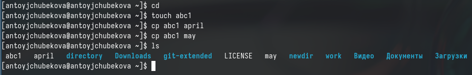

## Выполнение лабораторной работы

Копирую файлы april и may в каталог monthly. 

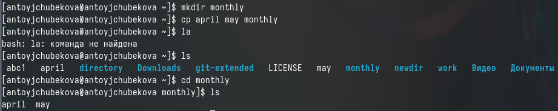

## Выполнение лабораторной работы

Копирую файл monthly/may в файл  june. С помощью утилиты ls мы видим, что файл был удачно скопирован. 

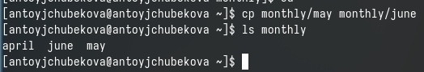

## Выполнение лабораторной работы

Копирую каталог monthly в новый каталог monthly.00, с помощью утилиты ls вижу, что все скопировано. 

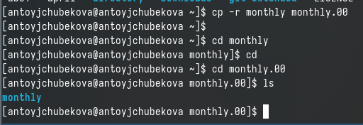

## Выполнение лабораторной работы

Копирую каталог monthly.00 в каталог /tmp. С помощью ls мы видим, что каталог monthly.00 теперь находиться и в tmp 

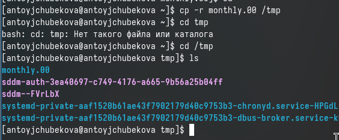

## Выполнение лабораторной работы

Изменяю название файла april на july в домашнем каталоге, с утилитой ls проверяю, что все удачно выполнилось. 

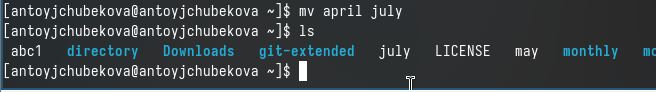

## Выполнение лабораторной работы

Перемещаю файл july в каталог monthly.00, с помощью ls проверяю. 

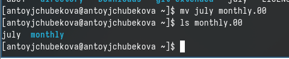

## Выполнение лабораторной работы

Переименовываю каталог monthly.00 в monthly.01. Затем перемещаю каталог monthly.01 в новый каталог reports. Далее переименовываю каталог report/monthly.01 в reports/monthly.

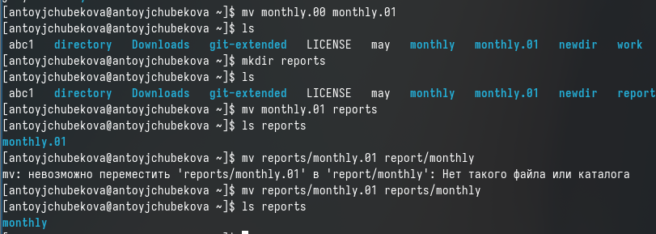

## Выполнение лабораторной работы

Создаю файл may и устанавливаю для него права выполнения для владельца, с помощью команды ls и утилита l, видим, что права доступа изменились.

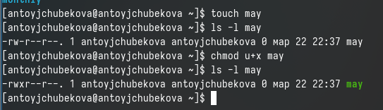

## Выполнение лабораторной работы

Лишаю владельца may права на выполнение. 

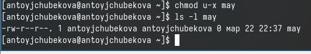

## Выполнение лабораторной работы

Создаю каталог monthly, и устанавливаю права доступа как запрет на чтение для членов группы и всех остальных пользователей. 

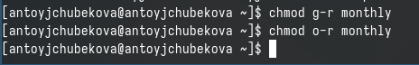

## Выполнение лабораторной работы

Создаю новый файл abc1 с правом для членов группы. 

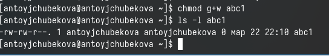

## Выполнение лабораторной работы

Для просмотра используемых в операционной системе файловых систем использую команду mount без параментров. 

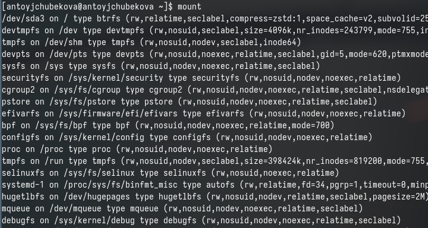

## Выполнение лабораторной работы

С помощью утилиты cat просматриваю содержания файла /etc/fstab. 

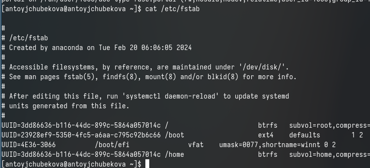

## Выполнение лабораторной работы

Использую команду df  и определяю объем свободного пространства на файловой системе.

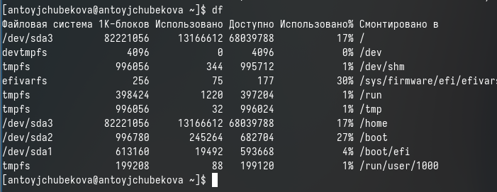

## Выполнение лабораторной работы

С помощью fsck проверяю(восстанавливаю) целостность файловой системы. 

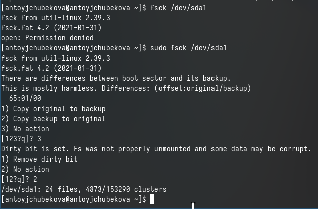

## Выполнение лабораторной работы

Копирую файл /usr/include/sys/io.h в домашний каталог и называю его equipment. 

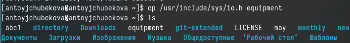

## Выполнение лабораторной работы

В домашнем каталоге создаю директорию ~/ski.plases. Перемещаю файл equipment в каталоге ~/ski.plases. Затем переименовываю файл ~/ski.pases/equiment в ~/ski.plases/equilist. C помощью утилита ls проверяю, что файлы переммещены и  переименованы. 

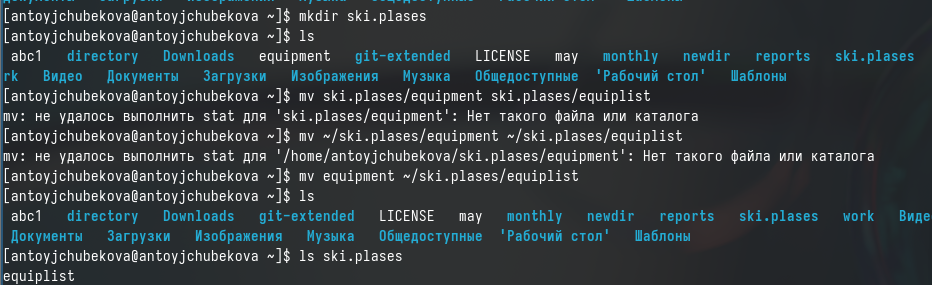

## Выполнение лабораторной работы

Создаю в домашнем каталоге файл abc1 и копирую его в каталог ~/ski.plases, назову его equiplist2. Затем создаю каталог с именем equipment в каталоге ~/ski.plases. Далее перемещаю файлы с ski.plases  в каталог ski.plases/equipment. 

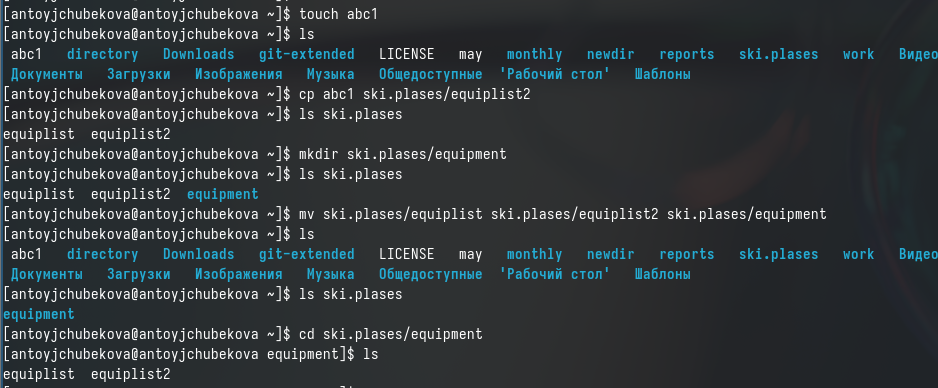

## Выполнение лабораторной работы

Создаю новый каталог newdir и перемещаю его в старый каталог ski.plases, поменяв название на plans. 

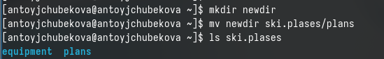

## Выполнение лабораторной работы

Для начала необходимо создать все каталоги и файлы над которыми я буду работать. 

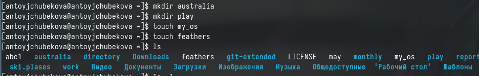

## Выполнение лабораторной работы

Проверяю какие  права доступа у этих файлов и каталогов имеюся на данны момент. 

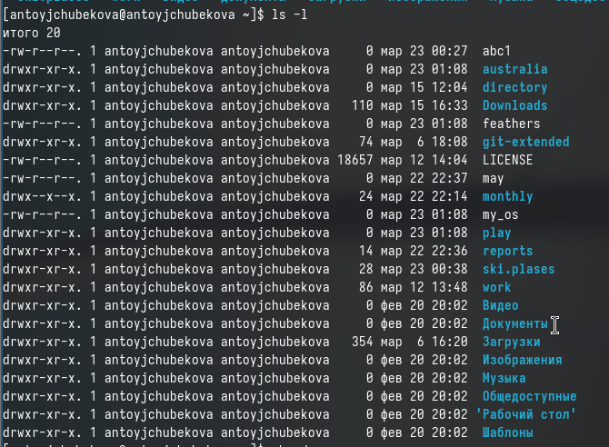

## Выполнение лабораторной работы

В каталоге australia нужно лишить права на выполнения у группы, в которую входит владелец и во всех остальных, чтобы у нового каталога были нужные по заданию права доступа. С помощью команды ls -l мы видим, что права доступа были правильно отредактированы. 

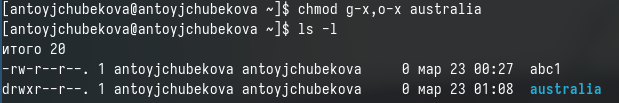

## Выполнение лабораторной работы

В каталоге play нужно лишить права на чтение у всех остальных и у группы, в которую входит владелец,чтобы у ногово каталога были нужные по заданию права доступа. С помощью команды ls -l мы видим, что права доступа были правильно отредактированы.

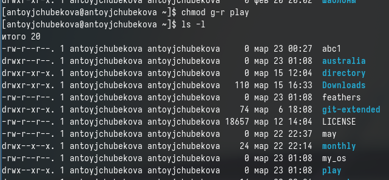

## Выполнение лабораторной работы

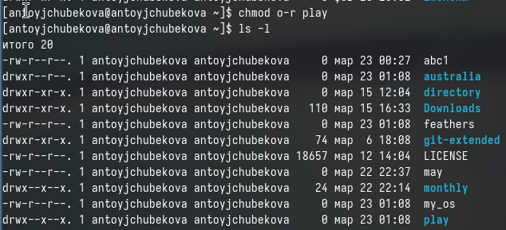

## Выполнение лабораторной работы

В файле my_os нужно лишить права на письмо и добавить права на выполнение владельцу,чтобы у ногово каталога были нужные по заданию права доступа. С помощью команды ls -l мы видим, что права доступа были правильно отредактированы.

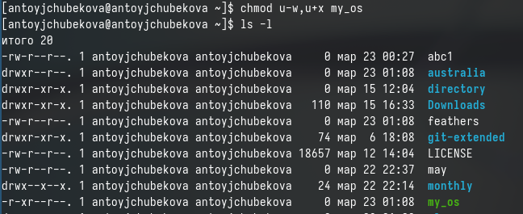

## Выполнение лабораторной работы

В файле feathers необходимо добавить права на письмо группе, к которому пренадлежит владелец,чтобы у ногово каталога были нужные по заданию права доступа. С помощью команды ls -l мы видим, что права доступа были правильно отредактированы.

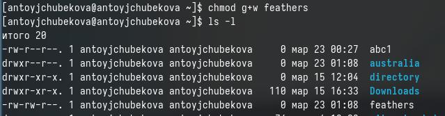

## Выполнение лабораторной работы

С помощью команды cat просматриваю содержение файла /etc/passwd.

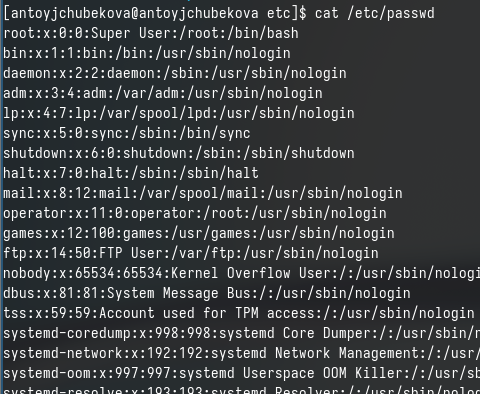

## Выполнение лабораторной работы

Копирую файл feathers в фвйл file.old.В свою очередь файл file.old  перемещаю в каталог play.В свою очередь каталог play  копирую в каталог fun. Затем перемещаю каталог fun в  каталог play  и переименовываю его в games. C помощью команды ls, проверяем содержание каталога play и видим, что теперь в нем находятся файл file.old и каталог games. 

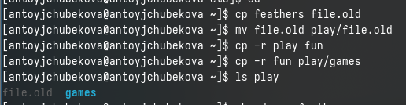

## Выполнение лабораторной работы

Лишаю владельца файла feathers права на чтение. Если я попытаюсь посмотреть содержание файла, то мне отказанов доступе, так как у владельца нет прав просматривать этот файл. Также если  я попытаюсь скопировать этот файл мне опять будет отказано в доступе по той же причине. Добавляю права на чтение владельцу.

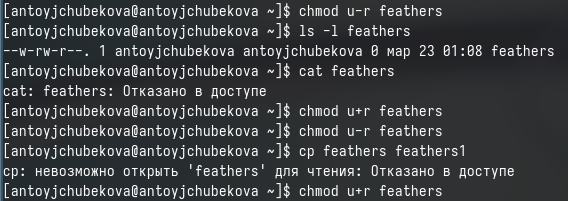

## Выполнение лабораторной работы

Лишаю владельца каталога play права на выполнение. Если я попытаюсь перейти в этот каталог, то мне отказанов доступе, так как у владельца нет прав выполнения с этим каталогом. Добавляю права на чтение владельцу. Если после этого я снова попытаюсь перейти в этот каталог у меня все получается. 

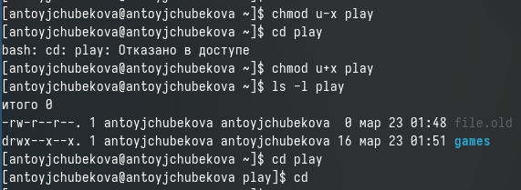

## Выполнение лабораторной работы

Я прочитала описание каждой из четырех команд с помощью команды man. \
mount-предназначена для подключения(монтиования) файловых систем и переносных накомплений( флешка, карта, памяти) к конкретным точкам монтирования в дереве директорий. \
fsck-команда Unix, которая проверяети устраняет ошибки в файловой системе. \
mkfs-используется для создания файловой системы на блочном устройстве, таком как жесткий диск или флэш-накопитель.\
kill-является встроенной командой оболочки, предназначенной для отправки системных сигналов определенным процессам, чаще всего данная команда используется для принудительногоо завершения работы определенных процессов. \

## Выводы

В ходе выполнения лабраторной работы №7 я знакомилась с файловой системой Linux, её структурой, именами и содержанием каталогов. Приобрела практические навыки по применению команд для работы с файлами и каталогами, по управлению процессами (и работами), по проверке использования диска и обслуживанию файловой системы.

