---
## Front matter
lang: ru-RU
title: Лабораторная работа №8
subtitle: Операционные системы
author:
  - Тойчубекова Асель Нурлановна
institute:
  - Российский университет дружбы народов, Москва, Россия
  
date: 30 марта 2024

## i18n babel
babel-lang: russian
babel-otherlangs: english

## Formatting pdf
toc: false
toc-title: Содержание
slide_level: 2
aspectratio: 169
section-titles: true
theme: metropolis
header-includes:
 - \metroset{progressbar=frametitle,sectionpage=progressbar,numbering=fraction}
 - '\makeatletter'
 - '\beamer@ignorenonframefalse'
 - '\makeatother'
 
## Fonts
mainfont: PT Serif
romanfont: PT Serif
sansfont: PT Sans
monofont: PT Mono
mainfontoptions: Ligatures=TeX
romanfontoptions: Ligatures=TeX
sansfontoptions: Ligatures=TeX,Scale=MatchLowercase
monofontoptions: Scale=MatchLowercase,Scale=0.9
---

# Информация

## Докладчик

:::::::::::::: {.columns align=center}
::: {.column width="70%"}

  * Тойчубекова Асель Нурлановна
  * Студент НПИбд-02-23
  * факультет физико-математических и естественных наук
  * Российский университет дружбы народов
  * [1032235033@pfur.ru](1032235033@pfur.ru)
  * <https://aseltoichubekova.github.io/ru/>

:::
::: {.column width="30%"}

:::
::::::::::::::

## Цель работы

Целью данной лабораторной работы является ознакомление с инструментами поиска файлов и фильтрации текстовых данных. Также приобретение практических навыков: по управлению процессами (и заданиями), по проверке использования диска и обслуживанию файловых систем.

## Задание

- Изучить теоретический материал. \

- Выполнить все указания к лабораторной работе.

# Теоретическое введение

## Теоретическое введение

В системе по умолчанию открыто три специальных потока:
– **stdin** — стандартный поток ввода (по умолчанию: клавиатура), файловый дескриптор 0;

– **stdout** — стандартный поток вывода (по умолчанию: консоль), файловый дескриптор 1;

– **stderr** — стандартный поток вывод сообщений об ошибках (по умолчанию: консоль), файловый дескриптор 2.

## Теоретическое введение

Большинство используемых в консоли команд и программ записывают результаты
своей работы в стандартный поток вывода stdout. Например, команда ls выводит в стандартный поток вывода (консоль) список файлов в текущей директории. Потоки вывода
и ввода можно перенаправлять на другие файлы или устройства. Проще всего это делается
с помощью символов >, >>, <, <<.

## Теоретическое введение

**Конвейер** (pipe) служит для объединения простых команд или утилит в цепочки, в которых результат работы прудыдущей команды передается поседующей. Для этого используется символ "|".

**Команда find** используется для поиска и отображения на экран имён файлов, соответствующих заданной строке символов. Путь определяет каталог, начиная с которого по всем подкаталогам будет вестись поиск.

## Теоретическое введение

Найти в текстовом файле указанную строку символов позволяет **команда grep**.

**Команда df** показывает размер каждого смонтированного раздела диска.

**Команда du** показывает число килобайт, используемое каждым файлом или каталогом.

## Теоретическое введение

Любую выполняющуюся в консоли команду или внешнюю программу можно запустить
в фоновом режиме. Для этого следует в конце имени команды указать **знак амперсанда &**

## Теоретическое введение

Запущенные фоном программы называются задачами (jobs). Ими можно управлять с помощью команды jobs, которая выводит список запущенных в данный момент задач. Для завершения задачи необходимо выполнить **команду kill**

## Теоретическое введение

Любой команде, выполняемой в системе, присваивается идентификатор процесса
(process ID). Получить информацию о процессе и управлять им, пользуясь идентификатором процесса, можно из любого окна командного интерпретатора.

**Команда ps** используется для получения информации о процессах.

# Выполнение лабораторной работы

## Выполнение лабораторной работы

Для начала осуществляю вход в систему, используя соответствующее имя пользователя. 

Записыва в файл file.txt названия файлов, содержащихся в каталоге /etc. С помощью утилиты head, которая выводит первые 10 строчек содержания файла на экран проверяю, что все имена файлов были записаны.

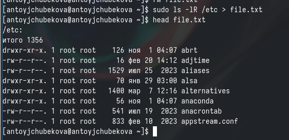

## Выполнение лабораторной работы

Затем добавляю в этот же файл названия файлов, содержащихся в моем домашнем каталоге. Используя команду cat  вывожу на экран содержимое файла  file.txt  и вижу, что все названия файлов из дмащнего каталога были записаны в файл 

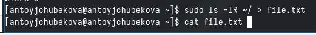

## Выполнение лабораторной работы

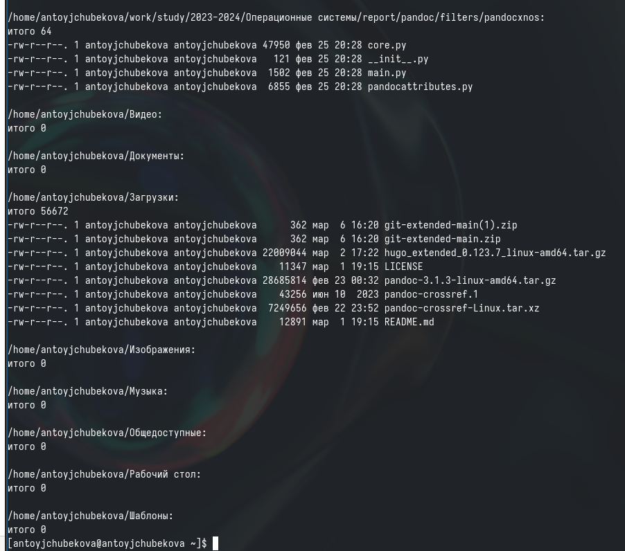

## Выполнение лабораторной работы

Вывожу имена всех файлов из file.txt, имеющих расширение .conf, с помощью утилиты grep. 

## Выполнение лабораторной работы

Далее записываю их в новый текстовый файл conf.txt, используя символ ">". С помощью команды head проверяю их наличия в файле. 

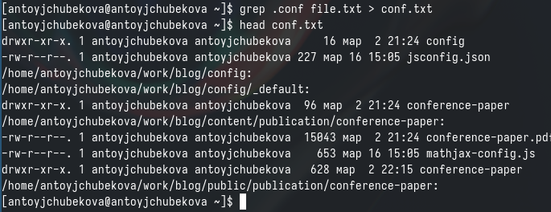

## Выполнение лабораторной работы

Определяю, какие файлы в домашнем каталоге начинаются с символа "c" с помощью утилиты find, прописываю ей в аргументы домашнюю директорию , такде опции -name и -print для того, чтобы  команда искала файлы по имени и выводила их на экран. 

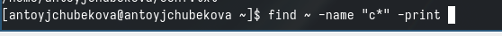

## Выполнение лабораторной работы

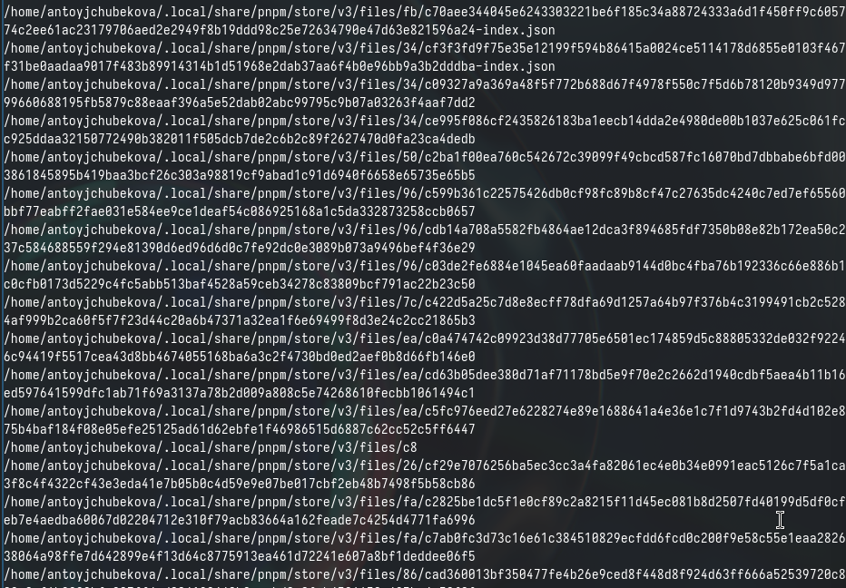

## Выполнение лабораторной работы

Второй способ заключается в использовании утилиты ls -lR и использовать grep, чтобы найти элементы с первым символом с. Однако этот способ не работает для поиска файлов из подкаталогов каталога. 

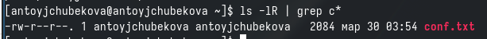

## Выполнение лабораторной работы

С помощью утилиты find  вывожу на экран имена файлов из каталога etc, начинающиеся с символом h. 

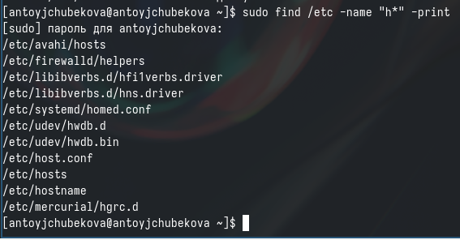

## Выполнение лабораторной работы

Запускаю в фоновом режиме процесс, который будет записывать в файл ~/logfile файлы, имена которых начинаются с log, с помощью утилиты find, амперсанта и символа перенаправления.

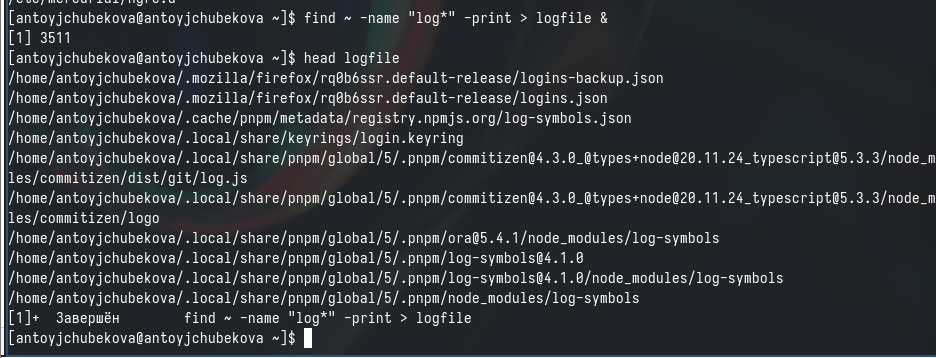

## Выполнение лабораторной работы

 Удаляю файл ~/logfile. С помощью команды ls, мы видим, что все было удалено. 

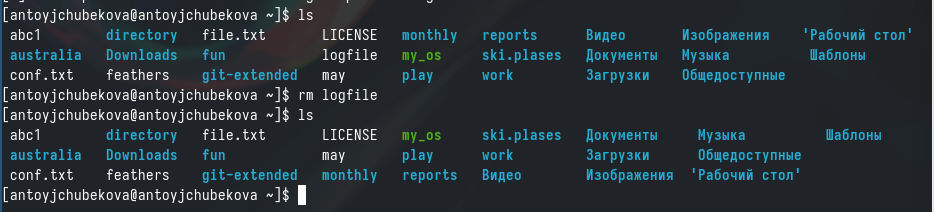

## Выполнение лабораторной работы

Запускаю из консоли в фоновом режиме редактор gedit, используя амперсант в конце. Мы видим, что редактор запустился, так что можно продолжать работу как в консоли так и в редакторе. 

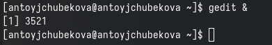

## Выполнение лабораторной работы

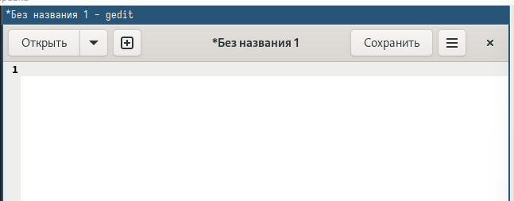

## Выполнение лабораторной работы

Используя команду ps, также конвейер и фильтр grep  определяю иденификатор процесса gedit. Мы видим, что идентификатор равен 3572. 

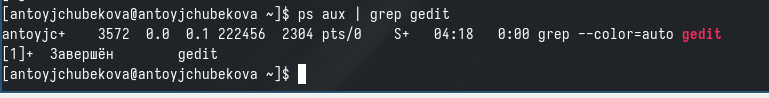

## Выполнение лабораторной работы

Также идентификатор процусса можно определить с помощью команды pgrep. 

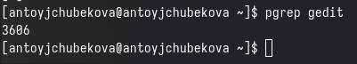

## Выполнение лабораторной работы

С помощью команды man просматриваю справку о команде kill, которая отвечает за прерывание процесса. 

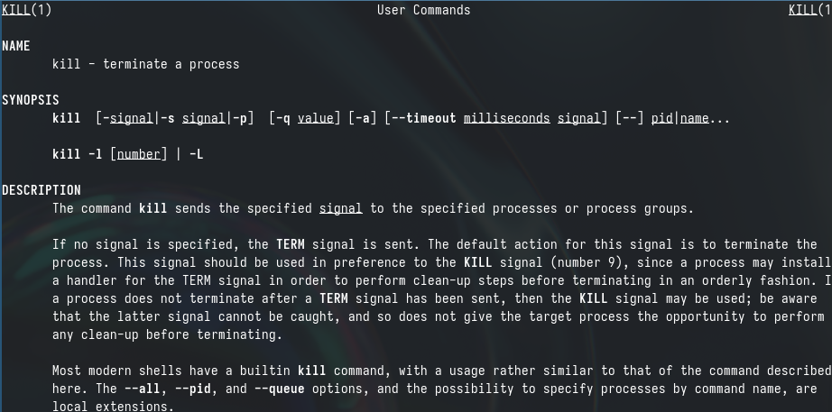

## Выполнение лабораторной работы

Используя команду kill завершаю процесс gedit, указывая его идентификатор процесса. 

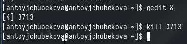

## Выполнение лабораторной работы

C помощью команды man получаю более подробную иныормацию про команды df и du

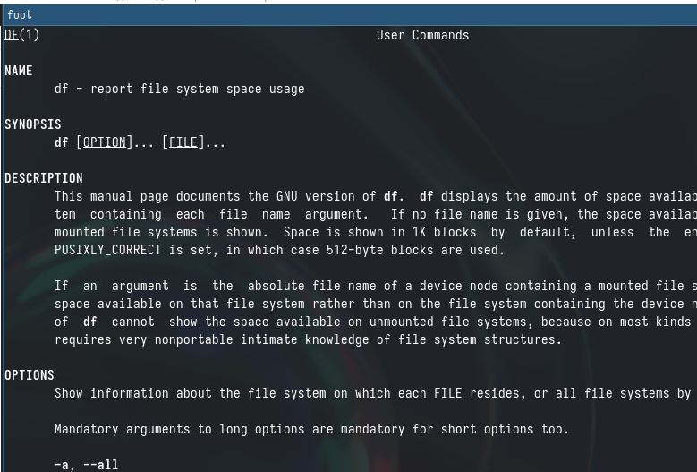

## Выполнение лабораторной работы

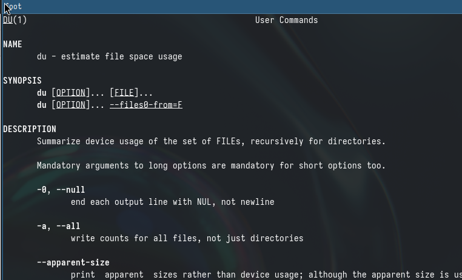

## Выполнение лабораторной работы

Выполняю команду df, которая показывает размер каждого смонтированного раздела диска.

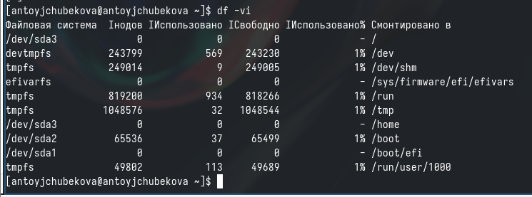

## Выполнение лабораторной работы

Выполняю команду du, которая показывает число килобайт, используемое каждым файлом или каталогом. 

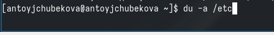

## Выполнение лабораторной работы

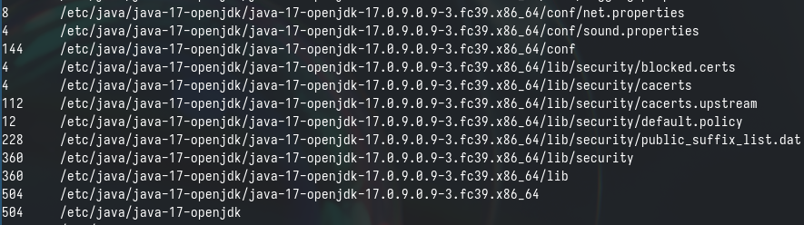

## Выполнение лабораторной работы

C помощью утилиты man нахожу опцию команды find, которая выведет имена всех директорий в домашнем каталоге. 

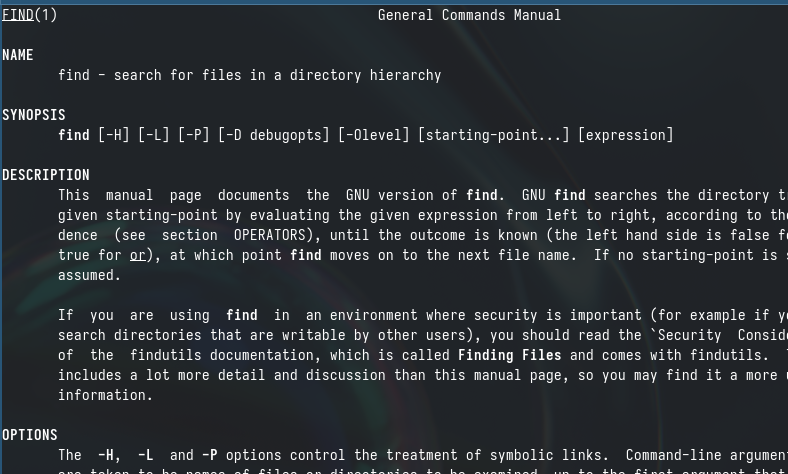

## Выполнение лабораторной работы

Вывожу на экран имена всех директорий в домашнем каталоге, используя команду find и опцию -type d. 

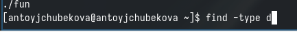

## Выполнение лабораторной работы

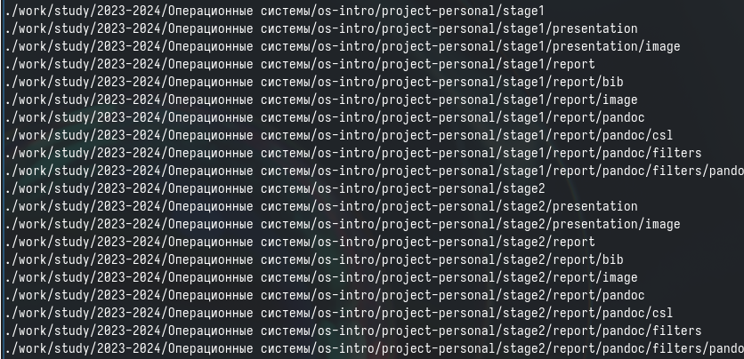

## Выводы
 
 В ходе выполнения лабораторной работы №8 я ознакомилась с инструментами поиска файлов и фильтрации текстовых данных. Также приобрела практические навыки: по управлению процессами (и заданиями), по проверке использования диска и обслуживанию файловых систем.
