---
## Front matter
title: "Лабораторная работа №8"
subtitle: "Операционные системы"
author: "Тойчубекова Асель Нурлановна"

## Generic otions
lang: ru-RU
toc-title: "Содержание"

## Bibliography
bibliography: bib/cite.bib
csl: pandoc/csl/gost-r-7-0-5-2008-numeric.csl

## Pdf output format
toc: true # Table of contents
toc-depth: 2
lof: true # List of figures
lot: true # List of tables
fontsize: 12pt
linestretch: 1.5
papersize: a4
documentclass: scrreprt
## I18n polyglossia
polyglossia-lang:
  name: russian
  options:
	- spelling=modern
	- babelshorthands=true
polyglossia-otherlangs:
  name: english
## I18n babel
babel-lang: russian
babel-otherlangs: english
## Fonts
mainfont: PT Serif
romanfont: PT Serif
sansfont: PT Sans
monofont: PT Mono
mainfontoptions: Ligatures=TeX
romanfontoptions: Ligatures=TeX
sansfontoptions: Ligatures=TeX,Scale=MatchLowercase
monofontoptions: Scale=MatchLowercase,Scale=0.9
## Biblatex
biblatex: true
biblio-style: "gost-numeric"
biblatexoptions:
  - parentracker=true
  - backend=biber
  - hyperref=auto
  - language=auto
  - autolang=other*
  - citestyle=gost-numeric
## Pandoc-crossref LaTeX customization
figureTitle: "Рис."
tableTitle: "Таблица"
listingTitle: "Листинг"
lofTitle: "Список иллюстраций"
lotTitle: "Список таблиц"
lolTitle: "Листинги"
## Misc options
indent: true
header-includes:
  - \usepackage{indentfirst}
  - \usepackage{float} # keep figures where there are in the text
  - \floatplacement{figure}{H} # keep figures where there are in the text
---

# Цель работы

Целью данной лабораторной работы является ознакомление с инструментами поиска файлов и фильтрации текстовых данных. Также приобретение практических навыков: по управлению процессами (и заданиями), по проверке использования диска и обслуживанию файловых систем.

# Задание

Выполнить все указания к лабораторной работе:\
1. Осуществите вход в систему, используя соответствующее имя пользователя.\
2. Запишите в файл file.txt названия файлов, содержащихся в каталоге /etc. Допишите в этот же файл названия файлов, содержащихся в вашем домашнем каталоге.\
3. Выведите имена всех файлов из file.txt, имеющих расширение .conf, после чего запишите их в новый текстовой файл conf.txt. \
4. Определите, какие файлы в вашем домашнем каталоге имеют имена, начинавшиеся с символа c? Предложите несколько вариантов, как это сделать. \
5. Выведите на экран (по странично) имена файлов из каталога /etc, начинающиеся с символа h. \
6. Запустите в фоновом режиме процесс, который будет записывать в файл ~/logfile файлы, имена которых начинаются с log.\
7. Удалите файл ~/logfile.\
8. Запустите из консоли в фоновом режиме редактор gedit. \
9. Определите идентификатор процесса gedit, используя команду ps, конвейер и фильтр grep. Как ещё можно определить идентификатор процесса? \
10. Прочтите справку (man) команды kill, после чего используйте её для завершения процесса gedit. \
11. Выполните команды df и du, предварительно получив более подробную информацию об этих командах, с помощью команды man. \
12. Воспользовавшись справкой команды find, выведите имена всех директорий, имеющихся в вашем домашнем каталоге.

# Теоретическое введение

В системе по умолчанию открыто три специальных потока:
– **stdin** — стандартный поток ввода (по умолчанию: клавиатура), файловый дескриптор 0;

– **stdout** — стандартный поток вывода (по умолчанию: консоль), файловый дескриптор 1;

– **stderr** — стандартный поток вывод сообщений об ошибках (по умолчанию: консоль), файловый дескриптор 2.

Большинство используемых в консоли команд и программ записывают результаты
своей работы в стандартный поток вывода stdout. Например, команда ls выводит в стандартный поток вывода (консоль) список файлов в текущей директории. Потоки вывода
и ввода можно перенаправлять на другие файлы или устройства. Проще всего это делается
с помощью символов >, >>, <, <<.

**Конвейер** (pipe) служит для объединения простых команд или утилит в цепочки, в которых результат работы прудыдущей команды передается поседующей. Для этого используется символ "|".

**Команда find** используется для поиска и отображения на экран имён файлов, соответствующих заданной строке символов. Путь определяет каталог, начиная с которого по всем подкаталогам будет вестись поиск.

Найти в текстовом файле указанную строку символов позволяет **команда grep**.

**Команда df** показывает размер каждого смонтированного раздела диска.

**Команда du** показывает число килобайт, используемое каждым файлом или каталогом.

Любую выполняющуюся в консоли команду или внешнюю программу можно запустить
в фоновом режиме. Для этого следует в конце имени команды указать **знак амперсанда &**

Запущенные фоном программы называются задачами (jobs). Ими можно управлять с помощью команды jobs, которая выводит список запущенных в данный момент задач. Для завершения задачи необходимо выполнить **команду kill**

Любой команде, выполняемой в системе, присваивается идентификатор процесса
(process ID). Получить информацию о процессе и управлять им, пользуясь идентификатором процесса, можно из любого окна командного интерпретатора.

**Команда ps** используется для получения информации о процессах.

# Выполнение лабораторной работы

Для начала осуществляю вход в систему, используя соответствующее имя пользователя. 

Записыва в файл file.txt названия файлов, содержащихся в каталоге /etc. С помощью утилиты head, которая выводит первые 10 строчек содержания файла на экран проверяю, что все имена файлов были записаны. (рис. [-@fig:001]).

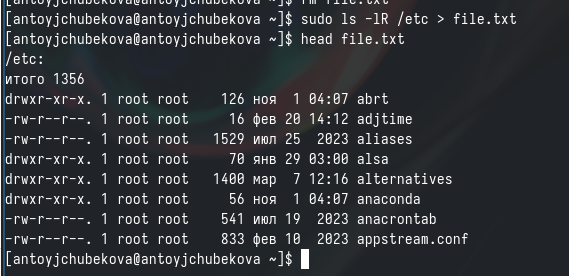{#fig:001 width=70%}

Затем добавляю в этот же файл названия файлов, содержащихся в моем домашнем каталоге (рис. [-@fig:002]). Используя команду cat  вывожу на экран содержимое файла  file.txt  и вижу, что все названия файлов из дмащнего каталога были записаны в файл (рис. [-@fig:003]).

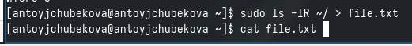{#fig:002 width=70%}

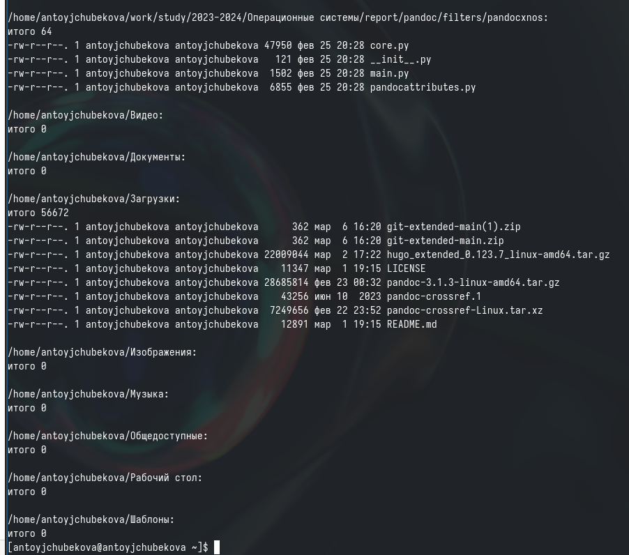{#fig:003 width=70%}

Вывожу имена всех файлов из file.txt, имеющих расширение .conf, с помощью утилиты grep. (рис. [-@fig:004]).

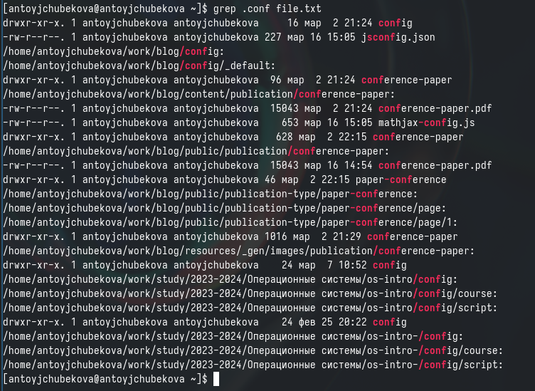{#fig:004 width=70%}

Далее записываю их в новый текстовый файл conf.txt, используя символ ">". С помощью команды head проверяю их наличия в файле. (рис. [-@fig:005]).

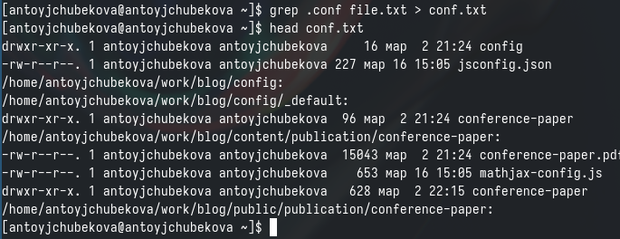{#fig:005 width=70%}

Определяю, какие файлы в домашнем каталоге начинаются с символа "c" с помощью утилиты find, прописываю ей в аргументы домашнюю директорию , такде опции -name и -print для того, чтобы  команда искала файлы по имени и выводила их на экран. (рис. [-@fig:006] и рис. [-@fig:007])

{#fig:006 width=70%}

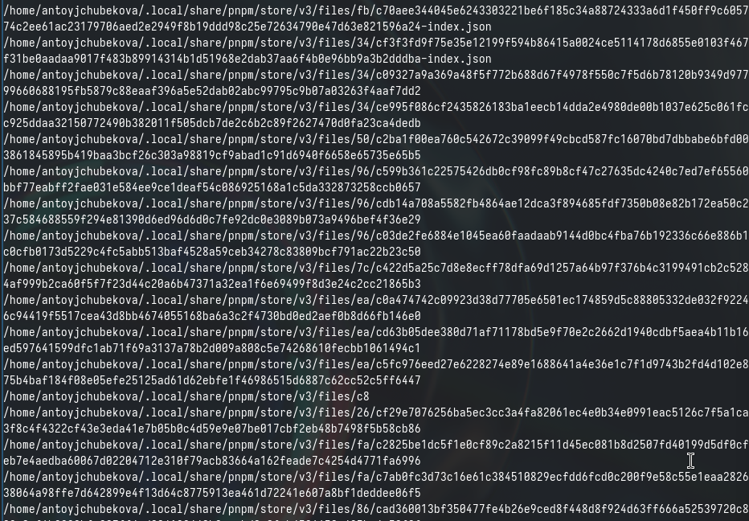{#fig:007 width=70%}

Второй способ заключается в использовании утилиты ls -lR и использовать grep, чтобы найти элементы с первым символом с. Однако этот способ не работает для поиска файлов из подкаталогов каталога. (рис. [-@fig:008]).

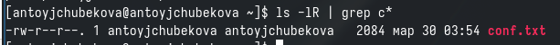{#fig:008 width=70%}

С помощью утилиты find  вывожу на экран имена файлов из каталога etc, начинающиеся с символом h. (рис. [-@fig:009]).

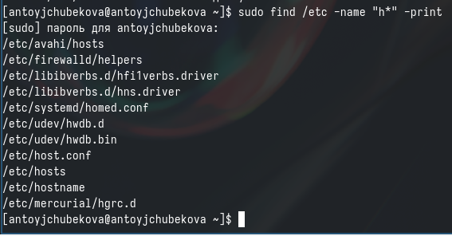{#fig:009 width=70%}

Запускаю в фоновом режиме процесс, который будет записывать в файл ~/logfile файлы, имена которых начинаются с log, с помощью утилиты find, амперсанта и символа перенаправления. (рис. [-@fig:010]).

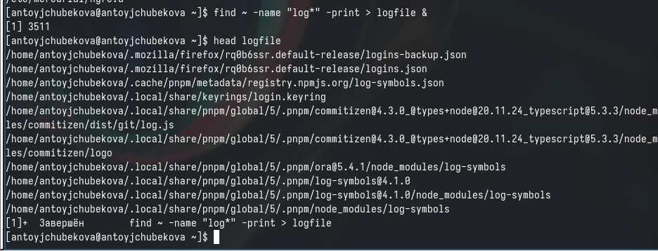{#fig:010 width=70%}

 Удаляю файл ~/logfile. С помощью команды ls, мы видим, что все было удалено. (рис. [-@fig:011]).

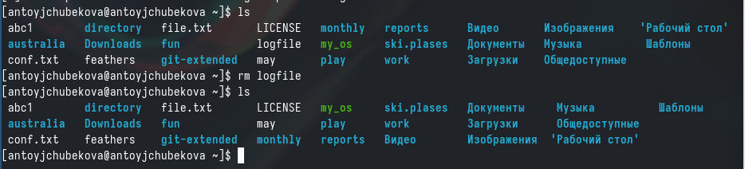{#fig:011 width=70%}

Запускаю из консоли в фоновом режиме редактор gedit, используя амперсант в конце. Мы видим, что редактор запустился, так что можно продолжать работу как в консоли так и в редакторе. (рис. [-@fig:012] и рис. [-@fig:013])

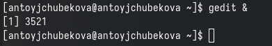{#fig:012 width=70%}

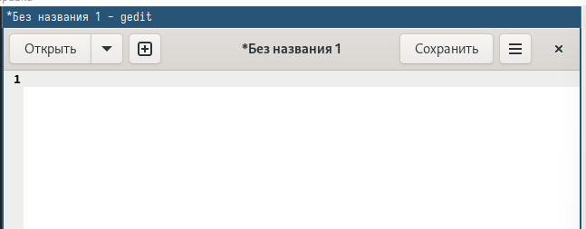{#fig:013 width=70%}

Используя команду ps, также конвейер и фильтр grep  определяю иденификатор процесса gedit. Мы видим, что идентификатор равен 3572. (рис. [-@fig:014]).

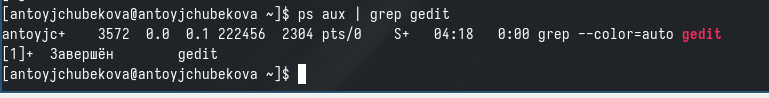{#fig:014 width=70%}

Также идентификатор процусса можно определить с помощью команды pgrep. (рис. [-@fig:015]).

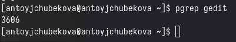{#fig:015 width=70%}

С помощью команды man просматриваю справку о команде kill, которая отвечает за прерывание процесса. (рис. [-@fig:016]).

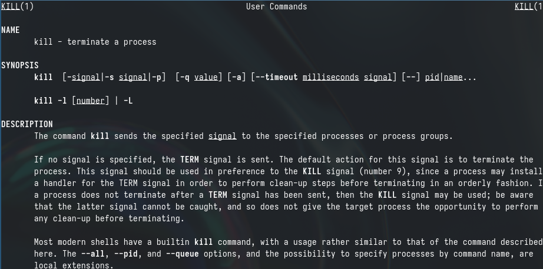{#fig:016 width=70%}

Используя команду kill завершаю процесс gedit, указывая его идентификатор процесса. (рис. [-@fig:017]).

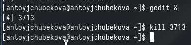{#fig:017 width=70%}

C помощью команды man получаю более подробную иныормацию про команды df (рис. [-@fig:019]) и du (рис. [-@fig:020]). 

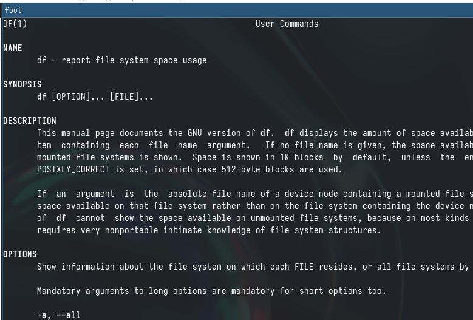{#fig:019 width=70%}

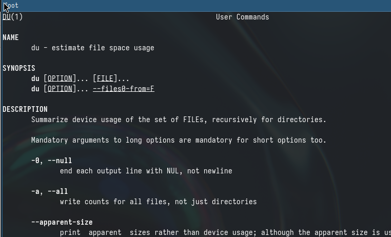{#fig:020 width=70%}

Выполняю команду df, которая показывает размер каждого смонтированного раздела диска. (рис. [-@fig:021]).

{#fig:021 width=70%}

Выполняю команду du, которая показывает число килобайт, используемое каждым файлом или каталогом. (рис. [-@fig:022] и рис. [-@fig:023])

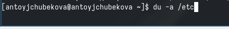{#fig:022 width=70%}

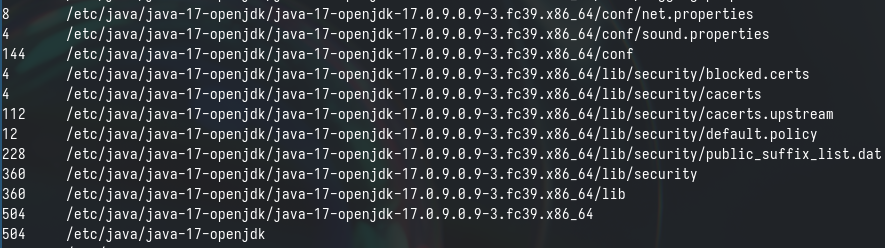{#fig:023 width=70%}

C помощью утилиты man нахожу опцию команды find, которая выведет имена всех директорий в домашнем каталоге. (рис. [-@fig:024]).

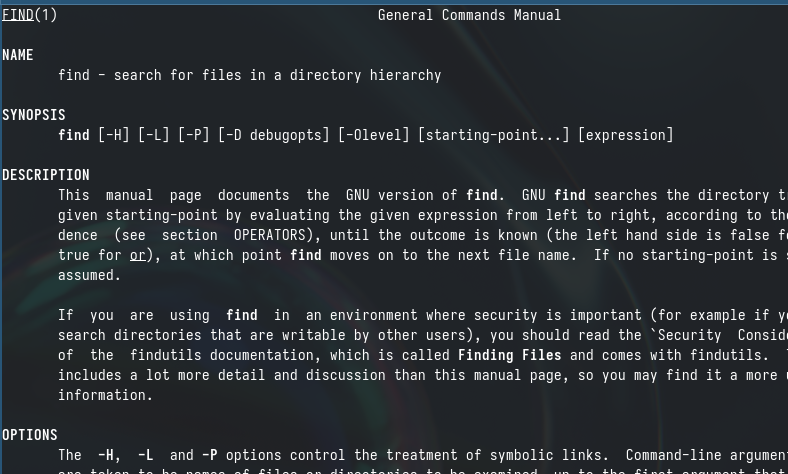{#fig:024 width=70%}

Вывожу на экран имена всех директорий в домашнем каталоге, используя команду find и опцию -type d. (рис. [-@fig:025]) и du (рис. [-@fig:026]). 

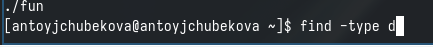{#fig:025 width=70%}

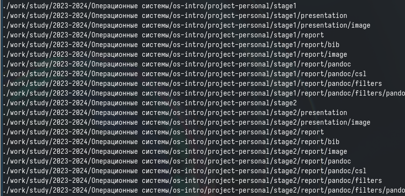{#fig:026 width=70%}

# Выводы
 
 В ходе выполнения лабораторной работы №8 я ознакомилась с инструментами поиска файлов и фильтрации текстовых данных. Также приобрела практические навыки: по управлению процессами (и заданиями), по проверке использования диска и обслуживанию файловых систем.
