---
## Front matter
lang: ru-RU
title: Лабораторная работа №9
subtitle: Операционные системы
author:
  - Тойчубекова АСель Нурлановна
institute:
  - Российский университет дружбы народов, Москва, Россия
date: 06 апрель 2024

## i18n babel
babel-lang: russian
babel-otherlangs: english

## Formatting pdf
toc: false
toc-title: Содержание
slide_level: 2
aspectratio: 169
section-titles: true
theme: metropolis
header-includes:
 - \metroset{progressbar=frametitle,sectionpage=progressbar,numbering=fraction}
 - '\makeatletter'
 - '\beamer@ignorenonframefalse'
 - '\makeatother'
 
## Fonts
mainfont: PT Serif
romanfont: PT Serif
sansfont: PT Sans
monofont: PT Mono
mainfontoptions: Ligatures=TeX
romanfontoptions: Ligatures=TeX
sansfontoptions: Ligatures=TeX,Scale=MatchLowercase
monofontoptions: Scale=MatchLowercase,Scale=0.9
 
---

# Информация

## Докладчик

:::::::::::::: {.columns align=center}
::: {.column width="70%"}

  * Тойчубекова Асель Нурлановна
  * Студент НПИбд-02-23
  * факультет физико-математических и естественных наук
  * Российский университет дружбы народов
  * [1032235033@pfur.ru](1032235033@pfur.ru)
  * <https://aseltoichubekova.github.io/ru/>

:::
::: {.column width="30%"}

:::
::::::::::::::
## Цель работы

Целью данной лабораторной работы является освоение основных возможностей командной оболочки Midnight Commander.  Также приобретение навыков практической работы по просмотру каталогов и файлов; манипуляций
с ними.

# Теоретическое введение 

## Теоретическое введение 

Командная оболочка — интерфейс взаимодействия пользователя с операционной системой и программным обеспечением посредством команд.
Midnight Commander (или mc) — псевдографическая командная оболочка для UNIX/Linux
систем. Для запуска mc необходимо в командной строке набрать mc и нажать Enter .
Рабочее пространство mc имеет две панели, отображающие по умолчанию списки
файлов двух каталогов. 

## Теоретическое введение

Над панелями располагается меню, доступ к которому осуществляется с помощью
клавиши F9 . Под панелями внизу расположены управляющие экранные кнопки, ассоциированные с функциональными клавишами F1 – F10 (табл. 7.1). Над ними располагается
командная строка, предназначенная для ввода команд.

## Теоретическое введение

Некоторые из основных возможностей командной оболочки MC включают:

1. Управление файлами и каталогами: копирование, перемещение, удаление, переименование и создание.
2. Редактирование файлов: открытие, сохранение и поиск по содержимому.
3. Запуск программ и команд.
4. Просмотр и управление процессами.
5. Доступ к системной информации, такой как использование памяти и дискового пространства.
6. Настройка внешнего вида и поведения MC с помощью файла конфигурации.

## Теоретическое введение

MC также поддерживает ряд расширений и плагинов, которые могут расширить функциональность и добавить новые функции, такие как поддержка архивов, просмотр изображений и управление сетевыми подключениями.

В целом, командная оболочка Midnight Commander - это мощный и универсальный инструмент для работы с файловой системой и командной строкой, который популярен среди системных администраторов, разработчиков и других опытных пользователей.

# Выполнение лабораторной работы

## Выполнение лабораторной работы

Для начала изучаю информацию о mc, вызвав в командной строке команду man mc.

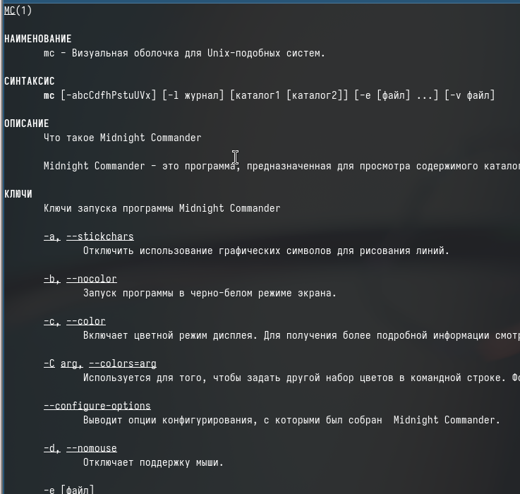

## Выполнение лабораторной работы

Запускаю из командной строки mc и изучпю его структуру и меню. 

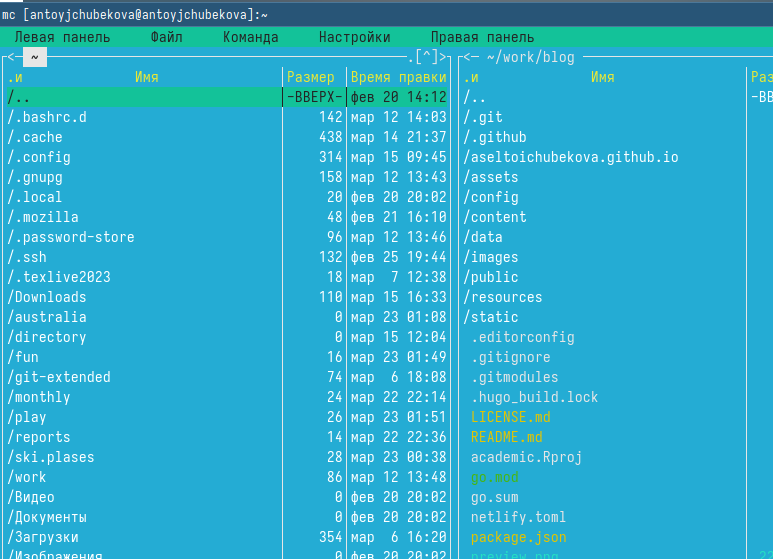

## Выполнение лабораторной работы

С помощью стрелочки влево вправо я могу перемещаться по директориям, а с помощью стрелочек вверх и вниз перебирать файлы в директории, в которой нахожусь. 

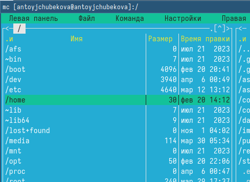

## Выполнение лабораторной работы

С помощью клавиши F5 копирую файл file.txt в каталог monthly, используя два окна паели mc. Далее мы видим, что файл был удачно скопирован.

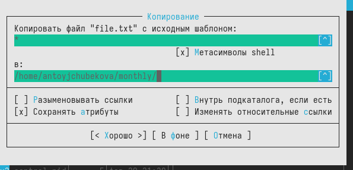

## Выполнение лабораторной работы

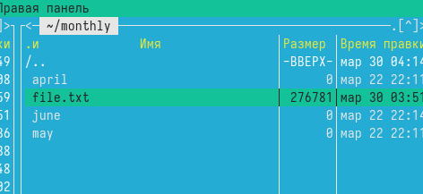

## Выполнение лабораторной работы

Используя клавишу F6 перемещаю файл conf.txt в каталог monthly. Затем мы видим, что файл был успешно перенесен, в домашнем каталоге его уже нет. 

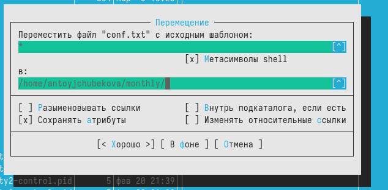

## Выполнение лабораторной работы

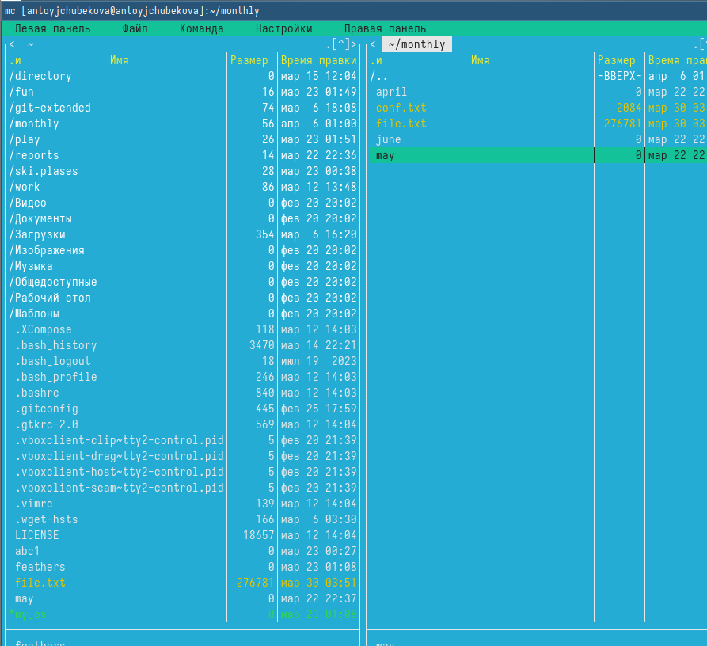

## Выполнение лабораторной работы

Вывожу информацию о файле, используя команду меню правой понели. В итоге получаю информацию больше чем при выводе команды ls-l. 

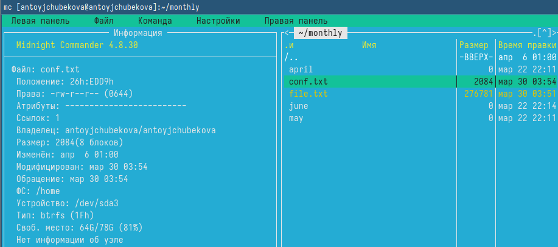

## Выполнение лабораторной работы

Также пользуясь командой меню правой понели, вывожу информацию о правах доступа файла и возможность ее редактирования. 

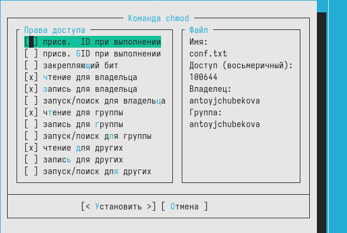

## Выполнение лабораторной работы

В правой понели команда "Быстрый просмотр" отвечает за просмотр содержимого файла, пременяя ее просматриваю содержимое файла conf.txt.

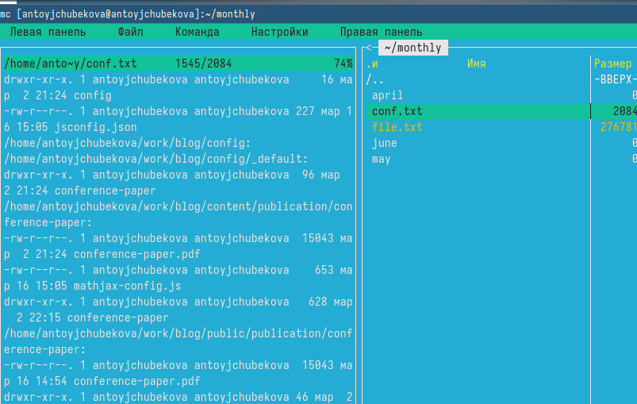

## Выполнение лабораторной работы

Используя возможности подменю "Файл" я просмиотрела содержимое текстового файла conf.txt. 

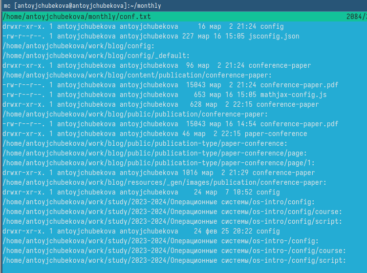

## Выполнение лабораторной работы

Открыла файл на изменения, поменяла пару строк и закрыла файл без сохранения. 

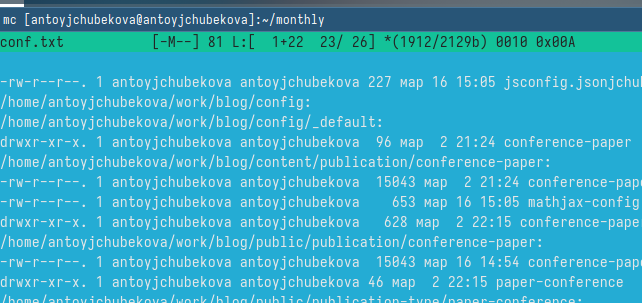

## Выполнение лабораторной работы

Создаю новый каталог privet. 

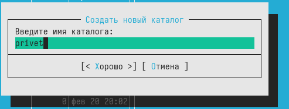

## Выполнение лабораторной работы

Копирую файл в созданный каталог. Перейдя в каталог privet на правой панели мы видим, что файл был успешно скопирован.

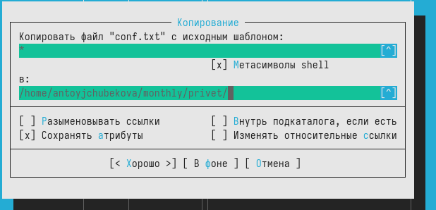

## Выполнение лабораторной работы

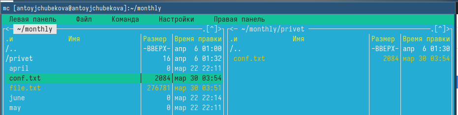

## Выполнение лабораторной работы

С помощью средств подменю "Команда" осуществляю поиск  в файловой системе файл с расширением txt. 

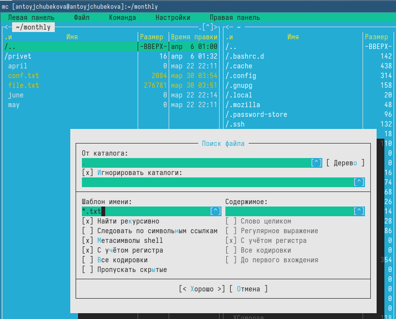

## Выполнение лабораторной работы

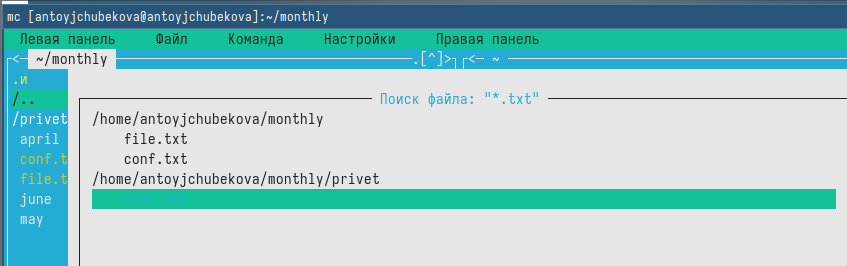

## Выполнение лабораторной работы

С помощью тех же средств подменю "Команда" просматриваю историю команд и повторяю одну из них, то есть создаю новый файл sun.

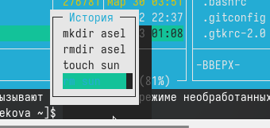

## Выполнение лабораторной работы

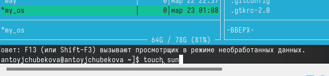

## Выполнение лабораторной работы

Можно перемещаться между директориями, я перемещусь в домашнюю, используя дерево каталогов. 

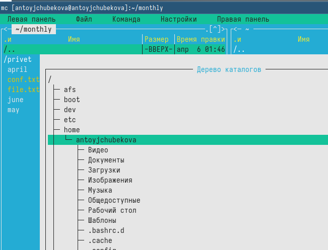

## Выполнение лабораторной работы

Провожу анализ файлов меню и файла расширений.

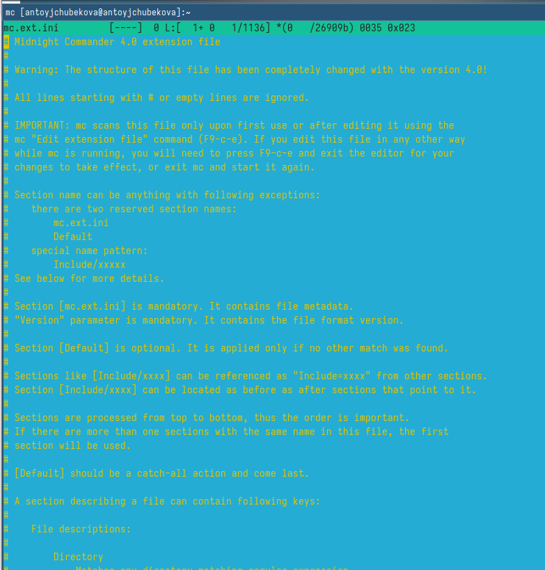

## Выполнение лабораторной работы

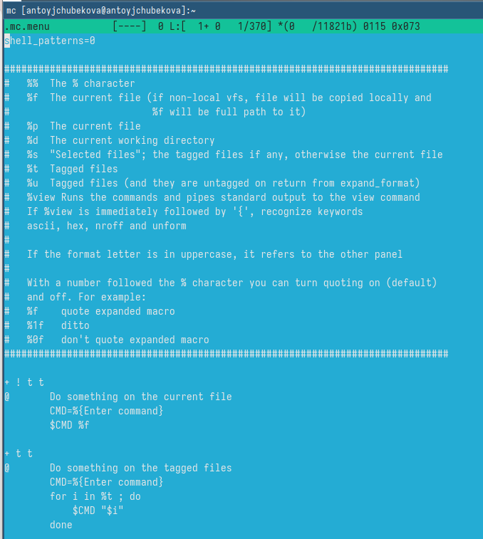

## Выполнение лабораторной работы

Вызываю подменю "Настройки" и вывожу на экран инфоормацию о параметрах конфигурации, о внешнем виде , о настройках понели

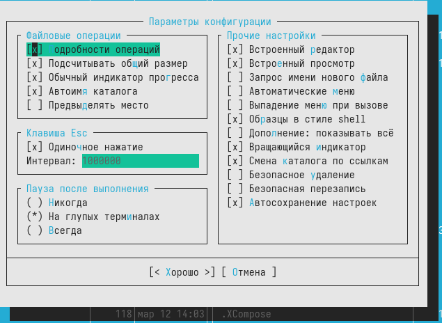

## Выполнение лабораторной работы

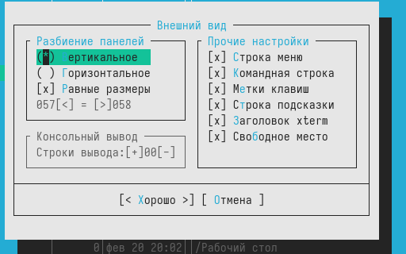

## Выполнение лабораторной работы

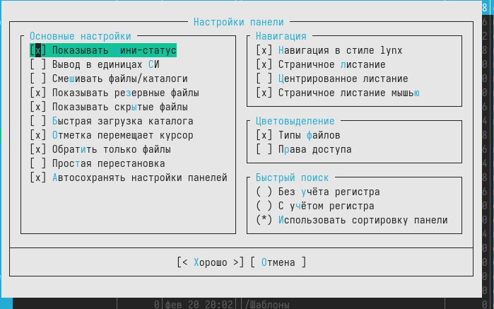

## Выполнение лабораторной работы

Создаю текстовый файл text.txt.

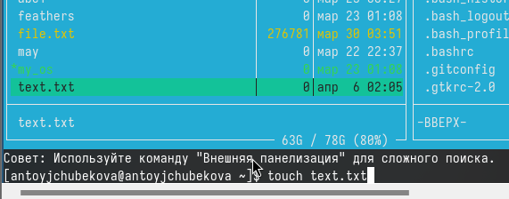

## Выполнение лабораторной работы

Открываю этот файл с помощью встроенного в mc редактора, используя  клавишу F4 и вставляю в открытый файл небольшой фрагмент текста, скопированный из прошлой лабораторной работы.

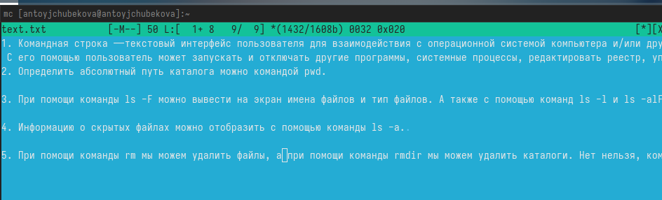

## Выполнение лабораторной работы

С помощью комбинации клавиш Ctrl+y удаляю четвертую строку в данном тексте.

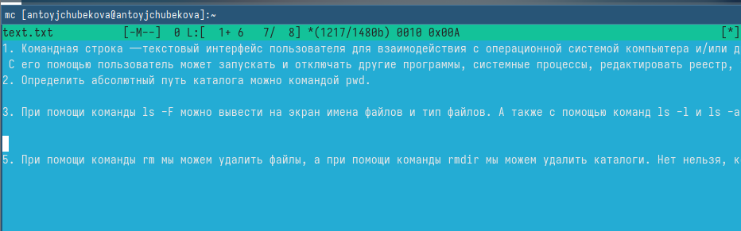

## Выполнение лабораторной работы

Выделяю пятую строку текста, используя клавишу F3 для выделения и F5 для копирования, и копирую его на новую строку. 

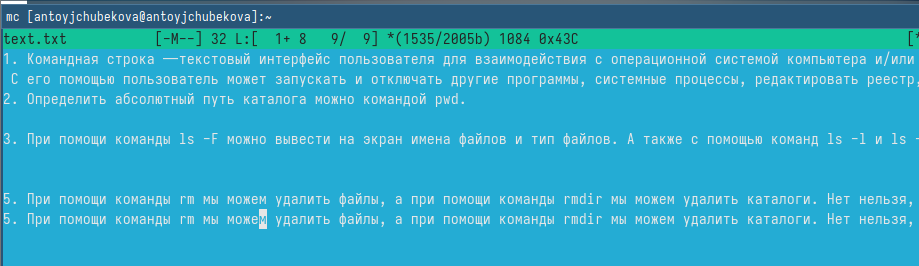

## Выполнение лабораторной работы

Выделяю третюю строку текста клавишей F3 и переношу его на новую строку клавишей F6. 

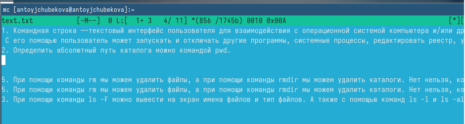

## Выполнение лабораторной работы

Созраняю файл клавишей F2.

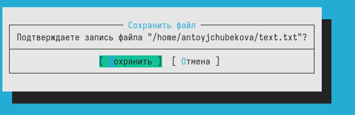

## Выполнение лабораторной работы

С помощью комбинации клавиш Ctrl+u отменяю все действия и возвращаю текст в исходный вид. 

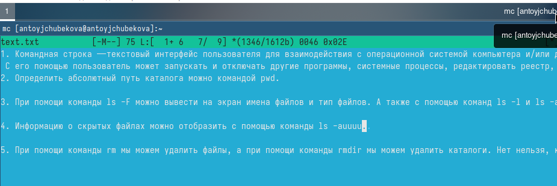

## Выполнение лабораторной работы

Перехожу в начало файла используя комбинацию клавиш ctrl+z перепрыгивая каждое слово и оставляю некоторый текст "Привет мир".

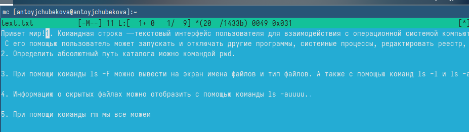

## Выполнение лабораторной работы

Перехожу в конец файла используя комбинацию клавиш ctrl+x перепрыгивая каждое слово и оставляю некоторый текст "До свидания мир".

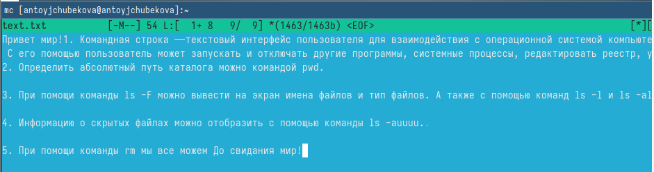

## Выполнение лабораторной работы

Сохраняю и закрываю файл.

Открываю файл с исходнфм текстом на языке с++  и вижу, что текст без подсветки синтаксиса. 

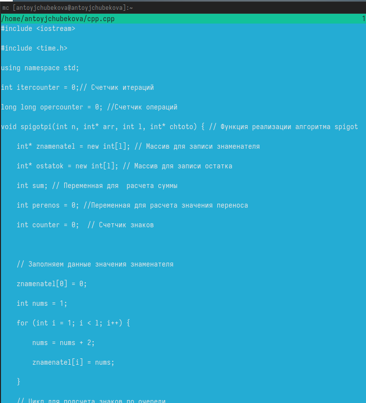

## Выполнение лабораторной работы

Используя меню редактора, включаю подсветку синтаксиса.

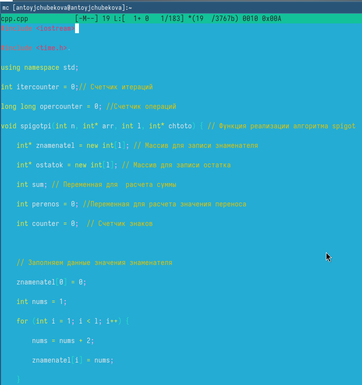

## Выводы
В ходе лабораторной работы № 9 я освоила основные возможности командной оболочки Midnight Commander.  Также приобрела навыков практической работы по просмотру каталогов и файлов; манипуляций
с ними.

