---
## Front matter
title: "Лабораторная работа №9"
subtitle: "Операционные системы"
author: "Тойчубекова Асель Нурлановна"

## Generic otions
lang: ru-RU
toc-title: "Содержание"

## Bibliography
bibliography: bib/cite.bib
csl: pandoc/csl/gost-r-7-0-5-2008-numeric.csl

## Pdf output format
toc: true # Table of contents
toc-depth: 2
lof: true # List of figures
lot: true # List of tables
fontsize: 12pt
linestretch: 1.5
papersize: a4
documentclass: scrreprt
## I18n polyglossia
polyglossia-lang:
  name: russian
  options:
	- spelling=modern
	- babelshorthands=true
polyglossia-otherlangs:
  name: english
## I18n babel
babel-lang: russian
babel-otherlangs: english
## Fonts
mainfont: PT Serif
romanfont: PT Serif
sansfont: PT Sans
monofont: PT Mono
mainfontoptions: Ligatures=TeX
romanfontoptions: Ligatures=TeX
sansfontoptions: Ligatures=TeX,Scale=MatchLowercase
monofontoptions: Scale=MatchLowercase,Scale=0.9
## Biblatex
biblatex: true
biblio-style: "gost-numeric"
biblatexoptions:
  - parentracker=true
  - backend=biber
  - hyperref=auto
  - language=auto
  - autolang=other*
  - citestyle=gost-numeric
## Pandoc-crossref LaTeX customization
figureTitle: "Рис."
tableTitle: "Таблица"
listingTitle: "Листинг"
lofTitle: "Список иллюстраций"
lotTitle: "Список таблиц"
lolTitle: "Листинги"
## Misc options
indent: true
header-includes:
  - \usepackage{indentfirst}
  - \usepackage{float} # keep figures where there are in the text
  - \floatplacement{figure}{H} # keep figures where there are in the text
---

# Цель работы

Целью данной лабораторной работы является освоение основных возможностей командной оболочки Midnight Commander.  Также приобретение навыков практической работы по просмотру каталогов и файлов; манипуляций
с ними.

# Задание

## Выполнить задания по mc

1. Изучите информацию о mc, вызвав в командной строке man mc.
2. Запустите из командной строки mc, изучите его структуру и меню
3. Выполните несколько операций в mc, используя управляющие клавиши (операции
с панелями; выделение/отмена выделения файлов, копирование/перемещение файлов, получение информации о размере и правах доступа на файлы и/или каталоги
и т.п.)
4. Выполните основные команды меню левой (или правой) панели. Оцените степень
подробности вывода информации о файлах.
5. Используя возможности подменю Файл , выполните:
– просмотр содержимого текстового файла;
– редактирование содержимого текстового файла (без сохранения результатов
редактирования);
– создание каталога;
– копирование в файлов в созданный каталог.
6. С помощью соответствующих средств подменю Команда осуществите:
– поиск в файловой системе файла с заданными условиями (например, файла
с расширением .c или .cpp, содержащего строку main);
– выбор и повторение одной из предыдущих команд;
– переход в домашний каталог;
– анализ файла меню и файла расширений.
7. Вызовите подменю Настройки . Освойте операции, определяющие структуру экрана mc
(Full screen, Double Width, Show Hidden Files и т.д.).

## Выполнить задания по встроенному редактору

1. Создайте текстовой файл text.txt.
2. Откройте этот файл с помощью встроенного в mc редактора.
3. Вставьте в открытый файл небольшой фрагмент текста, скопированный из любого
другого файла или Интернета.
4. Проделайте с текстом следующие манипуляции, используя горячие клавиши:
4.1. Удалите строку текста.
4.2. Выделите фрагмент текста и скопируйте его на новую строку1. Создайте текстовой файл text.txt.
2. Откройте этот файл с помощью встроенного в mc редактора.
3. Вставьте в открытый файл небольшой фрагмент текста, скопированный из любого
другого файла или Интернета.
4. Проделайте с текстом следующие манипуляции, используя горячие клавиши:
4.1. Удалите строку текста.
4.2. Выделите фрагмент текста и скопируйте его на новую строку
4.3. Выделите фрагмент текста и перенесите его на новую строку.
4.4. Сохраните файл.
4.5. Отмените последнее действие.
4.6. Перейдите в конец файла (нажав комбинацию клавиш) и напишите некоторый
текст.
4.7. Перейдите в начало файла (нажав комбинацию клавиш) и напишите некоторый
текст.
4.8. Сохраните и закройте файл.
5. Откройте файл с исходным текстом на некотором языке программирования (например C или Java)
6. Используя меню редактора, включите подсветку синтаксиса, если она не включена,
или выключите, если она включена.

# Теоретическое введение 

Командная оболочка — интерфейс взаимодействия пользователя с операционной системой и программным обеспечением посредством команд.
Midnight Commander (или mc) — псевдографическая командная оболочка для UNIX/Linux
систем. Для запуска mc необходимо в командной строке набрать mc и нажать Enter .
Рабочее пространство mc имеет две панели, отображающие по умолчанию списки
файлов двух каталогов. 

Над панелями располагается меню, доступ к которому осуществляется с помощью
клавиши F9 . Под панелями внизу расположены управляющие экранные кнопки, ассоциированные с функциональными клавишами F1 – F10 (табл. 7.1). Над ними располагается
командная строка, предназначенная для ввода команд.

Некоторые из основных возможностей командной оболочки MC включают:

1. Управление файлами и каталогами: копирование, перемещение, удаление, переименование и создание.
2. Редактирование файлов: открытие, сохранение и поиск по содержимому.
3. Запуск программ и команд.
4. Просмотр и управление процессами.
5. Доступ к системной информации, такой как использование памяти и дискового пространства.
6. Настройка внешнего вида и поведения MC с помощью файла конфигурации.

MC также поддерживает ряд расширений и плагинов, которые могут расширить функциональность и добавить новые функции, такие как поддержка архивов, просмотр изображений и управление сетевыми подключениями.

В целом, командная оболочка Midnight Commander - это мощный и универсальный инструмент для работы с файловой системой и командной строкой, который популярен среди системных администраторов, разработчиков и других опытных пользователей.

# Выполнение лабораторной работы

Для начала изучаю информацию о mc, вызвав в командной строке команду man mc (рис. [-@fig:001]).

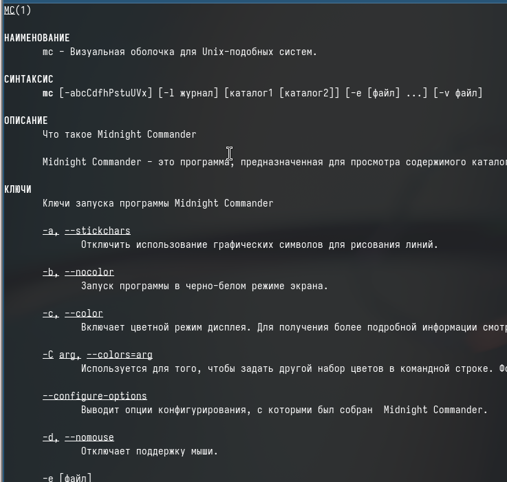{#fig:001 width=70%}

Запускаю из командной строки mc и изучпю его структуру и меню. (рис. [-@fig:002]).

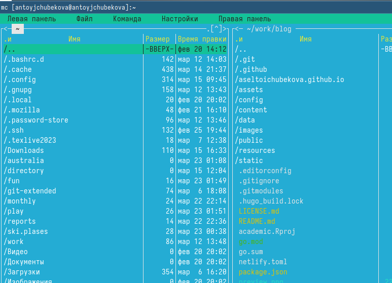{#fig:002 width=70%}

С помощью стрелочки влево вправо я могу перемещаться по директориям, а с помощью стрелочек вверх и вниз перебирать файлы в директории, в которой нахожусь. (рис. [-@fig:003]).

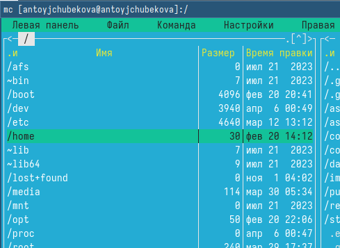{#fig:003 width=70%}

С помощью клавиши F5 копирую файл file.txt в каталог monthly, используя два окна паели mc. (рис. [-@fig:004]) Далее мы видим, что файл был удачно скопирован. (рис. [-@fig:005]).

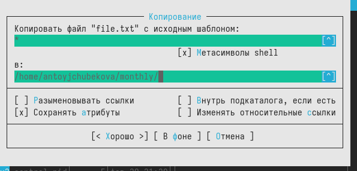{#fig:004 width=70%}

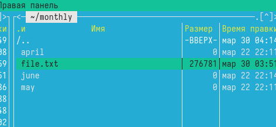{#fig:005 width=70%}

Используя клавишу F6 перемещаю файл conf.txt в каталог monthly.(рис. [-@fig:006]) Затем мы видим, что файл был успешно перенесен, в домашнем каталоге его уже нет. (рис. [-@fig:007])

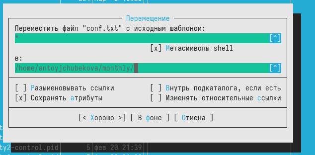{#fig:006 width=70%}

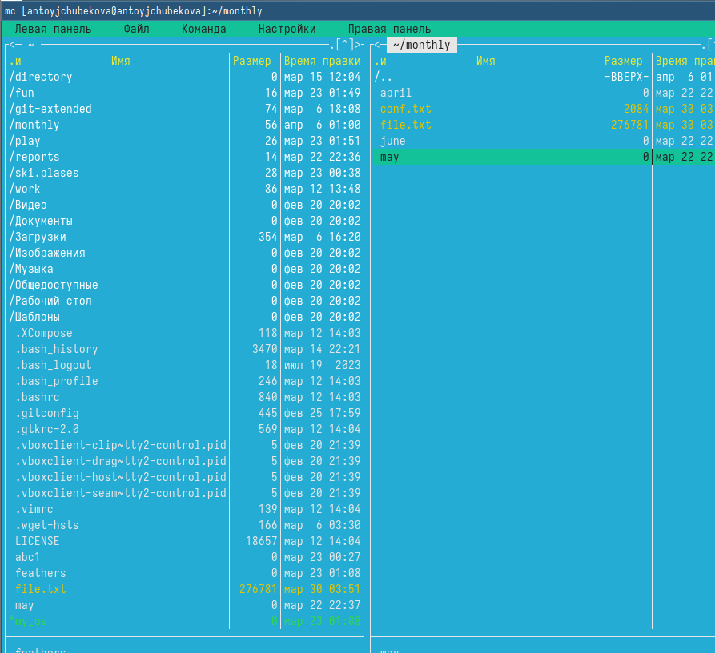{#fig:007 width=70%}

Вывожу информацию о файле, используя команду меню правой понели. В итоге получаю информацию больше чем при выводе команды ls-l. (рис. [-@fig:008]).

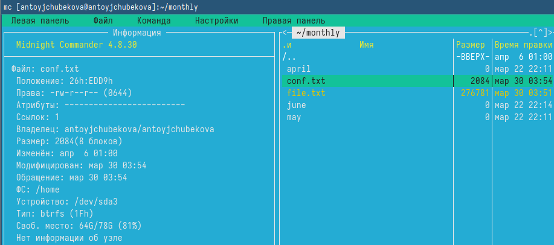{#fig:008 width=70%}

Также пользуясь командой меню правой понели, вывожу информацию о правах доступа файла и возможность ее редактирования. (рис. [-@fig:009]).

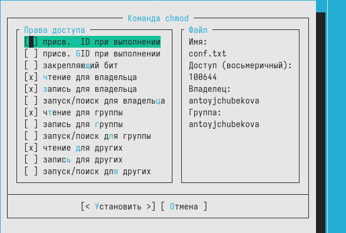{#fig:009 width=70%}

В правой понели команда "Быстрый просмотр" отвечает за просмотр содержимого файла, пременяя ее просматриваю содержимое файла conf.txt. (рис. [-@fig:010]).

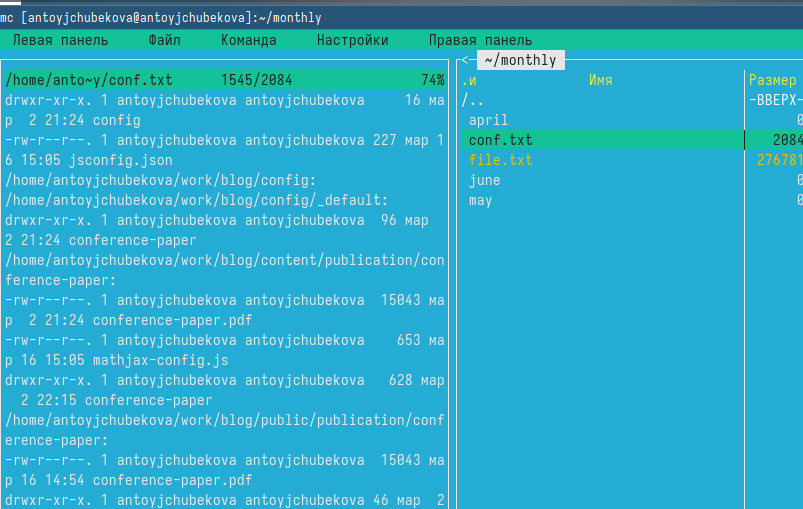{#fig:010 width=70%}

Используя возможности подменю "Файл" я просмиотрела содержимое текстового файла conf.txt. (рис. [-@fig:011]).

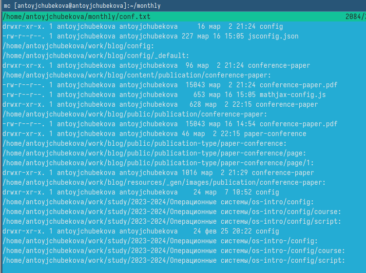{#fig:011 width=70%}

Открыла файл на изменения, поменяла пару строк и закрыла файл без сохранения. (рис. [-@fig:012]).

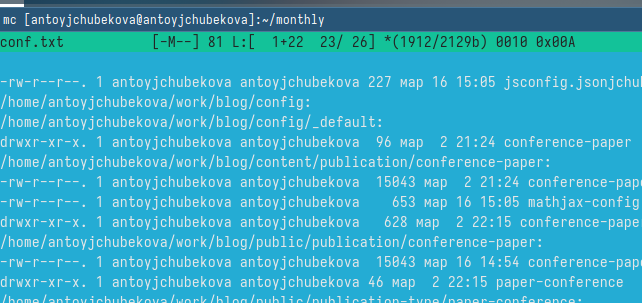{#fig:012 width=70%}

Создаю новый каталог privet. (рис. [-@fig:013]).

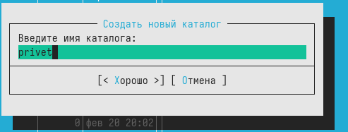{#fig:013 width=70%}

Копирую файл в созданный каталог. (рис. [-@fig:014]). Перейдя в каталог privet на правой панели мы видим, что файл был успешно скопирован.(рис. [-@fig:015]).

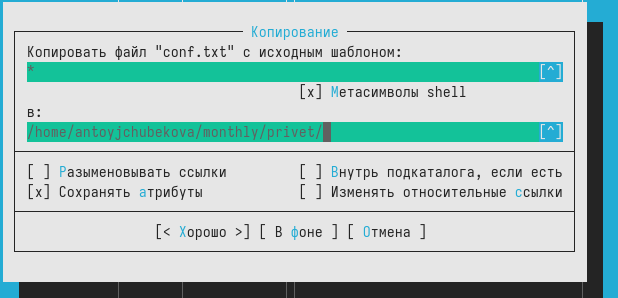{#fig:014 width=70%}

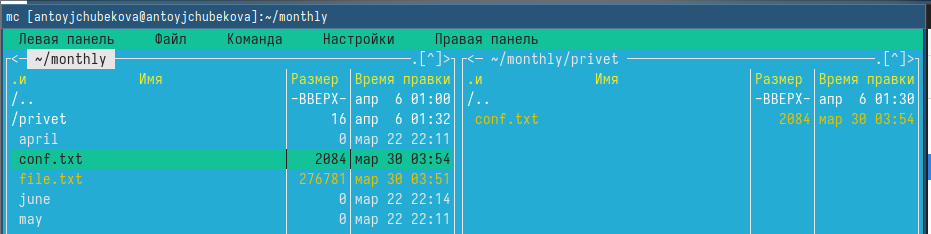{#fig:015 width=70%}

С помощью средств подменю "Команда" осуществляю поиск  в файловой системе файл с расширением txt. (рис. [-@fig:016] и рис. [-@fig:017] ) .

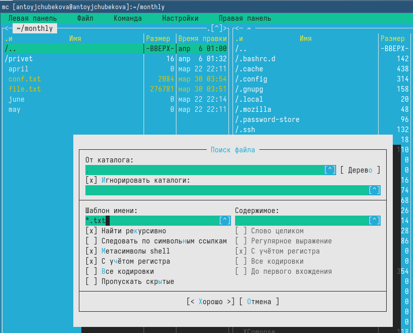{#fig:016 width=70%}

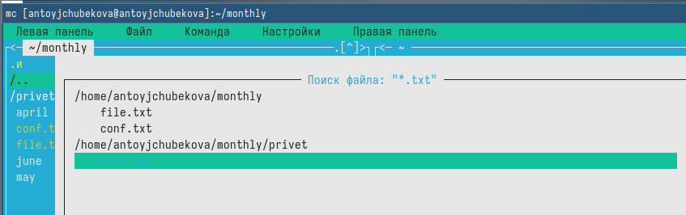{#fig:017 width=70%}

С помощью тех же средств подменю "Команда" просматриваю историю команд и повторяю одну из них, то есть создаю новый файл sun. (рис. [-@fig:018] и рис. [-@fig:019] ) .

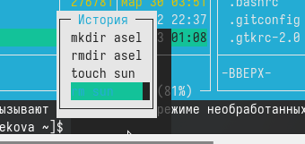{#fig:018 width=70%}

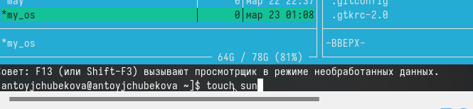{#fig:019 width=70%}

Можно перемещаться между директориями, я перемещусь в домашнюю, используя дерево каталогов. (рис. [-@fig:020]).

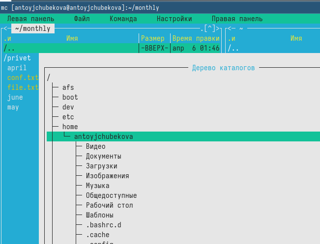{#fig:020 width=70%}

Провожу анализ файлов меню.(рис. [-@fig:021]) и файла расширений.(рис. [-@fig:022])

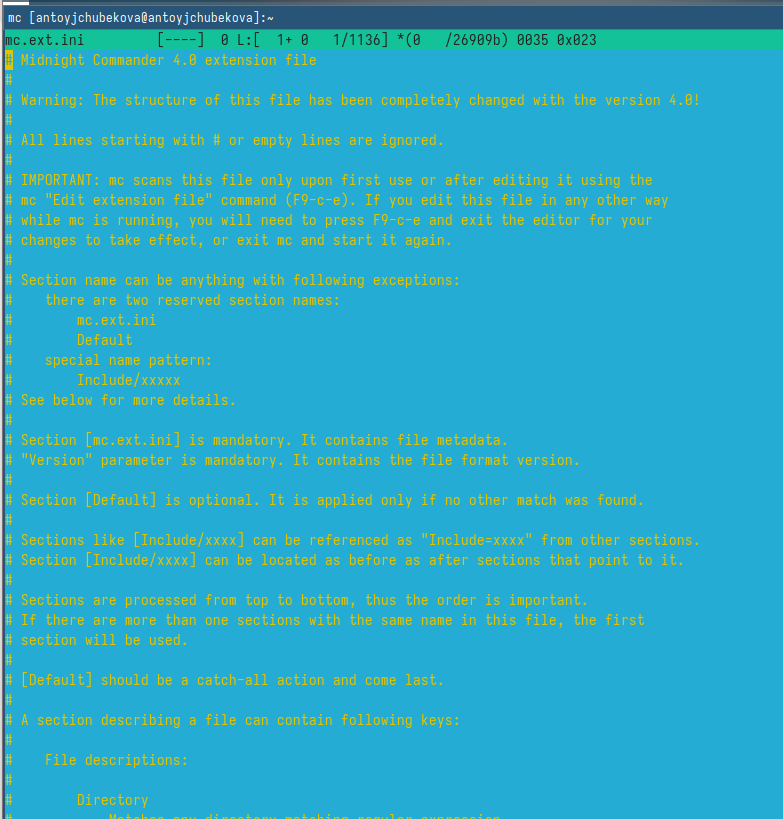{#fig:021 width=70%}

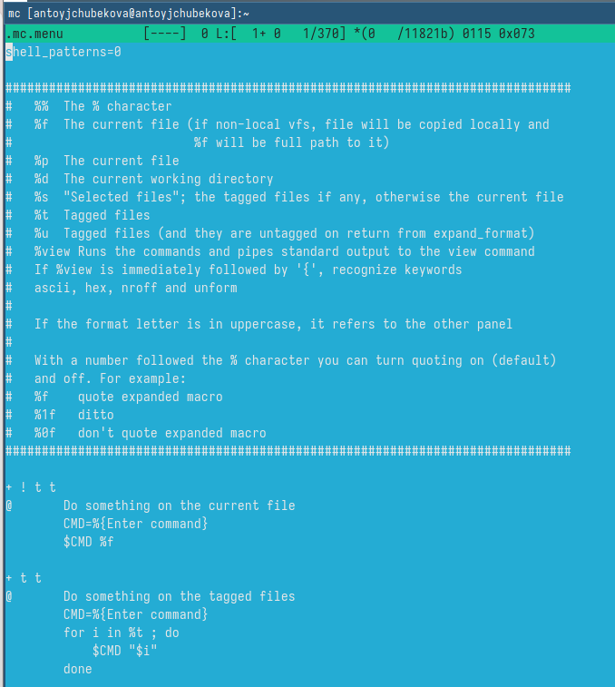{#fig:022 width=70%}

Вызываю подменю "Настройки" и вывожу на экран инфоормацию о параметрах конфигурации (рис. [-@fig:023]), о внешнем виде (рис. [-@fig:024]), о настройках понели(рис. [-@fig:025]).

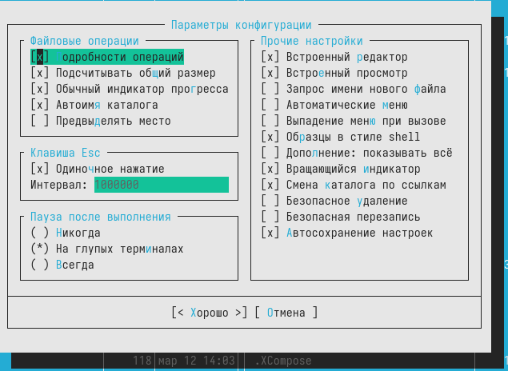{#fig:023 width=70%}

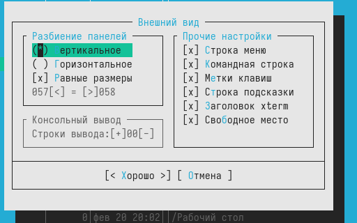{#fig:024 width=70%}

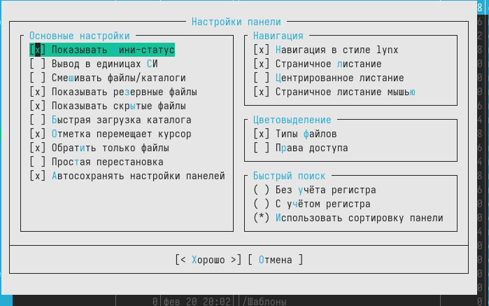{#fig:025 width=70%}

Создаю текстовый файл text.txt. (рис. [-@fig:026]).

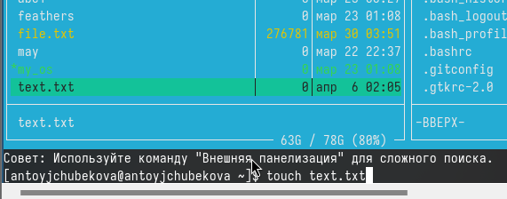{#fig:026 width=70%}

Открываю этот файл с помощью встроенного в mc редактора, используя  клавишу F4 и вставляю в открытый файл небольшой фрагмент текста, скопированный из прошлой лабораторной работы. (рис. [-@fig:027]).

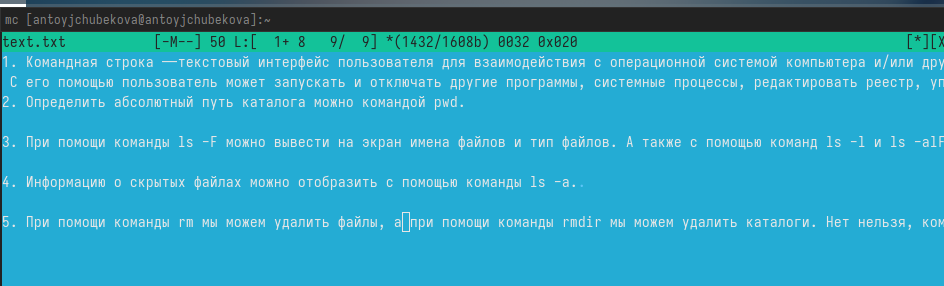{#fig:027 width=70%}

С помощью комбинации клавиш Ctrl+y удаляю четвертую строку в данном тексте. (рис. [-@fig:028]).

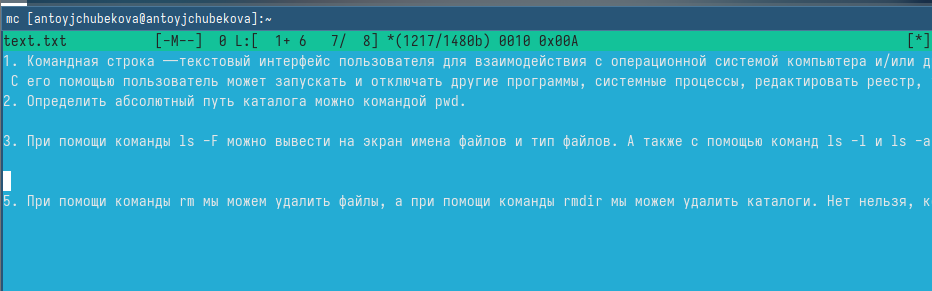{#fig:028 width=70%}

Выделяю пятую строку текста, используя клавишу F3 для выделения и F5 для копирования, и копирую его на новую строку. (рис. [-@fig:029]).

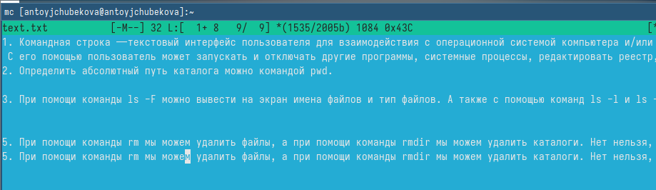{#fig:029 width=70%}

Выделяю третюю строку текста клавишей F3 и переношу его на новую строку клавишей F6. (рис. [-@fig:030])

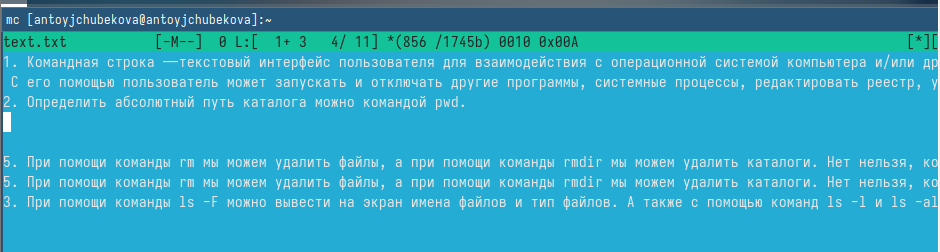{#fig:030 width=70%}

Созраняю файл клавишей F2. (рис. [-@fig:031]).

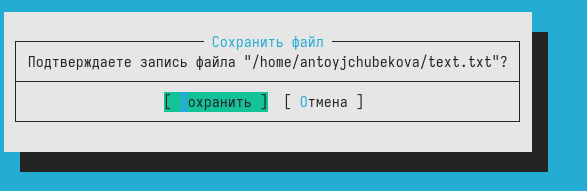{#fig:031 width=70%}

С помощью комбинации клавиш Ctrl+u отменяю все действия и возвращаю текст в исходный вид. (рис. [-@fig:032]).

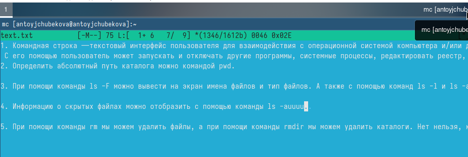{#fig:032 width=70%}

Перехожу в начало файла используя комбинацию клавиш ctrl+z перепрыгивая каждое слово и оставляю некоторый текст "Привет мир" (рис. [-@fig:033]).

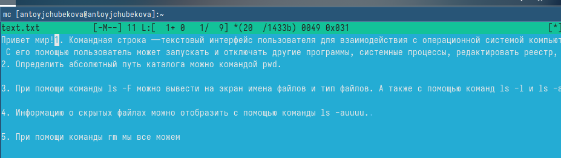{#fig:033 width=70%}

Перехожу в конец файла используя комбинацию клавиш ctrl+x перепрыгивая каждое слово и оставляю некоторый текст "До свидания мир" (рис. [-@fig:034]).

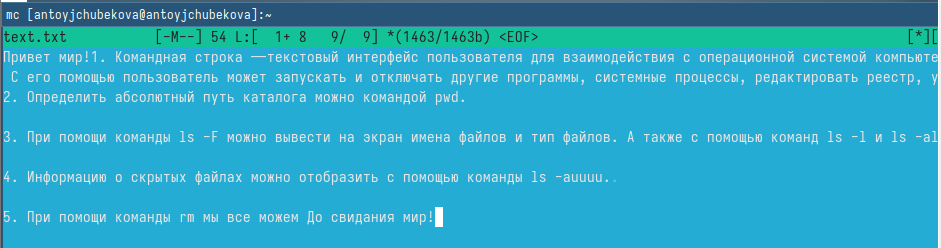{#fig:034 width=70%}

Сохраняю и закрываю файл.

Открываю файл с исходнфм текстом на языке с++  и вижу, что текст без подсветки синтаксиса. (рис. [-@fig:035]).

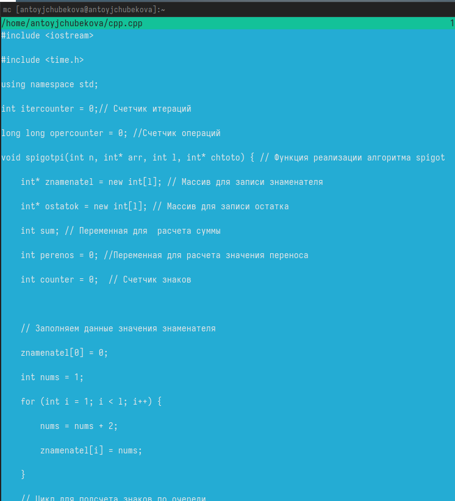{#fig:035 width=70%}

Используя меню редактора, включаю подсветку синтаксиса. (рис. [-@fig:036]).

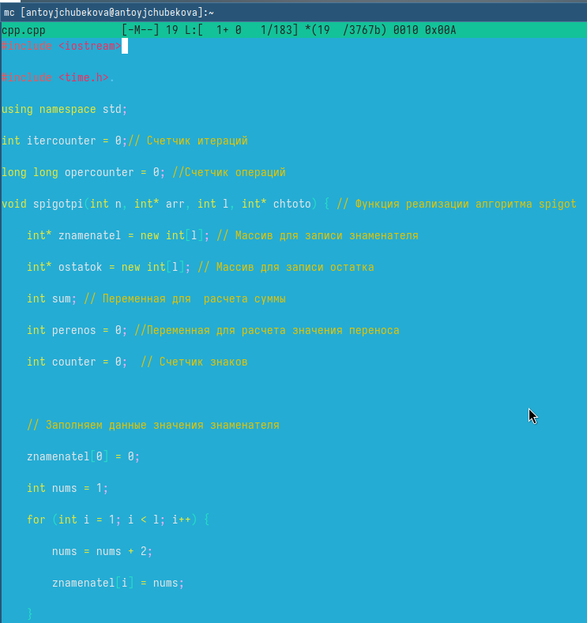{#fig:036 width=70%}

# Отеты на вопросы

1. Midnight Commander имеет два основных режима работы:

Командный режим: в этом режиме пользователь вводит команды с клавиатуры для выполнения различных операций, таких как копирование, перемещение, удаление файлов и т. д. Этот режим подразумевает ввод команд в командной строке и использование сочетаний клавиш для навигации по файловой системе. \

Режим редактирования: этот режим позволяет пользователю открыть и редактировать файлы непосредственно в интерфейсе Midnight Commander. В этом режиме можно использовать редактор nano или другие встроенные текстовые редакторы для изменения содержимого файлов. \

2. Копирование файла: \
Через команды shell: для копирования файла можно нажать клавишу F5 / Esc, затем указать папку, куда нужно скопировать файл. \
Перемещение файла: 
Через команды shell: для перемещения файла можн нажать клавишу F6 / F6, затем указать папку, куда нужно переместить файл \
Удаление файла: \
Через команды shell: для удаления файла можно использовать команду rm
Через меню mc: выделить файл, нажать клавишу F8 / F8 \
Переименование файла: \
Через команды shell: для переименования файла можно использовать команду mv old_name new_name
Через меню mc: выделить файл, нажать клавишу F6 / F6, затем ввести новое имя файла \
Создание нового файла: \ 
Через команды shell: для создания нового файла можно использовать команду touch new_file
Через меню mc: в меню выбрать пункт "File", затем "New"

3. В меню каждой (левой или правой) панели можно выбрать Формат списка:
- стандартный выводит список файлов и каталогов с указанием размера и времени правки; 
- ускоренный — позволяет задать число столбцов, на которые разбивается панель при выводе списка имён файлов или каталогов без дополнительной информации; 
- расширенный — помимо названия файла или каталога выводит сведения о правах доступа, владельце, группе, размере, времени правки; 
- определённый пользователем — позволяет вывести те сведения о файле или каталоге, которые задаст сам пользователь.

4.  В меню Файл содержит перечень команд, которые могут быть применены к одному
или нескольким файлам или каталогам.
Команды меню Файл: 
- Просмотр ( F3 ) — позволяет посмотреть содержимое текущего (или выделенного) файла без возможности редактирования. 
- Просмотр вывода команды ( М + ! ) — функция запроса команды с параметрами (аргумент к текущему выбранному файлу). 
- Правка ( F4 ) — открывает текущий (или выделенный) файл для его редактирования.
-  Копирование ( F5 ) — осуществляет копирование одного или нескольких файлов или каталогов в указанное пользователем во всплывающем окне место.
- Права доступа ( Ctrl-x c )— позволяет указать(изменить) права доступа к одному или нескольким файлам или каталогам . 
- Жёсткая ссылка ( Ctrl-x l ) — поволяет создать жёсткую ссылку к текущему (или
выделенному) файлу. 
- Символическая ссылка ( Ctrl-x s ) — позволяет создать символическую ссылку к текущему (или выделенному) файлу. 
- Владелец/группа ( Ctrl-x o ) — позволяет задать (изменить) владельца и имя группы для одного илинескольких файлов или каталогов. 
- Права (расширенные) — позволяет изменить права доступа и владения для одного или нескольких файлов или каталогов. 
- Переименование ( F6 ) — позволяет переименовать (или переместить) один или несколько файлов или каталогов. 
- Создание каталога ( F7 ) — позволяет создать каталог. 
- Удалить ( F8 ) — позволяет удалить один или несколько файлов или каталогов. 
- Выход ( F10 ) — завершает работу mc.

5. В меню Команда содержатся более общие команды для работы с mc. Команды
меню Команда:
- Дерево каталогов — отображает структуру каталогов системы.
- Поиск файла — выполняет поиск файлов по заданным параметрам.
- Переставить панели — меняет местами левую и правую панели.
- Сравнить каталоги ( Ctrl-x d ) — сравнивает содержимое двух каталогов.
- Размеры каталогов — отображает размер и время изменения каталога (по
умолчанию в mc размер - каталога корректно не отображается).

- История командной строки — выводит на экран список ранее выполненных в оболочке команд.
- Каталоги быстрого доступа ( Ctrl- ) — пр вызове выполняется быстрая смена текущего каталога на один из заданного списка.
- Восстановление файлов — позволяет восстановить файлы на файловых системах ext2 и ext3.
- Редактировать файл расширений — позволяет задать с помощью определённого синтаксиса действия при запуске файлов с определённым расширением (например, какое программного обеспечение запускать для открытия или редактирования файлов с расширением doc или docx).
- Редактировать файл меню — позволяет отредактировать контекстное меню
пользователя, вызываемое по клавише F2 .
- Редактировать файл расцветки имён — позволяет подобрать оптимальную
для пользователя расцветку имён файлов в зависимости от их типа.

6. Меню Настройки содержит ряд дополнительных опций по внешнему виду и
функциональности mc. Меню Настройки содержит: 
- Конфигурация — позволяет скорректировать настройки работы с панелями. 
- Внешний вид и Настройки панелей — определяет элементы (строка меню, командная строка, подсказки и прочее), отображаемые при вызове mc, а также геометрию расположения панелей и цветовыделение. 
- Биты символов — задаёт формат обработки информации локальным терминалом. 
- Потверждение — позволяет установить или убрать вывод окна с запросом подтверждения действий при операциях удаления и перезаписи файлов, а также при выходе из программы. 
- Виртуальные ФС – настройки виртуальной файловой системы: тайм-аут, пароль и прочее.

7.  F1 Вызов контекстно-зависимой подсказки;
- F2 Вызов пользовательского меню с возможностью создания и/или дополнения дополнительных функций;
- F3 Просмотр содержимого файла, на который указывает подсветка в активной панели (без возможности редактирования);
- F4 Вызов встроенного в mc редактора для изменения содержания файла, на который указывает подсветка в активной панели;
- F5 Копирование одного или нескольких файлов, отмеченных в первой (активной) панели, в каталог, отображаемый на второй панели;
- F6 Перенос одного или нескольких файлов, отмеченных в первой (активной) панели, в каталог, отображаемый на второй панели;
- F7 Создание подкаталога в каталоге, отображаемом в активной панели;
- F8 Удаление одного или нескольких файлов (каталогов), отмеченных в первой (активной панели файлов;
- F9 Вызов меню mc;
- F10 Выход из mc;

8.  Ctrl-y удалить строку;
- Ctrl-u отмена последней операции; Ins вставка/замена;
- F7 поиск (можно использовать регулярные выражения);
- (стрелочка вверх)-F7 повтор последней операции поиска;
- F4 замена;
- F3 первое нажатие — начало выделения,
- второе — окончание выделения;
- F5 копировать выделенный фрагмент;
- F6 переместить выделенный фрагмент;
- F8 удалить выделенный фрагмент;
- записать изменения в файл;
- F10 выйти из редактора.

9. Можете сохранить часто используемые команды панелизации под отдельными
информативными именами, чтобы иметь возможность их быстро вызвать по
этим именам.Для этого нужно набрать команду в строке ввода (строка “Команда”)
и нажать кнопку Добавить. После этого потребуется ввести имя, по которому
мы будем вызывать команду. В следующий раз вам достаточно будет выбрать
нужное имя из списка, а не вводить всю команду заново.

10. Панель в mc отображает список файлов текущего каталога. Абсолютный путь к
этому каталогу отображается в заголовке панели. У активной панели заголовок
и одна из её строк подсвечиваются. Управление панелями осуществляется с
помощью определённых комбинаций клавиш или пунктов меню mc.

# Выводы
В ходе лабораторной работы № 9 я освоила основные возможности командной оболочки Midnight Commander.  Также приобрела навыков практической работы по просмотру каталогов и файлов; манипуляций
с ними.
