---
## Front matter
lang: ru-RU
title: Лабораторная работа №10
subtitle: Опрерационные системы
author:
  - Тойчубекова Асель Нурлановна
institute:
  - Российский университет дружбы народов, Москва, Россия
date: 12 апреля 2024

## i18n babel
babel-lang: russian
babel-otherlangs: english

## Formatting pdf
toc: false
toc-title: Содержание
slide_level: 2
aspectratio: 169
section-titles: true
theme: metropolis
header-includes:
 - \metroset{progressbar=frametitle,sectionpage=progressbar,numbering=fraction}
 - '\makeatletter'
 - '\beamer@ignorenonframefalse'
 - '\makeatother'
 
## Fonts
mainfont: PT Serif
romanfont: PT Serif
sansfont: PT Sans
monofont: PT Mono
mainfontoptions: Ligatures=TeX
romanfontoptions: Ligatures=TeX
sansfontoptions: Ligatures=TeX,Scale=MatchLowercase
monofontoptions: Scale=MatchLowercase,Scale=0.9
 
---

# Информация

## Докладчик

:::::::::::::: {.columns align=center}
::: {.column width="70%"}

  * Тойчубекова Асель Нурлановна
  * Студент НПИбд-02-23
  * факультет физико-математических и естественных наук.
  * Российский университет дружбы народов
  * [1032235033@pfur.ru](1032235033@pfur.ru)
  * <https://aseltoichubekova.github.io/ru/>

:::
::: {.column width="30%"}

:::
::::::::::::::

## Цель работы

Целью данной лабораторной работы является познакомиться с операционной системой Линукс. Получить практические навыки работы с редактором vi, установленным по умолчанию практичнски во всех дистрибутивах.

## Задание

1. Ознакомиться с теоретическим материалом.
2. Ознакомиться с редактором vi
3. Выполнить упражнения, используя команду vi.

# Теоретическое введение

## Теоретическое введение

В большинстве дистрибутивов Linux в качестве текстового редактора по умолчанию устанавливается интерактивный экранный редактор vi (Visual display editor).\
Редактор vi имеет три режима работы: \
–командный режим — предназначен для ввода команд редактирования и навигации по редактируемому файлу; \
– режим вставки — предназначен для ввода содержания редактируемого файла; \
– режим последней (или командной) строки — используется для записи изменений в файл и выхода из редактора.\

## Теоретическое введение

Для вызова редактора vi необходимо указать команду vi и имя редактируемого файла: vi <имя_файла>. При этом в случае отсутствия файла с указанным именем будет создан такой файл. Переход в командный режим осуществляется нажатием клавиши Esc . Для выхода из редактора vi необходимо перейти в режим последней строки: находясь в командном режиме, нажать Shift-; (по сути символ : — двоеточие), затем: \
– набрать символы wq, если перед выходом из редактора требуется записать изменения в файл; \
– набрать символ q (или q!), если требуется выйти из редактора без сохранения.

## Теоретическое введение

Существуют команды для редактирования исходного текста, которые  помощью букв или символом преобразуют текст:
- Команды управление курсором; \
- Команды позиционирования; \
- Команды перемещения по файлу; \
- Команды перемешение по словам; \
- Команды вставка теста; \
- Команды удаления текста; \
- команды отмена и повтор произведенных изменений; \
- Команда Копирования текста в буфер; \
- Команда Замена текста; \
- Команда Поиск теста;  \
- Команда Копирование и перемещение текста; \
- Команда Запись в файл и выход из редактора;\
- Команда Опции.

# Выполнение лабораторной работы

## Выполнение лабораторной работы

Для начала создаю  каталог с именем ~work/os/lab10, где буду дальше работать 

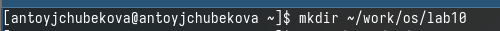

## Выполнение лабораторной работы

Перехожу во вновь созданный каталог и вызываю vi, создав файл hello.sh 

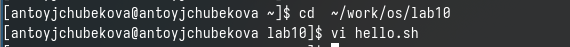

## Выполнение лабораторной работы

Нажимаю клавишу i, чтобы перейти в режим вставки и ввожу в него данный в лабораторной текст программы. 

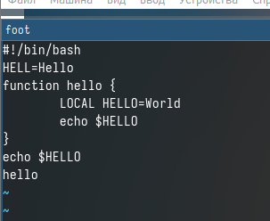

## Выполнение лабораторной работы

Нажимаю Esc для перехода в командный режим после завершения ввода текста и нажимаю : для перехода в режим пследней строки и нажимаю w-для записи , и q-для созранения, нажимаю Enter, тем самым сохраняю изменения. 

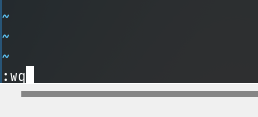

## Выполнение лабораторной работы

Создаю испольняемый файл. 

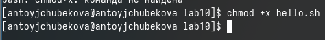

## Выполнение лабораторной работы

Вызываю vi на редактирование файла и устанавиваю курсор в конец слова HELL второй строки, используя 2g-для перехода на вторую строку, и w-для перехода в конец слова и меняю на Hello, перейдя в режим вставки. 

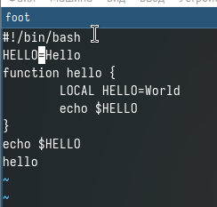

## Выполнение лабораторной работы

Устанавливаю курсор на четвертую строку с 4g и удалю слово LOCAL c dw.

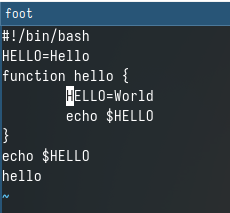

## Выполнение лабораторной работы

Перехожу в режим вставки и набераю local, нажимаю Esc для возврата в командный режим. 

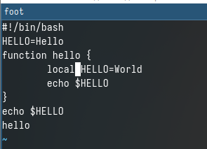

## Выполнение лабораторной работы

Устанавливаю курсор на последней строке файла с 8g. Вставлляю после нее строку с a "echo $HELLO". 

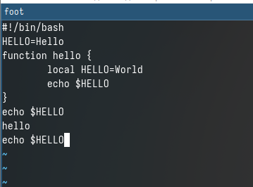

## Выполнение лабораторной работы

Нажимаю Esc для перехода в командный режим и удаляю последнюю строку с dd. 

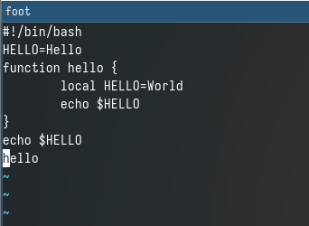 

## Выполнение лабораторной работы

Ввожу команду отмены изменений u для отмены поледней команды. 

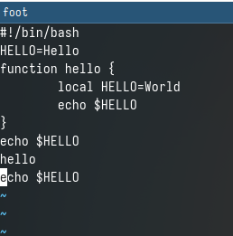

## Выполнение лабораторной работы

Перехожу в режим последней строки и записываю произведенные изменения и выхожу из vi. 

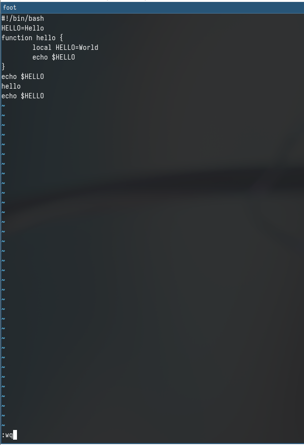

## Выполнение лабораторной работы

Далее можно запустить исполняемый файл и посмотреть, что программа работает корректно. 

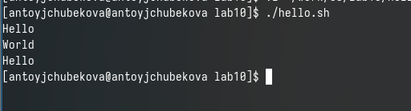

## Выводы

В ходе выполнения лабораторной работы №10 я познакомилась с операционной системой Линукс. Получила практические навыки работы с редактором vi, установленным по умолчанию практичнски во всех дистрибутивах.

