---
## Front matter
title: "Лабораторная рабоат №10"
subtitle: "Операционные системы"
author: "Тойчубекова Асель Нуралановна"

## Generic otions
lang: ru-RU
toc-title: "Содержание"

## Bibliography
bibliography: bib/cite.bib
csl: pandoc/csl/gost-r-7-0-5-2008-numeric.csl

## Pdf output format
toc: true # Table of contents
toc-depth: 2
lof: true # List of figures
lot: true # List of tables
fontsize: 12pt
linestretch: 1.5
papersize: a4
documentclass: scrreprt
## I18n polyglossia
polyglossia-lang:
  name: russian
  options:
	- spelling=modern
	- babelshorthands=true
polyglossia-otherlangs:
  name: english
## I18n babel
babel-lang: russian
babel-otherlangs: english
## Fonts
mainfont: PT Serif
romanfont: PT Serif
sansfont: PT Sans
monofont: PT Mono
mainfontoptions: Ligatures=TeX
romanfontoptions: Ligatures=TeX
sansfontoptions: Ligatures=TeX,Scale=MatchLowercase
monofontoptions: Scale=MatchLowercase,Scale=0.9
## Biblatex
biblatex: true
biblio-style: "gost-numeric"
biblatexoptions:
  - parentracker=true
  - backend=biber
  - hyperref=auto
  - language=auto
  - autolang=other*
  - citestyle=gost-numeric
## Pandoc-crossref LaTeX customization
figureTitle: "Рис."
tableTitle: "Таблица"
listingTitle: "Листинг"
lofTitle: "Список иллюстраций"
lotTitle: "Список таблиц"
lolTitle: "Листинги"
## Misc options
indent: true
header-includes:
  - \usepackage{indentfirst}
  - \usepackage{float} # keep figures where there are in the text
  - \floatplacement{figure}{H} # keep figures where there are in the text
---

# Цель работы

Целью данной лабораторной работы является познакомиться с операционной системой Линукс. Получить практические навыки работы с редактором vi, установленным по умолчанию практичнски во всех дистрибутивах.

# Задание

1. Ознакомиться с теоретическим материалом.
2. Ознакомиться с редактором vi
3. Выполнить упражнения, используя команду vi.

# Теоретическое введение

В большинстве дистрибутивов Linux в качестве текстового редактора по умолчанию устанавливается интерактивный экранный редактор vi (Visual display editor).\
Редактор vi имеет три режима работы: \
–командный режим — предназначен для ввода команд редактирования и навигации по редактируемому файлу; \
– режим вставки — предназначен для ввода содержания редактируемого файла; \
– режим последней (или командной) строки — используется для записи изменений в файл и выхода из редактора.\

Для вызова редактора vi необходимо указать команду vi и имя редактируемого файла: vi <имя_файла>. При этом в случае отсутствия файла с указанным именем будет создан такой файл. Переход в командный режим осуществляется нажатием клавиши Esc . Для выхода из редактора vi необходимо перейти в режим последней строки: находясь в командном режиме, нажать Shift-; (по сути символ : — двоеточие), затем: \
– набрать символы wq, если перед выходом из редактора требуется записать изменения в файл; \
– набрать символ q (или q!), если требуется выйти из редактора без сохранения.

Существуют команды для редактирования исходного текста, которые  помощью букв или символом преобразуют текст:
- Команды управление курсором; \
- Команды позиционирования; \
- Команды перемещения по файлу; \
- Команды перемешение по словам; \
- Команды вставка теста; \
- Команды удаления текста; \
- команды отмена и повтор произведенных изменений; \
- Команда Копирования текста в буфер; \ \\\
- Команда Замена текста; \
- Команда Поиск теста;  \
- Команда Копирование и перемещение текста; \
- Команда Запись в файл и выход из редактора;\
- Команда Опции.

# Выполнение лабораторной работы

Для начала создаю  каталог с именем ~work/os/lab10, где буду дальше работать  (рис. [-@fig:001]).

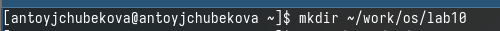{#fig:001 width=70%}

Перехожу во вновь созданный каталог и вызываю vi, создав файл hello.sh  (рис. [-@fig:002]).

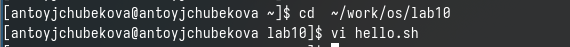{#fig:002 width=70%}

Нажимаю клавишу i, чтобы перейти в режим вставки и ввожу в него данный в лабораторной текст программы. (рис. [-@fig:003]).

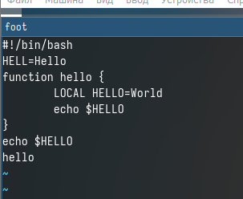{#fig:003 width=70%}

Нажимаю Esc для перехода в командный режим после завершения ввода текста и нажимаю : для перехода в режим пследней строки и нажимаю w-для записи , и q-для созранения, нажимаю Enter, тем самым сохраняю изменения. (рис. [-@fig:004]).

{#fig:004 width=70%}

Создаю испольняемый файл. (рис. [-@fig:005]).

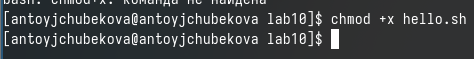{#fig:005 width=70%}

Вызываю vi на редактирование файла и устанавиваю курсор в конец слова HELL второй строки, используя 2g-для перехода на вторую строку, и w-для перехода в конец слова и меняю на Hello, перейдя в режим вставки. (рис. [-@fig:006]).

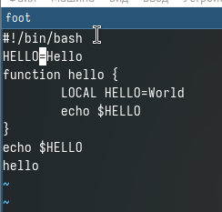{#fig:006 width=70%} 

Устанавливаю курсор на четвертую строку с 4g и удалю слово LOCAL c dw. (рис. [-@fig:007]).

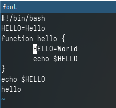{#fig:007 width=70%} 

Перехожу в режим вставки и набераю local, нажимаю Esc для возврата в командный режим. (рис. [-@fig:008]).

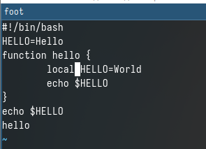{#fig:008 width=70%}

Устанавливаю курсор на последней строке файла с 8g. Вставлляю после нее строку с a "echo $HELLO". (рис. [-@fig:009]).

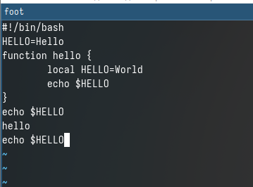{#fig:009 width=70%}

Нажимаю Esc для перехода в командный режим и удаляю последнюю строку с dd. (рис. [-@fig:010]).

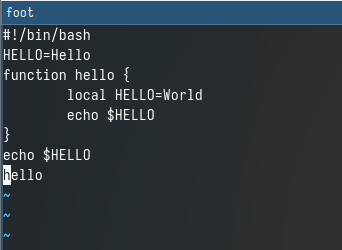{#fig:010 width=70%} 

Ввожу команду отмены изменений u для отмены поледней команды. (рис. [-@fig:011]).

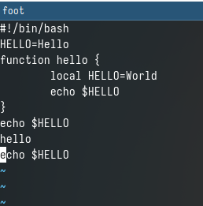{#fig:011 width=70%}

Перехожу в режим последней строки и записываю произведенные изменения и выхожу из vi. (рис. [-@fig:012]).

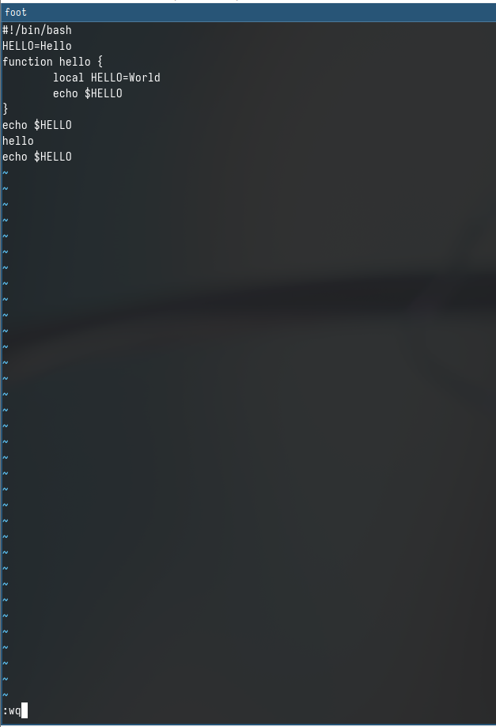{#fig:012 width=70%}

Далее можно запустить исполняемый файл и посмотреть, что программа работает корректно. (рис. [-@fig:013]).

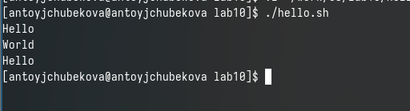{#fig:013 width=70%}

# Ответы на вопросы.

1. 
- командный режим — предназначен для ввода команд редактирования и навигации по редактируемому файлу;
- режим вставки — предназначен для ввода содержания редактируемого файла;
- режим последней (или командной) строки — используется для записи изменений в файл и выхода из редактора.

2. Можно нажимать символ q (или q!), если требуется выйти из редактора без сохранения.

3. 
- 0 (ноль) — переход в начало строки;
- $ — переход в конец строки;
- G — переход в конец файла;
- n G — переход на строку с номером n.

4. Редактор vi предполагает, что слово - это строка символов, которая может включать в себя буквы, цифры и символы подчеркивания.

5. С помощью G — переход в конец файла. 

6. 
- Вставка текста – а — вставить текст после курсора; – А — вставить текст в конец строки; – i — вставить текст перед курсором; – n i — вставить текст n
раз; – I — вставить текст в начало строки.
- Вставка строки – о — вставить строку под курсором; – О — вставить строку над курсором.
- Удаление текста – x — удалить один символ в буфер; – d w — удалить одно слово в буфер; – d $ — удалить в буфер текст от курсора до конца строки; –d 0 — удалить в буфер текст от начала строки до позиции курсора; – d d — удалить в буфер одну строку; – n d d — удалить в буфер n строк.
-  Отмена и повтор произведённых измененй – u — отменить последнее изменение; – . — повторить последнее изменение.
- Копирование текста в буфер – Y — скопировать строку в буфер; – n Y — скопировать n строк в буфер; – y w — скопировать слово в буфер.
- Вставка текста из буфера – p — вставить текст из буфера после курсора; – P - вставить текст из буфера перед курсором.
- Замена текста – c w — заменить слово; – n c w — заменить n слов; – c $ — заменить текст от курсора до конца строки; – r — заменить слово; – R — заменить текст.
- Поиск текста – / текст — произвести поиск вперёд по тексту указанной строки символов текст; – ? текст — произвести поиск назад по тексту указанной строки символов текст.

7. Перейти в режим вставки.

8. С помощью u — отменить последнее изменение

9. Режим последней строки — используется для записи изменений в файл и выхода из редактора.

10. $ — переход в конец строки

11. Опции редактора vi позволяют настроить рабочую среду. Для задания опций используется команда set (в режиме последней строки): – : set all — вывести полный список опций; – : set nu — вывести номера строк; – : set list — вывести
невидимые символы; – : set ic — не учитывать при поиске, является ли символ прописным или строчным.

12.  В редакторе vi есть два основных режима: командный режим и режим вставки. По умолчанию работа начинается в командном режиме. В режиме вставки клавиатура используется для набора текста. Для выхода в командный режим используется клавиша Esc или комбинация Ctrl + c.

13. Граф взаимосвязи режимов работы редактора vi.(рис. [-@fig:014]).

{#fig:014 width=70%}

# Выводы

В ходе выполнения лабораторной работы №10 я познакомилась с операционной системой Линукс. Получила практические навыки работы с редактором vi, установленным по умолчанию практичнски во всех дистрибутивах.

