---
## Front matter
lang: ru-RU
title: Лабораторная работа №11
subtitle: Операционные системы
author:
  - Тойчубекова Асель Нурлановна
institute:
  - Российский университет дружбы народов, Москва, Россия
date: 20 апреля 2024

## i18n babel
babel-lang: russian
babel-otherlangs: english

## Formatting pdf
toc: false
toc-title: Содержание
slide_level: 2
aspectratio: 169
section-titles: true
theme: metropolis
header-includes:
 - \metroset{progressbar=frametitle,sectionpage=progressbar,numbering=fraction}
 - '\makeatletter'
 - '\beamer@ignorenonframefalse'
 - '\makeatother'
 
## Fonts
mainfont: PT Serif
romanfont: PT Serif
sansfont: PT Sans
monofont: PT Mono
mainfontoptions: Ligatures=TeX
romanfontoptions: Ligatures=TeX
sansfontoptions: Ligatures=TeX,Scale=MatchLowercase
monofontoptions: Scale=MatchLowercase,Scale=0.9
 
---

# Информация

## Докладчик

:::::::::::::: {.columns align=center}
::: {.column width="70%"}

  * Тойчубекова Асель Нурлановна
  * Студент НПИбд-02-23
  * факультет физико- математических и естественных наук
  * Российский университет дружбы народов
  * [1032235033@pfur.ru](1032235033@pfur.ru)
  * <https://aseltoichubekova.github.io/ru/>

:::
::: {.column width="30%"}

:::
::::::::::::::

## Цель работы

Целью данной лабораторной работы является знакомство с операционной системой Linux. Также получение практических навыков работы с редактором Emacs.

## Задание

1. Ознакомиться с теоретическим материалом.
2. Ознакомиться с редактором emacs
3. Выполнить упражнения.
4. Ответить на контрольные вопросы.

# Теоретическое введение

## Теоретическое введение

**Emacs** — интегрированная среда для выполнения большого количества типов задач. Это значит, что все инструменты редактирования, поиска, обработки текста, работы с файлами, доступны вам в любой момент независимо от того что вы делаете: пишете код или текст диссертации, читаете документацию, выполняете системные задачи, составляете своё расписание или пишете электронное письмо.

**Буфер** — объект, представляющий какой-либо текст. Буфер может содержать что угодно, например, результаты компиляции программы или встроенные подсказки. Практически всё взаимодействие с пользователем, в том числе интерактивное, происходит посредством буферов.

## Теоретическое введение

**Фрейм** соответствует окну в обычном понимании этого слова. Каждый фрейм содержит область вывода и одно или несколько окон Emacs

**Окно** — прямоугольная область фрейма, отображающая один из буферов. Каждое окно имеет свою строку состояния, в которой выводится следующая информация: название буфера, его основной режим, изменялся ли текст буфера и как далеко вниз по буферу расположен курсор. Каждый буфер находится только в одном из возможных основных режимов. Существующие основные режимы включают режим Fundamental (наименее специализированный), режим Text, режим Lisp, режим С, режим Texinfo и другие. Под второстепенными режимами понимается список режимов, которые включены в данный момент в буфере выбранного окна.

## Теоретическое введение

**Область вывода** — одна или несколько строк внизу фрейма, в которой Emacs выводит различные сообщения, а также запрашивает подтверждения и дополнительную информацию от пользователя.

**Минибуфер** используется для ввода дополнительной информации и всегда отображается в области вывод

## Теоретическое введение

**Точка вставки** — место вставки (удаления) данных в буфере.

## Теоретическое введение

Для запуска Emacs необходимо в командной строке набрать emacs (или emacs & для работы в фоновом режиме относительно консоли). Для работы с Emacs можно использовать как элементы меню, так и различные сочетания клавиш. Например, для выхода из Emacs можно воспользоваться меню File и выбрать пункт Quit , а можно нажать последовательно Ctrl-x Ctrl-c (в обозначениях Emacs: C-x C-c).

## Теоретическое введение

Многие рутинные операции в Emacs удобнее производить с помощью клавиатуры, а не графического меню. Наиболее часто в командах Emacs используются сочетания c клавишами Ctrl и Meta (в обозначениях Emacs: C- и M-; клавиша Shift в Emasc обозначается как S-). Так как на клавиатуре для IBM PC совместимых ПК клавиши Meta нет, то вместо неё можно использовать Alt или Esc . Для доступа к системе меню используйте клавишу F10 .

## Теоретическое введение

Клавиши Ctrl , Meta и Shift принято называть префиксными. Например, запись M-x означает, что надо удерживая клавишу Meta (или Alt ), нажать на клавишу x.Для открытия файла следует использовать команду C-x C-f (надо, удерживая клавишу Ctrl , нажать на клавишу x , затем отпустить обе клавиши и снова, удерживая клавишу Ctrl , нажать на клавишу f ). По назначению префиксные сочетания клавиш различаются следующим образом: – C-x — префикс ввода основных команд редактора (например, открытия, закрытии, сохранения файла и т.д.); – C-c — префикс вызова функций, зависящих от используемого режима. 

## Теоретическое введение

В редакторе Emacs предусмотрены комбинации клавиш: для перемещения курсора в буфере, для работы с текстом, для работы с выделенной областью текста,для поиска и замены области текста, для работы с файлами,буферами и окнами.

# Выполнение лабораторной работы

Для начала открываю emacs 

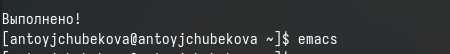

## Выполнение лабораторной работы

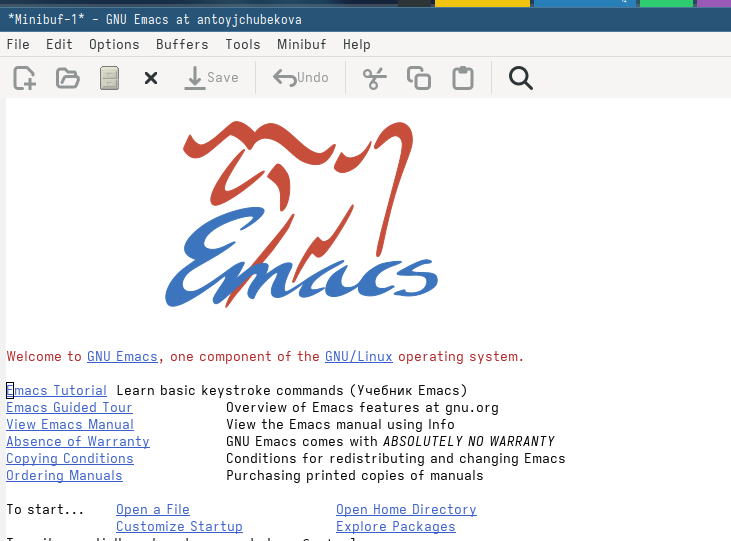

## Выполнение лабораторной работы

Создаю файл lab11.sh с помощью комбинации C-x C-f. 

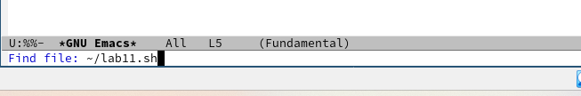

## Выполнение лабораторной работы

Введем в файл текст программы указанная в лабораторной работе. 

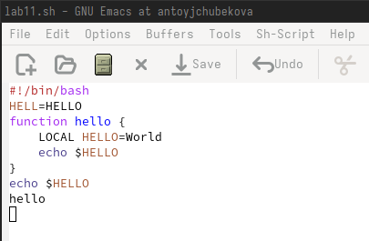

## Выполнение лабораторной работы

Далее сохраняю файл с помощью комбинации C-x C-s. 

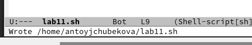

## Выполнение лабораторной работы

Комбинацией C-k вырезаю предпоследнюю строку в тексте.

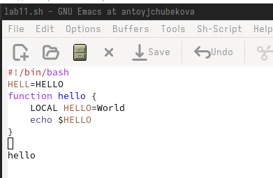

## Выполнение лабораторной работы

Вставляю вырезанную строку в конец файла комбинацией C-y. 

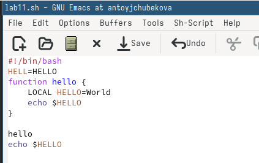

## Выполнение лабораторной работы

Выделяю некоторую область текста с помощью комбинации C-space.

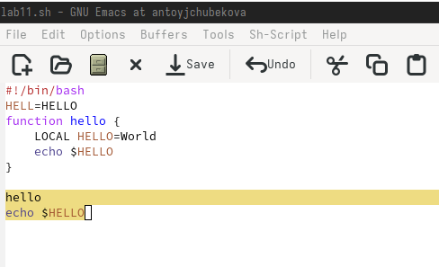

## Выполнение лабораторной работы

Копирую выделенную область в буфер обмена командой M-w и вставляю ее в конец файла. 

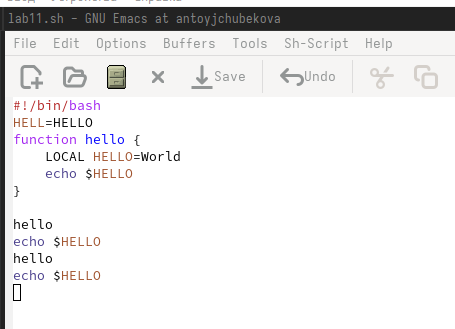

## Выполнение лабораторной работы

Вновь выделяю эту область и на этот раз вырезаю ее комбинацией С-w. 

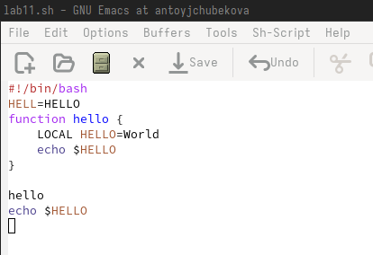

## Выполнение лабораторной работы

Отменяю последние изменения, тем самым возвращаю вырезанный фрагмент текста. 

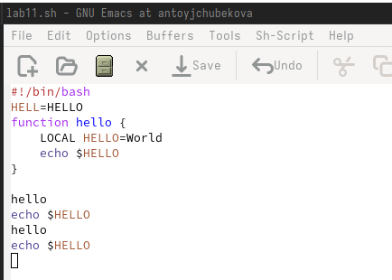

## Выполнение лабораторной работы

Теперь практикую навыки по перемещению курсора. Перемещаю курсор в начало последней строки. 

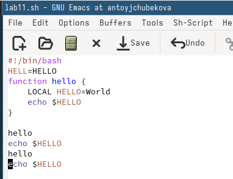

## Выполнение лабораторной работы

Перемещею курсор в конец последней строки комбинацией C-е. 

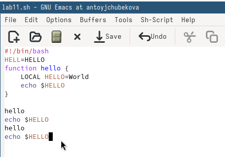

## Выполнение лабораторной работы

Перемещаю курсор а начало буфера комбинацией М-<. 

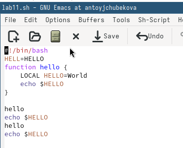

## Выполнение лабораторной работы

Перемещаю курсор в конец буфера комбинацией клавиш М-<.

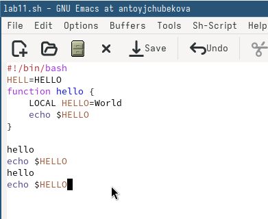

## Выполнение лабораторной работы

Далее вывожу список активных буферов на экран комбинацией клавиш С-x C-b. 

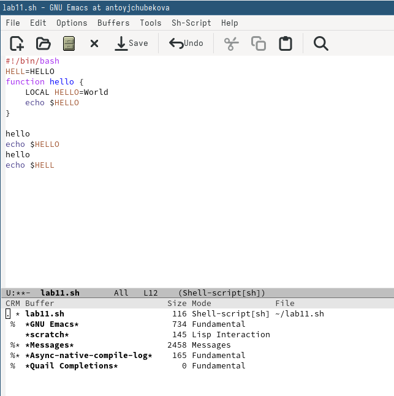

## Выполнение лабораторной работы

Перемещаюсь во вновь открытое окно со списком открытых буферов и переключаюсь на другой буфер с помощью С-x o. 

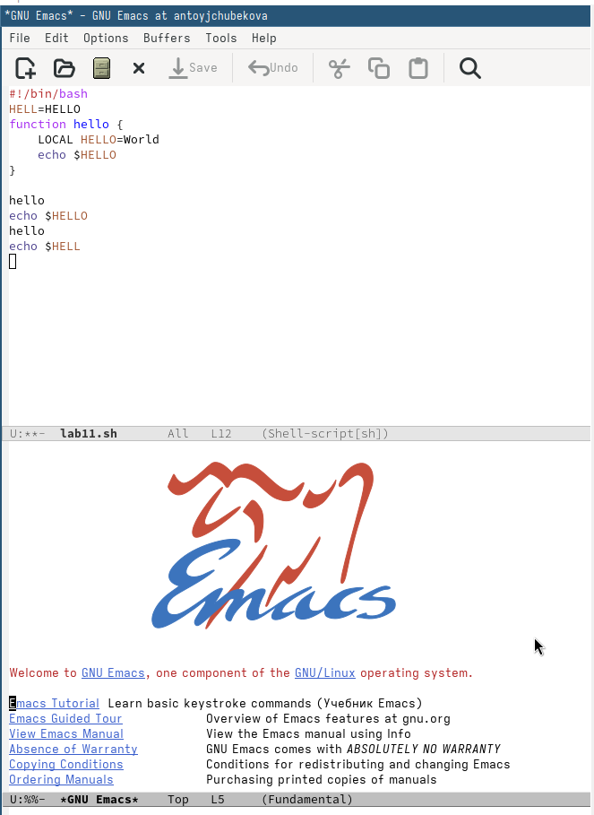

## Выполнение лабораторной работы

Закрываю это окно с помощью С-x 0. 

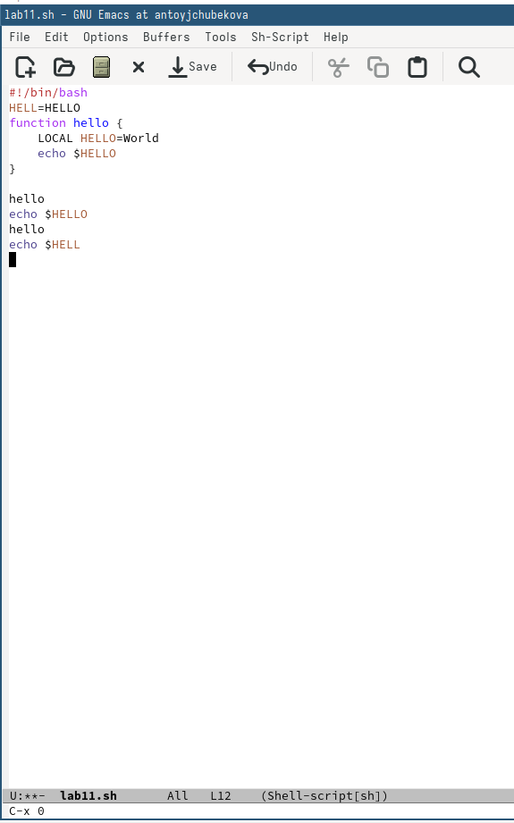

## Выполнение лабораторной работы

Теперь вновь переключаюсь между буферами, но уже без выхода их списка на экран с помощью комбинации клавиш C-x b.

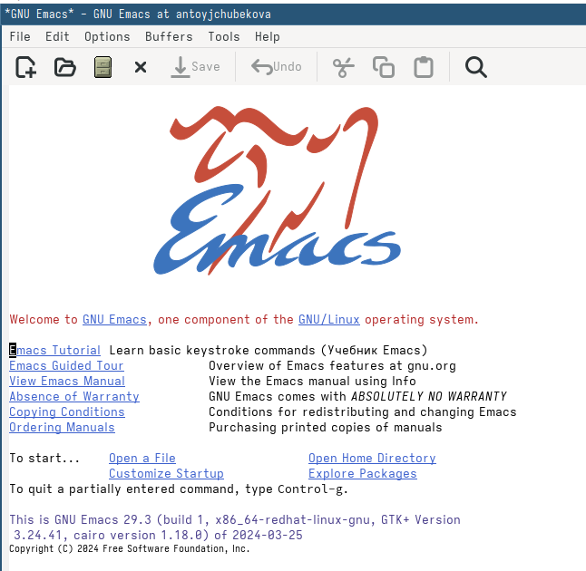

## Выполнение лабораторной работы

Делю фрейм на 4 части с помощью комбинации клавиш C-x 3, C-x 2. 

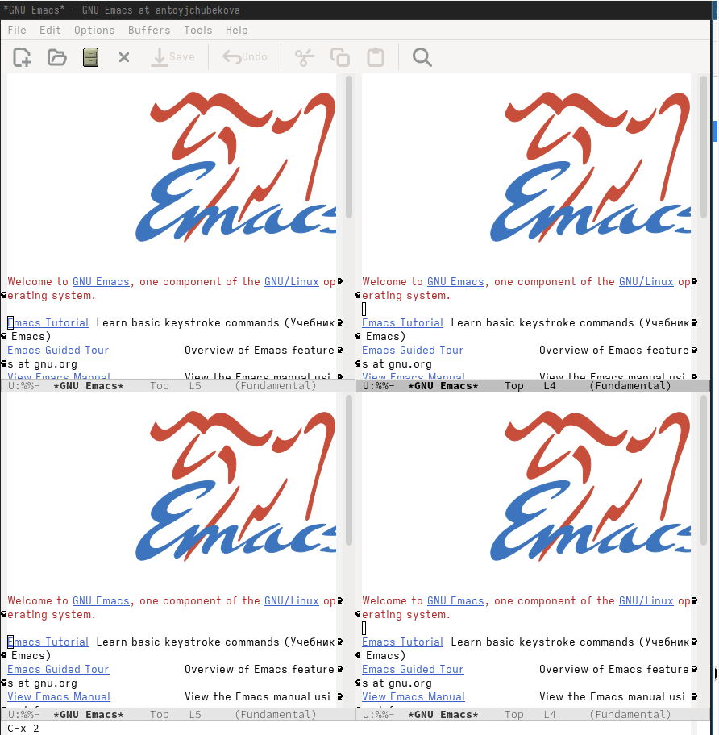

## Выполнение лабораторной работы

В каждой из четырех созданных окон открываю новый буфер и ввожу несколько строк текста. 

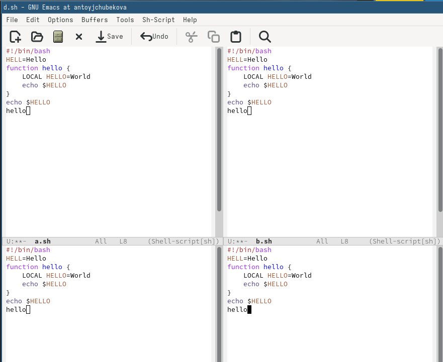

## Выполнение лабораторной работы

Используя комбинацию клавиш С-s переключаюсь в режим поиска и нахожу в тексте строки, где присутствет слово hello. 

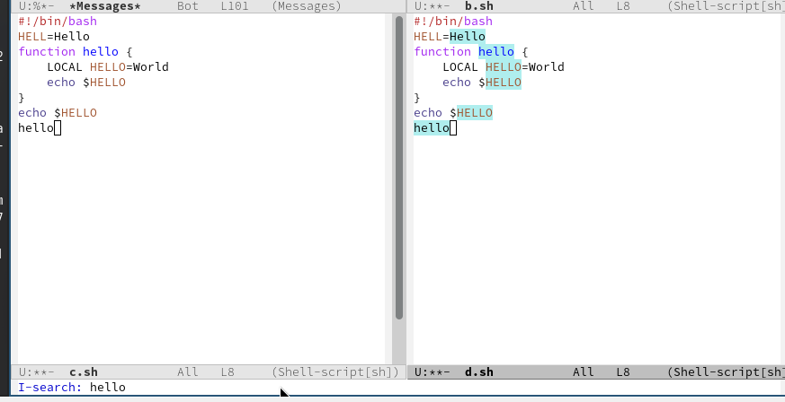

## Выполнение лабораторной работы

С помощью тойже комбинации клавиш C-s я могу переключаться между результатами поиска. 

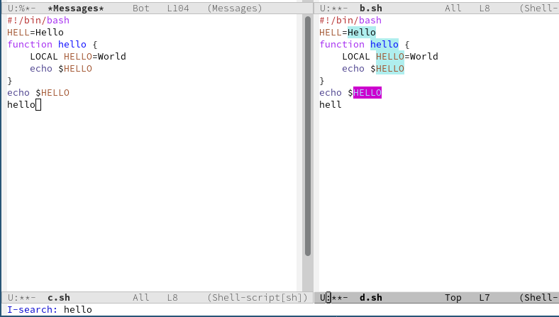

## Выполнение лабораторной работы

Выхожу из режима поиска, нажав С-g.

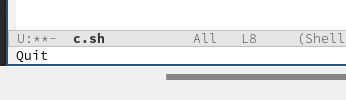

## Выполнение лабораторной работы

Перехожу в режим поиска и замены с помощью комбинации клавиш М-% и заменяю все слова hello на bye. 

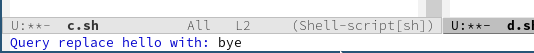

## Выполнение лабораторной работы

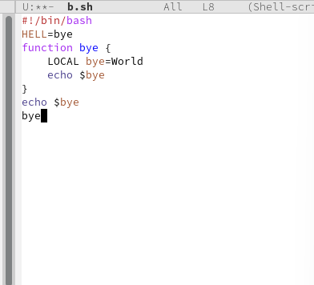

## Выполнение лабораторной работы

С помощью М-s перехожу в другой режим поиска. Он отличается от предыдущего тем, что выводит результат в отдельном окне от буфера. 

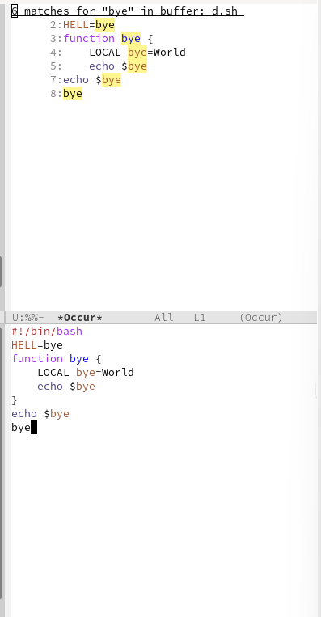

# Выводы

## Выводы

В ходе выполнения лабораторной работы №11 я познакомилась с операционной системой Linux. Также получила практические навыки работы с редактором Emacs.

