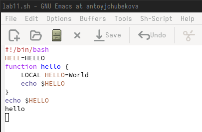

---
## Front matter
title: "Лабораторная работа №11"
subtitle: "Операционны системы"
author: "Тойчубекова Асель Нурлановна"

## Generic otions
lang: ru-RU
toc-title: "Содержание"

## Bibliography
bibliography: bib/cite.bib
csl: pandoc/csl/gost-r-7-0-5-2008-numeric.csl

## Pdf output format
toc: true # Table of contents
toc-depth: 2
lof: true # List of figures
lot: true # List of tables
fontsize: 12pt
linestretch: 1.5
papersize: a4
documentclass: scrreprt
## I18n polyglossia
polyglossia-lang:
  name: russian
  options:
	- spelling=modern
	- babelshorthands=true
polyglossia-otherlangs:
  name: english
## I18n babel
babel-lang: russian
babel-otherlangs: english
## Fonts
mainfont: PT Serif
romanfont: PT Serif
sansfont: PT Sans
monofont: PT Mono
mainfontoptions: Ligatures=TeX
romanfontoptions: Ligatures=TeX
sansfontoptions: Ligatures=TeX,Scale=MatchLowercase
monofontoptions: Scale=MatchLowercase,Scale=0.9
## Biblatex
biblatex: true
biblio-style: "gost-numeric"
biblatexoptions:
  - parentracker=true
  - backend=biber
  - hyperref=auto
  - language=auto
  - autolang=other*
  - citestyle=gost-numeric
## Pandoc-crossref LaTeX customization
figureTitle: "Рис."
tableTitle: "Таблица"
listingTitle: "Листинг"
lofTitle: "Список иллюстраций"
lotTitle: "Список таблиц"
lolTitle: "Листинги"
## Misc options
indent: true
header-includes:
  - \usepackage{indentfirst}
  - \usepackage{float} # keep figures where there are in the text
  - \floatplacement{figure}{H} # keep figures where there are in the text
---

# Цель работы

Целью данной лабораторной работы является знакомство с операционной системой Linux. Также получение практических навыков работы с редактором Emacs.

# Задание

1. Ознакомиться с теоретическим материалом.
2. Ознакомиться с редактором emacs
3. Выполнить упражнения.
4. Ответить на контрольные вопросы.

# Теоретическое введение

**Emacs** — интегрированная среда для выполнения большого количества типов задач. Это значит, что все инструменты редактирования, поиска, обработки текста, работы с файлами, доступны вам в любой момент независимо от того что вы делаете: пишете код или текст диссертации, читаете документацию, выполняете системные задачи, составляете своё расписание или пишете электронное письмо.

**Буфер** — объект, представляющий какой-либо текст. Буфер может содержать что угодно, например, результаты компиляции программы или встроенные подсказки. Практически всё взаимодействие с пользователем, в том числе интерактивное, происходит посредством буферов.

**Фрейм** соответствует окну в обычном понимании этого слова. Каждый фрейм содержит область вывода и одно или несколько окон Emacs

**Окно** — прямоугольная область фрейма, отображающая один из буферов. Каждое окно имеет свою строку состояния, в которой выводится следующая информация: название буфера, его основной режим, изменялся ли текст буфера и как далеко вниз по буферу расположен курсор. Каждый буфер находится только в одном из возможных основных режимов. Существующие основные режимы включают режим Fundamental (наименее специализированный), режим Text, режим Lisp, режим С, режим Texinfo и другие. Под второстепенными режимами понимается список режимов, которые включены в данный момент в буфере выбранного окна.

**Область вывода** — одна или несколько строк внизу фрейма, в которой Emacs выводит различные сообщения, а также запрашивает подтверждения и дополнительную информацию от пользователя.

**Минибуфер** используется для ввода дополнительной информации и всегда отображается в области вывод

**Точка вставки** — место вставки (удаления) данных в буфере.

Для запуска Emacs необходимо в командной строке набрать emacs (или emacs & для работы в фоновом режиме относительно консоли). Для работы с Emacs можно использовать как элементы меню, так и различные сочетания клавиш. Например, для выхода из Emacs можно воспользоваться меню File и выбрать пункт Quit , а можно нажать последовательно Ctrl-x Ctrl-c (в обозначениях Emacs: C-x C-c).

Многие рутинные операции в Emacs удобнее производить с помощью клавиатуры, а не графического меню. Наиболее часто в командах Emacs используются сочетания c клавишами Ctrl и Meta (в обозначениях Emacs: C- и M-; клавиша Shift в Emasc обозначается как S-). Так как на клавиатуре для IBM PC совместимых ПК клавиши Meta нет, то вместо неё можно использовать Alt или Esc . Для доступа к системе меню используйте клавишу F10 .

Клавиши Ctrl , Meta и Shift принято называть префиксными. Например, запись M-x означает, что надо удерживая клавишу Meta (или Alt ), нажать на клавишу x.Для открытия файла следует использовать команду C-x C-f (надо, удерживая клавишу Ctrl , нажать на клавишу x , затем отпустить обе клавиши и снова, удерживая клавишу Ctrl , нажать на клавишу f ). По назначению префиксные сочетания клавиш различаются следующим образом: – C-x — префикс ввода основных команд редактора (например, открытия, закрытии, сохранения файла и т.д.); – C-c — префикс вызова функций, зависящих от используемого режима. 

В редакторе Emacs предусмотрены комбинации клавиш: для перемещения курсора в буфере, для работы с текстом, для работы с выделенной областью текста,для поиска и замены области текста, для работы с файлами,буферами и окнами.

# Выполнение лабораторной работы

Для начала открываю emacs (рис. [-@fig:001] и рис. [-@fig:002]).

{#fig:001 width=70%}

{#fig:002 width=70%}

Создаю файл lab11.sh с помощью комбинации C-x C-f. (рис. [-@fig:003]).

{#fig:003 width=70%}

Введем в файл текст программы указанная в лабораторной работе. (рис. [-@fig:004]).

{#fig:004 width=70%}

Далее сохраняю файл с помощью комбинации C-x C-s. (рис. [-@fig:005]).

{#fig:005 width=70%}

Комбинацией C-k вырезаю предпоследнюю строку в тексте. (рис. [-@fig:006]).

{#fig:006 width=70%}

Вставляю вырезанную строку в конец файла комбинацией C-y. (рис. [-@fig:007]).

{#fig:007 width=70%}

Выделяю некоторую область текста с помощью комбинации C-space. (рис. [-@fig:008]).

{#fig:008 width=70%}

Копирую выделенную область в буфер обмена командой M-w и вставляю ее в конец файла. (рис. [-@fig:009]).

{#fig:009 width=70%}

Вновь выделяю эту область и на этот раз вырезаю ее комбинацией С-w. (рис. [-@fig:010]).

{#fig:010 width=70%}

Отменяю последние изменения, тем самым возвращаю вырезанный фрагмент текста. (рис. [-@fig:011]).

{#fig:011 width=70%}

Теперь практикую навыки по перемещению курсора. Перемещаю курсор в начало последней строки. (рис. [-@fig:012]).

{#fig:012 width=70%}

Перемещею курсор в конец последней строки комбинацией C-е. (рис. [-@fig:013]).

{#fig:013 width=70%}

Перемещаю курсор а начало буфера комбинацией М-<. (рис. [-@fig:014]).

{#fig:014 width=70%}

Перемещаю курсор в конец буфера комбинацией клавиш М-<.(рис. [-@fig:015]).

{#fig:015 width=70%}

Далее вывожу список активных буферов на экран комбинацией клавиш С-x C-b. (рис. [-@fig:016]).

{#fig:016 width=70%}

Перемещаюсь во вновь открытое окно со списком открытых буферов и переключаюсь на другой буфер с помощью С-x o. (рис. [-@fig:017]).

{#fig:017 width=70%}

Закрываю это окно с помощью С-x 0. (рис. [-@fig:018]).

{#fig:018 width=70%}

Теперь вновь переключаюсь между буферами, но уже без выхода их списка на экран с помощью комбинации клавиш C-x b. (рис. [-@fig:019]).

{#fig:019 width=70%}

Делю фрейм на 4 части с помощью комбинации клавиш C-x 3, C-x 2. (рис. [-@fig:020]).

{#fig:020 width=70%}

В каждой из четырех созданных окон открываю новый буфер и ввожу несколько строк текста. (рис. [-@fig:021]).

{#fig:021 width=70%}

Используя комбинацию клавиш С-s переключаюсь в режим поиска и нахожу в тексте строки, где присутствет слово hello. (рис. [-@fig:022]).

{#fig:022 width=70%} 

С помощью тойже комбинации клавиш C-s я могу переключаться между результатами поиска. (рис. [-@fig:023]).

{#fig:023 width=70%}

Выхожу из режима поиска, нажав С-g. (рис. [-@fig:024]).

{#fig:024 width=70%}

Перехожу в режим поиска и замены с помощью комбинации клавиш М-% и заменяю все слова hello на bye. (рис. [-@fig:025] и рис. [-@fig:026]).

{#fig:025 width=70%}

{#fig:026 width=70%}

С помощью М-s перехожу в другой режим поиска. Он отличается от предыдущего тем, что выводит результат в отдельном окне от буфера. (рис. [-@fig:027]).

{#fig:027 width=70%}

# Ответы на вопросы

1. Emacs — один из наиболее мощных и широко распространённых редакторов, используемых в мире UNIX. Написан на языке высокого уровня Lisp.
2. Большое разнообразие сложных комбинаций клавиш, которые необходимы для редактирования файла и в принципе для работа с Emacs.
3. Буфер - это объект в виде текста. Окно - это прямоугольная область, в которой отображен буфер.
4. Да, можно.
5. Emacs использует буферы с именами, начинающимися с пробела, для внутренних целей. Отчасти он обращается с буферами с такими именами особенным образом — например, по умолчанию в них не записывается информация для отмены изменений.
6. Ctrl + c, а потом | и Ctrl + c Ctrl + |
7. С помощью команды Ctrl + x 3 (по вертикали) и Ctrl + x 2 (по горизонтали).
8. Настройки emacs хранятся в файле .emacs, который хранится в домашней дирректории пользователя. Кроме этого файла есть ещё папка .emacs.
9. Клавиша -> выполняет функцию стереть, думаю можно переназначить.
10. Для меня удобнее был редактор Emacs, так как у него есть командая оболочка. А vi открывается в терминале, и выглядит своеобразно.

# Выводы

В ходе выполнения лабораторной работы №11 я познакомилась с операционной системой Linux. Также получила практические навыки работы с редактором Emacs.

