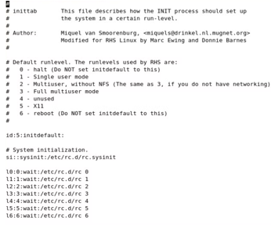
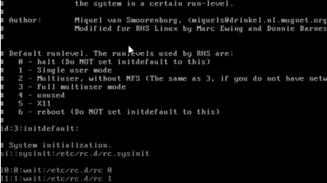

---
## Front matter
lang: ru-RU
title: Доклад по теме "System V система инициализации"
subtitle: Операционные системы
author:
  - Тойчубекова Асель Нурлановна
institute:
  - Российский университет дружбы народов, Москва, Россия
date: 20 апреля 2024

## i18n babel
babel-lang: russian
babel-otherlangs: english

## Formatting pdf
toc: false
toc-title: Содержание
slide_level: 2
aspectratio: 169
section-titles: true
theme: metropolis
header-includes:
 - \metroset{progressbar=frametitle,sectionpage=progressbar,numbering=fraction}
 - '\makeatletter'
 - '\beamer@ignorenonframefalse'
 - '\makeatother'
 
## Fonts
mainfont: PT Serif
romanfont: PT Serif
sansfont: PT Sans
monofont: PT Mono
mainfontoptions: Ligatures=TeX
romanfontoptions: Ligatures=TeX
sansfontoptions: Ligatures=TeX,Scale=MatchLowercase
monofontoptions: Scale=MatchLowercase,Scale=0.9
 
---

# Информация

## Докладчик

:::::::::::::: {.columns align=center}
::: {.column width="70%"}

  * Тойчубекова Асель Нурлановна
  * Студент НПИбд-02-23
  * факультет физико- математических и естественных наук
  * Российский университет дружбы народов
  * [1032235033@rudn.ru](1032235033@rudn.ru)
  * <https://aseltoichubekova.github.io/ru/>

:::
::: {.column width="30%"}

:::
::::::::::::::

# Цель работы

## Цель работы

Целью данного доклада является понять роль и функции систем инициализации в операционных системах на базе ядра. Также рассмотреть традиционную систему инициализации System V, включая ее структуру, режимы загрузки и управление службами. Определить преимущества и недостатки System V как системы инициализации. 

# Система инициализации

## Система инициализации

**Система инициализации** является критически важным компонентом, который определяет, как операционная система (ОС) запускается и загружается. Эта система служит первым уровнем, который вступает в действие сразу после запуска ядра Linux , выполняя роль связующего звена между ядром ОС и высокоуровневыми приложениями.

## Система инициализации

Система инициализации выполняет несколько ключевых задач: \

- Запуск процессов: она инициирует и управляет различными процессами, необходимыми для работы системы и пользовательских приложений: управление сетевыми соединениями, системными логами, планировщиком задач и другими критически важными сервисами. 

- Управление зависимостями: система инициализации управляет порядком и условиями запуска служб, обеспечивая правильное разрешение всех необходимых зависимостей и запуск сервисов в нужном порядке. 

- Контроль за процессами: после начальной загрузки система инициализации продолжает контролировать работающие процессы, перезапуская службы в случае их сбоя или остановки для обеспечения стабильности и надёжности системы.

## Система инициализации

В операционной системе Linux и других системах семейства Unix после завершения загрузки ядра начинается инициализация Linux системы, сервисов и других компонентов. За это отвечает процесс инициализации, он запускается ядром сразу после завершения загрузки, имеет PID 1, и будет выполняться пока будет работать система. 

## Система инициализации

Существует несколько различных типов систем инициализации.

# System V

## System V

System V или SysV - это довольно старая, но до сих пор ещё популярная система инициализации Linux и Unix подобных операционных систем. Она была основой для создания многих других систем инициализации, а также первой коммерческой системой инициализации разработанной для Unix в AT&T. Она была разработана еще в 1983 году.

## System V

К основным возможностям SysV относятся:

1. Написание файлов запуска служб на bash; 

2. Последовательный запуск служб; 

3. простота управления сервисами через символические ссылки и скрипты; 

4. минимальные зависимости от стороннего программного обеспечения, что делает её правильным выбором систем с ограниченными ресурсами. 

5. Сортировка порядка запуска с помощью номеров в именах файлов; 

6. Команды для запуска, остановки и проверки состояния служб. 

## System V 

**Уровни выполнения в SysV** \

- Уровень 1 (однопользовательский режим): используется для выполнения задач администрирования системы, требующих эксклюзивного доступа к системе, таких как восстановление файловых систем или сброс пароля root.
- Уровень 2 (многопользовательский режим без сетевого доступа): Полезен для выполнения задач администрирования системы, таких как обновление программного обеспечения или устранение неполадок с оборудованием, без необходимости запуска сетевых служб.

## System V

- Уровень 3 (многопользовательский режим с сетевым доступом): Стандартный уровень выполнения, который запускает все необходимые службы для многопользовательской работы, включая сетевые службы.
- Уровень 5 (графический режим): Используется для запуска графического интерфейса пользователя (GUI).
- Уровень 6 (перезагрузка системы) — при включении этого режима останавливаются все запущенные программы и производится перезагрузка

# Классическая программа init в сочетании со скриптами rc.d в стиле System V

## Классическая программа init в сочетании со скриптами rc.d в стиле System V

Классический System V init читает файл /etc/inittab и выполняет ряд предписаний, которые прописаны в этом файле. Inittab этот текстовый файл каждая строка которого, это, по сути дела, одна команда или какое-то правило поведения.

## Классическая программа init в сочетании со скриптами rc.d в стиле System V

Inittab выглядит так

## Строка “id:3:initdefault” в файле /etc/inittab

“id:3:initdefault” в файле /etc/inittab \

За что отвечает: \
- Эта строка определяет стандартный уровень выполнения для системы. Уровень выполнения - это состояние системы, которое определяет, какие службы и процессы должны быть запущены.
Формат: \
id:runlevel:action \
Поля: \

- id: Идентификатор уровня выполнения (число от 0 до 6).

- runlevel: Текстовое описание уровня выполнения (например, “single-user mode” или “multi-user mode”).

- action: Действие, которое должно быть выполнено, когда система загружается на этот уровень выполнения (например, “sysinit” для запуска процесса init).

## Строка “si::sysinit:/etc/rc.d/rc.sysinit” в файле /etc/inittab

“si::sysinit:/etc/rc.d/rc.sysinit” в файле /etc/inittab \

За что отвечает:
- Эта строка определяет действие, которое должно быть выполнено, когда система загружается на уровень выполнения 1 (однопользовательский режим).
Формат: \
runlevel:wait:action \
Поля: \

- runlevel: Уровень выполнения (число от 0 до 6).

- wait: Время ожидания (в секундах) перед выполнением действия.

- action: Действие, которое должно быть выполнено.

## Строка “l3:3:wait:/etc/rc.d/rc 3” в файле /etc/inittab

“l3:3:wait:/etc/rc.d/rc 3” в файле /etc/inittab \

За что отвечает: \
- Эта строка определяет действие, которое должно быть выполнено, когда система загружается на уровень выполнения 3 (многопользовательский режим с сетевым доступом).
Формат: \
runlevel:wait:action \
Поля: \

- runlevel: Уровень выполнения (число от 0 до 6).

- wait: Время ожидания (в секундах) перед выполнением действия.

- action: Действие, которое должно быть выполнено.

## Строка “1:2345:respawn:/sbin/mingetty tty1” в файле /etc/inittab

“1:2345:respawn:/sbin/mingetty tty1” в файле /etc/inittab \

За что отвечает: \
- Эта строка определяет действие, которое должно быть выполнено, когда система загружается на уровень выполнения 1 (однопользовательский режим) и на уровне выполнения 2 (многопользовательский режим без сетевого доступа).
Формат: \
runlevel:wait:action \
Поля: \

- runlevel: Уровень выполнения (число от 0 до 6).

- wait: Время ожидания (в секундах) перед выполнением действия.

- action: Действие, которое должно быть выполнено.

## Строка “ca:ctrlaltdel:/sbin/shutdown -t3 -r now” в файле /etc/inittab

“ca:ctrlaltdel:/sbin/shutdown -t3 -r now” в файле /etc/inittab \
За что отвечает: \
- Эта строка определяет действие, которое должно быть выполнено, когда пользователь нажимает комбинацию клавиш Ctrl+Alt+Del.
Формат: \
key sequence:action \
Поля: \

- key sequence: Комбинация клавиш (например, Ctrl+Alt+Del).

- action: Действие, которое должно быть выполнено.

## Виды действий 

Дальше идет некое действие. Действия бывают следующие: wait, respawn, sysinit, ctrlaltdel.

## 

# Преимущество System V

## Преимущество System V

**Преимущества System V init по сравнению с другими системами инициализации**:

1. Простота и понятность: Сценарии инициализации написаны в виде простых текстовых файлов, что упрощает их понимание и модификацию. 
2. Гибкость: Администраторы системы могут легко добавлять, удалять и изменять сценарии инициализации, чтобы настроить систему в соответствии со своими потребностями.

## Преимущество System V

3. Совместимость: System V init широко используется в дистрибутивах Unix и Linux, что обеспечивает совместимость с большим количеством приложений и сервисов.
4. Низкие требования к ресурсам: System V init является относительно легкой системой инициализации, что делает ее подходящей для систем с ограниченными ресурсами.

# Недостатки System V

## Недостатки System V

**Недостатки System V init по сравнению с другими системами инициализации**:

1. Последовательный запуск: System V init запускает службы и процессы последовательно, что может привести к замедлению загрузки системы.
2. Сложность управления зависимостями: System V init не предоставляет встроенного механизма для управления зависимостями между службами, что может привести к ошибкам при запуске и остановке служб.

## Недостатки System V

3. Ограниченные возможности параллельного запуска: System V init запускает службы и процессы последовательно, что не позволяет использовать возможности параллельного запуска современных многоядерных систем.
4. Устаревший: System V init является устаревшей системой инициализации, которая больше не так активно развивается, как другие системы инициализации. 

## Преимущество и недостатки System V

В целом, System V init остается популярным выбором для систем, требующих простоты и гибкости. Однако в современных системах, требующих высокой производительности и расширенных возможностей управления, более подходящими альтернативами являются Upstart или Systemd.

# Выводы

## Выводы

Система инициализации является жизненно важным компонентом в операционных системах на базе ядра, таком как Linux, которая отвечает за правильную загрузку и инициализацию системы. Она управляет запуском процессов и служб, обеспечивает упорядоченный запуск и остановку, а также контролирует их поведение во время работы системы.

System V init является традиционной системой инициализации, которая использовалась во многих старых дистрибутивах Linux. Она предоставляет простую и понятную структуру для управления службами, но имеет ограничения, такие как последовательный запуск и отсутствие управления зависимостями.

## Список литературы{.unnumbered}

1. https://parallel.uran.ru/book/export/html/487?ysclid=lvqoxg5dcv321111041

2. https://moluch.ru/archive/503/110797/?ysclid=lvq8qoj6k7851804848

3. https://losst.pro/sistemy-initsializatsii-linux?ysclid=lvqcpskbl6380114430

5. https://pikabu.ru/story/sistema_initsializatsii_5191339?ysclid=lvq8i3pnwl986484468

6. https://wiki.merionet.ru/articles/3-varianta-inicializacii-operacionnoj-sistemy?ysclid=lvqcw2mbfm974602146
