---
## Front matter
title: "Лабораторная работа №12"
subtitle: "Операионные системы"
author: "Тойчубекова Асель Нурлановна"

## Generic otions
lang: ru-RU
toc-title: "Содержание"

## Bibliography
bibliography: bib/cite.bib
csl: pandoc/csl/gost-r-7-0-5-2008-numeric.csl

## Pdf output format
toc: true # Table of contents
toc-depth: 2
lof: true # List of figures
lot: true # List of tables
fontsize: 12pt
linestretch: 1.5
papersize: a4
documentclass: scrreprt
## I18n polyglossia
polyglossia-lang:
  name: russian
  options:
	- spelling=modern
	- babelshorthands=true
polyglossia-otherlangs:
  name: english
## I18n babel
babel-lang: russian
babel-otherlangs: english
## Fonts
mainfont: PT Serif
romanfont: PT Serif
sansfont: PT Sans
monofont: PT Mono
mainfontoptions: Ligatures=TeX
romanfontoptions: Ligatures=TeX
sansfontoptions: Ligatures=TeX,Scale=MatchLowercase
monofontoptions: Scale=MatchLowercase,Scale=0.9
## Biblatex
biblatex: true
biblio-style: "gost-numeric"
biblatexoptions:
  - parentracker=true
  - backend=biber
  - hyperref=auto
  - language=auto
  - autolang=other*
  - citestyle=gost-numeric
## Pandoc-crossref LaTeX customization
figureTitle: "Рис."
tableTitle: "Таблица"
listingTitle: "Листинг"
lofTitle: "Список иллюстраций"
lotTitle: "Список таблиц"
lolTitle: "Листинги"
## Misc options
indent: true
header-includes:
  - \usepackage{indentfirst}
  - \usepackage{float} # keep figures where there are in the text
  - \floatplacement{figure}{H} # keep figures where there are in the text
---

# Цель работы

Целью данной лабораторной работы является изучение основы программирования в оболочке OC LINUX. Также научиться писать небольшие командные файлы.

# Задание

1. Написать скрипт, который при запуске будет делать резервную копию самого себя (то есть файла, в котором содержится его исходный код) в другую директорию backup в вашем домашнем каталоге. При этом файл должен архивироваться одним из архиваторов на выбор zip, bzip2 или tar. Способ использования команд архивации необходимо узнать, изучив справку.
2. Написать пример командного файла, обрабатывающего любое произвольное число аргументов командной строки, в том числе превышающее десять. Например, скрипт может последовательно распечатывать значения всех переданных аргументов.
3. Написать командный файл — аналог команды ls (без использования самой этой команды и команды dir). Требуется, чтобы он выдавал информацию о нужном каталоге и выводил информацию о возможностях доступа к файлам этого каталога.
4. Написать командный файл, который получает в качестве аргумента командной строки формат файла (.txt, .doc, .jpg, .pdf и т.д.) и вычисляет количество таких файлов в указанной директории. Путь к директории также передаётся в виде аргумента командной строки

# Теоретическое введение

**Командный процессор** (командная оболочка, интерпретатор команд shell) — это программа, позволяющая пользователю взаимодействовать с операционной системой компьютера. В операционных системах типа UNIX/Linux наиболее часто используются следующие реализации командных оболочек:
- оболочка Борна (Bourne shell или sh) — стандартная командная оболочка UNIX/Linux, содержащая базовый, но при этом полный набор функций;
- С-оболочка (или csh) — надстройка на оболочкой Борна, использующая С-подобный синтаксис команд с возможностью сохранения истории выполнения команд;
- оболочка Корна (или ksh) — напоминает оболочку С, но операторы управления программой совместимы с операторами оболочки Борна;
- BASH — сокращение от Bourne Again Shell (опять оболочка Борна), в основе своей совмещает свойства оболочек С и Корна (разработка компании Free Software Foundation).

**POSIX** (Portable Operating System Interface for Computer Environments) — набор стандартов описания интерфейсов взаимодействия операционной системы и прикладных программ. Стандарты POSIX разработаны комитетом IEEE (Institute of Electrical and Electronics Engineers) для обеспечения совместимости различных UNIX/Linux-подобных операционных систем и переносимости прикладных программ на уровне исходного кода.

POSIX-совместимые оболочки разработаны на базе оболочки Корна.

**Командные файлы**, также известные как shell-скрипты, являются текстовыми файлами, содержащими последовательность команд командного процессора. Командные файлы позволяют пользователям автоматизировать задачи, выполняя несколько команд подряд без необходимости вводить их вручную.

# Выполнение лабораторной работы

Для начала я создаю файл task1, в котором буду писать программу и открою его в редакторе gedit (рис. [-@fig:001]).

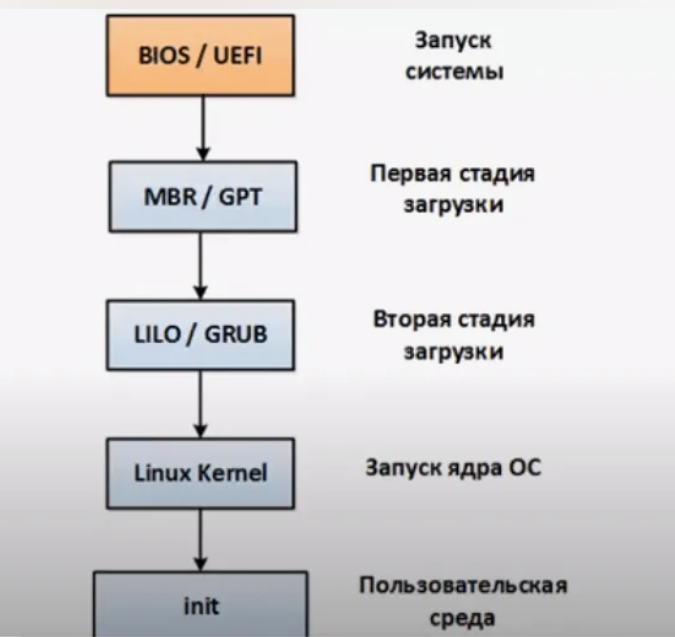{#fig:001 width=70%}

Редактирую файл, записывая код программы, которая будет делать резервную копию самого себя и при этом файл должен архивироваться. В этом кода яя сперва создаю каталог backup, где будут храниться резервная копия и архив файла. С помощью команды tar -cvf  создаю архив из резервной копии. С помощью команды echo вывожу сведения о созданном архиве. (рис. [-@fig:002]).

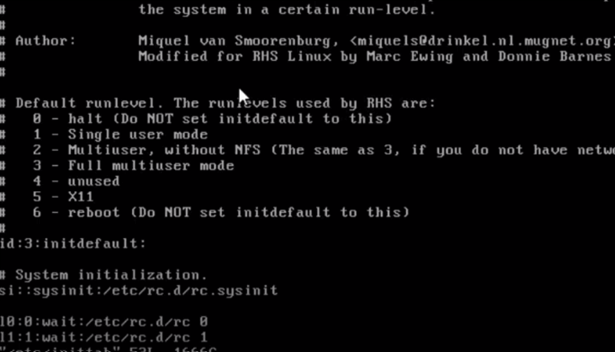{#fig:002 width=70%}

Меняю права доступа, включая права доступа на выполнение. Вызываю командный файл на выполнение и вижу сведения о том, что архив был создан, перейдя в домашний каталог в каталог backup видим, что архив удачно создан. (рис. [-@fig:003] и рис. [-@fig:004]).

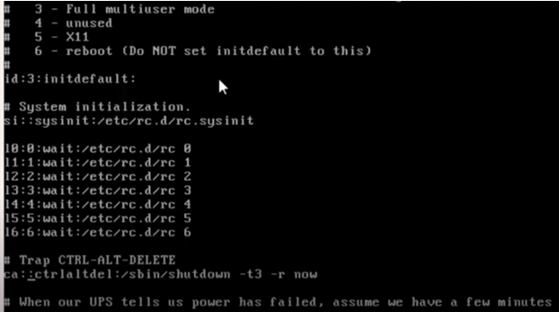{#fig:003 width=70%}

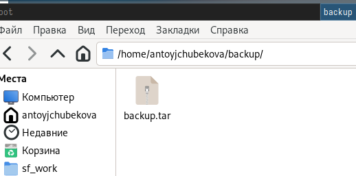{#fig:004 width=70%}

Создаю файл task2, в котором буду писать программу и открою его в редакторе gedit (рис. [-@fig:005]).

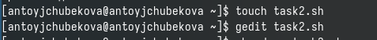{#fig:005 width=70%}

Редактирую файл, записывая код программы, которая будет обрабатывать любое произвольное число аргументов командной строки. Для этого я созздаю цикл который будет проходить по всей командной строке, по всем аргуменнтам и буду выводить каждый из них с помощью команды echo, в конце добавляю done для указания,что конец икла.  (рис. [-@fig:006]).

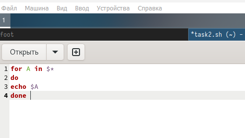{#fig:006 width=70%}

Меняю права доступа, включая права на выполнение. Вызываю командный фвйл на выполнения в конце указывая аргуметы, мы видим, что программа корректно работает и все аргументы выводятся на экран.  (рис. [-@fig:007]).

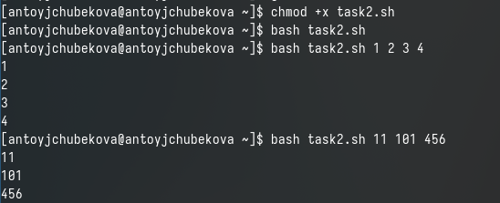{#fig:007 width=70%}

Создаю файл task3, в котором буду писать программу и открою его в редакторе gedit (рис. [-@fig:008]).

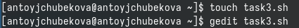{#fig:008 width=70%}

Редактирую файл, который будет выводить данные о каталоге как команда ls, а также выводит информацию о правах доступа. Для этого я с помощью цикла for прохожусь по асем у содержанию данного каталога, указывая * для этого. Паралельно проверяю если это каталог, исполняемый файл или просто файл с помощью команды test и его опций -d(для директорий) -e(для исполняемого файла) -f(для файла) и используя команду if/elif/else  как и в других высокоуровневых языках программирования. Паралельно с проверкой если условие истина вывожу соответствующее собщение о том каталог это или файл и о правах доступа.  (рис. [-@fig:009]).

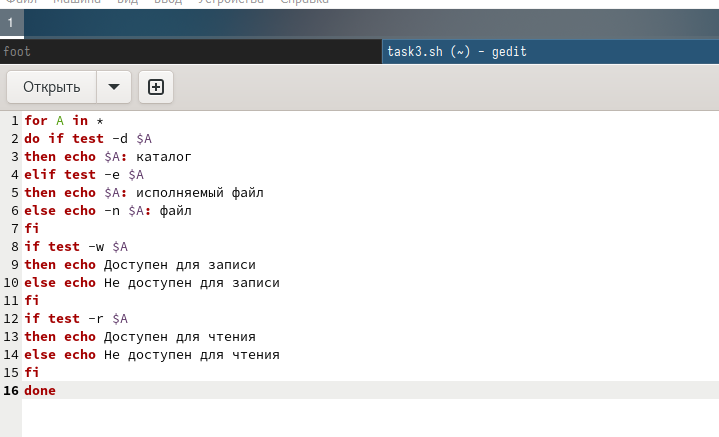{#fig:009 width=70%}

Меняю права досттупа, включая права на выполнение. Вызываю командный файл на выполнение, мы видим, что программа корректно работает и на экран выводится все содержимое домашнего каталога с правами доступа. (рис. [-@fig:010]).

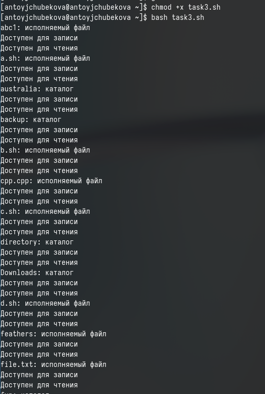{#fig:010 width=70%}

Создаю файл task4, в котором буду писать программу и открою его в редакторе gedit (рис. [-@fig:011]).

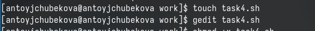{#fig:011 width=70%}

Редактирую файл, который будет получать в качестве аргумента командной строки формат файла и вычилить количество таких файлов в указанной директории. Путь к директорию также передается в виде аргумента командной строкки. Для этого я сперва с помощью команды echo и read вывожу на экран запрос пользователю, чтобы он ввел значения пути каталога и тип файла. Далее я проверяю существует ди такой каталог, если нет то вывожу об этом текст. Завожу переменную x и с пмощью цикла ищу файла соответствующие требуемой, если нахожу прибавляю к x +1 который изначально был равен 0. Завершаю цикл с done и вывожу на экран x. (рис. [-@fig:012]).

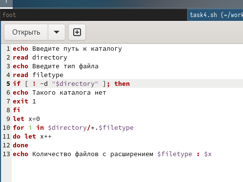{#fig:012 width=70%}

Меняю права доступа, включая права на выполнение. Вызываю командный файл на выполнение, сперва проверяю каталог по адресу /home/antoyjchubekova/fun на количество файов с sh  и получаю ответ 3, перейдя по данному адресу мы видим, что  программа сработала верно.  рис. [-@fig:013] и рис. [-@fig:014]).

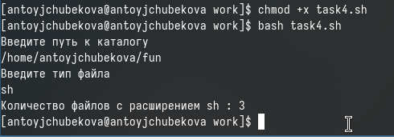{#fig:013 width=70%}

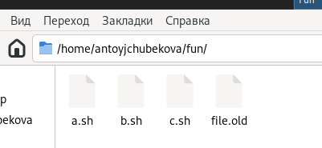{#fig:014 width=70%}

Далее проверяю каталог по адресу /home/antoyjchubekova/ на количество файов с txt  и получаю ответ 2, перейдя по данному адресу мы видим, что  программа сработала верно.  рис. [-@fig:015] и рис. [-@fig:016]).

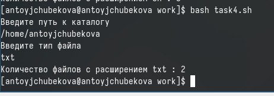{#fig:015 width=70%}

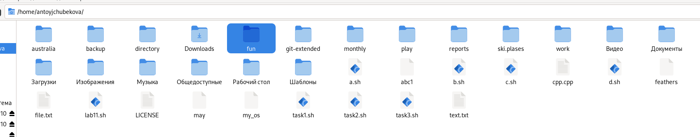{#fig:016 width=70%}

# Выводы

В ходе выполнения лабораторной работы №12 я изучила основы программирования в оболочке OC LINUX. Также я научилась писать небольшие командные файлы.

