---
## Front matter
lang: ru-RU
title: Лабораторная работа №13
subtitle: Операционные системы
author:
  - Тойчубекова Асель Нурлановна
institute:
  - Российский университет дружбы народов, Москва, Россия
date: 04 мая 2024

## i18n babel
babel-lang: russian
babel-otherlangs: english

## Formatting pdf
toc: false
toc-title: Содержание
slide_level: 2
aspectratio: 169
section-titles: true
theme: metropolis
header-includes:
 - \metroset{progressbar=frametitle,sectionpage=progressbar,numbering=fraction}
 - '\makeatletter'
 - '\beamer@ignorenonframefalse'
 - '\makeatother'
 
## Fonts
mainfont: PT Serif
romanfont: PT Serif
sansfont: PT Sans
monofont: PT Mono
mainfontoptions: Ligatures=TeX
romanfontoptions: Ligatures=TeX
sansfontoptions: Ligatures=TeX,Scale=MatchLowercase
monofontoptions: Scale=MatchLowercase,Scale=0.9
 
---

# Информация

## Докладчик

:::::::::::::: {.columns align=center}
::: {.column width="70%"}

  * Тойчубекова Асель Нурлановна
  * Студент НПИбд-02-23
  * факультет физико-математичских и естветвенных наук
  * Российский университет дружбы народов
  * [1032235033@rudn.ru](1032235033@rudn.ru)
  * <https://aseltoichubekova.github.io/ru/>

:::
::: {.column width="30%"}

:::
::::::::::::::

## Цель работы

Целью данной лабораторной работы является изучить основы программирования в оболочке ОС UNIX. Также научиться писать более сложные командные файлы с использованием логических управляющих конструкций и циклов.

## Задание

1. Используя команды getopts grep, написать командный файл, который анализирует
командную строку с ключами:

- -iinputfile — прочитать данные из указанного файла;

- -ooutputfile — вывести данные в указанный файл;

- -pшаблон — указать шаблон для поиска;

- -C — различать большие и малые буквы;

- -n — выдавать номера строк.

а затем ищет в указанном файле нужные строки, определяемые ключом -p.

## Задание

2. Написать на языке Си программу, которая вводит число и определяет, является ли оно больше нуля, меньше нуля или равно нулю. Затем программа завершается с помощью функции exit(n), передавая информацию в о коде завершения в оболочку. Командный файл должен вызывать эту программу и, проанализировав с помощью команды $?, выдать сообщение о том, какое число было введено.

## Задание

3. Написать командный файл, создающий указанное число файлов, пронумерованных последовательно от 1 до заданного числа (например 1.tmp, 2.tmp, 3.tmp,4.tmp и т.д.). Число файлов, которые необходимо создать, передаётся в аргументы командной строки. Этот же командный файл должен уметь удалять все созданные им файлы (если они существуют).

## Задание

4. Написать командный файл, который с помощью команды tar запаковывает в архив все файлы в указанной директории. Модифицировать его так, чтобы запаковывались только те файлы, которые были изменены менее недели тому назад (использовать команду find).

# Теоретическое введение

## Теоретическое введение

Командный процессор (командная оболочка, интерпретатор команд shell) — это программа, позволяющая пользователю взаимодействовать с операционной системой компьютера. В операционных системах типа UNIX/Linux наиболее часто используются
следующие реализации командных оболочек: \

- оболочка Борна (Bourne shell или sh) — стандартная командная оболочка UNIX/Linux, содержащая базовый, но при этом полный набор функций;

- С-оболочка (или csh) — надстройка на оболочкой Борна, использующая С-подобный синтаксис команд с возможностью сохранения истории выполнения команд;

## Теоретическое введение

- оболочка Корна (или ksh) — напоминает оболочку С, но операторы управления программой совместимы с операторами оболочки Борна;

-  BASH — сокращение от Bourne Again Shell (опять оболочка Борна), в основе своей совмещает свойства оболочек С и Корна (разработка компании Free Software Foundation).

## Теоретическое введение

POSIX (Portable Operating System Interface for Computer Environments) — набор стандартов описания интерфейсов взаимодействия операционной системы и прикладных программ.

Стандарты POSIX разработаны комитетом IEEE (Institute of Electrical and Electronics Engineers) для обеспечения совместимости различных UNIX/Linux-подобных операционных систем и переносимости прикладных программ на уровне исходного кода.

POSIX-совместимые оболочки разработаны на базе оболочки Корна.

# Выполнение лабораторной работы

## Выполнение лабораторной работы

Для начало я создаю первый файл, в котором буду писать программу и открою его в редакторе gedit. 

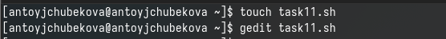

## Выполнение лабораторной работы

Редактирую файл, пишу командный файл, который используя команды getopts grep анализирует командную строку с некоторыми ключами. Используя цикл while программа анализирует все флаги, запичывая данные в нужные файлы. В конце проверяются использования опций c и n и присваиваются определенным переменным. Осуществляется команда grep, которая в данном случае берет и записывает в новый файл текст который совпал с шаблонным. 

## Выполнение лабораторной работы

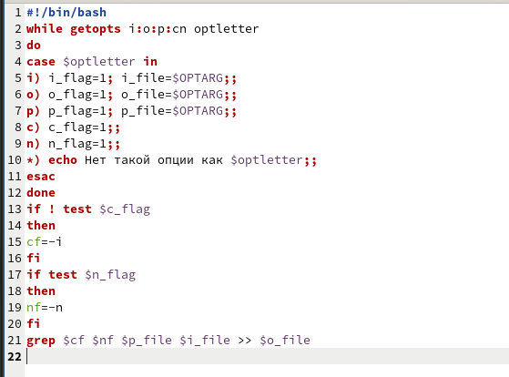

## Выполнение лабораторной работы

Даю права на выполнение и запускаю программу. 

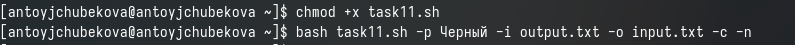

## Выполнение лабораторной работы

Мы видим, что программа удачно сработала и строки с шаблоном "Черный" из текста в файле output.txt записался в файл input.txt. 

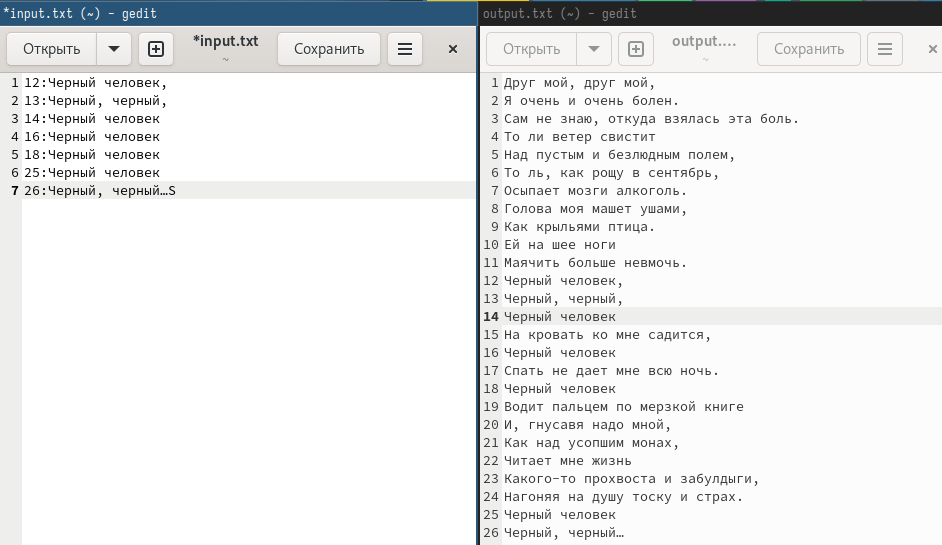

## Выполнение лабораторной работы

Создаю файлы для второй программы и открываю их в редакторе.

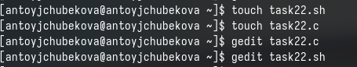

## Выполнение лабораторной работы

В файле с расширением .c пишу программу на си, которая вводит число и определяет, является ли оно больше нуля, мент=ьше нуля, или равно нулю. Затем завершающаяся с помощью функции exit(n), передавая информацию о коде завершения в оболочку. Для этого с помощью if проверяю числа и вывожу соответствующий exit. 

## Выполнение лабораторной работы

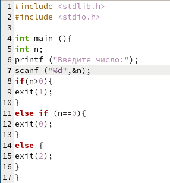

## Выполнение лабораторной работы

Открываю файл с расширением .sh и создаю командный файл, который анализирует программу на си с помощью команды $? и выдает сообщения о том, какое число было введено. Для этого я использую команду gcc -o чтобы программма на си закомпилировалась в новый файл, затем с помощью case проверяю какое значения в этом файле и вывожу соответствующее сообщение.

## Выполнение лабораторной работы

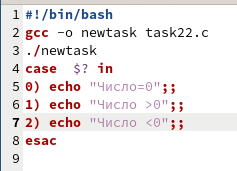

## Выполнение лабораторной работы

Даю право на выполнение и запускаю программу с числами 4,0,-8, мы видим, что все работает корректно. 

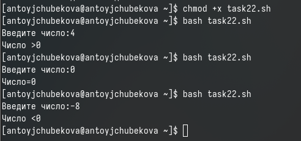

## Выполнение лабораторной работы

Создаю третий файл для написания командного файла и открываю его в редакторе. 

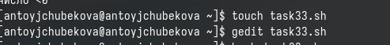

## Выполнение лабораторной работы

Создаю командный файл, который создает указанное количество файлов, пронумерованные последовательно от 1 до n, число файлов же передается в аргументы командной строки. Также этот же командный файл должен удалять файлы с похожими именами, если они есть до создания новых. Для этого я запрашиваю у польнователя количество файлов, которые необходимо создать и прохожусь от 1 до этого числа параллельно проверяя есть ли уже файлы с такими именами если да, то удаляю их, а если нет создаю их. 

## Выполнение лабораторной работы

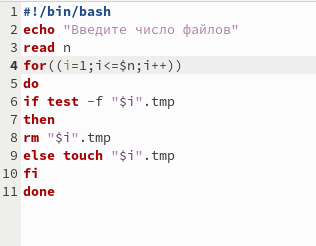

## Выполнение лабораторной работы

Даю право на выполнение и запускаю программу с числом 4. 

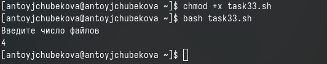

## Выполнение лабораторной работы

Зайдя в свой домашний каталог, можно видеть, что файлы удачно созданы. 

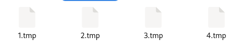

## Выполнение лабораторной работы

Создаю четвертый файл для написания командного файла и открываю его в редакторе. 

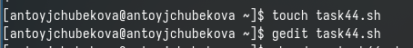

## Выполнение лабораторной работы

Редактирую файл, пишу команднй файл, который с помощью команды tar запаковывает в архив все файлы в указанной директории, также модифицирует его так, чтобы запаковывались толко те файлы, которые были изменены менее недели назад . Для этого я использую команду find c опцией -mtime -7(чтобы указать, что менее 7 дней) и  -mtime +0(чтобы программа не брала в учет сегодняшние файлы), а также type -f(для архивации исключительно файлов) вывод этих команд записываю в новый файл 2xfile.txt. Далее архивирую все файлы с помощью команды tar - cf и записываю вывод в файл archive2x.tar.

## Выполнение лабораторной работы

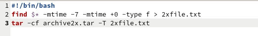

## Выполнение лабораторной работы

Даю право на выполнение и запускаю программу. 

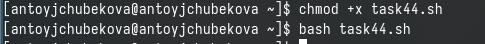

## Выполнение лабораторной работы

Перейдя в домашний каталог видим, что программа сработала корректно. 

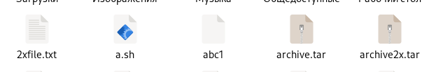

# Выводы

## Выводы

В ходе выполнения лабораторной работы № 13 я изучила основы программирования в оболочке ОС UNIX. Также научилась писать более сложные командные файлы с использованием логических управляющих конструкций и циклов. Создала четыре командных файла и проверила их работу.

