---
## Front matter
title: "Лабораторная работа №13 "
subtitle: "Операционные системы"
author: "Тойчубекова Асель Нурлановна"

## Generic otions
lang: ru-RU
toc-title: "Содержание"

## Bibliography
bibliography: bib/cite.bib
csl: pandoc/csl/gost-r-7-0-5-2008-numeric.csl

## Pdf output format
toc: true # Table of contents
toc-depth: 2
lof: true # List of figures
lot: true # List of tables
fontsize: 12pt
linestretch: 1.5
papersize: a4
documentclass: scrreprt
## I18n polyglossia
polyglossia-lang:
  name: russian
  options:
	- spelling=modern
	- babelshorthands=true
polyglossia-otherlangs:
  name: english
## I18n babel
babel-lang: russian
babel-otherlangs: english
## Fonts
mainfont: PT Serif
romanfont: PT Serif
sansfont: PT Sans
monofont: PT Mono
mainfontoptions: Ligatures=TeX
romanfontoptions: Ligatures=TeX
sansfontoptions: Ligatures=TeX,Scale=MatchLowercase
monofontoptions: Scale=MatchLowercase,Scale=0.9
## Biblatex
biblatex: true
biblio-style: "gost-numeric"
biblatexoptions:
  - parentracker=true
  - backend=biber
  - hyperref=auto
  - language=auto
  - autolang=other*
  - citestyle=gost-numeric
## Pandoc-crossref LaTeX customization
figureTitle: "Рис."
tableTitle: "Таблица"
listingTitle: "Листинг"
lofTitle: "Список иллюстраций"
lotTitle: "Список таблиц"
lolTitle: "Листинги"
## Misc options
indent: true
header-includes:
  - \usepackage{indentfirst}
  - \usepackage{float} # keep figures where there are in the text
  - \floatplacement{figure}{H} # keep figures where there are in the text
---

# Цель работы

Целью данной лабораторной работы является изучить основы программирования в оболочке ОС UNIX. Также научиться писать более сложные командные файлы с использованием логических управляющих конструкций и циклов.

# Задание

1. Используя команды getopts grep, написать командный файл, который анализирует
командную строку с ключами:

- -iinputfile — прочитать данные из указанного файла;

- -ooutputfile — вывести данные в указанный файл;

- -pшаблон — указать шаблон для поиска;

- -C — различать большие и малые буквы;

- -n — выдавать номера строк.

а затем ищет в указанном файле нужные строки, определяемые ключом -p.

2. Написать на языке Си программу, которая вводит число и определяет, является ли оно больше нуля, меньше нуля или равно нулю. Затем программа завершается с помощью функции exit(n), передавая информацию в о коде завершения в оболочку. Командный файл должен вызывать эту программу и, проанализировав с помощью команды $?, выдать сообщение о том, какое число было введено.
3. Написать командный файл, создающий указанное число файлов, пронумерованных последовательно от 1 до 𝑁 (например 1.tmp, 2.tmp, 3.tmp,4.tmp и т.д.). Число файлов, которые необходимо создать, передаётся в аргументы командной строки. Этот же командный файл должен уметь удалять все созданные им файлы (если они существуют).
4. Написать командный файл, который с помощью команды tar запаковывает в архив все файлы в указанной директории. Модифицировать его так, чтобы запаковывались только те файлы, которые были изменены менее недели тому назад (использовать команду find).

# Теоретическое введение

Командный процессор (командная оболочка, интерпретатор команд shell) — это программа, позволяющая пользователю взаимодействовать с операционной системой компьютера. В операционных системах типа UNIX/Linux наиболее часто используются
следующие реализации командных оболочек: \

- оболочка Борна (Bourne shell или sh) — стандартная командная оболочка UNIX/Linux, содержащая базовый, но при этом полный набор функций;

- С-оболочка (или csh) — надстройка на оболочкой Борна, использующая С-подобный синтаксис команд с возможностью сохранения истории выполнения команд;

- оболочка Корна (или ksh) — напоминает оболочку С, но операторы управления программой совместимы с операторами оболочки Борна;

-  BASH — сокращение от Bourne Again Shell (опять оболочка Борна), в основе своей совмещает свойства оболочек С и Корна (разработка компании Free Software Foundation).

POSIX (Portable Operating System Interface for Computer Environments) — набор стандартов описания интерфейсов взаимодействия операционной системы и прикладных программ.

Стандарты POSIX разработаны комитетом IEEE (Institute of Electrical and Electronics Engineers) для обеспечения совместимости различных UNIX/Linux-подобных операционных систем и переносимости прикладных программ на уровне исходного кода.

POSIX-совместимые оболочки разработаны на базе оболочки Корна.

# Выполнение лабораторной работы

Для начало я создаю первый файл, в котором буду писать программу и открою его в редакторе gedit. (рис. [-@fig:001]).

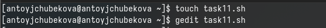{#fig:001 width=70%}

Редактирую файл, пишу командный файл, который используя команды getopts grep анализирует командную строку с некоторыми ключами. Используя цикл while программа анализирует все флаги, запичывая данные в нужные файлы. В конце проверяются использования опций c и n и присваиваются определенным переменным. Осуществляется команда grep, которая в данном случае берет и записывает в новый файл текст который совпал с шаблонным. (рис. [-@fig:002]).

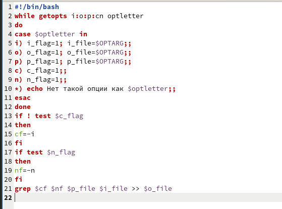{#fig:002 width=70%}

Даю права на выполнение и запускаю программу. (рис. [-@fig:003]).

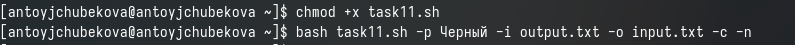{#fig:003 width=70%}

Мы видим, что программа удачно сработала и строки с шаблоном "Черный" из текста в файле output.txt записался в файл input.txt. (рис. [-@fig:004]).

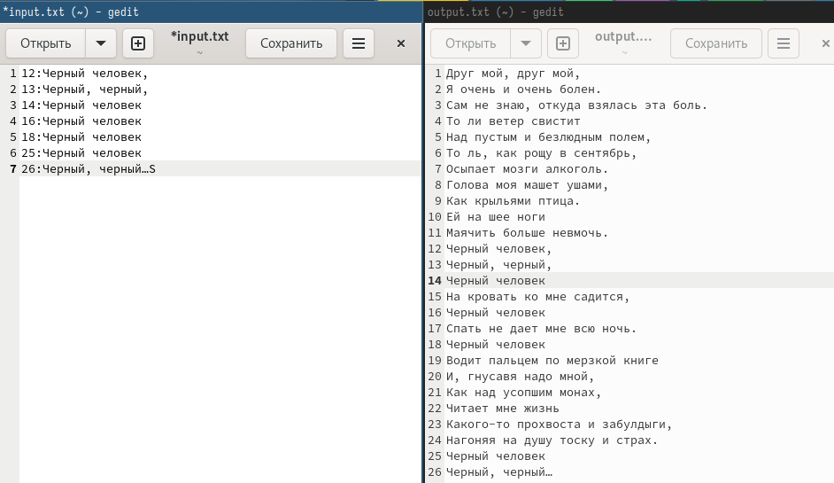{#fig:004 width=70%}

Создаю файлы для второй программы и открываю их в редакторе. (рис. [-@fig:005]).

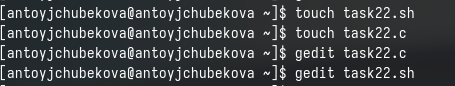{#fig:005 width=70%}

В файле с расширением .c пишу программу на си, которая вводит число и определяет, является ли оно больше нуля, мент=ьше нуля, или равно нулю. Затем завершающаяся с помощью функции exit(n), передавая информацию о коде завершения в оболочку. Для этого с помощью if проверяю числа и вывожу соответствующий exit. (рис. [-@fig:006]).

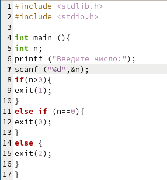{#fig:006 width=70%}

Открываю файл с расширением .sh и создаю командный файл, который анализирует программу на си с помощью команды $? и выдает сообщения о том, какое число было введено. Для этого я использую команду gcc -o чтобы программма на си закомпилировалась в новый файл, затем с помощью case проверяю какое значения в этом файле и вывожу соответствующее сообщение. (рис. [-@fig:007]).

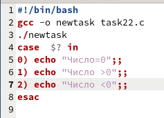{#fig:007 width=70%}

Даю право на выполнение и запускаю программу с числами 4,0,-8, мы видим, что все работает корректно. (рис. [-@fig:008]).

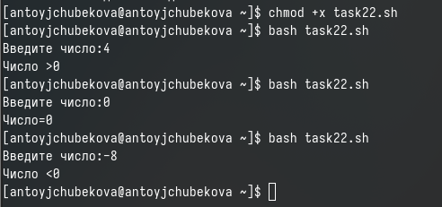{#fig:008 width=70%}

Создаю третий файл для написания командного файла и открываю его в редакторе. (рис. [-@fig:009]).

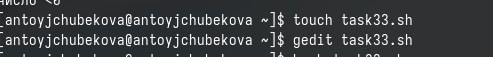{#fig:009 width=70%}

Создаю командный файл, который создает указанное количество файлов, пронумерованные последовательно от 1 до n, число файлов же передается в аргументы командной строки. Также этот же командный файл должен удалять файлы с похожими именами, если они есть до создания новых. Для этого я запрашиваю у польнователя количество файлов, которые необходимо создать и прохожусь от 1 до этого числа параллельно проверяя есть ли уже файлы с такими именами если да, то удаляю их, а если нет создаю их. (рис. [-@fig:010]).

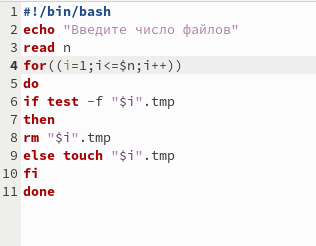{#fig:010 width=70%}

Даю право на выполнение и запускаю программу с числом 4. (рис. [-@fig:011]).

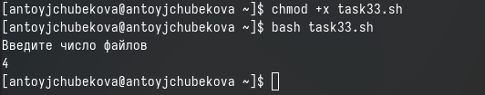{#fig:011 width=70%}

Зайдя в свой домашний каталог, можно видеть, что файлы удачно созданы. (рис. [-@fig:012]).

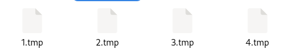{#fig:012 width=70%}

Создаю четвертый файл для написания командного файла и открываю его в редакторе. (рис. [-@fig:013]).

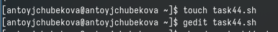{#fig:013 width=70%}

Редактирую файл, пишу команднй файл, который с помощью команды tar запаковывает в архив все файлы в указанной директории, также модифицирует его так, чтобы запаковывались толко те файлы, которые были изменены менее недели назад . Для этого я использую команду find c опцией -mtime -7(чтобы указать, что менее 7 дней) и  -mtime +0(чтобы программа не брала в учет сегодняшние файлы), а также type -f(для архивации исключительно файлов) вывод этих команд записываю в новый файл 2xfile.txt. Далее архивирую все файлы с помощью команды tar - cf и записываю вывод в файл archive2x.tar. (рис. [-@fig:014]).

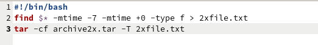{#fig:014 width=70%}

Даю право на выполнение и запускаю программу. (рис. [-@fig:015]).

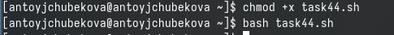{#fig:015 width=70%}

Перейдя в домашний каталог видим, что программа сработала корректно. (рис. [-@fig:016]).

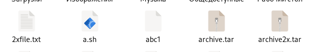{#fig:016 width=70%}

# Ответы на вопросы

1. Команда getopts осуществляет синтаксический анализ командной строки, выделяя флаги, и используется для объявления переменных.
2. Метасимвол позволяют использовать шаблоны для сопоставления файлов, основанных на их именах и других атрибутах.
3. Часто бывает необходимо обеспечить проведение каких-либо действий циклически и управление дальнейшими действиями в зависимости отрезультатов проверки некоторого условия.Для решения подобных задач язык программирования bash предоставляет возможность использовать такие управляющие конструкции, как for, case, if и while. С точки зрения командного процессора эти управляющие конструкции являются обычными командами и могут использоваться как при создании командных файлов, так и при работе в интерактивном режиме. Команды, реализующие подобные конструкции, по сути, являются операторами языка программирования bash. Поэтому при описании языка программирования bash термин оператор будет использоваться наравне с термином команда. Команды ОС UNIX возвращают код завершения, значение которого может быть использовано для принятия решения о дальнейших действиях. Команда test, например, создана специально для использования в командных файлах. Единственная функция этой команды заключается в выработке кода завершения.
4. Два несложных способа позволяют вам прерывать циклы в оболочке bash. Команда break завершает выполнение цикла, а команда continue завершает данную итерацию блока операторов. Команда break полезна для завершения цикла while в ситуациях, когда условие перестаёт быть правильным. Команда continue используется в ситуациях, когда больше нет необходимости выполнять блок операторов, но вы можете захотеть продолжить проверять данный блок на других условных выражениях.
5. Следующие две команды ОС UNIX используются только совместно с управляющими конструкциями языка программирования bash: это команда true, которая всегда возвращает код завершения, равный нулю (т.е. истина), и команда false, которая всегда возвращает код завершения, не равный нулю (т. е. ложь).
6. Строка if test -f mans/i.$s в командном файле оболочки Bash выполняет проверку с помощью утилиты test (или [) для определения того, является ли указанный файл обычным файлом.
7. Выполнение оператора цикла while сводится к тому, что сначала выполняется последовательность команд (операторов), которую задаёт список-команд в строке, содержащей служебное слово while, а затем, если последняя выполненная команда из этой последовательности команд возвращает нулевой код завершения (истина), выполняется последовательность команд (операторов), которую задаёт список-команд в строке, содержащей служебное слово do, после чего осуществляется безусловный переход на начало оператора цикла while. Выход из цикла будет осуществлён тогда, когда последняя выполненная команда из последовательности команд (операторов), которую задаёт список-команд в строке, содержащей служебное слово while, возвратит ненулевой код завершения (ложь). При замене в операторе цикла while служебного слова while на until условие, при выполнении которого осуществляется выход из цикла, меняется на противоположное. В остальном оператор цикла while и оператор цикла until идентичны.

# Выводы

В ходе выполнения лабораторной работы № 13 я изучила основы программирования в оболочке ОС UNIX. Также научилась писать более сложные командные файлы с использованием логических управляющих конструкций и циклов. Создала четыре командных файла и проверила их работу.

