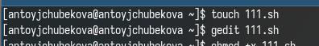
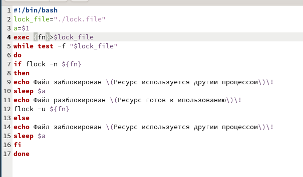
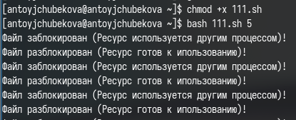
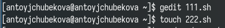
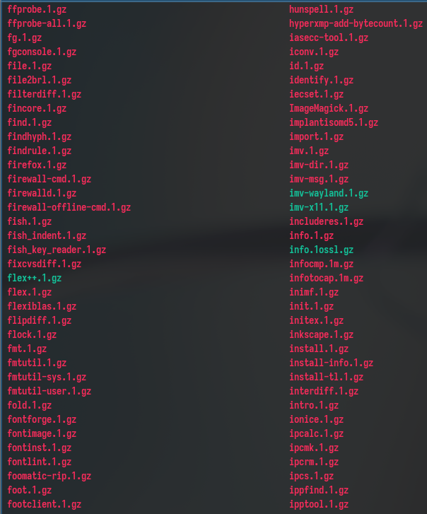
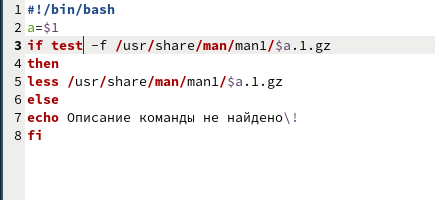
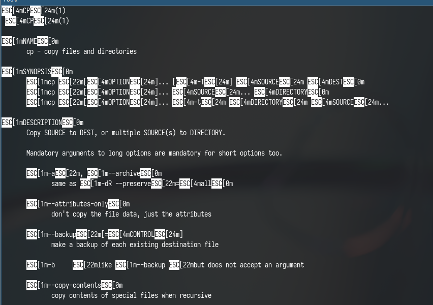
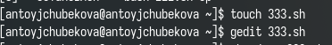
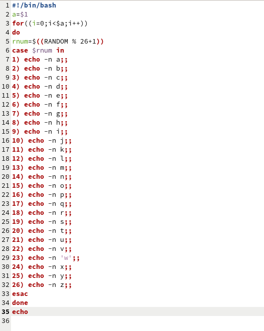
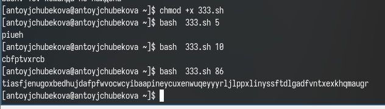

---
## Front matter
lang: ru-RU
title: Лабораторная рабта №14
subtitle: Операционные системы
author:
  - Тойчубекова Асель Нурлановна
institute:
  - Российский университет дружбы народов, Москва, Россия
date: 10 мая 2024

## i18n babel
babel-lang: russian
babel-otherlangs: english

## Formatting pdf
toc: false
toc-title: Содержание
slide_level: 2
aspectratio: 169
section-titles: true
theme: metropolis
header-includes:
 - \metroset{progressbar=frametitle,sectionpage=progressbar,numbering=fraction}
 - '\makeatletter'
 - '\beamer@ignorenonframefalse'
 - '\makeatother'
 
## Fonts
mainfont: PT Serif
romanfont: PT Serif
sansfont: PT Sans
monofont: PT Mono
mainfontoptions: Ligatures=TeX
romanfontoptions: Ligatures=TeX
sansfontoptions: Ligatures=TeX,Scale=MatchLowercase
monofontoptions: Scale=MatchLowercase,Scale=0.9
 
---

# Информация

## Докладчик

:::::::::::::: {.columns align=center}
::: {.column width="70%"}

  * Тойчубекова Асель Нурлановна
  * Студент НПИбд-02-23
  * факультет физико математических и естественных наук
  * Российский университет дружбы народов
  * [1032235033@rudn.ru](1032235033@rudn.ru)
  * <https://aseltoichubekova.github.io/ru/>

:::
::: {.column width="30%"}

:::
::::::::::::::

# Цель работы

## Цель работы

Целью данной лабораторной рабораторной работы является изучение основ программирования в оболочке OC Unix. Также научиться писать более сложные командные файлы с использованием логических управляющих конструкций и циклов.

## Задание

1. Написать командный файл, реализующий упрощённый механизм семафоров. Командный файл должен в течение некоторого времени t1 дожидаться освобождения ресурса, выдавая об этом сообщение, а дождавшись его освобождения, использовать его в течение некоторого времени t2<>t1, также выдавая информацию о том, что ресурс используется соответствующим командным файлом (процессом). Запустить командный файл в одном виртуальном терминале в фоновом режиме, перенаправив его вывод в другой,  в котором также запущен этот файл, но не фоновом, а в привилегированном режиме. Доработать программу так, чтобы имелась возможность взаимодействия трёх
и более процессов.

## Задание

2. Реализовать команду man с помощью командного файла. Изучите содержимое каталога /usr/share/man/man1. В нем находятся архивы текстовых файлов, содержащих справку по большинству установленных в системе программ и команд. Каждый архив можно открыть командой less сразу же просмотрев содержимое справки. Командный файл должен получать в виде аргумента командной строки название команды и в виде результата выдавать справку об этой команде или сообщение об отсутствии справки, если соответствующего файла нет в каталоге man1.
3. Используя встроенную переменную $RANDOM, напишите командный файл, генерирующий случайную последовательность букв латинского алфавита. Учтите, что $RANDOM выдаёт псевдослучайные числа в диапазоне от 0 до 32767.

# Выполнение лабораторной работы

## Выполнение лабораторной работы

Для начала создаю файл в котором буду писать саму програму и открываю его в редакторе gedit 

## Выполнение лабораторной работы

Редактирую файл, записывая командный файл, который реализует упрощенный механизм семофонов. Для этого я сперва создаю переменную в которой будет храниться адрес файла блокирования, а также переменную, которому присваивается значение первого аргумента. Дальше открыв файл блокирования с помощью команды exec и приваиваю ему свободный файловый дискриптор. Далее запускаю цикл, который будет работать пока файл блокирования существует и проверяю можно ли заблокировать фaйл c помощью команды flock -n, если да, то вывожу сообщение, что файл заблокирован, затем жду столько времени, сколько было указано в аргумете и разблокировываю файл с помощью команды flock -u, выведя об этом сообщение.Если же файл изначально был заблокирован, то я вывожу сообщения, что файл заблокирован и жду пока не истечет время, указанное в аргументе. 

## Выполнение лабораторной работы

## Выполнение лабораторной работы

Даю права на выполнение и запускаю программу, мы видим, что все работает корректно. 

## Выполнение лабораторной работы

Создаю файл для написания программы второго задания. 

## Выполнение лабораторной работы

Далее перехожу по ссылке /usr/share/man/man1 и вижу архивы текстовых файлов, содержащих справки о командах. 

## Выполнение лабораторной работы

Открываю созданный файл в редакторе и редактирую его, записывая командный файл, который реализует команду man, перейдя по адресу /usr/share/man/man1 и используя архивы данных о командах выполняет эту команду. Для этого сперва завожу переменную, которой присваиваю значения аргуметна, затем проверяю есть ли подходящий файл в man1, если есть с помощью команды less вывожу ее, а если нет вывожу соответствующее сообщение. 

## Выполнение лабораторной работы

## Выполнение лабораторной работы

Даю права на выполнение и запускаю программу, мы видим, что все работает правильно и программа выдает нам сообщение о команде. 

## Выполнение лабораторной работы

Создаю файл для написание программы для третьего задания и открываю его в редакторе. 

## Выполнение лабораторной работы

Редактирую файл, записывая командный файл, который используя встроенную переменную $RANDOM, генерирует случайную последовательность букв латинского алфавита. Для этого я создаю переменную и присваиваю ей значения аргумента, далее запускаю цикл, который будет продолжаться пока i не станет равным аргументу, запускаю RANDOM и в соответствии с получившимся числом с помощью командыcase  перебираю по цифрам все буквы, если совпадает вывожу на экран, в конце перехожу на новую строку.

## Выполнение лабораторной работы

## Выполнение лабораторной работы

Даю права на выполнение и запускаю программу, мы видим, что программа правильно работает и выводит латинские букввы. 

# Выводы

## Выводы

В ходе лабораторной работы №14  я изучила основы программирования в оболочке OC Unix. Также научилась писать более сложные командные файлы с использованием логических управляющих конструкций и циклов.

