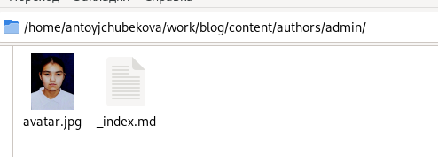

---
## Front matter
lang: ru-RU
title: Индивидуальный проект. Этап 2.
subtitle: Операционные системы.
author:
  - Тойчубекова Асель Нурлановна
institute:
  - Российский университет дружбы народов, Москва, Россия
date: 16 март 2024

## i18n babel
babel-lang: russian
babel-otherlangs: english

## Formatting pdf
toc: false
toc-title: Содержание
slide_level: 2
aspectratio: 169
section-titles: true
theme: metropolis
header-includes:
 - \metroset{progressbar=frametitle,sectionpage=progressbar,numbering=fraction}
 - '\makeatletter'
 - '\beamer@ignorenonframefalse'
 - '\makeatother'
 
## Fonts
mainfont: PT Serif
romanfont: PT Serif
sansfont: PT Sans
monofont: PT Mono
mainfontoptions: Ligatures=TeX
romanfontoptions: Ligatures=TeX
sansfontoptions: Ligatures=TeX,Scale=MatchLowercase
monofontoptions: Scale=MatchLowercase,Scale=0.9
 
---

# Информация

## Докладчик

:::::::::::::: {.columns align=center}
::: {.column width="70%"}

  * Тойчубекова Асель Нурлановна
  * Студент, НПИбд-02-23
  * факультет физико-математических и естественных наук.
  * Российский университет дружбы народов
  * [102235033@pfur.ru](102235033@pfur.ru)
  * <https://aseltoichubekova.github.io/ru/>

:::
::: {.column width="30%"}

:::
::::::::::::::

## Цель работы

 Целью индивдуального проекта, этап 2 является продолжение работы со своим сайтом. Редактировать его в соответствии с требованиями. Добавить данные о себе. Научить
 ся писать посты.
 
## Задание

1. Разместить фотографию владельца сайта.

2. Разместить краткое описание владельца сайта (Biography).

3. Добавить информацию об интересах (Interests).

4. Добавить информацию об образовании (Education).

5. Сделать пост по прошедшей неделе.

6. Добавить пост на тему управление версиями. Git.

## Теоретическое введение

Hugo - это статический генератор веб-сайтов HTML и CSS, написанный на Go. Он оптимизирован для обеспечения скорости, простоты использования и возможности настройки. Хьюго берет каталог с контентом и шаблонами и превращает их в полноценный HTML-сайт.

Hugo полагается на файлы Markdown с исходным кодом для метаданных, и вы можете запустить Hugo из любого каталога. Это хорошо работает для общих хостов и других систем, где у вас нет привилегированной учетной записи.

## Теоретическое введение

Hugo рендерит типичный веб-сайт среднего размера за доли секунды. Хорошее эмпирическое правило заключается в том, что каждый фрагмент контента отображается примерно за 1 миллисекунду.

Hugo разработан так, чтобы хорошо работать с любым типом веб-сайта, включая блоги, tumbles и docs.

## Теоретическое введение

Основные преимущества Hugo:

- Очень быстрый и гибкий \
- Для него легко настроить хостинг \
- Безопасный \
- Хорошая структура исходников \
- Возможность хранить содержимое в удобном формате (YAML, JSON или TOML) \
- Поддержка тем. Есть готовый набор тем, более 200 \
- Легко SEO-оптимизировать \
- i18n с коробки
- Хорошая поддержка таксономии \
- Быстрый в освоении. 

# Выполнение индивидуального проекта

## Выполнение индивидуального проекта

Размещаю свою фотографию на сайт, скопировав ее с внешнего компьютера 

## Выполнение индивидуального проекта

Заполняю данные о себе, в поля ввожу свое фамилие и имя, а также некоторые данные. 

## Выполнение индивидуального проекта

Заполняю данным об учебном заведении, в котором я обучаюсь, также ввожу краткое описание о себя в bio, которое будет выводится в конце моих постов. .

## Выполнение индивидуального проекта

Заполняю данные о своих интересах и образовании. 

## Выполнение индивидуального проекта

Заполняю данные о себе более развернуто.

## Выполнение индивидуального проекта

Далее запускаю локальный сайт с помощью команды hugo server и вижу, что на локальном сайте есть все изменения. 

## Выполнение индивидуального проекта

Создаю папку post1 в директории post, в ней будут храниться тексты пастов, изображения и др.

## Выполнение индивидуального проекта

Открываю index.md  и ззапалняю текст поста про прошедшую неделю. Заполняю поля с названием поста и комментарием к нему.

## Выполнение индивидуального проекта

Заполняю данные об авторе и указываю категорию week. 

## Выполнение индивидуального проекта

Запалня сам текст поста, рассказываю как прошла моя неделя. 

## Выполнение индивидуального проекта

Созаю папку post2 для написание в ней второго нашего поста на тему "Управления версиями. Git". 

## Выполнение индивидуального проекта

Открываю index.md  и запалняю текст поста про управления версиями git. Заполняю поля с названием поста и комментарием к нему. 

## Выполнение индивидуального проекта

Заполняю данные об авторе и указываю категорию week.

## Выполнение индивидуального проекта

Запалня сам текст поста, рассказываю как прошла моя неделя. 

## Выполнение индивидуального проекта

Используя команду hugo server  запускаю локальный сайт и вижу, что наши 2 поста были заргружены. 

## Выполнение индивидуального проекта

Сохроняю все изменения и отправляю их на github командами git add, git commit, git push. 

## Выполнение индивидуального проекта

Перехожу в public и тоже сохраняю изменения и отправляю их на github.

## Выполнение индивидуального проекта

Захожу на сайт через браузер внешнего компьютера и вижу, что сайт был преобразован.

## Выводы

В ходе выполнения 2 этапа игдивидуального проекта я научилась преобрпзовывать сайт, вносит свои данные, а также загружать посты.

## Список литературы{.unnumbered}

- https://esystem.rudn.ru/mod/page/view.php?id=1098933#org2151722.
