---
## Front matter
title: "Индивидуальный проект. Этап 2."
subtitle: "Операционные системы"
author: "Тойчубекова Асель Нурлановна"

## Generic otions
lang: ru-RU
toc-title: "Содержание"

## Bibliography
bibliography: bib/cite.bib
csl: pandoc/csl/gost-r-7-0-5-2008-numeric.csl

## Pdf output format
toc: true # Table of contents
toc-depth: 2
lof: true # List of figures
lot: true # List of tables
fontsize: 12pt
linestretch: 1.5
papersize: a4
documentclass: scrreprt
## I18n polyglossia
polyglossia-lang:
  name: russian
  options:
	- spelling=modern
	- babelshorthands=true
polyglossia-otherlangs:
  name: english
## I18n babel
babel-lang: russian
babel-otherlangs: english
## Fonts
mainfont: PT Serif
romanfont: PT Serif
sansfont: PT Sans
monofont: PT Mono
mainfontoptions: Ligatures=TeX
romanfontoptions: Ligatures=TeX
sansfontoptions: Ligatures=TeX,Scale=MatchLowercase
monofontoptions: Scale=MatchLowercase,Scale=0.9
## Biblatex
biblatex: true
biblio-style: "gost-numeric"
biblatexoptions:
  - parentracker=true
  - backend=biber
  - hyperref=auto
  - language=auto
  - autolang=other*
  - citestyle=gost-numeric
## Pandoc-crossref LaTeX customization
figureTitle: "Рис."
tableTitle: "Таблица"
listingTitle: "Листинг"
lofTitle: "Список иллюстраций"
lotTitle: "Список таблиц"
lolTitle: "Листинги"
## Misc options
indent: true
header-includes:
  - \usepackage{indentfirst}
  - \usepackage{float} # keep figures where there are in the text
  - \floatplacement{figure}{H} # keep figures where there are in the text
---

# Цель работы

 Целью индивдуального проекта, этап 2 является продолжение работы со своим сайтом. Редактировать его в соответствии с требованиями. Добавить данные о себе. Научить
 ся писать посты.
 
# Задание

1. Разместить фотографию владельца сайта.

2. Разместить краткое описание владельца сайта (Biography).

3. Добавить информацию об интересах (Interests).

4. Добавить информацию об образовании (Education).

5. Сделать пост по прошедшей неделе.

6. Добавить пост на тему управление версиями. Git.

# Теоретическое введение

Hugo - это статический генератор веб-сайтов HTML и CSS, написанный на Go. Он оптимизирован для обеспечения скорости, простоты использования и возможности настройки. Хьюго берет каталог с контентом и шаблонами и превращает их в полноценный HTML-сайт.

Hugo полагается на файлы Markdown с исходным кодом для метаданных, и вы можете запустить Hugo из любого каталога. Это хорошо работает для общих хостов и других систем, где у вас нет привилегированной учетной записи.

Hugo рендерит типичный веб-сайт среднего размера за доли секунды. Хорошее эмпирическое правило заключается в том, что каждый фрагмент контента отображается примерно за 1 миллисекунду.

Hugo разработан так, чтобы хорошо работать с любым типом веб-сайта, включая блоги, tumbles и docs.

Основные преимущества Hugo:

- Очень быстрый и гибкий \
- Для него легко настроить хостинг \
- Безопасный \
- Хорошая структура исходников \
- Возможность хранить содержимое в удобном формате (YAML, JSON или TOML) \
- Поддержка тем. Есть готовый набор тем, более 200 \
- Легко SEO-оптимизировать \
- i18n с коробки
- Хорошая поддержка таксономии \
- Быстрый в освоении. 

# Выполнение лабораторной работы

Размещаю свою фотографию на сайт, скопировав ее с внешнего компьютера (рис. [-@fig:001]).

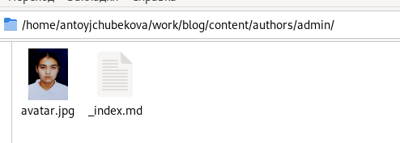{#fig:001 width=70%}

Заполняю данные о себе, в поля ввожу свое фамилие и имя, а также некоторые данные. (рис. [-@fig:002]).

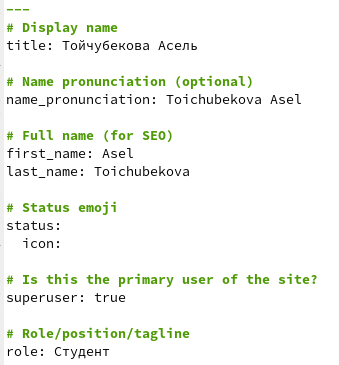{#fig:002 width=70%}

Заполняю данным об учебном заведении, в котором я обучаюсь, также ввожу краткое описание о себя в bio, которое будет выводится в конце моих постов. (рис. [-@fig:003]).

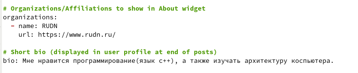{#fig:003 width=70%}

Заполняю данные о своих интересах и образовании. (рис. [-@fig:004]).

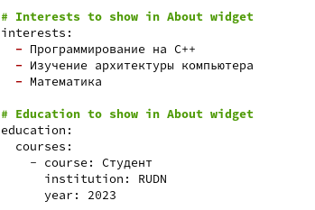{#fig:004 width=70%}

Заполняю данные о себе более развернуто. (рис. [-@fig:005]).

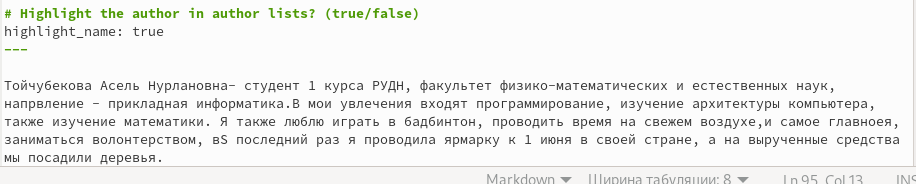{#fig:005 width=70%}

Далее запускаю локальный сайт с помощью команды hugo server и вижу, что на локальном сайте есть все изменения. (рис. [-@fig:006]).

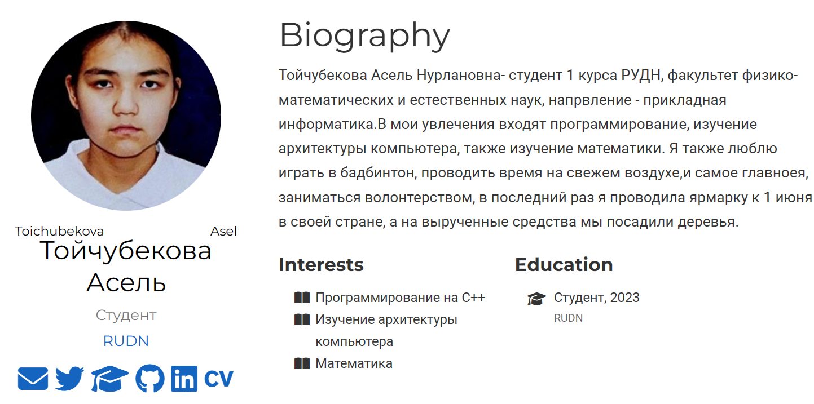{#fig:006 width=70%}

Создаю папку post1 в директории post, в ней будут храниться тексты пастов, изображения и др. (рис. [-@fig:007]).

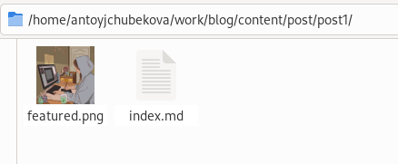{#fig:007 width=70%}

Открываю index.md  и ззапалняю текст поста про прошедшую неделю. Заполняю поля с названием поста и комментарием к нему. (рис. [-@fig:008]).

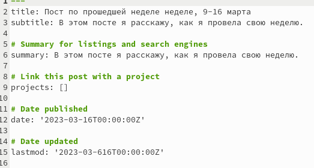{#fig:008 width=70%}

Заполняю данные об авторе и указываю категорию week. (рис. [-@fig:009]).

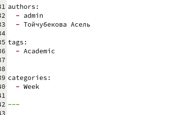{#fig:009 width=70%}

Запалня сам текст поста, рассказываю как прошла моя неделя. (рис. [-@fig:010]).

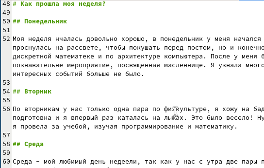{#fig:010 width=70%}

Созаю папку post2 для написание в ней второго нашего поста на тему "Управления версиями. Git". (рис. [-@fig:011]).

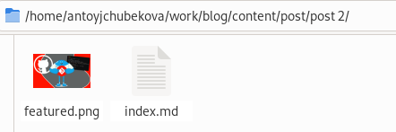{#fig:011 width=70%}

Открываю index.md  и запалняю текст поста про управления версиями git. Заполняю поля с названием поста и комментарием к нему. (рис. [-@fig:012]).

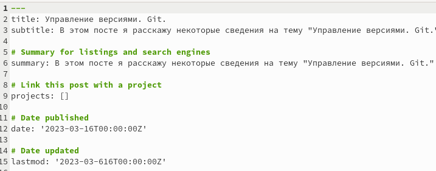{#fig:012 width=70%}

Заполняю данные об авторе и указываю категорию week. (рис. [-@fig:013]).

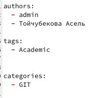{#fig:013 width=70%}

Запалня сам текст поста, рассказываю как прошла моя неделя. (рис. [-@fig:014]).

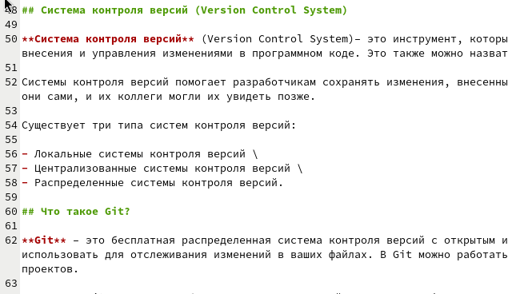{#fig:014 width=70%}

Используя команду hugo server  запускаю локальный сайт и вижу, что наши 2 поста были заргружены. (рис. [-@fig:015]).

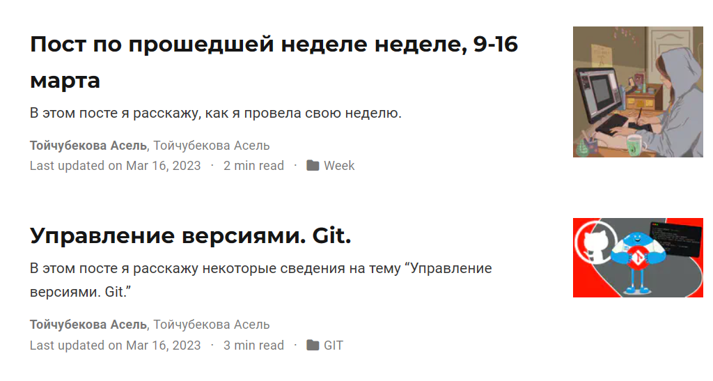{#fig:015 width=70%}

Сохроняю все изменения и отправляю их на github командами git add, git commit, git push. (рис. [-@fig:016]).

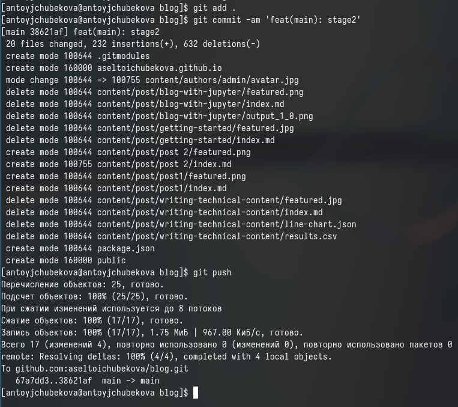{#fig:016 width=70%}

Перехожу в public и тоже сохраняю изменения и отправляю их на github. (рис. [-@fig:017]).

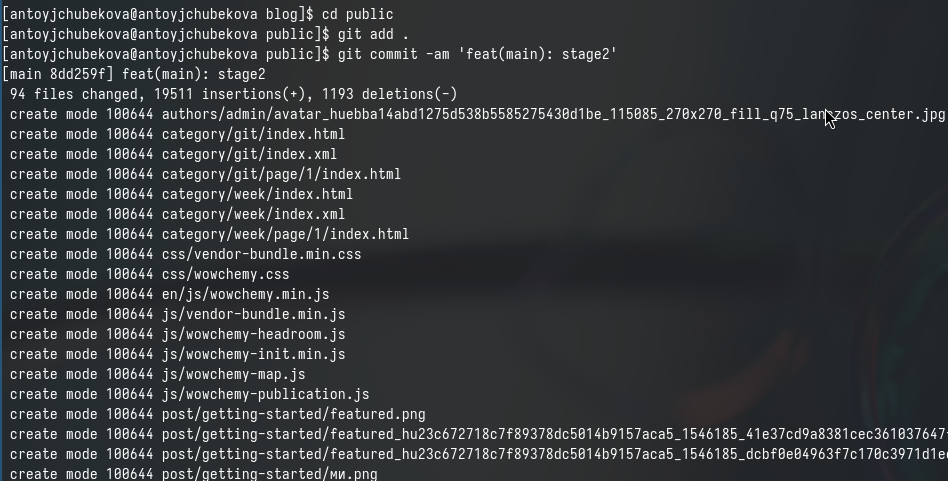{#fig:017 width=70%}

Захожу на сайт через браузер внешнего компьютера и вижу, что сайт был преобразован. (рис. [-@fig:018]).

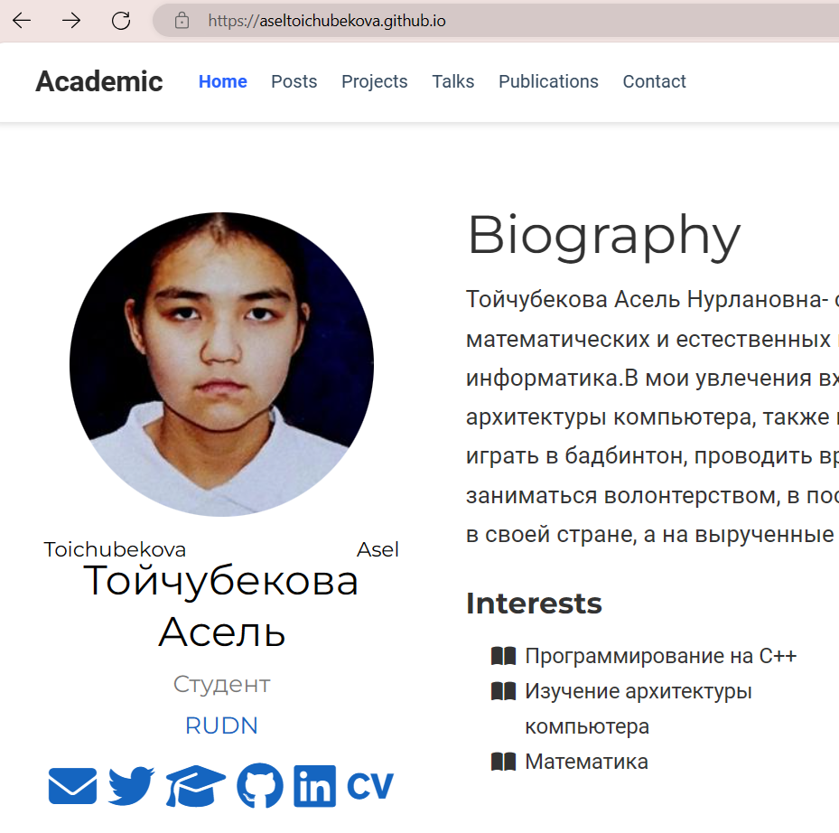{#fig:018 width=70%}

# Выводы

В ходе выполнения 2 этапа игдивидуального проекта я научилась преобрпзовывать сайт, вносит свои данные, а также загружать посты.

# Список литературы{.unnumbered}

- https://esystem.rudn.ru/mod/page/view.php?id=1098933#org2151722.
