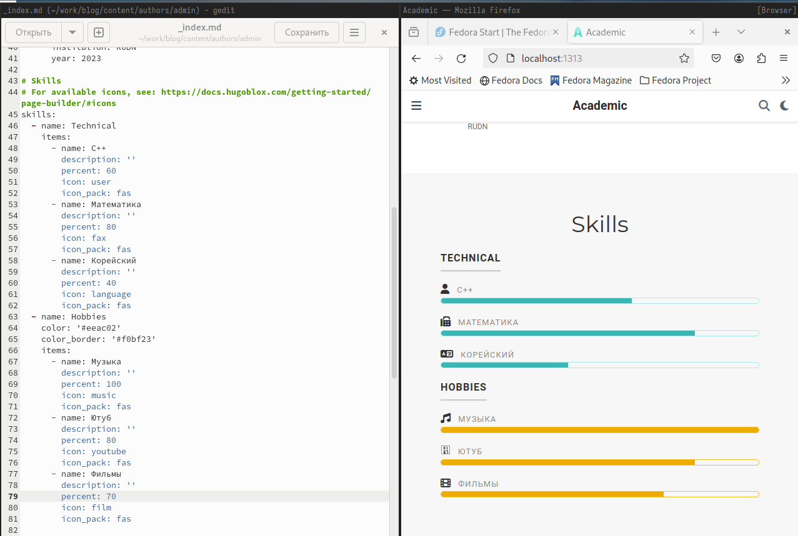

---
## Front matter
lang: ru-RU
title: Индивидуальный проект. Этап №3
subtitle: Операционные системы
author:
  - Тойчубекова Асель Нурлановна
institute:
  - Российский университет дружбы народов, Москва, Россия
date: 06 апрель 2024

## i18n babel
babel-lang: russian
babel-otherlangs: english

## Formatting pdf
toc: false
toc-title: Содержание
slide_level: 2
aspectratio: 169
section-titles: true
theme: metropolis
header-includes:
 - \metroset{progressbar=frametitle,sectionpage=progressbar,numbering=fraction}
 - '\makeatletter'
 - '\beamer@ignorenonframefalse'
 - '\makeatother'
 
## Fonts
mainfont: PT Serif
romanfont: PT Serif
sansfont: PT Sans
monofont: PT Mono
mainfontoptions: Ligatures=TeX
romanfontoptions: Ligatures=TeX
sansfontoptions: Ligatures=TeX,Scale=MatchLowercase
monofontoptions: Scale=MatchLowercase,Scale=0.9
 
---

# Информация

## Докладчик

:::::::::::::: {.columns align=center}
::: {.column width="70%"}

  * Тойчубекова Асель Нурлановна
  * Студент НПИбд-02-23
  * факультет физико-математических и естественных наук
  * Российский университет дружбы народов
  * [1032235033@pfur.ru](1032235033@pfur.ru)
  * <https://aseltoichubekova.github.io/ru/>

:::
::: {.column width="30%"}

:::
::::::::::::::

## Цель работы

Цель Индивидуального проекта №3 продолжить работу со своим сайтом. Редактировать его в соответствии требованиями. Добавить информацию о своих навыках, опыте и достижениях, а также опубликовать еще 2 поста

## Задание

- Добавить информацию о навыках (Skill) \
- Добавить информацию об опыте (Experience)\
- Добавить информацию о достижениях (Accomplishments)
- Сделать пост по прошедшей неделе \
- Сделать пост на тему "Язык разметки Markdown" 

# Выполнение индивидуального проекта

## Выполнение индивидуального проекта

Для начала зайду в терминал и перейду в каталог work/blog. Далее ввожу команду hugo и hugo server для запуска локального сервера, чтобы отслеживать наши измнения.

## Выполнение индивидуального проекта

Далее перехожу в каталог work/blog/content/author для дальнейшей работы в нем. 

## Выполнение индивидуального проекта

Открываю файл _index.md и приступаю к ее редактированию. Нахожу раздел Skills и Hobbies и заполняю их. На правой понели экрана мы можем наблюдать все изменения на сайте. 

## Выполнение индивидуального проекта

Иконки для навыков и хобби находила в интернете,  нашла официальную библиотеку иконок fas, также можно найти и иконки из библиотеки fab. 

## Выполнение индивидуального проекта

Затем перехожу возвращаюсь в каталог content и там открываю файл _index.md  для редактирования и заполнения разделов с опытом и достижениями. Заполняю раздел с опытом, а правой части экрана мы можем наблюдать все изменения. Здесь также можно добавить иконки, скачав изображения формата svg и поместив в директорию ~/work/blig/assets/media/icons/brands. 

Ниже в этом же файле нахожу раздел с достижениями- Accomplishments, указывая ссылки на имеющиеся у меня сертификаты, а также ссылки на сайты организаций олимпиад, и др заполняю этот раздел. Здесь также с правой стороны экрана мы можем наблюдать все сделанные изменения. 

## Выполнение индивидуального проекта

Дальше перехожу в каталог work/blog/post и создаю папку с постом и изображениями к этому посту, загружаю, понравившееся изображеня из интернета. 

## Выполнение индивидуального проекта

Откываю файл index.md  для редактирования и записываю в него пост по прошедшей неделе, сохраняю и закрываю его. 

## Выполнение индивидуального проекта

Перейдля в браузер, на наш сайт мы видим, что пост был удачно залит на сайт.

## Выполнение индивидуального проекта

Создаю еще одну папку с постом и изображениями к этому посту для нового поста на тему "Язык разметки Markdown", загружаю изображение из интеренета. 

## Выполнение индивидуального проекта

Откываю файл index.md  для редактирования и записываю в него пост на тему "Язык разметки Markdown", сохраняю и закрываю его. 

## Выполнение индивидуального проекта

Переходим в браузер, на наш сайт и видим, что пост был успешно загружен на сайт. 

## Выполнение индивидуального проекта

Созраняю и залтваю все изменения на гитхаб. 

## Выполнение индивидуального проекта

Далее перехожу в каталог blog/puplic и отправляю изменения на гитхаб, чтобы глобальный сайт тоже был обнавлен. 

## Выполнение индивидуального проекта

Перехожу во внешний браузер и проверяю корректность всех изменений и вижу, что все верно!

## Выводы

В ходе выполнения третьего этапа индивидуального проекта я продолжила работу со своим сайтом. Редактировала его в соответствии требованиями. Добавила информацию о своих навыках, опыте и достижениях, а также опубликовала еще 2 поста

