---
## Front matter
title: "Индивидуальный проект. Этап №3"
subtitle: "Операционные системы"
author: "Тойчубекова Асель Нурлановна"

## Generic otions
lang: ru-RU
toc-title: "Содержание"

## Bibliography
bibliography: bib/cite.bib
csl: pandoc/csl/gost-r-7-0-5-2008-numeric.csl

## Pdf output format
toc: true # Table of contents
toc-depth: 2
lof: true # List of figures
lot: true # List of tables
fontsize: 12pt
linestretch: 1.5
papersize: a4
documentclass: scrreprt
## I18n polyglossia
polyglossia-lang:
  name: russian
  options:
	- spelling=modern
	- babelshorthands=true
polyglossia-otherlangs:
  name: english
## I18n babel
babel-lang: russian
babel-otherlangs: english
## Fonts
mainfont: PT Serif
romanfont: PT Serif
sansfont: PT Sans
monofont: PT Mono
mainfontoptions: Ligatures=TeX
romanfontoptions: Ligatures=TeX
sansfontoptions: Ligatures=TeX,Scale=MatchLowercase
monofontoptions: Scale=MatchLowercase,Scale=0.9
## Biblatex
biblatex: true
biblio-style: "gost-numeric"
biblatexoptions:
  - parentracker=true
  - backend=biber
  - hyperref=auto
  - language=auto
  - autolang=other*
  - citestyle=gost-numeric
## Pandoc-crossref LaTeX customization
figureTitle: "Рис."
tableTitle: "Таблица"
listingTitle: "Листинг"
lofTitle: "Список иллюстраций"
lotTitle: "Список таблиц"
lolTitle: "Листинги"
## Misc options
indent: true
header-includes:
  - \usepackage{indentfirst}
  - \usepackage{float} # keep figures where there are in the text
  - \floatplacement{figure}{H} # keep figures where there are in the text
---

# Цель работы

Цель Индивидуального проекта №3 продолжить работу со своим сайтом. Редактировать его в соответствии требованиями. Добавить информацию о своих навыках, опыте и достижениях, а также опубликовать еще 2 поста

# Задание

- Добавить информацию о навыках (Skill) \
- Добавить информацию об опыте (Experience)\
- Добавить информацию о достижениях (Accomplishments)
- Сделать пост по прошедшей неделе \
- Сделать пост на тему "Язык разметки Markdown" 

# Выполнение индивидуального проекта

Для начала зайду в терминал и перейду в каталог work/blog. Далее ввожу команду hugo и hugo server для запуска локального сервера, чтобы отслеживать наши измнения (рис. [-@fig:001]).

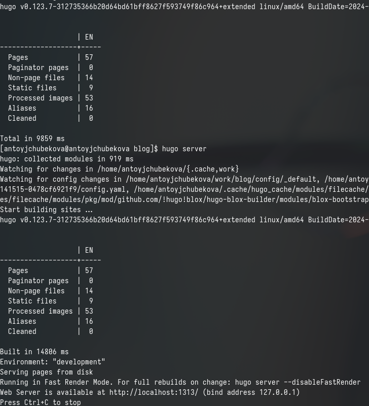{#fig:001 width=70%}

Далее перехожу в каталог work/blog/content/author для дальнейшей работы в нем. (рис. [-@fig:002]).

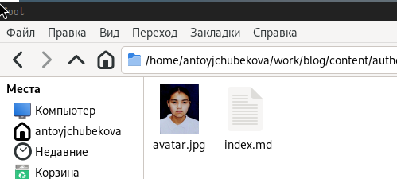{#fig:002 width=70%}

Открываю файл _index.md и приступаю к ее редактированию. Нахожу раздел Skills и Hobbies и заполняю их. На правой понели экрана мы можем наблюдать все изменения на сайте. (рис. [-@fig:003]).

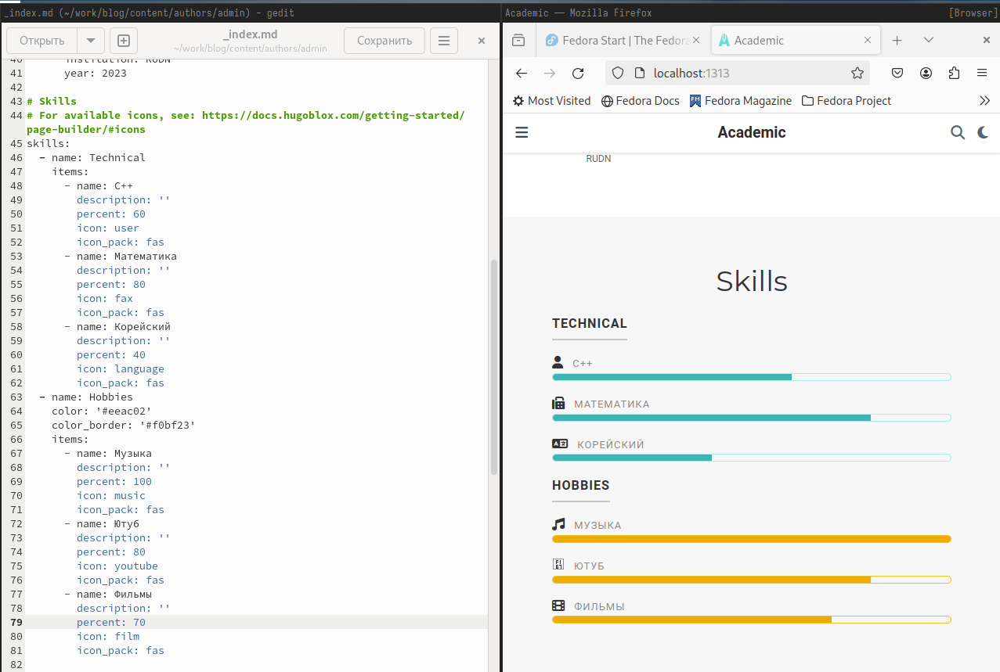{#fig:003 width=70%}

Иконки для навыков и хобби находила в интернете,  нашла официальную библиотеку иконок fas, также можно найти и иконки из библиотеки fab.  (рис. [-@fig:004]).

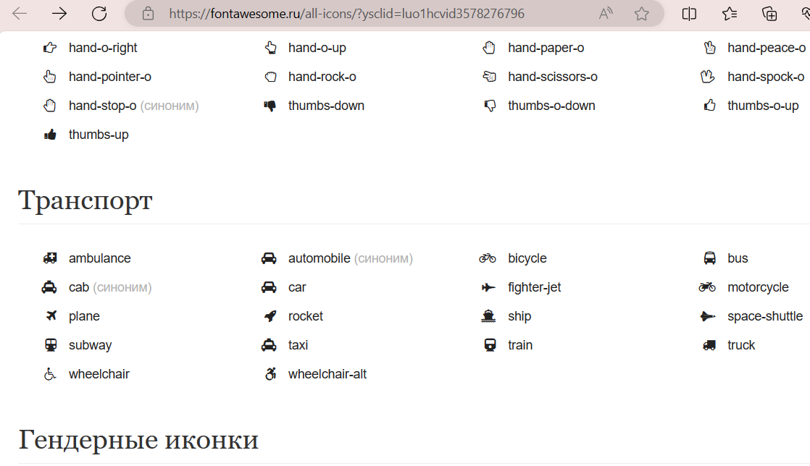{#fig:004 width=70%}

Затем перехожу возвращаюсь в каталог content и там открываю файл _index.md  для редактирования и заполнения разделов с опытом и достижениями. Заполняю раздел с опытом, а правой части экрана мы можем наблюдать все изменения. (рис. [-@fig:005]). Здесь также можно добавить иконки, скачав изображения формата svg и поместив в директорию ~/work/blig/assets/media/icons/brands. 

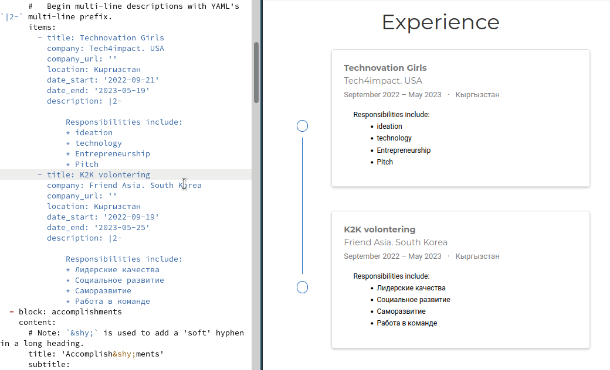{#fig:005 width=70%}

Ниже в этом же файле нахожу раздел с достижениями- Accomplishments, указывая ссылки на имеющиеся у меня сертификаты, а также ссылки на сайты организаций олимпиад, и др заполняю этот раздел. Здесь также с правой стороны экрана мы можем наблюдать все сделанные изменения. (рис. [-@fig:006]). 

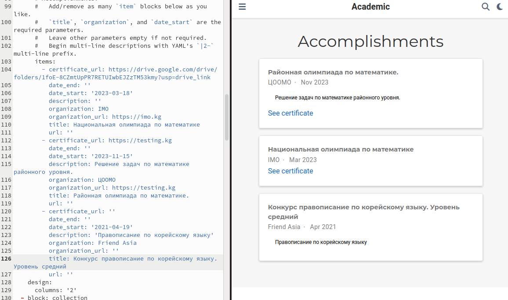{#fig:006 width=70%}

Дальше перехожу в каталог work/blog/post и создаю папку с постом и изображениями к этому посту, загружаю, понравившееся изображеня из интернета. (рис. [-@fig:007]).

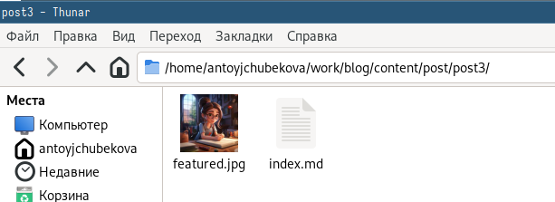{#fig:007 width=70%}

Откываю файл index.md  для редактирования и записываю в него пост по прошедшей неделе, сохраняю и закрываю его. (рис. [-@fig:008]).

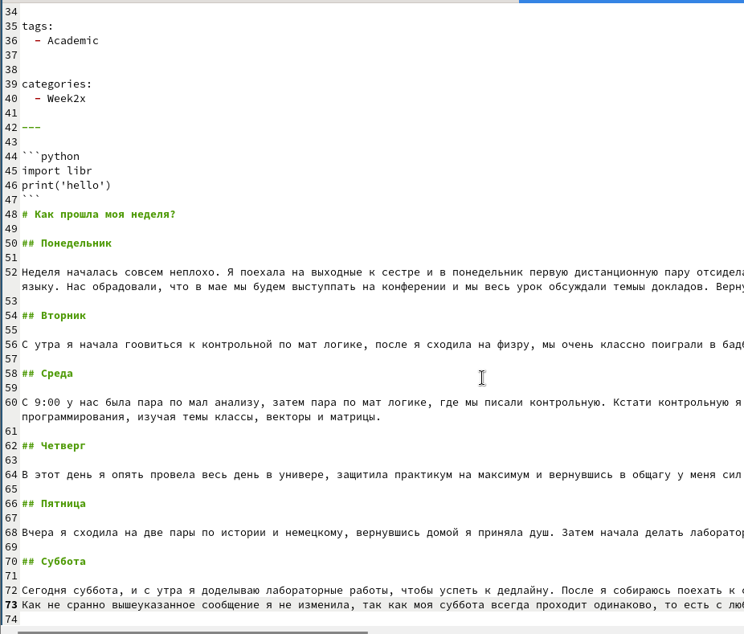{#fig:008 width=70%}

Перейдля в браузер, на наш сайт мы видим, что пост был удачно залит на сайт.(рис. [-@fig:009]).

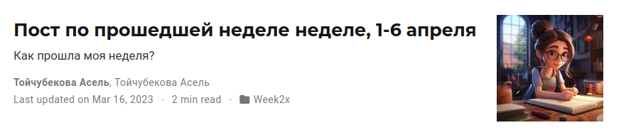{#fig:009 width=70%}

Создаю еще одну папку с постом и изображениями к этому посту для нового поста на тему "Язык разметки Markdown", загружаю изображение из интеренета. (рис. [-@fig:010]).

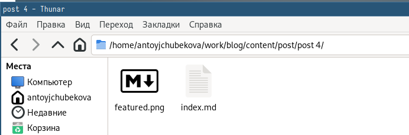{#fig:010 width=70%}

Откываю файл index.md  для редактирования и записываю в него пост на тему "Язык разметки Markdown", сохраняю и закрываю его. (рис. [-@fig:011]).

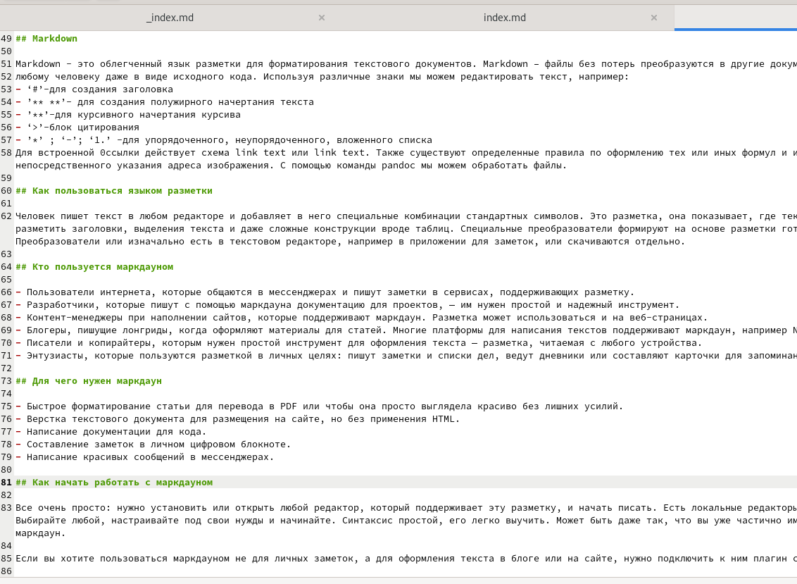{#fig:011 width=70%}

Переходим в браузер, на наш сайт и видим, что пост был успешно загружен на сайт.  (рис. [-@fig:012]).

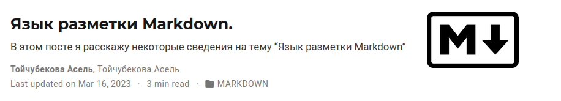{#fig:012 width=70%}

Созраняю и залтваю все изменения на гитхаб.  (рис. [-@fig:013]).

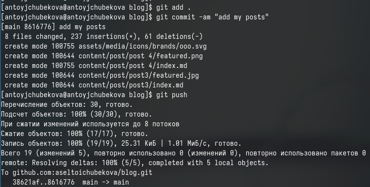{#fig:013 width=70%}

Далее перехожу в каталог blog/puplic и отправляю изменения на гитхаб, чтобы глобальный сайт тоже был обнавлен.  (рис. [-@fig:014]).

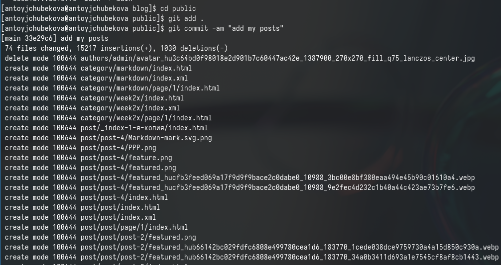{#fig:014 width=70%}

Перехожу во внешний браузер и проверяю корректность всех изменений и вижу, что все верно.  (рис. [-@fig:015]).

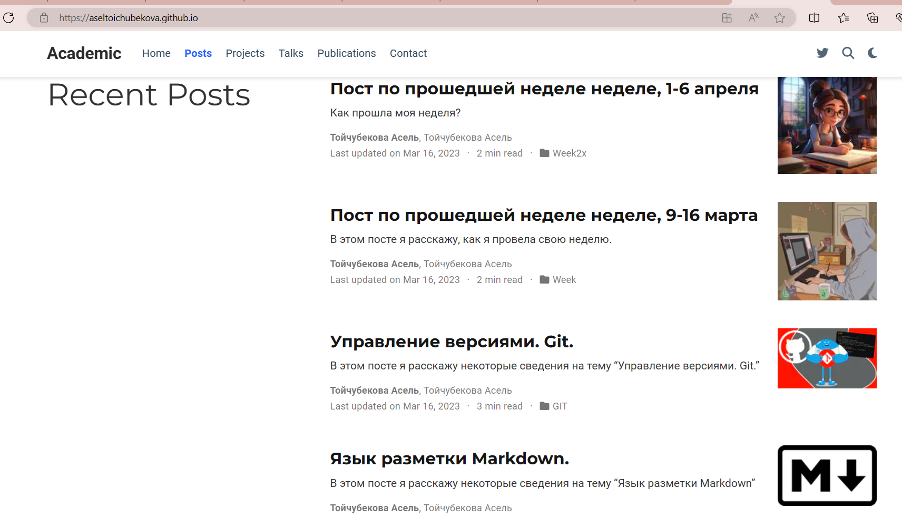{#fig:015 width=70%}

# Выводы

В ходе выполнения третьего этапа индивидуального проекта я продолжила работу со своим сайтом. Редактировала его в соответствии требованиями. Добавила информацию о своих навыках, опыте и достижениях, а также опубликовала еще 2 поста

