---
## Front matter
lang: ru-RU
title: Индивидуальный проект. Этап 4
subtitle: Операционные системы.
author:
  - Тойчубекова Асель Нурлановна
institute:
  - Российский университет дружбы народов, Москва, Россия
date: 27 апреля 2024

## i18n babel
babel-lang: russian
babel-otherlangs: english

## Formatting pdf
toc: false
toc-title: Содержание
slide_level: 2
aspectratio: 169
section-titles: true
theme: metropolis
header-includes:
 - \metroset{progressbar=frametitle,sectionpage=progressbar,numbering=fraction}
 - '\makeatletter'
 - '\beamer@ignorenonframefalse'
 - '\makeatother'
 
## Fonts
mainfont: PT Serif
romanfont: PT Serif
sansfont: PT Sans
monofont: PT Mono
mainfontoptions: Ligatures=TeX
romanfontoptions: Ligatures=TeX
sansfontoptions: Ligatures=TeX,Scale=MatchLowercase
monofontoptions: Scale=MatchLowercase,Scale=0.9
 
---

# Информация

## Докладчик

:::::::::::::: {.columns align=center}
::: {.column width="70%"}

  * Тойчубекова Асель Нурлановна
  * Студент НПИбд-02-23
  * факультет физико математических и естественных наук
  * Российский университет дружбы народов
  * [1032235033@pfur.ru](1032235033@pfur.ru)
  * <https://aseltoichubekova.github.io/ru/>

:::
::: {.column width="30%"}

:::
::::::::::::::

## Цель работы

Целью данной работы является продолжить работу  над индивидуальным проектом. Выполнить все задания, добавив данные на свой сайт о социальных сетях.

## Задание

- Зарегистрироваться на соответствующих ресурсах и разместить на них ссылки на сайт
- Опубликовать пост по прошедшей неделе
- Опубликовать пост про написание отчета

# Выполнение лабораторной работы

## Выполнение лабораторной работы

Для начала перейду в каталог ~/work/blog/content/authors/admin и открываю файл index.md для дальнейшего редактирования. 

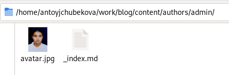

## Выполнение лабораторной работы

Встаяляю ссылки на ресурсы и соответствующие им иконки, предварительно зарегистрировавшись на этих сайтах. Иконки я брала с официальной библиотеки fab/fas. 

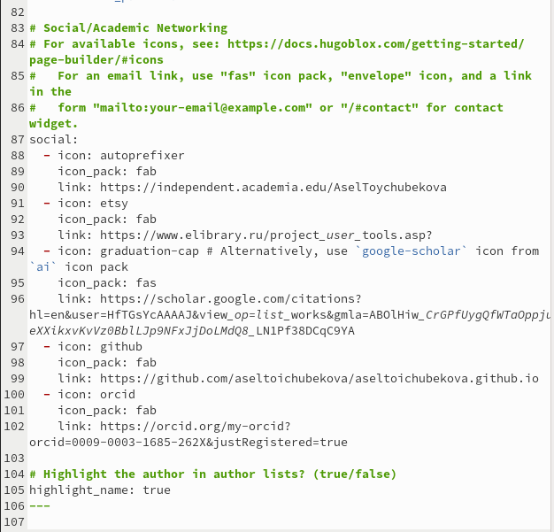

## Выполнение лабораторной работы

Дальше я ввожу команды hugo hugo server соответственно и загружаю свой сайт, мы можемзаметить, что все изменения удачно ссохранены. 

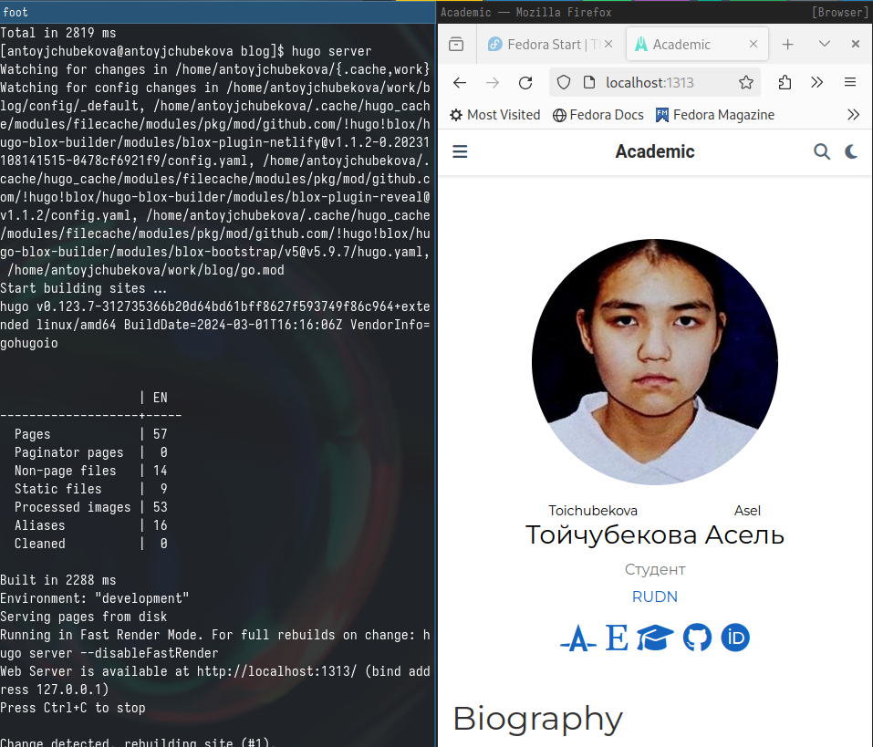

## Выполнение лабораторной работы

Добавляю папку в каталоге post для написание поста по прошедшей неделе и добовляю соответствующие картинки. 

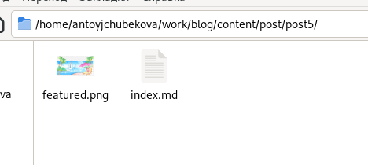

## Выполнение лабораторной работы

Открываю файл index.md и пишу пост по прошедшей неделе. 

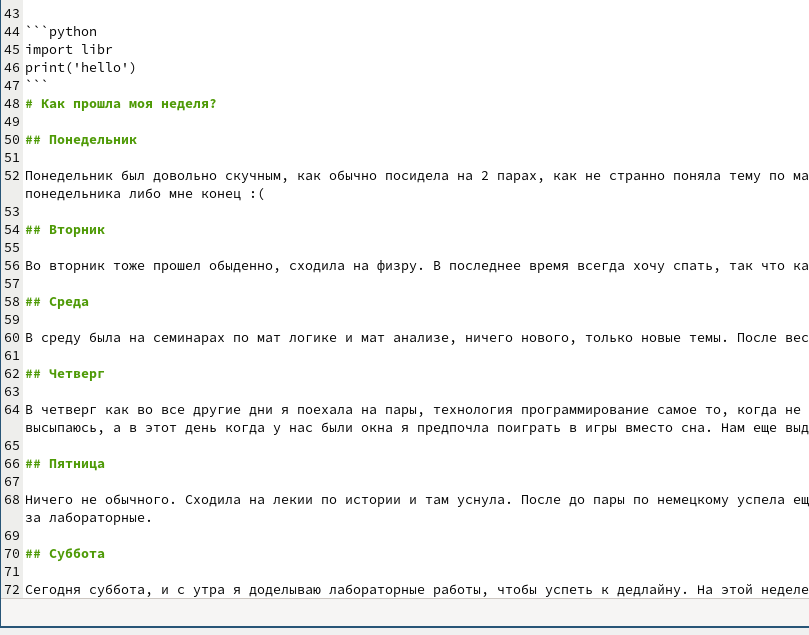

## Выполнение лабораторной работы

Загрузив сайт мы видим, что пост был удачно опубликован. 

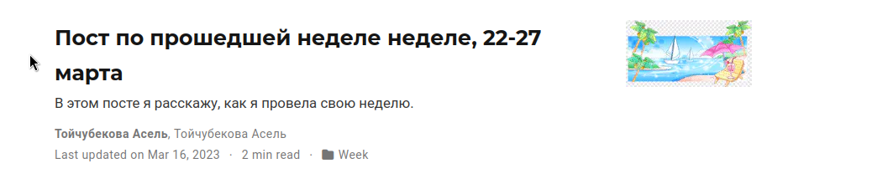

## Выполнение лабораторной работы

Добавляю папку в каталоге post для написание поста на выбор, на тему "Написание отчета" и добавляю соответствующие каринки. 

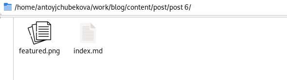

## Выполнение лабораторной работы

Открываю файл index.md и пишу пост на тему "Написание отчета". 

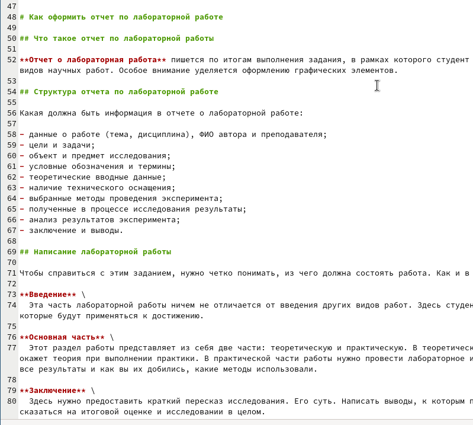

## Выполнение лабораторной работы

Загрузив сайт мы видим, что пост был удачно опубликован. 

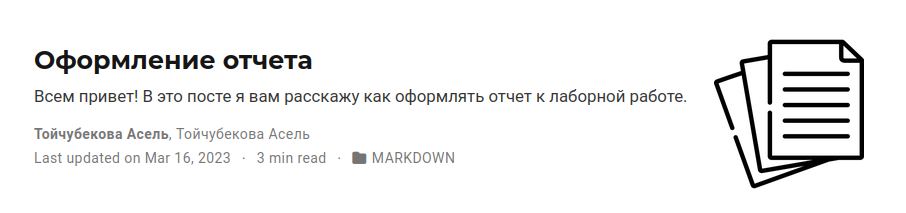

## Выполнение лабораторной работы

Загружаю все изменения на гитхаб. Также перехожу в деректорию blog/puplic и тут тоже загружаю изменения на гитхаб. 

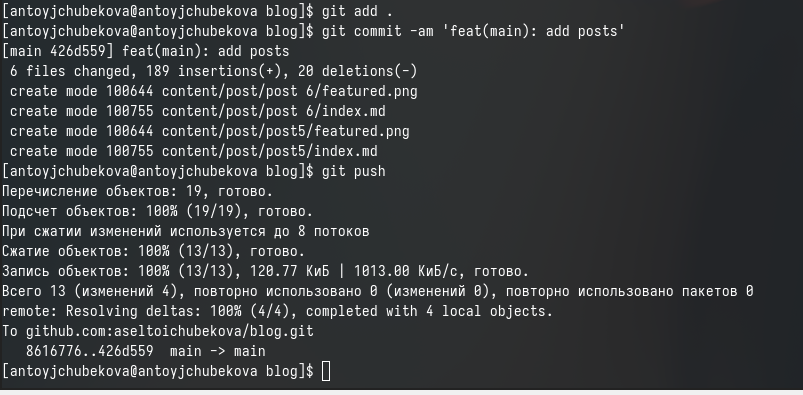

## Выполнение лабораторной работы

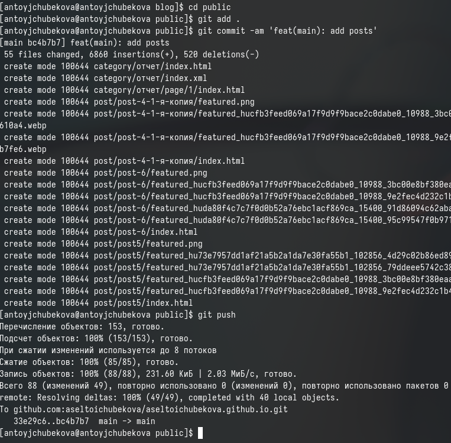

## Выполнение лабораторной работы

Захожу на сайт с внешнего браузера, мы видим, что все успешно отредактировано и все изменения осуществлены. 

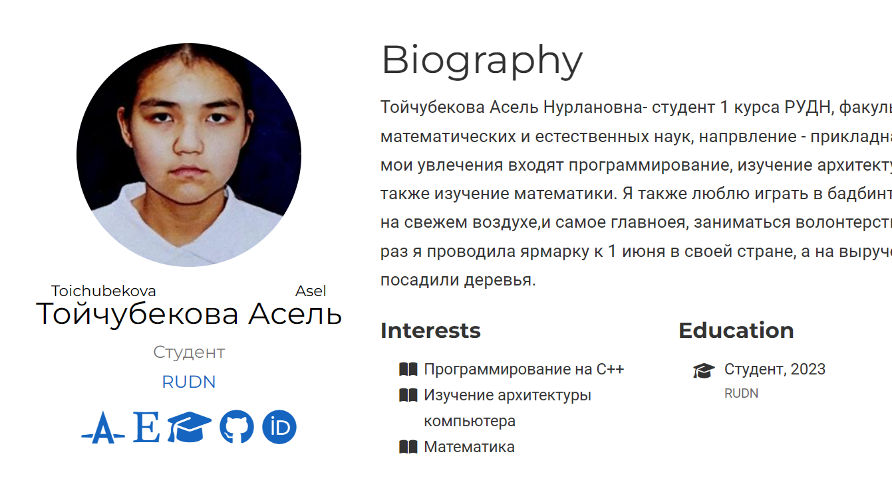

## Выполнение лабораторной работы

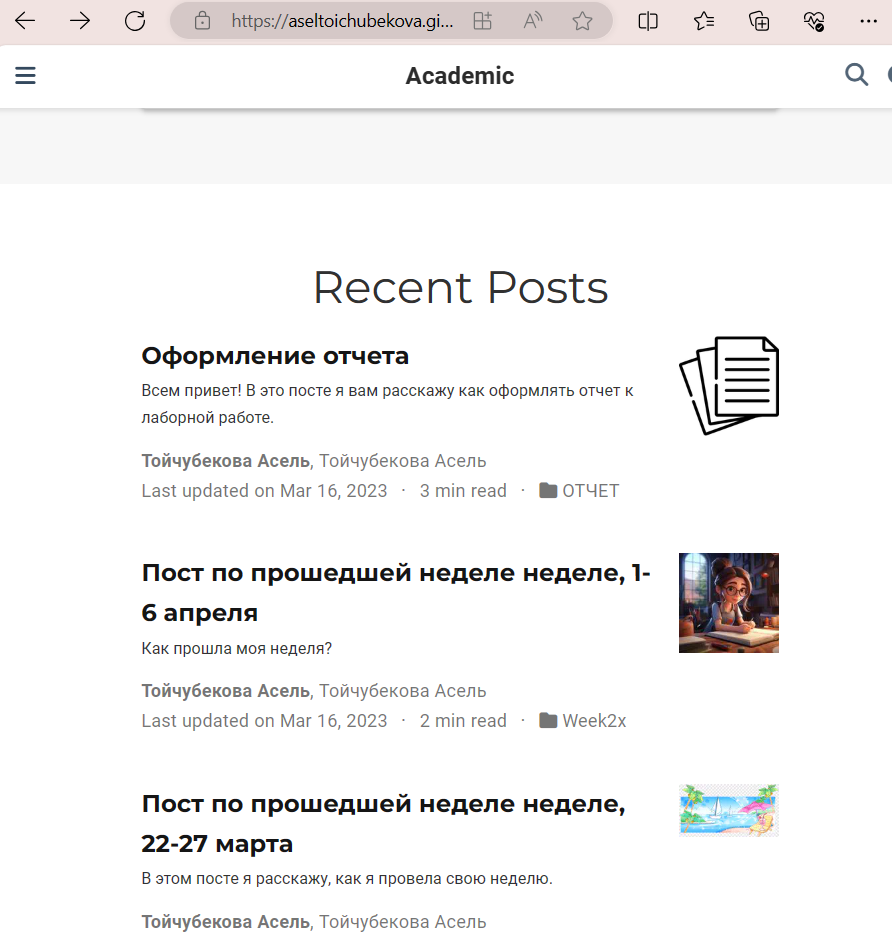

## Выводы

В ходе выполнения 4 ого этапа индивидуальной работы я зарегистрировалась на многих ресурсах и добавила информаию о них на мой сайт. Также написала пост по прошедшей неделе и пост по выбору. Получила практические навыки по работе с hugo.

