---
## Front matter
title: "Индивидуальный проект. Этап 4"
subtitle: "Операционные системы"
author: "Тойчубекова Асель Нурлановна"

## Generic otions
lang: ru-RU
toc-title: "Содержание"

## Bibliography
bibliography: bib/cite.bib
csl: pandoc/csl/gost-r-7-0-5-2008-numeric.csl

## Pdf output format
toc: true # Table of contents
toc-depth: 2
lof: true # List of figures
lot: true # List of tables
fontsize: 12pt
linestretch: 1.5
papersize: a4
documentclass: scrreprt
## I18n polyglossia
polyglossia-lang:
  name: russian
  options:
	- spelling=modern
	- babelshorthands=true
polyglossia-otherlangs:
  name: english
## I18n babel
babel-lang: russian
babel-otherlangs: english
## Fonts
mainfont: PT Serif
romanfont: PT Serif
sansfont: PT Sans
monofont: PT Mono
mainfontoptions: Ligatures=TeX
romanfontoptions: Ligatures=TeX
sansfontoptions: Ligatures=TeX,Scale=MatchLowercase
monofontoptions: Scale=MatchLowercase,Scale=0.9
## Biblatex
biblatex: true
biblio-style: "gost-numeric"
biblatexoptions:
  - parentracker=true
  - backend=biber
  - hyperref=auto
  - language=auto
  - autolang=other*
  - citestyle=gost-numeric
## Pandoc-crossref LaTeX customization
figureTitle: "Рис."
tableTitle: "Таблица"
listingTitle: "Листинг"
lofTitle: "Список иллюстраций"
lotTitle: "Список таблиц"
lolTitle: "Листинги"
## Misc options
indent: true
header-includes:
  - \usepackage{indentfirst}
  - \usepackage{float} # keep figures where there are in the text
  - \floatplacement{figure}{H} # keep figures where there are in the text
---

# Цель работы

Целью данной работы является продолжить работу  над индивидуальным проектом. Выполнить все задания, добавив данные на свой сайт о социальных сетях.

# Задание

- Зарегистрироваться на соответствующих ресурсах и разместить на них ссылки на сайт
- Опубликовать пост по прошедшей неделе
- Опубликовать пост про написание отчета

# Выполнение лабораторной работы

Для начала перейду в каталог ~/work/blog/content/authors/admin и открываю файл index.md для дальнейшего редактирования.  (рис. [-@fig:001]).

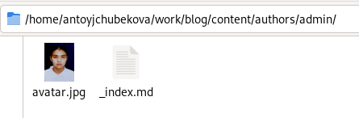{#fig:001 width=70%}

Встаяляю ссылки на ресурсы и соответствующие им иконки, предварительно зарегистрировавшись на этих сайтах. Иконки я брала с официальной библиотеки fab/fas. (рис. [-@fig:002]).

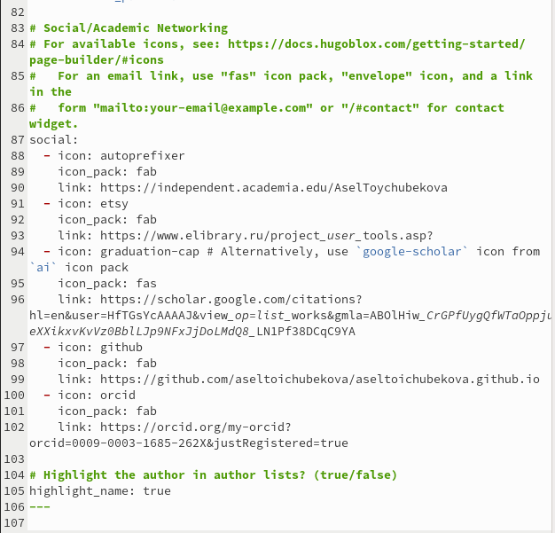{#fig:002 width=70%}

Дальше я ввожу команды hugo hugo server соответственно и загружаю свой сайт, мы можемзаметить, что все изменения удачно ссохранены. (рис. [-@fig:003]).

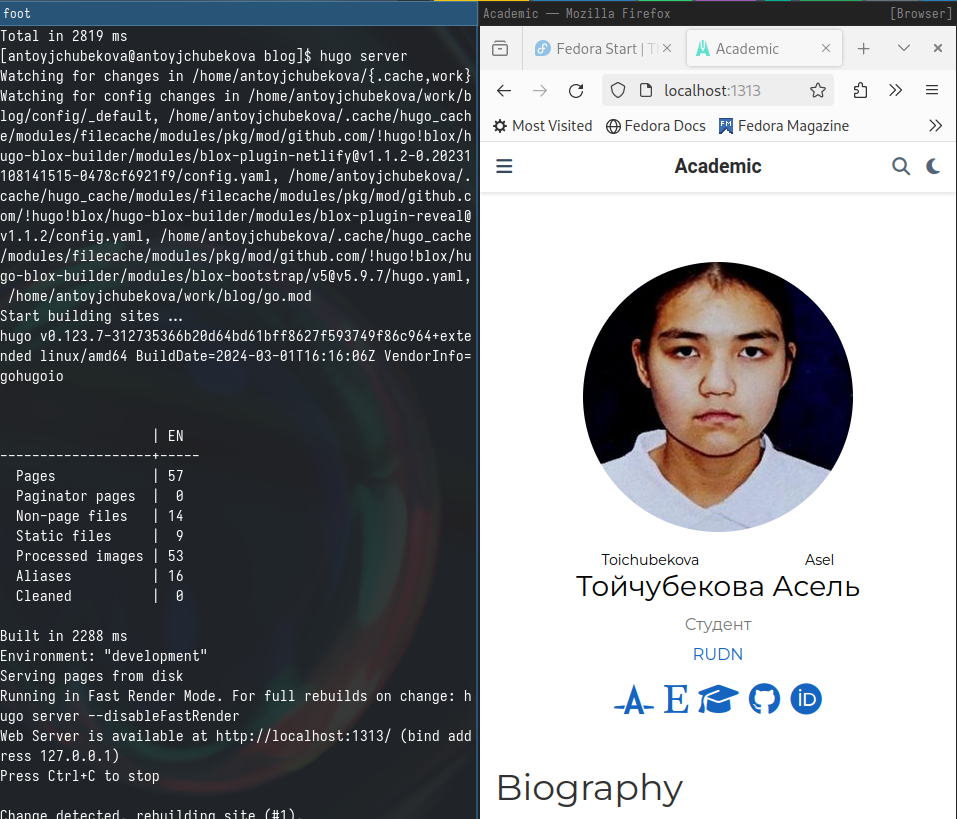{#fig:003 width=70%}

Добавляю папку в каталоге post для написание поста по прошедшей неделе и добовляю соответствующие картинки. (рис. [-@fig:004]).

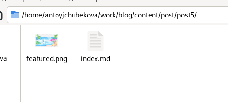{#fig:004 width=70%}

Открываю файл index.md и пишу пост по прошедшей неделе. (рис. [-@fig:005]).

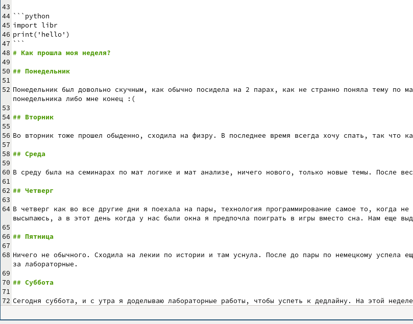{#fig:005 width=70%}

Загрузив сайт мы видим, что пост был удачно опубликован. (рис. [-@fig:006]).

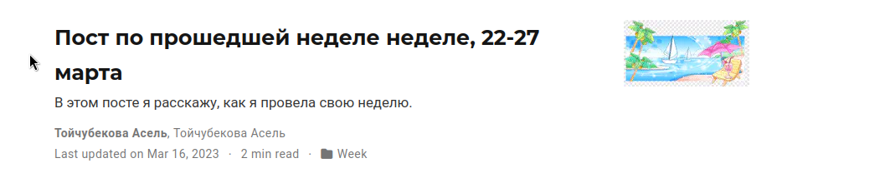{#fig:006 width=70%}

Добавляю папку в каталоге post для написание поста на выбор, на тему "Написание отчета" и добавляю соответствующие каринки. (рис. [-@fig:007]).

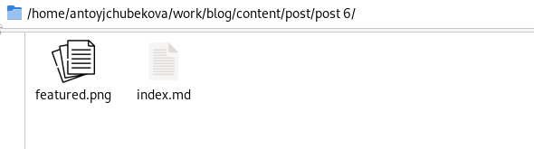{#fig:007 width=70%} 

Открываю файл index.md и пишу пост на тему "Написание отчета". (рис. [-@fig:008]).

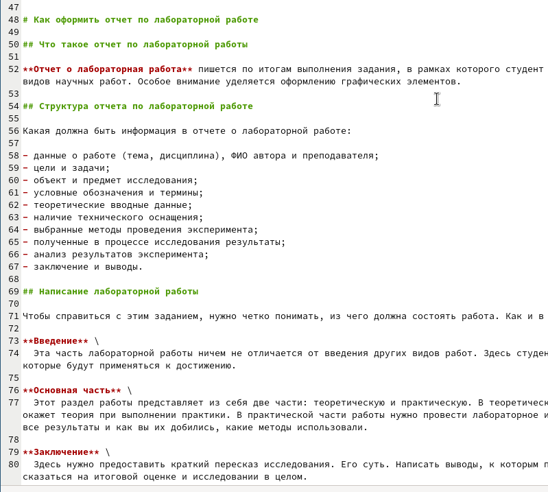{#fig:008 width=70%}

Загрузив сайт мы видим, что пост был удачно опубликован. (рис. [-@fig:009]).

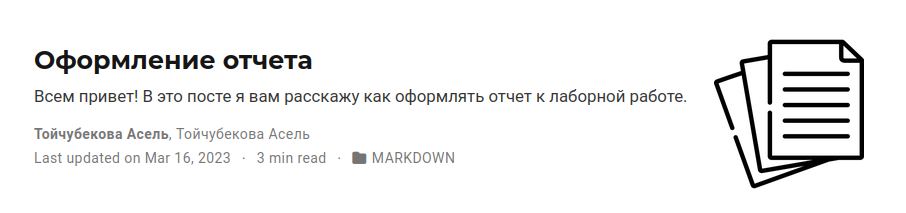{#fig:009 width=70%}

Загружаю все изменения на гитхаб. (рис. [-@fig:010]). Также перехожу в деректорию blog/puplic и тут тоже загружаю изменения на гитхаб. (рис. [-@fig:011])

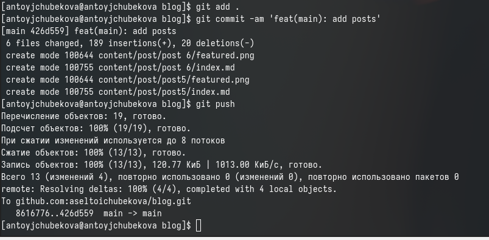{#fig:010 width=70%}

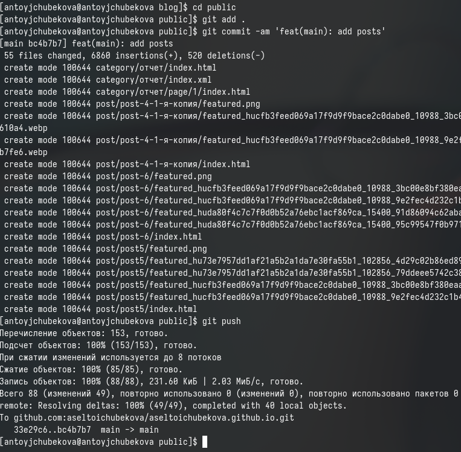{#fig:011 width=70%}

Захожу на сайт с внешнего браузера, мы видим, что все успешно отредактировано и все изменения осуществлены. (рис. [-@fig:012]) и (рис. [-@fig:013])

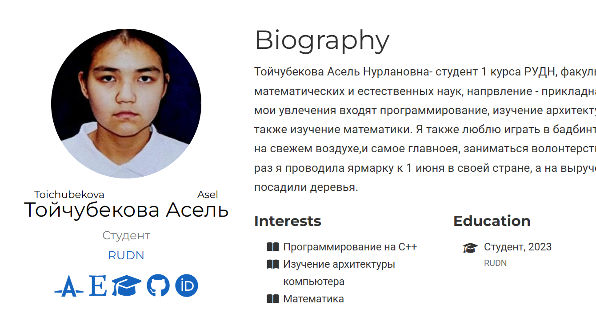{#fig:012 width=70%}

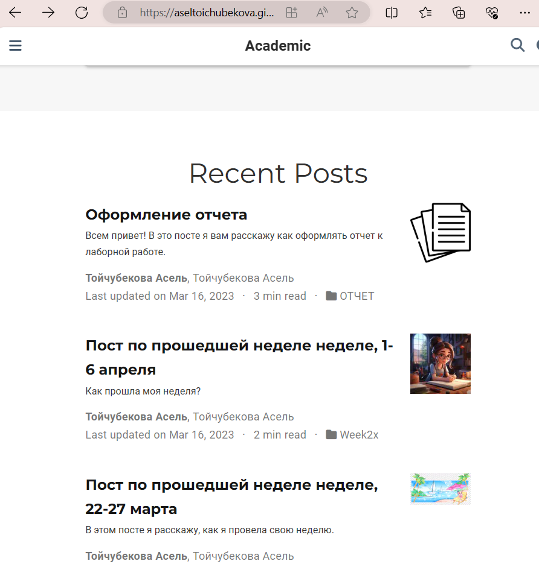{#fig:013 width=70%}

# Выводы

В ходе выполнения 4 ого этапа индивидуальной работы я зарегистрировалась на многих ресурсах и добавила информаию о них на мой сайт. Также написала пост по прошедшей неделе и пост по выбору. Получила практические навыки по работе с hugo.

