---
## Front matter
lang: ru-RU
title: Индивидуальный проект. Этап 5
subtitle: Операционные системы
author:
  - Тойчубекова Асель Нурлановна
institute:
  - Российский университет дружбы народов, Москва, Россия
date: 11 май 2024

## i18n babel
babel-lang: russian
babel-otherlangs: english

## Formatting pdf
toc: false
toc-title: Содержание
slide_level: 2
aspectratio: 169
section-titles: true
theme: metropolis
header-includes:
 - \metroset{progressbar=frametitle,sectionpage=progressbar,numbering=fraction}
 - '\makeatletter'
 - '\beamer@ignorenonframefalse'
 - '\makeatother'
 
## Fonts
mainfont: PT Serif
romanfont: PT Serif
sansfont: PT Sans
monofont: PT Mono
mainfontoptions: Ligatures=TeX
romanfontoptions: Ligatures=TeX
sansfontoptions: Ligatures=TeX,Scale=MatchLowercase
monofontoptions: Scale=MatchLowercase,Scale=0.9
 
---

# Информация

## Докладчик

:::::::::::::: {.columns align=center}
::: {.column width="70%"}

  * Тойчубекова Асель Нурлановна
  * Студент НПИбд-02-23
  * физико математических и естественных наук
  * Российский университет дружбы народов
  * [1032235033@rudn.ru](1032235033@rudn.ru)
  * <https://aseltoichubekova.github.io/ru/>

:::
::: {.column width="30%"}

:::
::::::::::::::

# Цель работы

## Цель работы

Целью пятого этапа индивидуального проекта является продолжить работу над своим сайтом. Научиться писать проекты и загружать их на сайт, а также выложить посты.

# Задание

## Задание

- Сделать записи для персонального проекта.

- Сделать пост по прошедшей неделе.

- Добавить пост на тему: "Языки научного программирования"

# Выполнение индивидуального проета

## Выполнение индивидуального проета

Для того, чтобы сделать записи для персонального проета я перехожу по ссылке /work/blog/content/project и открываю папку exaple для дальнейшей работы с ней.

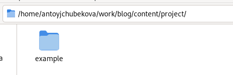

## Выполнение индивидуального проета

Дальше загружаю в эту папку все необходимые изображения, которые будут использоваться в ходе описания проета.

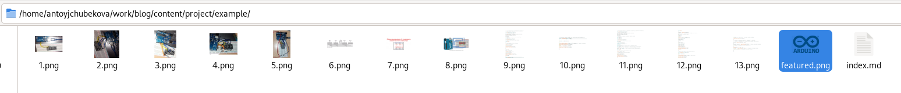

## Выполнение индивидуального проета

Открываю файл index.md для редактирования. Записываю в него информацию по проету на тему: "Работа с Arduino Uno. Выводим цифры". 

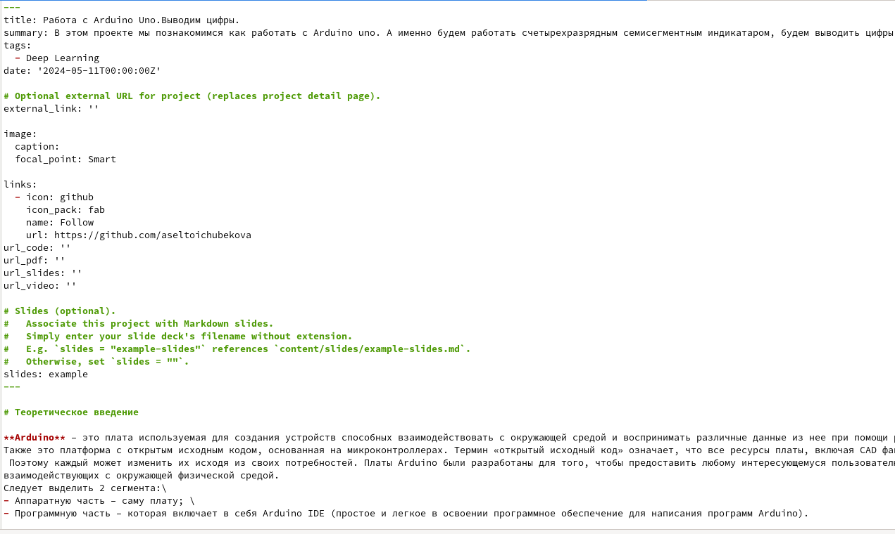

## Выполнение индивидуального проета

Прикрепляю необходимые изображения, которые мы заранее загрузили в папку с проектом.

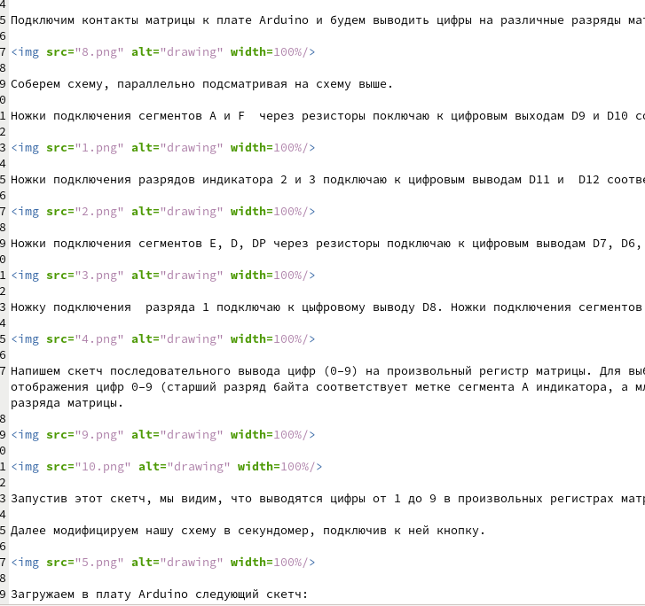

## Выполнение индивидуального проета

Далее я ввожу команду hugo и hugo server, чтобы загрузить сайт. 

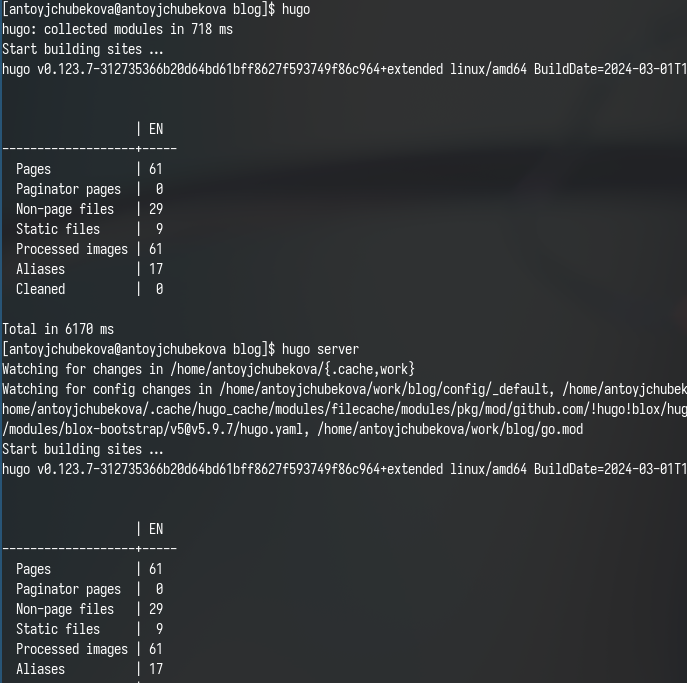

## Выполнение индивидуального проета

Перейдя в раздел с проетами мы видим, что наш проет был успешно загруженна сайт.

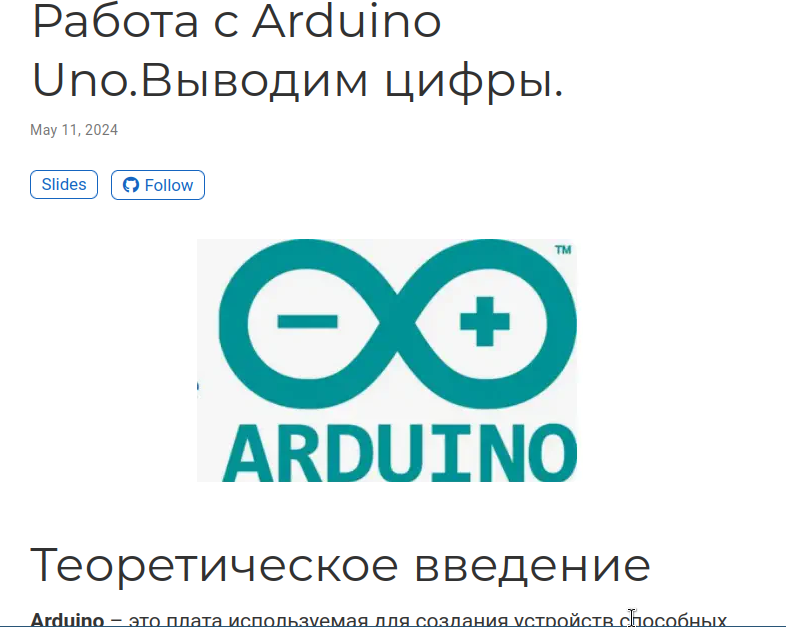

## Выполнение индивидуального проета

Создаю новую папку для постна по прошедшей неделе и загружан в нее необходимое изображение с интернета.

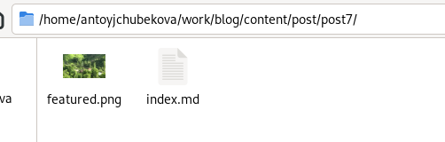

## Выполнение индивидуального проета

Открываю файл index.md и редактирую его, записывая пост по прошедшей неделе.

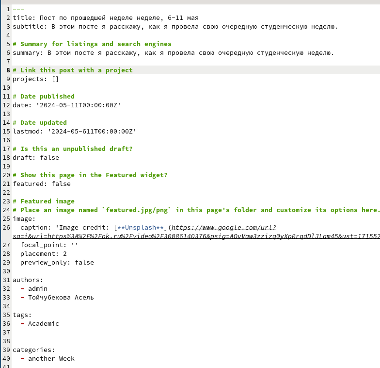

## Выполнение индивидуального проета

Перехожу на сайт, мы видим, что пост по прошедшей неделе был успешно опубликован.

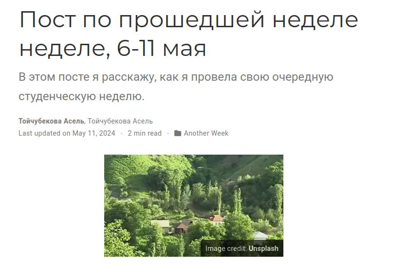

## Выполнение индивидуального проета

Создаю новую папку для поста на тему: "Языки научного программирования", а также загружаю в нее необходимое изображение также с интернета.

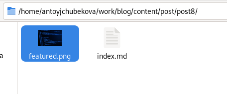

## Выполнение индивидуального проета

Открываю файл index.md и записываю в него пост на тему: "Языки научного программирования".

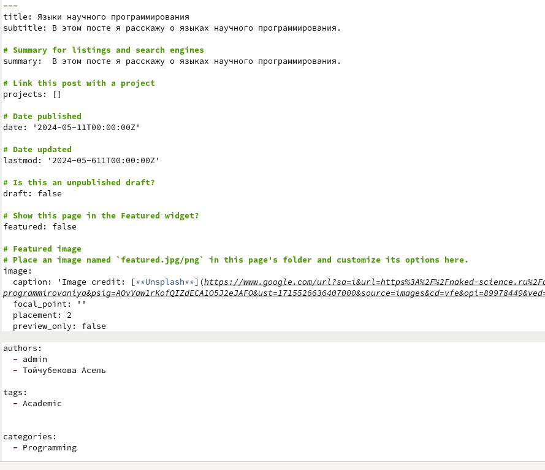

## Выполнение индивидуального проета

Перехожу на сайт, мы видим, что пост был успешно опубликован.

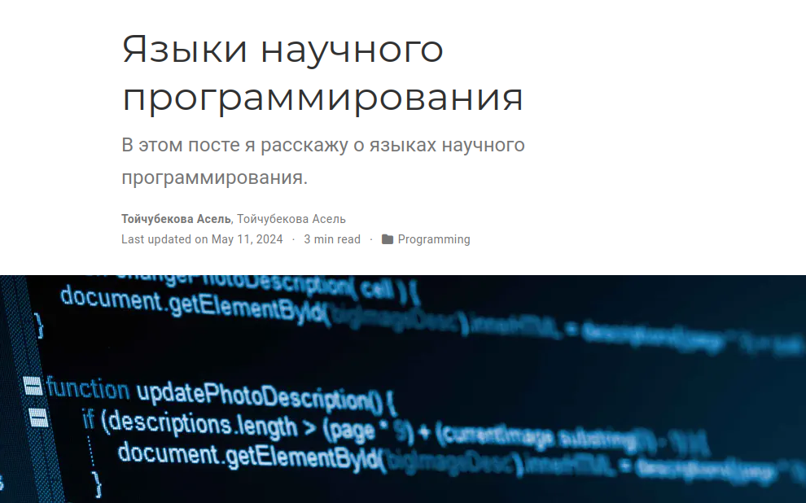

## Выполнение индивидуального проета

Загружаю все изменения на гитхаб, также перехожу в public и тоже загружаю изменения на гитхаб. 

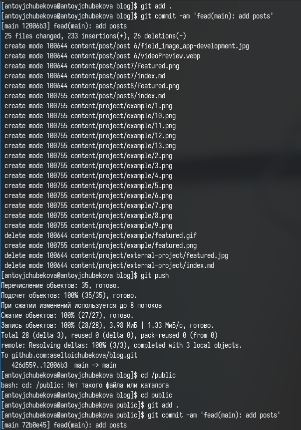

## Выполнение индивидуального проета

Захожу на сайт с внешнего браузера, мы видим, что все успешно отредактировалось и проект, и посты опубликованы. 

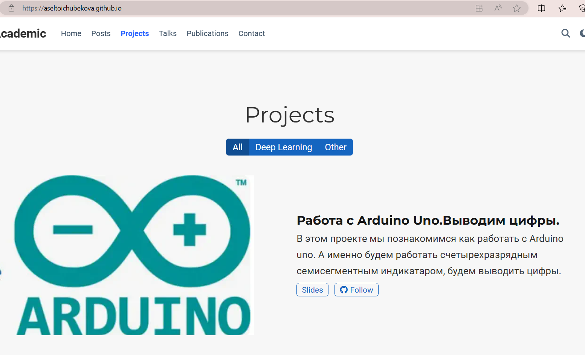

## Выполнение индивидуального проета

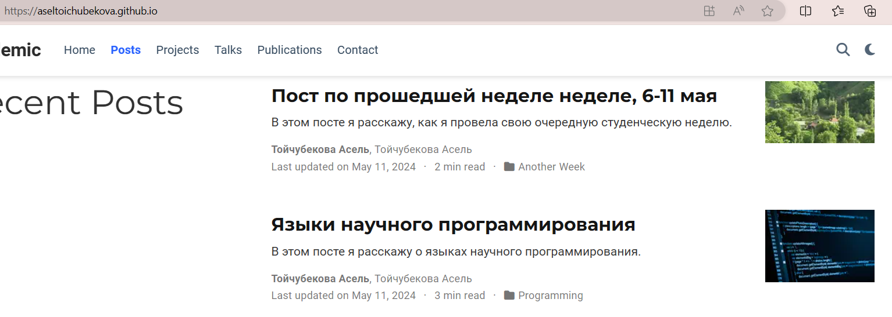

# Выводы

## Выводы

В ходе выполнения индивидуального проекта мы продолжили работу с нашим сайтом. Загрузили на сайт первый персональный проект, а также опубликовали два поста.

