---
## Front matter
title: "Индивидуальный проект. Этап 5"
subtitle: "Операционные системы"
author: "Тойчубекова Асель Нурлановна"

## Generic otions
lang: ru-RU
toc-title: "Содержание"

## Bibliography
bibliography: bib/cite.bib
csl: pandoc/csl/gost-r-7-0-5-2008-numeric.csl

## Pdf output format
toc: true # Table of contents
toc-depth: 2
lof: true # List of figures
lot: true # List of tables
fontsize: 12pt
linestretch: 1.5
papersize: a4
documentclass: scrreprt
## I18n polyglossia
polyglossia-lang:
  name: russian
  options:
	- spelling=modern
	- babelshorthands=true
polyglossia-otherlangs:
  name: english
## I18n babel
babel-lang: russian
babel-otherlangs: english
## Fonts
mainfont: PT Serif
romanfont: PT Serif
sansfont: PT Sans
monofont: PT Mono
mainfontoptions: Ligatures=TeX
romanfontoptions: Ligatures=TeX
sansfontoptions: Ligatures=TeX,Scale=MatchLowercase
monofontoptions: Scale=MatchLowercase,Scale=0.9
## Biblatex
biblatex: true
biblio-style: "gost-numeric"
biblatexoptions:
  - parentracker=true
  - backend=biber
  - hyperref=auto
  - language=auto
  - autolang=other*
  - citestyle=gost-numeric
## Pandoc-crossref LaTeX customization
figureTitle: "Рис."
tableTitle: "Таблица"
listingTitle: "Листинг"
lofTitle: "Список иллюстраций"
lotTitle: "Список таблиц"
lolTitle: "Листинги"
## Misc options
indent: true
header-includes:
  - \usepackage{indentfirst}
  - \usepackage{float} # keep figures where there are in the text
  - \floatplacement{figure}{H} # keep figures where there are in the text
---

# Цель работы

Целью пятого этапа индивидуального проекта является продолжить работу над своим сайтом. Научиться писать проекты и загружать их на сайт, а также выложить посты.

# Задание

- Сделать записи для персонального проекта.

- Сделать пост по прошедшей неделе.

- Добавить пост на тему: "Языки научного программирования"

# Выполнение индивидуального проета

Для того, чтобы сделать записи для персонального проета я перехожу по ссылке /work/blog/content/project и открываю папку exaple для дальнейшей работы с ней (рис. [-@fig:001]).

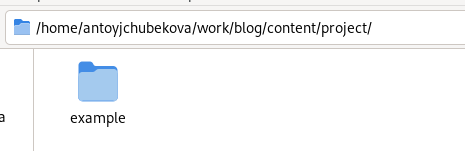{#fig:001 width=70%}

Дальше загружаю в эту папку все необходимые изображения, которые будут использоваться в ходе описания проета. (рис. [-@fig:002]).

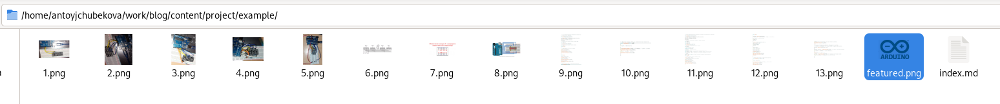{#fig:002 width=70%}

Открываю файл index.md для редактирования. Записываю в него информацию по проету на тему: "Работа с Arduino Uno. Выводим цифры". (рис. [-@fig:003]).

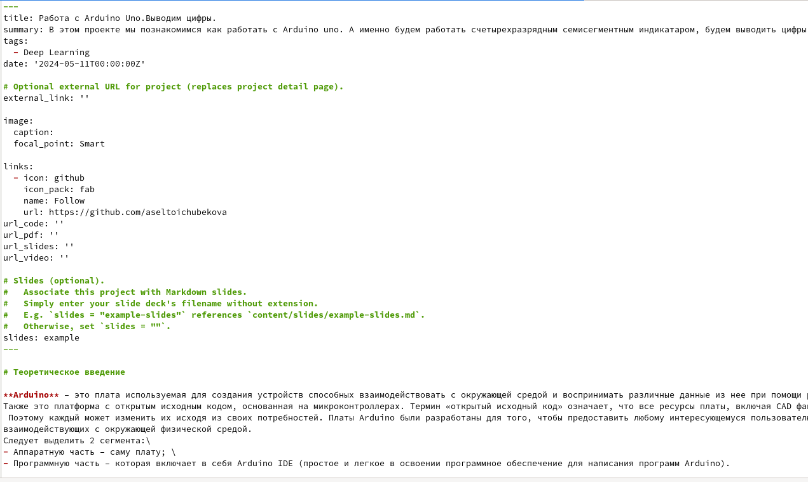{#fig:003 width=70%} 

Прикрепляю необходимые изображения, которые мы заранее загрузили в папку с проектом. (рис. [-@fig:004]).

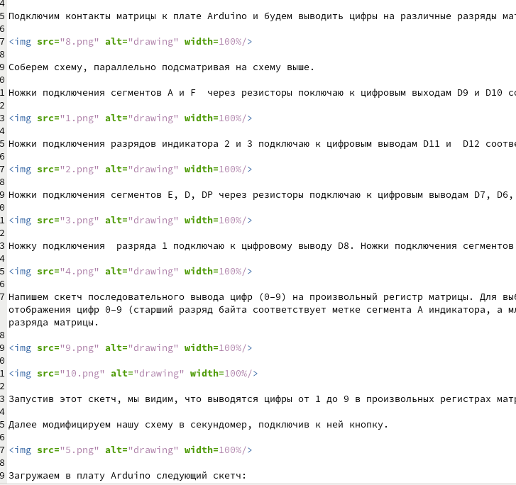{#fig:004 width=70%}

Далее я ввожу команду hugo и hugo server, чтобы загрузить сайт. (рис. [-@fig:005]).

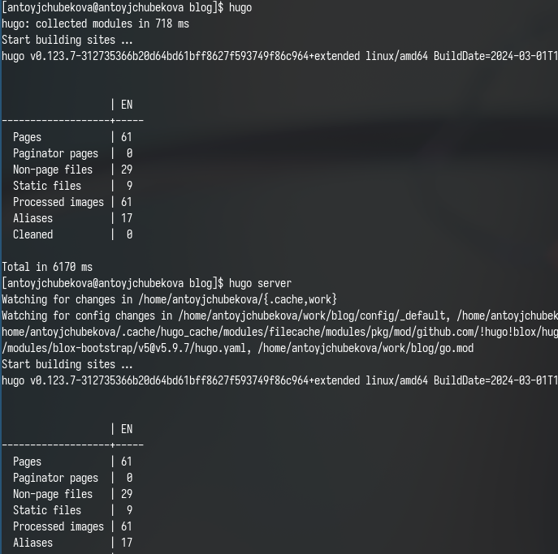{#fig:005 width=70%}

Перейдя в раздел с проетами мы видим, что наш проет был успешно загруженна сайт. (рис. [-@fig:006]).

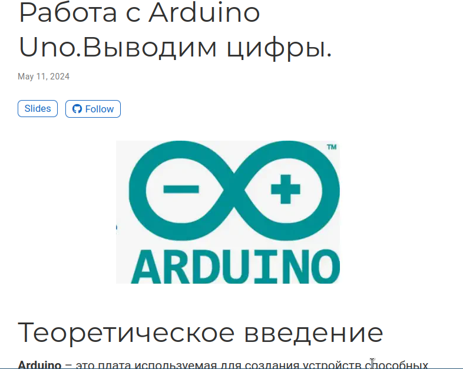{#fig:006 width=70%}

Создаю новую папку для постна по прошедшей неделе и загружан в нее необходимое изображение с интернета. (рис. [-@fig:007]).

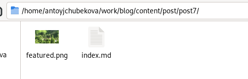{#fig:007 width=70%}

Открываю файл index.md и редактирую его, записывая пост по прошедшей неделе. (рис. [-@fig:008]).

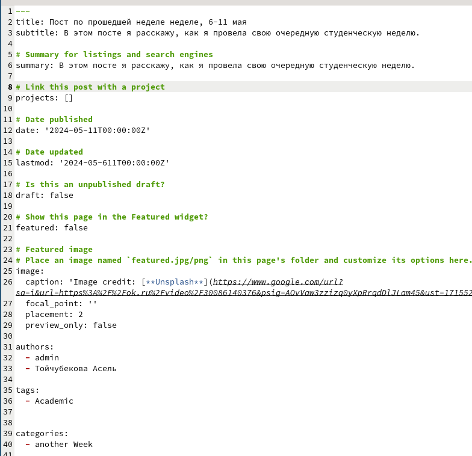{#fig:008 width=70%}

Перехожу на сайт, мы видим, что пост по прошедшей неделе был успешно опубликован. (рис. [-@fig:009]).

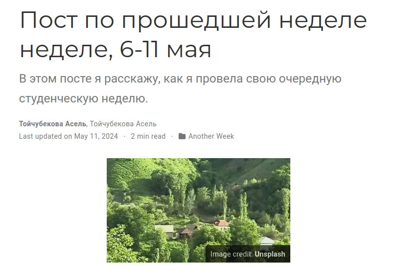{#fig:009 width=70%}

Создаю новую папку для поста на тему: "Языки научного программирования", а также загружаю в нее необходимое изображение также с интернета. (рис. [-@fig:010]).

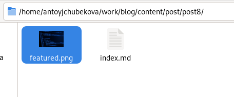{#fig:010 width=70%}

Открываю файл index.md и записываю в него пост на тему: "Языки научного программирования". (рис. [-@fig:011]).

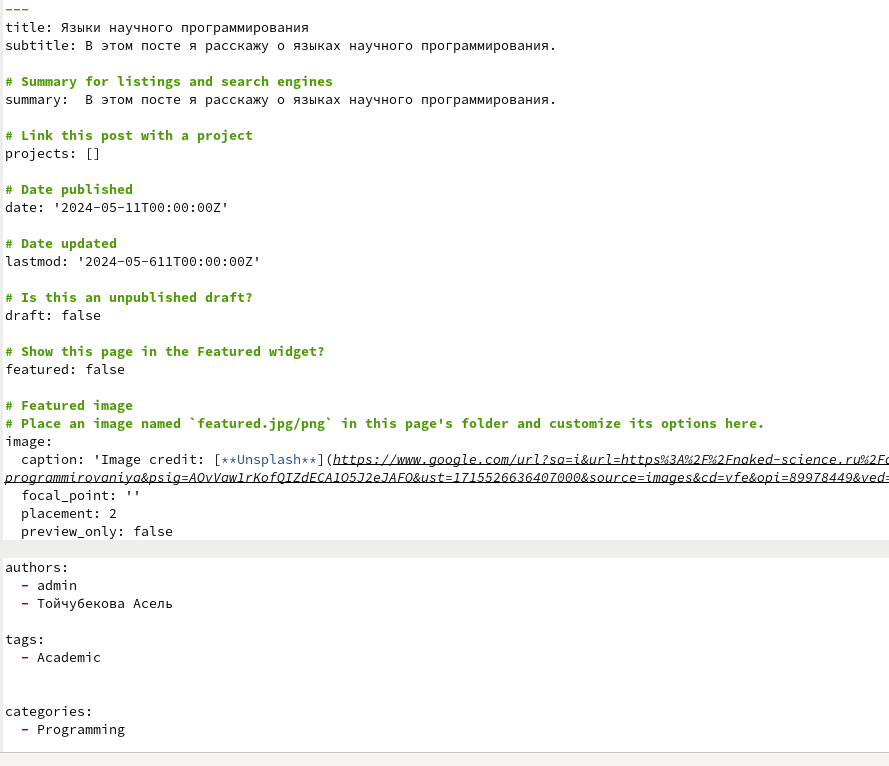{#fig:011 width=70%}

Перехожу на сайт, мы видим, что пост был успешно опубликован. (рис. [-@fig:012]).

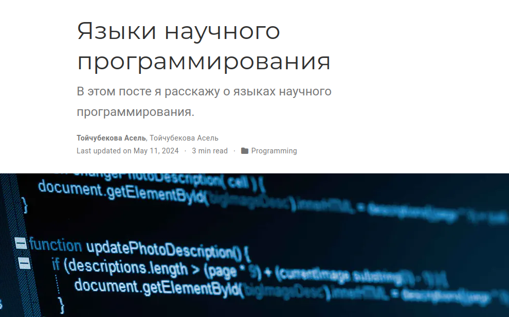{#fig:012 width=70%}

Загружаю все изменения на гитхаб, также перехожу в public и тоже загружаю изменения на гитхаб. (рис. [-@fig:013]).

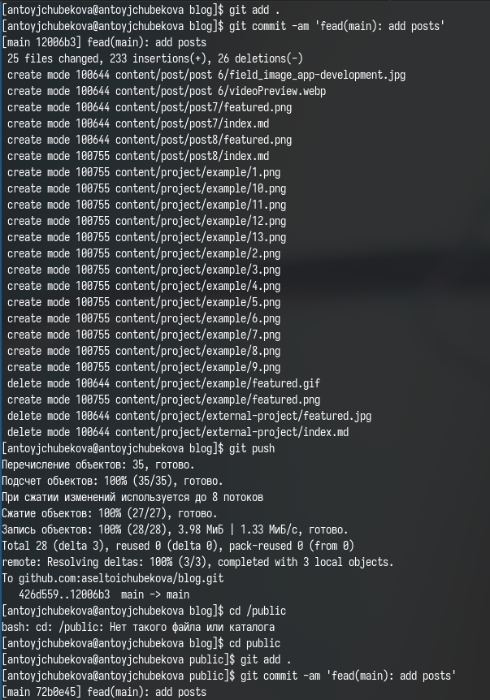{#fig:013 width=70%}

Захожу на сайт с внешнего браузера, мы видим, что все успешно отредактировалось и проект, и посты опубликованы. (рис. [-@fig:014] и рис. [-@fig:015]).

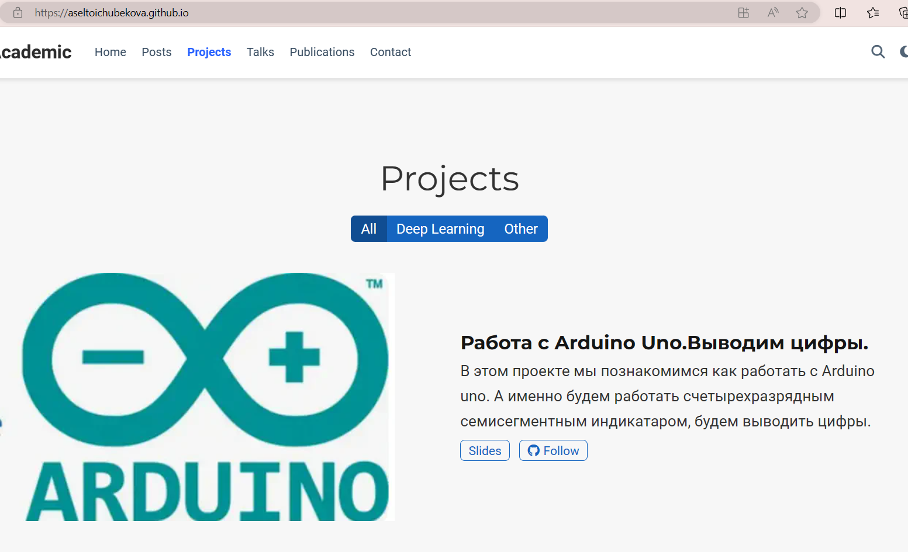{#fig:014 width=70%}

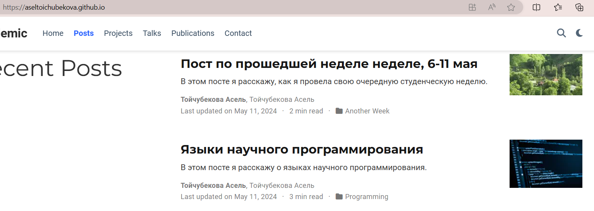{#fig:015 width=70%}

# Выводы

В ходе выполнения индивидуального проекта мы продолжили работу с нашим сайтом. Загрузили на сайт первый персональный проект, а также опубликовали два поста.
